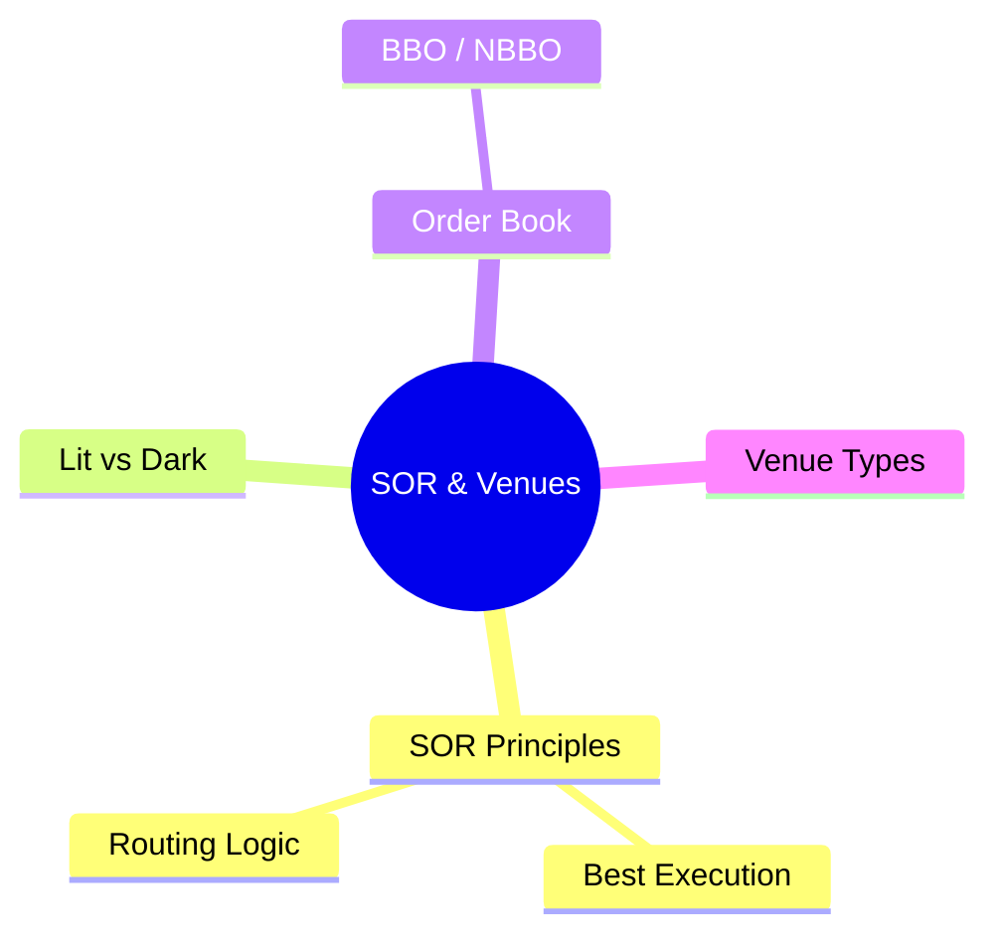
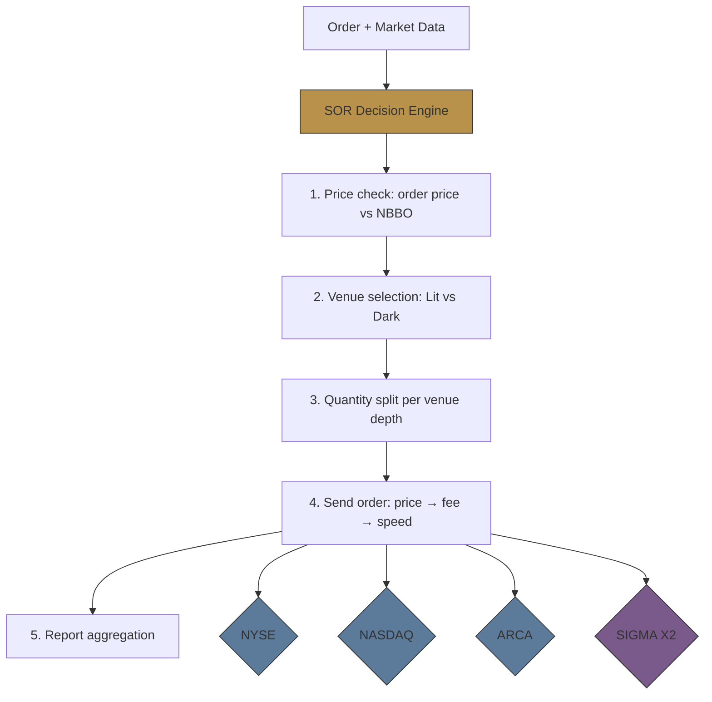
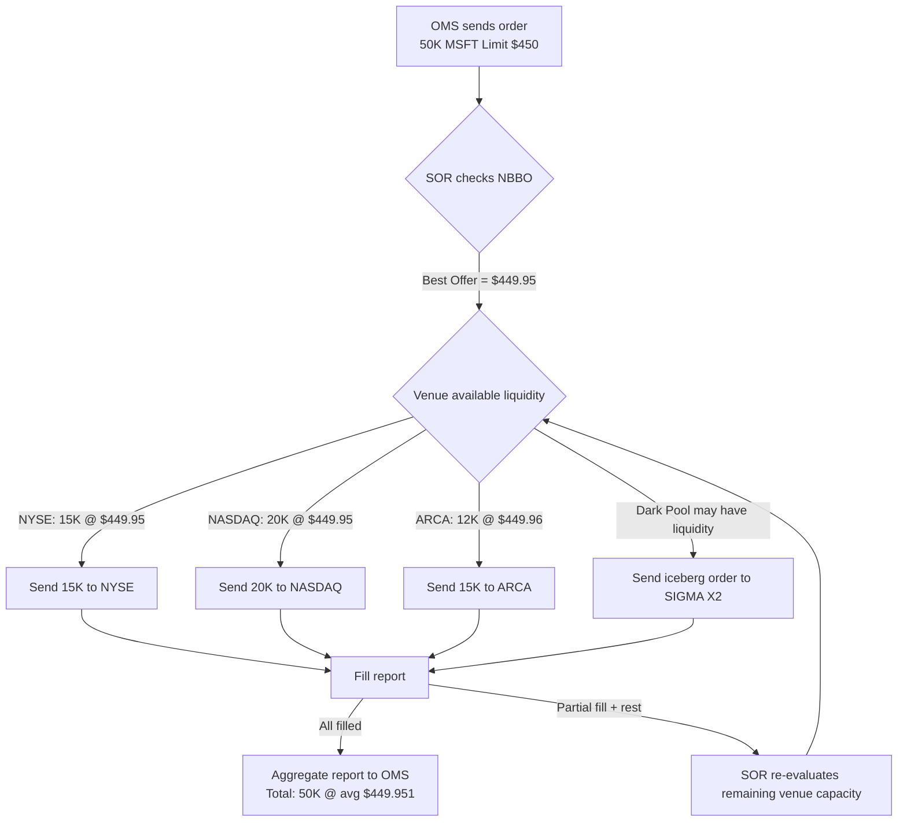
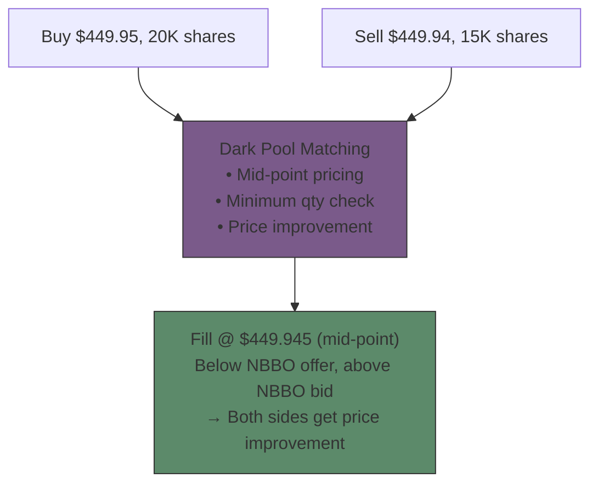
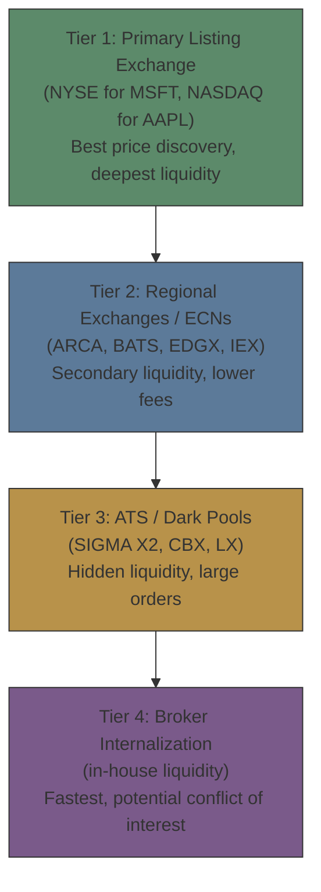

# Module 19: SOR & Venues




## Learning Objectives (CILO Mapping)
- Understand how Smart Order Routing performs price discovery and routing decisions across venues — CILO #4
- Distinguish Lit Venues from Dark Pools operating mechanisms — CILO #4
- Master FIX Execution Report (35=8) core fields and partial fill sequencing — CILO #3
- Identify routing strategy impact on execution quality — CILO #4
- Understand market data sources (SIP vs Direct Feed) impact on routing decisions — CILO #6

---


## Real-World Scenario

Brokerage EMS receives an order: **Buy 50,000 shares of MSFT, limit $450.00**. SOR engine activates, checks NBBO and finds best offer distributed across venues:

- NYSE: shows depth 15,000 shares @ $449.95
- NASDAQ: shows depth 20,000 shares @ $449.95
- ARCA (NYSE Arca): shows depth 12,000 shares @ $449.96
- SIGMA X2 (Dark Pool): hidden liquidity, no public quote

SOR decision: Split order into 3 child orders — 15K to NYSE, 20K to NASDAQ, 15K to ARCA. All 3 venues report fills — total 50,000 shares executed at $449.95-$449.96 range.

But the trader checks the execution report and finds: **Timestamps show the three fills happened 47 milliseconds apart** — in high-speed trading, what does 47ms mean?

> **Think**: Why does SOR not send all 50,000 shares to one venue? Why not let NASDAQ eat the entire order?
>
> *Answer: A single venue may not have enough liquidity to absorb all 50K shares without price slippage. NYSE only shows 15K depth — sending 50K there means remaining 35K could fill at worse prices (price impact). SOR's goal is "minimize market impact + best price execution."*

---

## Core Content

### 1. Smart Order Routing (SOR) Principles

SOR is the "brain" of the EMS — deciding where the order goes, how much, and in what sequence.



> **Think**: If NYSE and NASDAQ both have the best offer at $449.95, but NYSE's routing fee is $0.0001/share lower than NASDAQ's, which should SOR choose?
>
> *Answer: Typical routing logic is "price first, fees second." If price is the same, lower-fee venues get priority. But this also depends on the client's routing instructions — some specify "best execution" regardless of fees, others require "lowest cost."*

---

#### SOR Routing Decision Flow



> **Cloze**: "SOR decision sequence: {price} first → {fee} first → {speed} first. But must not violate {NBBO} protection rules."
>
> *Answer: price, fee, speed, NBBO*

> **Think**: SOR receives an order when NBBO Bid is $449.90, but the order is Sell 50K MSFT. How should SOR handle a sell order route?
>
> *Answer: Sell orders use Best Bid (highest buy price). NBBO Bid = $449.90 means the market is willing to buy at $449.90. SOR routes to the venue displaying this best bid, splitting if needed. If the sell limit price is $449.95, the order will not immediately fill — it must wait for the market to rise.*

---

### 2. Lit Venues vs Dark Pools

**Lit Venues (displayed liquidity)**:
- Publicly display bid/ask order book — size at each price level
- Include: NYSE, NASDAQ, NYSE Arca, CBOE, etc.
- Pros: High transparency, price discovery function
- Cons: Large orders expose intent, cause market impact

**Dark Pools (hidden liquidity)**:
- Do not publicly display order book — only the pool knows liquidity
- Include: SIGMA X2 (Morgan Stanley), CBX (Credit Suisse), LX (broker's own), Liquidnet
- Pros: Large orders not exposed, reduced market impact
- Cons: Poor price discovery, potential adverse selection

**Dark Pool Crossing Mechanism**:


> **Cloze**: "The main advantage of {Dark Pools} is reducing {market impact} for large orders, but the trade-off is poorer {price discovery}."
>
> *Answer: Dark Pools, market impact, price discovery*

---

### 3. Routing Logic & Venue Types

#### Venue Tiers & Routing Strategies



#### Routing Strategy Comparison

| Strategy                       | Description                                                     | Best For                                      |
| ------------------------------ | --------------------------------------------------------------- | --------------------------------------------- |
| **DMA (Direct Market Access)** | Order sent directly to specified exchange, no routing decisions | Trader knows exactly which venue              |
| **Algo Routing**               | Algorithm (TWAP/VWAP/IS) auto-splits across multiple venues     | Large orders needing reduced market impact    |
| **Broker-Assisted**            | Broker manually chooses venue or routes based on experience     | Complex products or special market conditions |

> **Think**: In the brokerage, when would a trader choose DMA over SOR?
>
> *Answer: When the trader needs a specific venue's matching logic (e.g., IEX's anti-front-running mechanism), or is executing an arbitrage strategy (simultaneous orders on two venues), they would choose DMA. SOR delegates routing decisions to the system, giving the trader no control over routing details.*

---

### 4. Order Book & BBO/NBBO

**BBO (Best Bid/Offer)**: A single venue's current best bid and offer prices.

**NBBO (National Best Bid/Offer)**: The best bid and offer across all US venues — computed and disseminated by the SIP (Securities Information Processor).

```text
NYSE BBO:      Bid 449.90 (5K)  /  Offer 449.95 (15K)
NASDAQ BBO:    Bid 449.91 (8K)  /  Offer 449.95 (20K)
ARCA BBO:      Bid 449.89 (3K)  /  Offer 449.96 (12K)

NBBO:          Bid 449.91 @ NASDAQ (8K)  /  Offer 449.95 @ NYSE (15K)
                                                    Offer 449.95 @ NASDAQ (20K)
```

> **Think**: A buy order at $449.95 is sent to NYSE, but NYSE's Best Offer was already taken by another party by the time the order arrives. What should SOR do?
>
> *Answer: SOR checks remaining quantity and whether NBBO has changed. If NBBO is still $449.95 (NASDAQ still has 20K), SOR re-routes the remaining order to NASDAQ. This is the "sweep" mechanism — scanning venues sequentially for available liquidity until the order is fully filled or no liquidity remains.*

> **Predict**: SIP takes ~1ms to compute NBBO. Direct Feed takes ~10μs. If a brokerage EMS uses only SIP data for routing decisions, what happens?
>
> *Answer: SIP latency means the EMS sees "past" NBBO. In fast markets, SIP-published NBBO may already be stale — the best prices may have been taken. Rivals using Direct Feed will fill before you. This is why many firms upgrade to Direct Feed + FPGA hardware acceleration to reduce latency.*

---

## Spot the Mistake

Someone says "Dark Pool fill prices are always at the NBBO mid-point because that is fairest for both sides."

**Why is this wrong?**

*Answer: Not all Dark Pools use mid-point pricing. Some use random prices within NBBO, volume-weighted prices, or negotiated prices between counterparties. Mid-point is common but not the only practice. Also, mid-point is only possible when both buyer and seller are simultaneously in the pool.*

---
