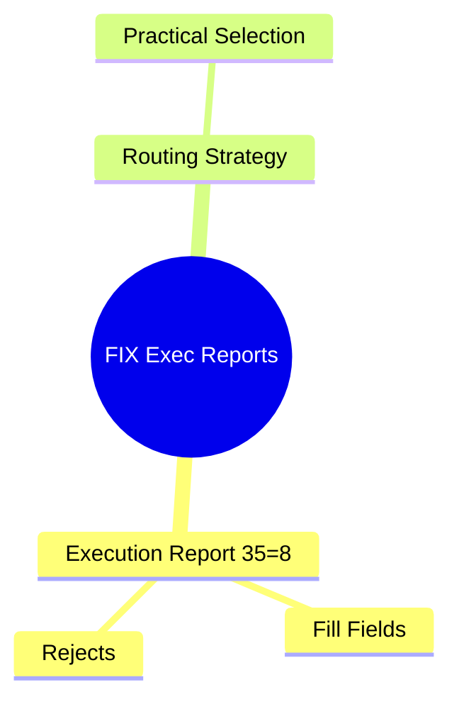
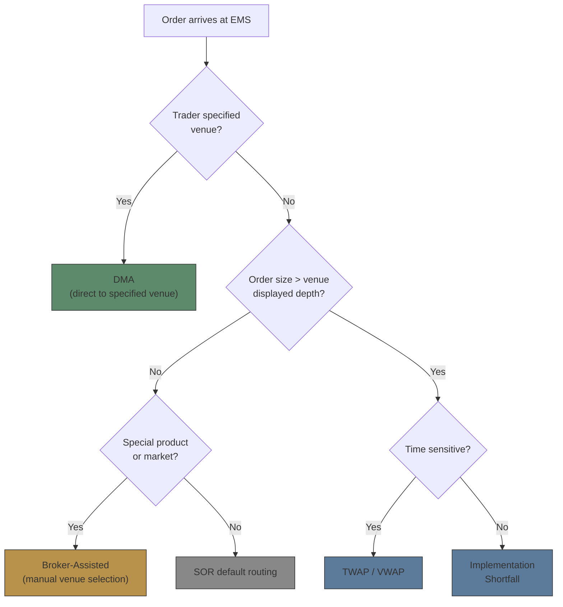

# Module 20: FIX Execution Reports




## Learning Objectives (CILO Mapping)
- Understand how Smart Order Routing performs price discovery and routing decisions across venues — CILO #4
- Distinguish Lit Venues from Dark Pools operating mechanisms — CILO #4
- Master FIX Execution Report (35=8) core fields and partial fill sequencing — CILO #3
- Identify routing strategy impact on execution quality — CILO #4
- Understand market data sources (SIP vs Direct Feed) impact on routing decisions — CILO #6

---

## Core Content

### 5. FIX Execution Report (35=8)

When an order fills (partially or fully) at a venue, the EMS sends a FIX Execution Report to notify the OMS.

#### Core Fields

```text
35=8               → MsgType: Execution Report
17=20250710-001    → ExecID (unique, different per fill)
150=0|1|2|F|8      → ExecType
                    0=New (order accepted)
                    1=Partial Fill
                    2=Fill (fully filled)
                    F=Trade Cancel (rare)
                    8=Rejected
39=0|1|2|8         → OrdStatus
                    0=New, 1=Partially Filled, 2=Filled, 8=Rejected
32=15000           → LastShares (this fill quantity)
31=449.95          → LastPx (this fill price)
14=15000           → CumQty (cumulative filled quantity)
151=35000          → LeavesQty (remaining quantity)
6=449.95           → AvgPx (average fill price)
851=15000          → LastLiquidityInd (liquidity indicator)
                    1=Added Liquidity (Maker)
                    2=Removed Liquidity (Taker)
                    4=Crossed (dark pool cross)
60=20250710-14:30:01.123456 → TransactTime (timestamp)
```

#### Partial Fill Sequence

50K MSFT order split across 3 venues — each fill is an independent Execution Report:

```text
Timestamp                        OMS Receives
14:30:01.123456  NYSE Fill 15K @ 449.95   →  ExecID=NY-001  CumQty=15K  LeavesQty=35K
14:30:01.127891  NASDAQ Fill 20K @ 449.95 →  ExecID=NS-001  CumQty=35K  LeavesQty=15K
14:30:01.170234  ARCA Fill 15K @ 449.96   →  ExecID=AR-001  CumQty=50K  LeavesQty=0
                                           AvgPx = (15K×449.95 + 20K×449.95 + 15K×449.96) / 50K
                                                 = $449.951
```

> **Cloze**: "During partial fills, the OMS correlates multiple fills for the same order by matching {ClOrdID} and {ExecID}. {CumQty} is the cumulative fill count, {LeavesQty} is the {remaining} quantity. When LeavesQty=0, the order status becomes {Filled}."
>
> *Answer: ClOrdID, ExecID, CumQty, remaining, Filled*

> **Predict**: The OMS receives three Execution Reports, but the third (ARCA 15K @ 449.96) has a different ExecID format from the first two, and OrdStatus=2 (Filled) with LeavesQty=0 but CumQty is only 35K. What does this mean?
>
> *Answer: This is an inconsistent Execution Report — CumQty (35K) does not equal the original order quantity of 50K. The OMS should detect the mismatch and trigger an alert. Possible causes: ARCA's CumQty did not include the previous 35K (different child order), or the EMS made an aggregation error. The OMS should not auto-mark the order as Filled; manual reconciliation is needed.*

#### Timestamp Types & Precision

```text
Timestamp Type        Precision     Source        Purpose
──────────────────────────────────────────────────────────
Entry Time            millisecond   OMS           Order creation time
Exchange Time         microsecond   Exchange      Venue matching time
Last (TransactTime)   microsecond   EMS/Exchange  Fill time
──────────────────────────────────────────────────────────

Practical Issues:
• Exchange Time earlier than OMS Entry Time → clocks not synchronized
• Multi-venue fill time gap > expected (e.g., 100ms) → possible routing latency
• Microsecond precision is critical for latency monitoring
```

---

### 6. Routing Strategy Practical Selection

#### DMA vs Algo vs Broker-Assisted Decision Tree



#### Brokerage Scenario: Crossing Network Internalization

The brokerage's own Dark Pool (LX) can match client orders internally:
- If "Buy MSFT 50K" and "Sell MSFT 30K" arrive simultaneously, SOR can cross 30K internally in LX
- Pros: No market impact, no exchange fees
- Cons: Potential deviation from NBBO (must monitor price improvement)

> **Think**: When crossing internally in the brokerage LX, what regulatory concern applies?
>
> *Answer: Best Execution obligation. Internal cross prices must not be worse than NBBO. If LX's fill price deviates from NBBO, the client can claim the broker failed to fulfill best execution duty. The brokerage must regularly test LX's price improvement performance.*

---

## Spot the Mistake

A team says "Our EMS latency is very low — Exchange Time and Entry Time differ by only 500 microseconds."

**Why is this wrong?**

*Answer: Exchange Time is the exchange's clock; Entry Time is the OMS's clock. The two may not be synchronized (NTP sync precision is limited). Real EMS latency should be calculated using the EMS's own send time and receipt of exchange confirmation. Comparing Entry Time and Exchange Time is unreliable.*

---
