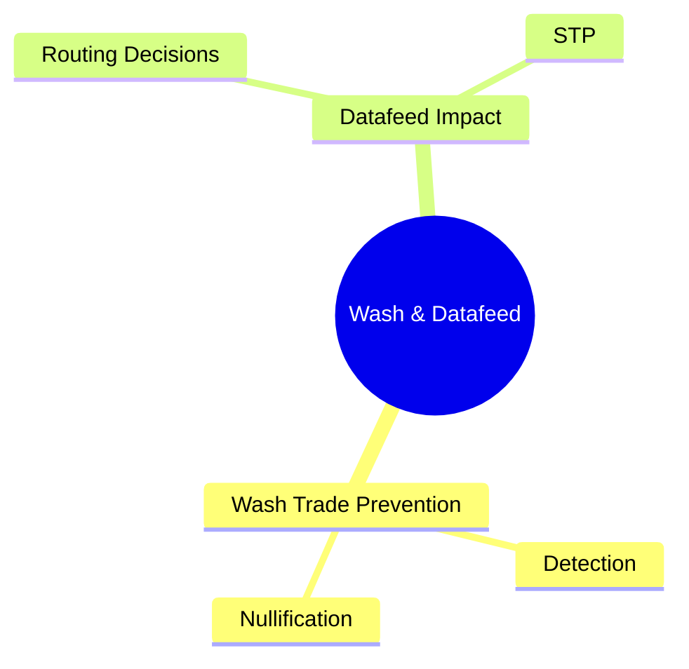
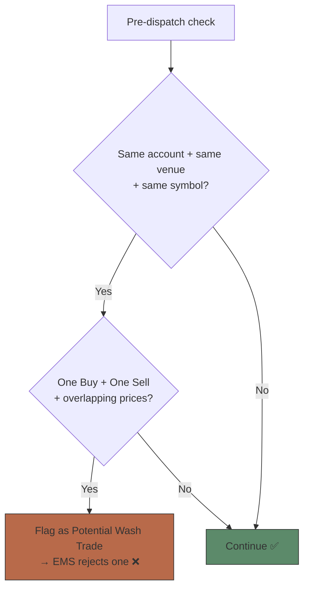

# Module 21: Wash, Datafeed & STP

## Learning Objectives (CILO Mapping)
- Understand how Smart Order Routing performs price discovery and routing decisions across venues — CILO #4
- Distinguish Lit Venues from Dark Pools operating mechanisms — CILO #4
- Master FIX Execution Report (35=8) core fields and partial fill sequencing — CILO #3
- Identify routing strategy impact on execution quality — CILO #4
- Understand market data sources (SIP vs Direct Feed) impact on routing decisions — CILO #6

---

## Core Content

### 7. Wash Trade Prevention

**Wash Trade**: The same beneficial owner buys and sells the same product on the same venue, creating artificial trading volume.

**Wash Trade Detection Logic (Brokerage EMS)**:

> **Cloze**: A {wash trade} occurs when the same beneficial owner buys and sells the same product on the same {venue}, creating artificial volume; the EMS pre-dispatch check compares account, venue and {symbol} before flagging. On market data, the {SIP} consolidates all venue data with ~1-5ms latency while {Direct Feeds} update at microsecond level.
>
> **Think**: Wash detection checks "same account + same venue" — why must the venue match before flagging?
>
> *Answer: Same-account buy/sell orders sent to different venues never reach one matching engine — EMS only sees per-venue orders. Cross-venue wash trades need OMS-level correlation before orders leave the system.*

> **Spot the Mistake**: Someone says "Wash trades only happen between two different accounts — same account buy and sell cannot fill because the EMS would auto-block it."
>
> *What is wrong with this?*
>
> *Answer: Same-account buy and sell orders sent to two different venues (NYSE Buy and NASDAQ Sell) cannot be detected by the EMS automatically — they go to different matching engines. Wash trade prevention requires cross-venue detection at the OMS or EMS level before orders leave the system. Also, deliberate wash trades in high-frequency trading often use different accounts and venues to evade detection.*

---

### 8. Market Data Feed Impact on Routing

| Attribute | SIP (Securities Information Processor) | Direct Feeds (NYSE OpenBook, NASDAQ TotalView) |
| --------- | -------------------------------------- | --------------------------------------------- |
| Data source | Consolidates all venue data | Raw order book from each venue |
| Update frequency | NBBO updates every event | Microsecond-level updates |
| Latency | ~1-5ms (consumer-grade) | ~10-50μs |
| Cost | Low (cheaper market data) | High (each venue charges) |

**Latency Arbitrage**:
- Direct Feed users see market changes ~1-5ms before SIP users
- In 1ms, prices may change multiple times — SIP users see historical NBBO
- Brokerage EMS typically uses Direct Feed + FPGA acceleration to ensure routing decisions are based on latest market state

> **Predict**: If the brokerage EMS's SIP feed experiences a network fault causing 10ms delay, while competitors use Direct Feed. The brokerage's SOR routes based on stale NBBO. What are the consequences?
>
> *Answer: Most likely, the brokerage's orders will be "late" — SOR sees $449.95 as the best offer which was accurate 10ms ago, but now the market has moved. Orders sent to NYSE find $449.95 already taken, filling at $449.97 instead. Client incurs extra $0.02/share × 50K = $1,000 cost. In extreme market volatility, stale NBBO could cause fills at much worse prices, potentially triggering best execution regulatory issues.*

---

## Why This Matters

1. **SOR Design Affects Every Trade's Cost**: Poor routing decisions can cause thousands of dollars in additional slippage. As a pre-trade system developer, the order metadata you produce (time-in-force, min qty, discretionary price) directly impacts SOR's decision capability.

2. **Execution Report Parsing is Debugging Foundation**: When orders execute abnormally (price deviation, wrong quantity, time mismatch), you need to correctly interpret FIX Execution Reports to locate the problem — OMS issue, EMS issue, or exchange issue.

3. **NBBO & Market Data Understanding Shapes System Design**: If your pre-trade system does pre-trade price validation, do you use SIP data or Direct Feed? Different latency characteristics affect validation threshold design.

4. **Wash Trade Prevention is a Regulatory Red Line**: Violations can result in FINRA fines. The pre-trade system must coordinate with the EMS for cross-venue wash trade detection.

5. **Cross-Team Collaboration**: Your OMS development story may require modifying ClOrdID generation logic, adding extra routing instructions, or adjusting timestamp format — understanding how the EMS handles these fields enables correct technical decisions.

---

## Key Takeaways

- SOR routes large orders across multiple venues based on NBBO and venue depth to reduce market impact
- Lit Venues display order books (high transparency, high market impact); Dark Pools hide liquidity (good for large orders, poorer price discovery)
- Three routing strategies: DMA (direct venue), Algo Routing (algorithmic split), Broker-Assisted (manual)
- NBBO is computed by SIP but has ~1-5ms latency; Direct Feed provides microsecond-level market data
- FIX Execution Report (35=8) core fields: ExecID, ExecType, OrdStatus, LastShares, LastPx, CumQty, LeavesQty, AvgPx, LastLiquidityInd, TransactTime
- Partial fills come as multiple Execution Reports; OMS correlates by ClOrdID + ExecID
- Wash trade prevention requires cross-venue buy/sell overlap detection before routing
- Market data feed latency (SIP vs Direct Feed) directly impacts routing decision quality

---

## Common Misconceptions

**Misconception**: "Dark Pool fills must equal NBBO, otherwise it is an execution violation."
**Fact**: Dark Pool fills are typically at prices better than NBBO (price improvement), but not always at the NBBO mid-point. Some Dark Pools allow negotiation or use volume-weighted pricing. The key requirement: fill price cannot be worse than NBBO — this is the basic best execution requirement.

**Misconception**: "SIP NBBO reflects the true market state."
**Fact**: SIP NBBO has ~1-5ms latency. In a millisecond-scale market, SIP NBBO is historical data. This is why high-frequency traders pay for Direct Feed — to see the real-time market state.

---

## Spot the Mistake

Xiao Wang's system design: When receiving multiple Execution Reports, the OMS uses the last report's CumQty as the total filled quantity and ignores all other Execution Reports.

**Why is this wrong?**

*Answer: The OMS must use ClOrdID to correlate all Execution Reports and verify CumQty's monotonic increase and LeavesQty's final state (=0). Using only the last CumQty may miss fills (if a report was lost). Correct approach: maintain a local state table, update CumQty incrementally, and compare with the previous report to ensure continuity. If a gap is found, trigger reconciliation.*

---

## Feynman Explain

(Explain "Smart Order Routing" in the simplest terms to a non-finance person. Analogy: You want to buy 50 cases of soda, but each store only shows 15-20 cases in stock. How do you buy all 50 cases with minimal cost?)

---

## Reframe

(Pause. Evaluate "SOR routing decisions": How "smart" should SOR be in the brokerage's system? Is there a trade-off we are ignoring? Example: over-optimizing routing could increase latency, system complexity, and maintenance cost. Write your assessment.)

---

## Drill

Complete the quiz. MCQs test from different angles — memory, application, scenario.

Run: `learn.sh quiz brokerage-ops 21`
