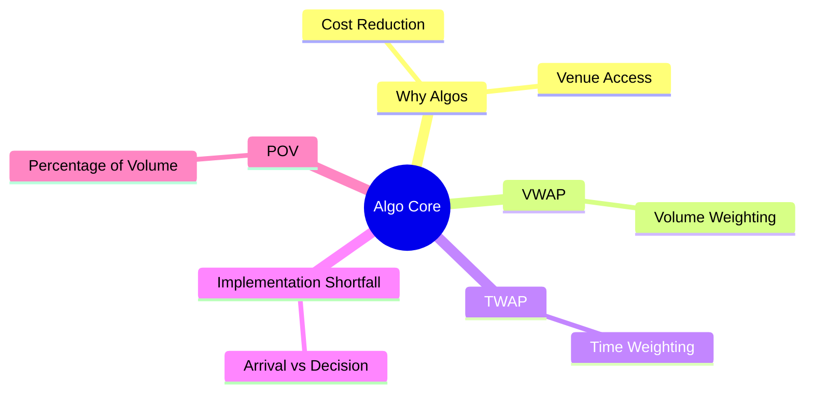
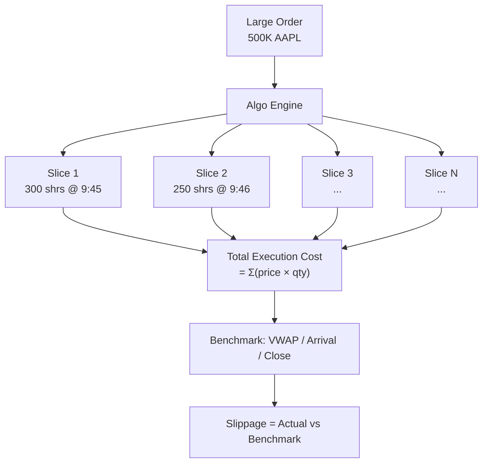

# Module 22: Algorithmic Trading Core

Estimated time: 2h



## Learning Objectives (aligned with course CILOs)
- Differentiate between major algo strategies (VWAP, TWAP, IS, POV) — use cases and limitations — maps to CILO #4
- Select appropriate algorithm based on order characteristics (urgency, size/ADV, spread, volatility) — maps to CILO #4
- Calculate and interpret Implementation Shortfall and its decomposition — maps to CILO #4
- Understand Reg NMS constraints on algo behavior — maps to CILO #4
- Perform basic TCA (Transaction Cost Analysis) — maps to CILO #5

---


## Real-World Scenario

You are an algo strategist on the brokerage's US equities trading desk. At 9:35 AM, a large mutual fund client calls: "We need to buy 500,000 shares of AAPL, complete today."

You quickly assess the key parameters:
- **Order size**: 500,000 shares
- **AAPL average daily volume (ADV)**: ~10,000,000 shares
- **Size / ADV ratio**: 5% (500K / 10M)
- **Market state**: 5 minutes after open, ample liquidity but volatile (opening imbalance just cleared)
- **Order deadline**: Complete by today's close (single-day execution)
- **Client preference**: No specific algo specified, but "minimize market impact" requested

The question emerges: **Is 5% ADV order size large or small? Which algo should be chosen? What happens if a large order is sent directly to the market?**

> **Think**: Is 5% ADV a large order size? If you drop an order to buy 500K AAPL straight into the market, how fast would it fill? What happens to the price?
>
> *Answer: 5% ADV = medium urgency. Dropping it all in as a market order might fill in seconds, but at massive slippage (price impact). Your buy order eats through multiple layers of order book depth, pushing the price up. An algorithm breaks the order into small slices spread across the day.*

---

## Core Content

### 1. Why Algorithmic Trading Exists

The core purpose of algorithmic trading is simple: **Break a large order into smaller pieces to find the optimal balance between time and price.**



Consequences of not slicing:
- 500K share market order → eats best offer + several layers of depth
- Price moves from $150 to $150.50 → market impact cost = 500K × $0.25 average = $125,000
- Other market participants see the large order → adverse selection

After slicing:
- Only a few hundred shares per minute → blends into normal flow
- Average price close to 9:30-16:00 VWAP
- Market impact minimized

> **Cloze**: "The core mechanism of algorithmic trading is splitting a large order into multiple {child orders}, balancing reduced {market impact} against controlling {execution risk}."
>
> *Answer: child orders (slices), market impact, execution risk*

---

### 2. VWAP (Volume-Weighted Average Price)

VWAP is the most classic algo strategy. The goal is execution close to the day's volume-weighted average price.

**Formula:**

```text
VWAP = Σ(Price_i × Volume_i) / Σ(Volume_i)
```

Where i iterates over each trade (or each time interval) in the session.

**How it works:**
- Algo engine loads historical volume profile — average volume percentage per 5-30 minute bucket
- Slicing schedule built from the volume profile
- Within each bucket, uses TWAP or liquidity-seeking to fill that bucket's quota
- Goal: track the market's natural volume distribution

**VWAP Slicing Schedule Example:**

```text
Time       Volume Profile    Slices to send    Cumulative %
─────────────────────────────────────────────────────
09:30-10:00    12%               60,000          12%
10:00-10:30    10%               50,000          22%
10:30-11:00     9%               45,000          31%
11:00-11:30     8%               40,000          39%
11:30-12:00     8%               40,000          47%
12:00-12:30     6%               30,000          53%
12:30-13:00     6%               30,000          59%
13:00-13:30     7%               35,000          66%
13:30-14:00     8%               40,000          74%
14:00-14:30     9%               45,000          83%
14:30-15:00    10%               50,000          93%
15:00-16:00     7%               35,000         100%
─────────────────────────────────────────────────────
Total         100%              500,000
```

> **Think**: Why is the volume profile highest at the open (09:30-10:00)? If the VWAP algo falls behind (under-executed) in the morning, what happens later?
>
> *Answer: The open has elevated volume from opening imbalance and overnight information accumulation. If the algo falls behind in the morning, it's very hard to catch up during the low-volume midday period — historical volume profile shows low midday volume, so you can't execute heavily in a low-volume environment without causing price impact. The VWAP algo will drift from its benchmark.*

> **Predict**: Suppose AAPL has a sudden news event (e.g. earnings leak), and actual volume profile deviates completely from historical. Morning volume spikes to 3x ADV, afternoon crashes. What happens to a VWAP algo order?
>
> *Answer: The VWAP algo's slicing schedule is based on historical data. In the morning when actual volume surges, the algo only sends its scheduled 12% while 36% of daily volume has already traded → the algo falls behind. In the afternoon when volume collapses, the algo must chase the remaining shares in a low-liquidity environment → execution cost spikes. This is VWAP's weakness: slow to react to actual volume changes.*

**Common Misconception:** "VWAP algo guarantees your execution price equals the VWAP benchmark."
**Fact:** VWAP algo only "tracks" the volume profile. If the slicing schedule diverges from actual volume distribution, or if child orders fill away from the interval average, the final result may deviate from VWAP. No algo can guarantee VWAP.

---

### 3. TWAP (Time-Weighted Average Price)

TWAP is simpler than VWAP: **split time evenly, each slice equal size.**

**Formula:**

```text
TWAP = Σ(Price_i) / N
```

Each slice size = total quantity / number of time slices

**Characteristics:**
- Ignores volume profile — doesn't care when volume is heavy or light
- Deterministic execution time: e.g. 500K shares / 390 minutes ≈ 1,282 shares per minute
- Pros: simple, predictable, suitable for low-liquidity or when volume profile unavailable
- Cons: unnecessary market impact during low-liquidity midday periods

> **Think**: For a very small order (0.5% ADV), does the difference between TWAP and VWAP matter?
>
> *Answer: No. For tiny orders with negligible market impact, any slicing strategy yields virtually the same result. For small orders, even a single limit order might suffice — no algorithm needed.*

**TWAP Common Use Cases:**
- Extremely illiquid stocks (micro-cap) — volume profile unreliable
- ETF market maker hedges — just need execution within a fixed window
- Passive index rebalancing — schedule is known (close auction)

---

### 4. Implementation Shortfall (IS)

Implementation Shortfall, introduced by Perold (1988), is the most popular execution algorithm among institutions. It uses the **decision price (arrival price)** as benchmark.

**Core Concept:**

```text
Implementation Shortfall = (Avg Execution Price − Arrival Price) × Shares Executed
```

If avg execution price > arrival price → positive slippage → cost (buy order).

**IS Cost Decomposition:**

```text
Total IS Cost = Market Impact + Timing Risk + Opportunity Cost + Fixed Cost
```

| Cost Category    | Definition                              | Example (500K AAPL)                            |
| ---------------- | --------------------------------------- | ---------------------------------------------- |
| Market Impact    | Price movement caused by your order     | Price pushed from $150 to $150.15 while buying |
| Timing Risk      | Cost from market drift during execution | AAPL rises $0.20 while waiting                 |
| Opportunity Cost | P&L on unfilled portion                 | Last 50K not bought, close at $151             |
| Fixed Cost       | Commissions, fees, reg fees             | $0.005/share × 500K = $2,500                   |

**Worked Example:**

```text
Arrival Price (9:35)                   = $150.00
Weighted Avg Fill Price                = $150.18
Shares Filled                          = 480,000 (partial fill)
Unfilled Shares                        = 20,000
Close Price                            = $151.00

Market Impact          = ($150.18 - $150.00) × 480K                 = $86,400
Fixed Cost             = $0.005 × 500K                              = $2,500
Opportunity Cost       = ($151.00 - $150.00) × 20K (unbought)      = $20,000
──────────────────────────────────────────────────────────────────────────
Total IS Cost          = $86,400 + $2,500 + $20,000                 = $108,900
```

> **Cloze**: "Implementation Shortfall uses {arrival price} as its benchmark. If the algo is too aggressive, {market impact} increases; if too passive, {timing risk} rises. The IS algo seeks the optimal path between the two."
>
> *Answer: arrival price, market impact, timing risk*

---

### 5. Percentage of Volume (POV)

POV algorithm participates at a **fixed percentage of real-time market volume**.

**How it works:**
- Set target participation rate, e.g. 10%
- Algo monitors real-time market volume
- Each minute: shares to send = that minute's market volume × 10%
- Market slow → you slow (passive waiting)
- Market fast → you accelerate

**POV vs VWAP:**
- VWAP: tracks historical volume profile, ignores real-time market
- POV: tracks real-time market proportion, ignores historical profile
- Hybrid: POV with historical profile as expected volume baseline

> **Think**: Setting POV = 10% means you expect to represent 10% of total daily volume. What happens if every large buyer sets 10% POV?
>
> *Answer: Aggregate participation would far exceed 10%, creating self-fulfilling congestion. This is why brokerage algo engines need order orchestration — coordinating multiple client orders to prevent the same strategy from competing against itself.*

---

## Spot the Mistake

A trader says: "Lower IS cost means the algorithm performed better."

**Why is this wrong?**

*Answer: IS cost depends on market conditions and order difficulty. If the market rallies sharply after the order, even perfect execution produces a high IS cost (arrival price was $150, close $155). Conversely, if the market drops, poor execution might "coincidentally" yield low IS. Algo performance should be measured as "deviation from achievable benchmark," not absolute IS. A better metric is "excess slippage" = actual IS − expected IS (from model estimates).*

---
