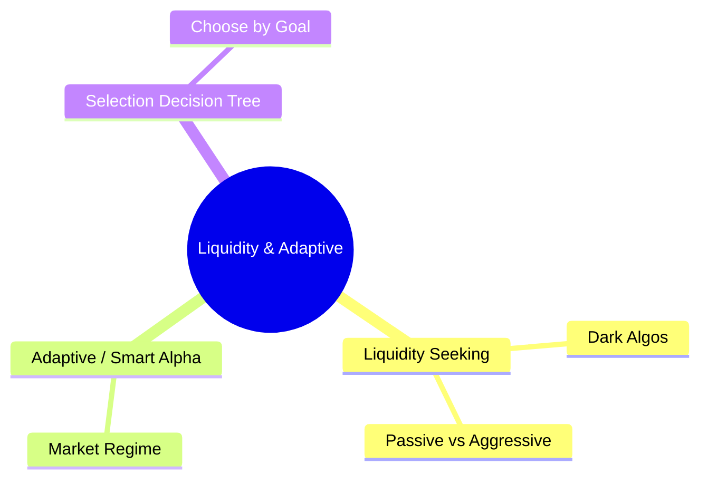
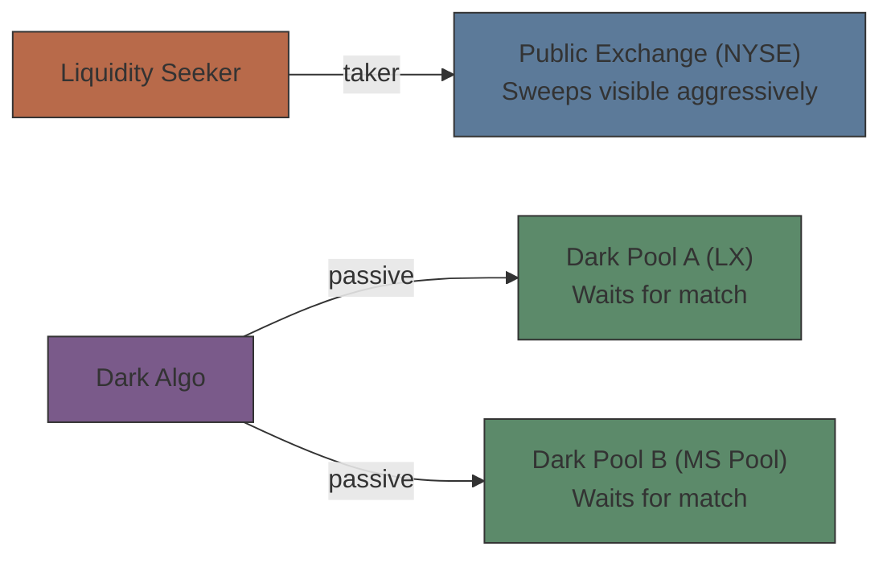
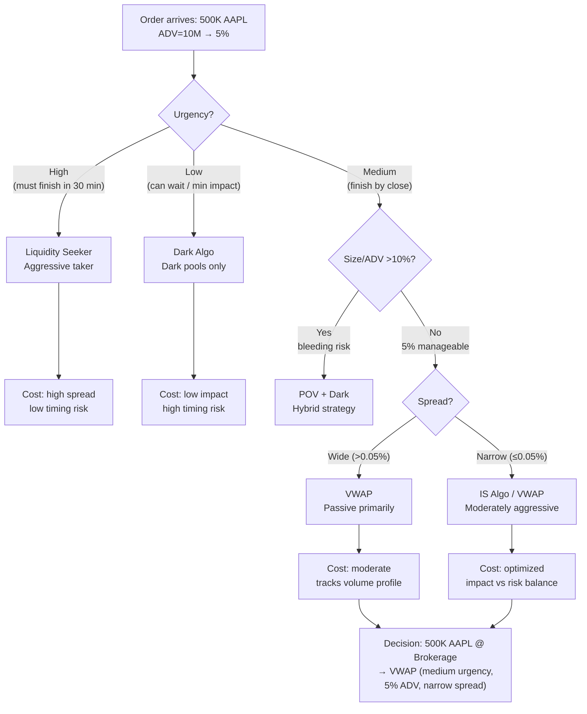

# Module 23: Liquidity & Adaptive Algos

Estimated time: 2h



## Learning Objectives (aligned with course CILOs)
- Differentiate between major algo strategies (VWAP, TWAP, IS, POV) — use cases and limitations — maps to CILO #4
- Select appropriate algorithm based on order characteristics (urgency, size/ADV, spread, volatility) — maps to CILO #4
- Calculate and interpret Implementation Shortfall and its decomposition — maps to CILO #4
- Understand Reg NMS constraints on algo behavior — maps to CILO #4
- Perform basic TCA (Transaction Cost Analysis) — maps to CILO #5

---

## Core Content

### 6. Liquidity Seeking vs Dark Algo

**Liquidity Seeking (aggressively seeking liquidity):**
- Aggressively sweeps visible liquidity (public order book quotes)
- Uses taker strategy: hits best offer / best bid
- Fast execution, but pays spread + exchange fee (taker role in maker-taker model)
- Suitable for high-urgency orders

**Dark Algo:**
- Finds passive liquidity only in dark pools / ATS (Alternative Trading Systems)
- Does not display order information, does not affect public price
- Uses sweeper strategy: simultaneously queries multiple dark pools
- Slow, but market impact is minimal (near zero)
- Risk: may encounter toxic flow in dark pools (e.g. HFT hedging flow)



**Maker vs Taker Cost Comparison:**
| Attribute | Maker (limit order) | Taker (market order) |
| --------- | ------------------- | -------------------- |
| Revenue/Cost | Earns rebate ~$0.002/share | Pays spread ~$0.01/share |
| Fill guarantee | No fill guarantee | Near-guaranteed fill |
| Risk | Adverse selection risk | Causes market impact |

> **Cloze**: "Taker strategy pays {spread} and {taker fee}, but executes fastest. Maker strategy earns {rebate}, but faces {adverse selection} risk — the market may move against your resting order."
>
> *Answer: spread, taker fee, rebate, adverse selection*

---

### 7. Adaptive / Smart Alpha Algorithms

Next-generation algorithms use machine learning and real-time data to dynamically adjust execution:

- **Volume prediction model**: forecasts volume for the next 5-30 minutes
- **Volatility adjustment**: reduces participation rate when volatility is high
- **Spread cost optimization**: shifts to passive when spreads are too wide
- **Alpha capture**: if model predicts short-term price rise, accelerates buying (not just executing, but capturing alpha)

**Example: Smart Alpha in the Brokerage Algo Wheel:**
```text
Inputs:
  - L1 market data (bid/ask spread, depth)
  - Historical volume profile
  - Peer flow patterns
  - News sentiment signals (NLP)

Outputs:
  - Suggested participation rate: dynamically 5%-25%
  - Suggested aggression: aggressive in high liquidity, passive in low
  - Dynamic dark / lit allocation ratio
```

> **Think**: Volume model predicts 20% liquidity drop in the next 30 min. Should the adaptive algo raise or cut its participation rate?
>
> *Answer: Cut it. Lower volume → each order moves price more, impact rises. Adaptive algo reduces participation and may shift to dark pools to avoid tipping its hand.*

---

### 8. Algo Selection Decision Tree

Back to the brokerage's 500K AAPL order. Based on order parameters and market conditions:



> **Predict**: The client suddenly says "This order is now urgent — must complete in 15 minutes." You're already running VWAP. What do you do?
>
> *Answer: Immediately pause the VWAP algo, switch to liquidity seeker mode. Or use "adaptive IS algo with high urgency" parameters — the brokerage's algo wheel supports real-time urgency override. If you can't switch instantly, use a hybrid: market order + dark sweeper — sweep 40% with liquidity seeker, rest with dark limit orders to avoid excessive impact.*

---

## Spot the Mistake

Someone says "Dark algo is always better than liquidity seeker because it produces zero market impact."

**Why is this wrong?**

*Answer: Dark algo doesn't guarantee execution. Waiting for passive matching in dark pools may result in only 20% filled by close. The unfilled portion creates massive opportunity cost. Liquidity seeker has market impact but ensures execution. No algorithm is universally superior — the choice depends on the trade-off between market impact and opportunity cost.*

---
