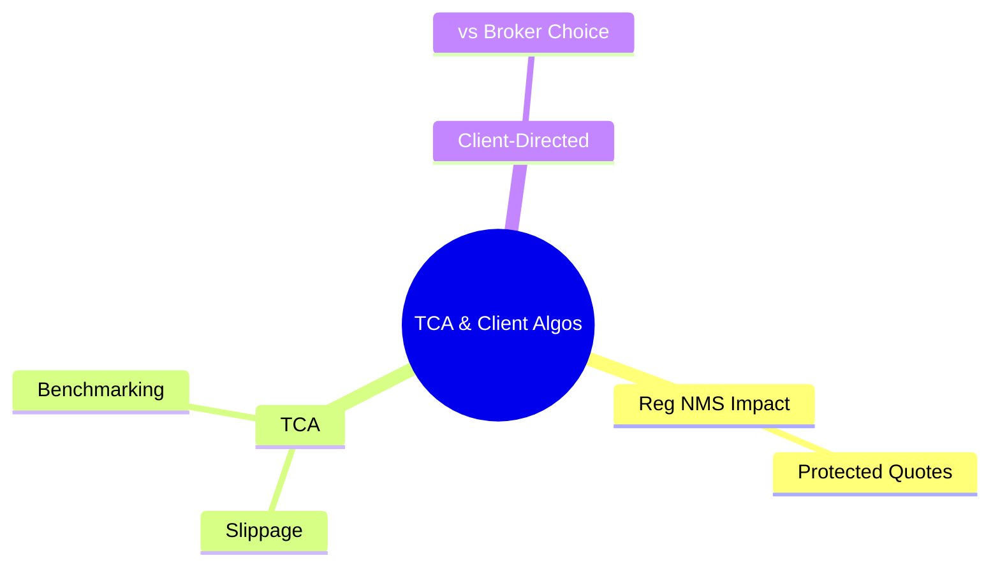

# Module 24: TCA & Client Algos

Estimated time: 2h



## Learning Objectives (aligned with course CILOs)
- Differentiate between major algo strategies (VWAP, TWAP, IS, POV) — use cases and limitations — maps to CILO #4
- Select appropriate algorithm based on order characteristics (urgency, size/ADV, spread, volatility) — maps to CILO #4
- Calculate and interpret Implementation Shortfall and its decomposition — maps to CILO #4
- Understand Reg NMS constraints on algo behavior — maps to CILO #4
- Perform basic TCA (Transaction Cost Analysis) — maps to CILO #5

---

## Core Content

### 9. Reg NMS Impact on Algorithms

Reg NMS (Regulation National Market System), the 2005 US regulatory framework, profoundly affects algo design:

**Key Rules:**

| Rule                                 | Description                                                                                               | Algo Impact                                       |
| ------------------------------------ | --------------------------------------------------------------------------------------------------------- | ------------------------------------------------- |
| **Rule 611 (Order Protection Rule)** | Cannot trade through a protected quote (e.g. can't execute at $150.05 if another exchange quotes $150.06) | Algo must route to best-price exchange            |
| **Rule 610 (Market Access)**         | Fair access, non-discriminatory fees                                                                      | Algo must consider exchange fee/rebate structures |
| **Rule 612 (Sub-Penny Rule)**        | Minimum quote increment is $0.01 (for stocks > $1)                                                        | Algo can only place orders in penny increments    |

**Practical Impact:**
- SOR (Smart Order Router) must check NBBO (National Best Bid and Offer) across all exchanges
- Algo cannot route to a worse-priced exchange just to save fees
- HFTs exploit Rule 611 for latency arbitrage — algo must account for this

> **Think**: Is there an inherent tension between Rule 611 (Order Protection Rule) and algo routing strategy? Why?
>
> *Answer: Yes. Rule 611 forces routing to the best-price exchange, even if that exchange has lower rebates or slower speed. From the algo's perspective, if routed to a low-rebate, slow exchange, total cost (price + fee + opportunity cost) may be higher. Rule 611 protects "price," not "total cost."*

> **Predict**: Algo routed to the best-priced exchange charges high taker fee, no rebate. What happens to order economics?
>
> *Answer: Fill at best price but the fee eats the edge. Rule 611 protects "price," not total cost — that's why algos still factor fee/rebate structures into routing, and why Rule 610 fee fairness matters.*

> **Predict**: An algo submits a limit order at $150.005 for a stock trading above $1. What happens?
>
> *Answer: Rule 612 (Sub-Penny Rule) forbids increments below $0.01 for stocks > $1 — the exchange rejects the order. The algo must round to penny increments, which is exactly how sub-penny pricing breaks order-placement logic.*

---

### 10. TCA (Transaction Cost Analysis)

TCA is the systematic method for evaluating algo performance.

**Pre-Trade TCA (ex-ante estimation):**
```text
Expected Cost = Market Impact Model + Spread Cost + Timing Risk
             = f(size/ADV, volatility, spread, exchange)
```
- Uses historical data to simulate expected slippage under different algo strategies
- Helps traders select algorithms

**Post-Trade TCA (ex-post analysis):**
```text
Actual Slippage = Execution Price − Benchmark Price

Benchmark Options:
  - Arrival Price: measures execution vs decision timing
  - VWAP: measures vs day's average market price
  - Close: measures vs closing price
  - Implementation Shortfall: comprehensive measure
```

**TCA Report Example:**

```text
Order: BUY 500,000 AAPL (2025-03-15)
─────────────────────────────────────────────
Arrival Price:         $150.00
Avg Fill Price:        $150.18
Close Price:           $151.00
─────────────────────────────────────────────
vs Arrival:            -$0.18 (-0.12%)    ✓ Good
vs VWAP ($150.12):     -$0.06 (-0.04%)    ✓ Good
vs Close:              -$0.82 (-0.54%)    ✓ Saved vs close
─────────────────────────────────────────────
IS Cost:                $108,900
  Market Impact:        $86,400
  Opp. Cost:            $20,000
  Fixed Cost:            $2,500
─────────────────────────────────────────────
Algo: VWAP, participation rate ≈ 8%
Execution rate: 94.5% of DVOL
```

> **Predict**: Same BUY order re-run next day in a flat market. Close-vs-arrival now shows +$0.30. What should the trader conclude?
>
> *Answer: Not that the algo got worse — market direction drove the change. Compare actual IS against pre-trade TCA expected IS, not raw benchmark swings. Single-day benchmark deltas hide market moves.*

> **Cloze**: "TCA splits into {pre-trade} and {post-trade} phases. Pre-trade helps select strategy, post-trade evaluates execution quality. Common benchmarks include {arrival price}, {VWAP}, and {close price}."
>
> *Answer: pre-trade, post-trade, arrival price, VWAP, close price*

---

### 11. Client-Directed vs Broker-Choice

- **Client-Directed Routing**: Client specifies which broker's algo or routing rules to use. Common at large hedge funds that have their own algo wheel or TCA team.
- **Broker-Choice**: Client authorizes the broker to choose. Broker optimizes based on client profile and order parameters.

**Brokerage Scenario Distinction:**
```text
Client-Directed: "Use Broker's VWAP for this order."
Broker-Choice:   "Help me buy 500K AAPL — use your best judgement."
```

---

## Why This Matters

1. **Wrong algo choice is costly**: Executing a non-urgent order with a liquidity seeker → wasted spread + fee. Executing an urgent order with a dark algo → unfilled shares + opportunity cost.
2. **TCA is key to client retention**: Large asset managers run TCA daily. If the brokerage's algo consistently underperforms benchmarks, the client takes their order flow elsewhere.
3. **Reg NMS violations = regulatory fines + reputation loss**: Rule 611 violations are a FINRA priority.
4. **Cross-team collaboration**: Whether you work on OMS/EMS engineering or as an algo strategist, you need to understand the algo wheel's routing logic to debug execution anomalies.

---

## Key Takeaways

- VWAP: tracks historical volume profile, suited for medium-sized, low-to-medium urgency orders
- TWAP: time-sliced, simple but ignores volume variation, suited for low-liquidity or ETF hedging
- Implementation Shortfall: arrival price benchmark, balances market impact vs timing risk
- POV: fixed percentage of real-time market volume, follows the market's rhythm
- Dark algo: fully passive, only seeks liquidity in dark pools → zero market impact but high opportunity cost
- Liquidity seeker: aggressively sweeps, high market impact but guarantees execution speed
- Maker earns rebate → passive; Taker pays spread + fee → aggressive
- TCA evaluates execution quality using arrival price / VWAP / close
- Reg NMS Rule 611 prohibits "trading through" a protected quote — algo must route to best price
- Algo selection depends on: urgency, size/ADV, spread, volatility, session timing

---

## Common Misconceptions

**Misconception 1: "VWAP algo guarantees your execution price equals the VWAP benchmark."**
**Fact**: VWAP algo only tracks the historical volume profile. Actual volume may deviate (e.g. major earnings announcement), causing the slicing schedule to misalign. Execution results may be above or below the day's VWAP. Guaranteeing VWAP is impossible.

**Misconception 2: "Dark algo is always better than visible algo because it produces no market impact."**
**Fact**: Dark algo waits passively in dark pools with uncertain fill rates. In low-liquidity dark pools, only 20-30% may fill. The opportunity cost on the unfilled portion can far exceed market impact.

**Misconception 3: "Lower IS cost means better algo execution."**
**Fact**: Absolute IS cost is influenced by market direction. A buy order in a rising market naturally has higher IS, even with perfect execution. Evaluate against "expected IS from pre-trade TCA model" deviation.

---

## Spot the Mistake

A junior trader submits the following execution analysis:

```text
Order: BUY 200,000 MSFT (ADV = 25M → 0.8%)
Algo: POV = 10%
Avg Fill Price: $425.20
VWAP: $425.10
Arrival Price: $425.00

"Execution result is only $0.10 (0.024%) away from VWAP — good performance."
```

**What key point does this analysis miss?**

*Answer: At 0.8% ADV, the order is very small — any reasonable execution method will get close to VWAP. The real test: comparing to arrival price, how did the stock trend through the day? If MSFT opened at $425 and closed at $428, then $425.20 is decent — but that "good result" may owe more to market direction than algo skill. Use pre-trade TCA to estimate expected slippage, then compare actual vs expected.*

---

## Feynman Explain

(Explain "Implementation Shortfall" in the simplest possible terms to someone without a finance background. Example: You decide to buy 100 AAPL shares at $150. As you start buying, the price rises to $151. How much "extra cost" did you incur? Why can't every trade execute at the decision price?)


---

## Reframe

(Pause. Evaluate the convention of "VWAP as execution benchmark." Does VWAP accurately measure execution quality? If a large ETF rebalance order (must execute in close auction) uses a VWAP algo, is this benchmark appropriate? When does VWAP produce misleading evaluations? Write your assessment.)

---

## Drill

Complete the quiz. MCQs test from different angles — recall, application, scenario, TCA calculation.

Run: `learn.sh quiz brokerage-ops 24`
