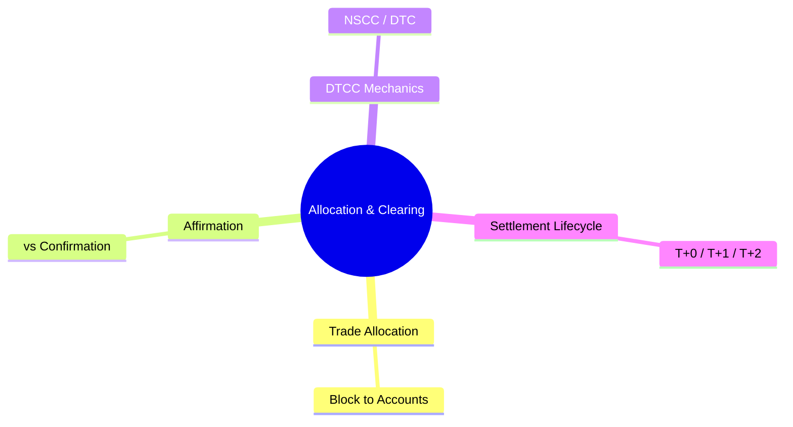
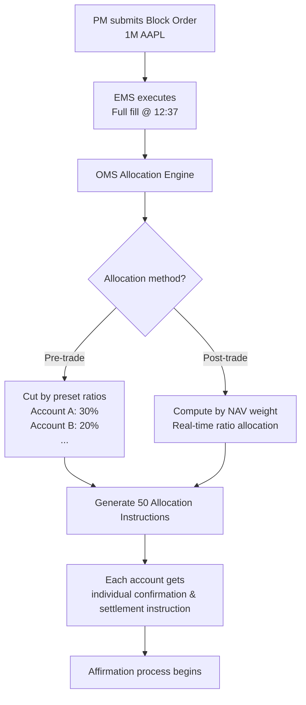
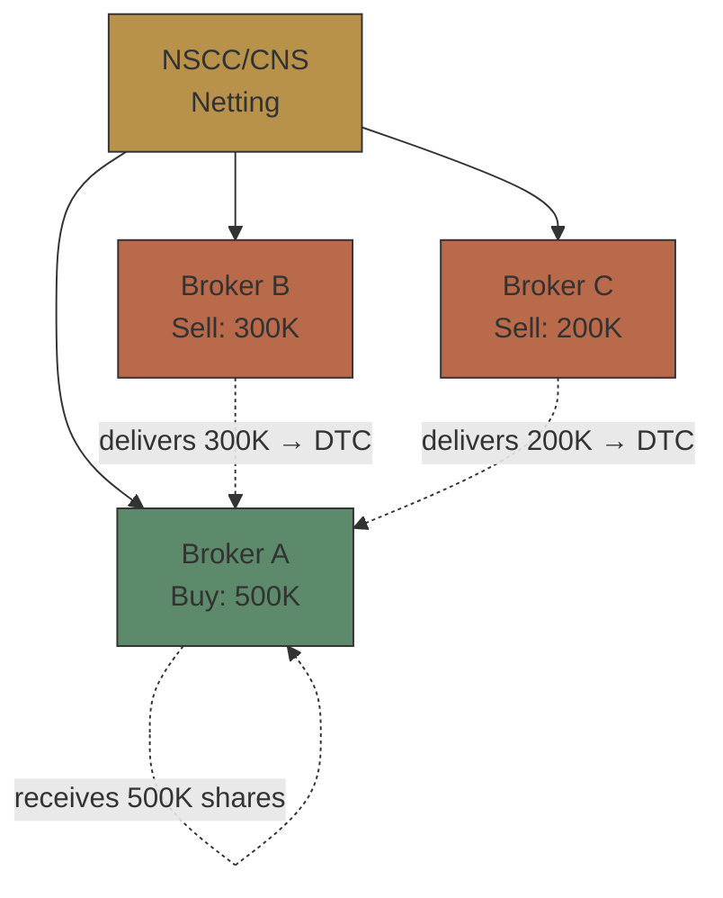

# Module 25: Allocation & Clearing

Estimated time: 2h



## Learning Objectives (aligned with course CILOs)
- Understand block trade allocation workflow and partial fill allocation methodology — maps to CILO #3
- Distinguish between affirmation and confirmation — timing and use cases — maps to CILO #1
- Master DTCC NSCC/DTC clearing mechanics (CNS, netting, matching) — maps to CILO #4
- Understand the settlement lifecycle (T+0/T+1/T+2) and settlement instruction types (DVP/RVP/FOP) — maps to CILO #4
- Identify settlement failure causes and buy-in risk management — maps to CILO #5
- Master fee structure (commissions, exchange fees, clearing fees, SEC fee, FINRA TAF) and pricing models — maps to CILO #5
- Understand STP as the core post-trade KPI — maps to CILO #6

---


## Real-World Scenario

At the brokerage's institutional brokerage morning meeting, the PM gives the order: "Buy 1,000,000 shares of AAPL, market price, split across 50 client accounts, proportioned by prior-day NAV weights."

Execution completes as a full fill at 12:37 PM. But by end of day, operations team discovers:
- 3 accounts have DVP settlement failures (insufficient cash)
- 5 accounts have DVP/RVP flags misconfigured in settlement instructions
- 1 account received no allocation at all — the account ID in the allocation engine was deactivated but not synced

Worse, one defaulting account triggers an NSCC buy-in — the brokerage is forced to repurchase shares at a higher price in the market, with the loss borne by the broker-dealer.

> **Think**: Why does a seemingly simple block trade cause so many post-trade problems? Which step is most underestimated?
>
> *Answer: Execution takes seconds, but allocation + affirmation + clearing + settlement involves at least 4 systems, 50 account configurations, 3 external institutions (DTCC, custodian bank, client). Post-trade complexity far exceeds execution. The most underestimated step is "settlement instruction correctness" — a wrong DVP/RVP flag means money and securities can't be exchanged.*

---

## Core Content

### 1. Trade Allocation: From Block Trade to Individual Accounts

A block trade is a single order that aggregates demand from multiple clients. After execution, it must be broken back into individual client accounts.

**Allocation Timing Models:**
- **Pre-trade allocation**: Ratios set before order placement. Required for fiduciary accounts, ERISA. Ratios must be strictly followed.
- **Post-trade allocation**: Ratios applied after execution. Flexible, but GIPS requires completion before T+1 with timestamp records.
- **Partial fill allocation**: When only part of the order fills, allocation uses pro-rata (shrink proportionally) or FIFO (first-in first-served).

> **Mermaid: Allocation Flow**


**Example — Partial Fill Scenario:**
```text
Original order: 1,000,000 AAPL
Actual fill: 750,000 AAPL (partial fill)

Allocation accounts:  Original %   Original Amt   Post-fill Amt (pro-rata)
Account A:            30%          300,000        225,000
Account B:            20%          200,000        150,000
Account C:            15%          150,000        112,500
...                                      (total = 750,000)
```

> **Think**: If the allocation engine used FIFO instead of pro-rata on a partial fill, what happens?
>
> *Answer: FIFO means the earliest sub-accounts get fully allocated first; later accounts may get nothing. For ERISA accounts this could violate fiduciary duty — all participants should be treated fairly. Pro-rata ensures proportional reduction.*

> **Cloze**: "After block trade execution, the OMS must {allocate} the block trade to individual client sub-accounts. When a partial fill occurs, the standard fair allocation method is {pro-rata}, not FIFO."
>
> *Answer: allocate, pro-rata*

---

### 2. Affirmation vs Confirmation

This is the most commonly confused pair of concepts in post-trade.

| Dimension | Affirmation (Intent Confirmation) | Confirmation (Trade Confirmation) |
|-----------|----------------------------------|-----------------------------------|
| Timing | Trade day (T+0) | Next business day (T+1, US equities) |
| Participants | Institutional client ↔ Broker | Broker ↔ Clearinghouse |
| Purpose | Both parties agree on trade details | Formal legal document |
| Electronic | Yes — CTM (Omgeo/DTCC) | Yes — electronic confirmation platforms |
| Legal effect | Intent confirmation | Formal confirmation, admissible as evidence |
| Failure consequence | Unaffirmed → cannot proceed to settlement | Confirmation delay → settlement risk |

> **Think**: Why does the institutional market need affirmation while retail doesn't?
>
> *Answer: Institutional orders may be split across 50 accounts, each with different settlement instructions. Discovering account errors at T+1 leaves no time to correct before settlement. Affirmation on T+0 lets both sides verify details the same day, leaving time to fix issues. Retail has only a single account with fixed settlement instructions — no affirmation needed.*

> **Predict**: If a client fails to affirm by T+0, but the broker already sent DTC instructions. What happens on T+1 settlement day?
>
> *Answer: DSD (Don't Settle / DK) status. DTCC CNS marks the trade as unconfirmed, unable to auto-settle. The broker-dealer must intervene manually. If the issue can't be resolved before cut-off, the trade is flagged as a fail (settlement failure), potentially triggering NSCC buy-in penalties.*

> **Cloze**: "Institutional trades use {affirmation} on T+0 to verify trade details; retail trades go straight to {confirmation} on T+1 for book entry. Affirmation is the last line of defense before settlement."
>
> *Answer: affirmation, confirmation*

---

### 3. DTCC NSCC/DTC Clearing Mechanics

**Key Entities:**
- **NSCC** (National Securities Clearing Corporation): Net settlement. Continuous Net Settlement (CNS) — all participants' buy and sell orders are netted, only net differences are transmitted.
- **DTC** (Depository Trust Company): Securities custody and transfer. Holds the market's securities in dematerialized form, transfers ownership on the books at settlement.
- **DTCC**: Parent company of NSCC + DTC.

**How CNS Works:**


**CNS Three Steps:**
1. **Trade Comparison**: Ensures buyer and seller agree on trade details. DTCC runs nightly batch.
2. **CNS Netting**: All positions for each participant are aggregated into a net amount.
3. **Settlement**: DTC executes securities transfer; NSCC guarantees fund settlement (if one party defaults, NSCC bears the risk).

> **Think**: How are short-term open CNS positions (typically 3-5 days) handled? What's the impact on the brokerage?
>
> *Answer: CNS allows "fail to deliver" to remain open short-term. But beyond T+5, NSCC initiates buy-in — forcing the seller to repurchase and charging penalty fees. Impact on brokerage: capital charge increases (regulatory capital rises due to open fails), client relationships suffer. This is why STP rate is the most important post-trade KPI.*

---

### 4. Settlement Lifecycle: T+0, T+1, T+2

**Settlement Cycle — how long after trade before cash and securities actually exchange:**

| Asset Class | Settlement Cycle | Effective Date | Notes |
|-------------|-----------------|---------------|-------|
| US Treasuries | T+0 | Long-standing | Same-day settlement |
| US Stocks / ETFs | T+1 | May 28, 2024 | SEC mandated shortening from T+2 |
| US Options | T+1 | May 2024 | Followed T+1 migration |
| FX Spot | T+2 | Long-standing | Interbank forex convention |
| European Equities | T+2 | Long-standing | EU CSDR |
| Municipal / Corp Bonds | T+1 (changing) | 2025-2026 | Varies by market adoption |

> **Think**: What was the SEC's primary motivation for shortening the US equity settlement cycle from T+2 to T+1 in 2024? What pressure does this put on post-trade systems?
>
> *Answer: Motivation: reduce settlement risk (counterparty risk) by shrinking the window between T+1 and T+2 where one party could default. Pressure (on post-trade systems): affirmation must complete on T+0 — can't wait overnight. STP rate must be higher because the window for manual intervention has shrunk dramatically. Batch processing must shift toward near-real-time.*

> **Cloze**: "Since May 28, 2024, US stocks and ETFs settled on {T+1} instead of T+2. This means affirmation must be completed on {T+0} — there's no more buffer day to fix issues."
>
> *Answer: T+1, T+0*

> **Predict**: An ETF trades at 4:00 PM on T-day (market close alloc), but the custodian bank's cut-off is 5:00 PM, and affirmation requires manual client confirmation. What happens on T+1 settlement day?
>
> *Answer: If the client misses cut-off and can't affirm, the trade is marked unmatched in CNS and can't auto-settle. Since T+1 is now settlement day (no T+2 buffer), the broker must request a CNS extension from DTCC or open a fail position. If large enough, this triggers SEC 15c3-3 (Customer Protection Rule) reserve formula capital requirements.*

---

## Spot the Mistake

Someone says "DTCC's CNS clearing and exchange matching are the same thing."

**Why is this wrong?**

*Answer: Exchange matching (matching engine) happens at execution — finding buy and sell orders at matching prices and executing. CNS happens post-trade — netting and settlement guarantees for "already executed" trades. Different timing, different function, different institution.*

---
