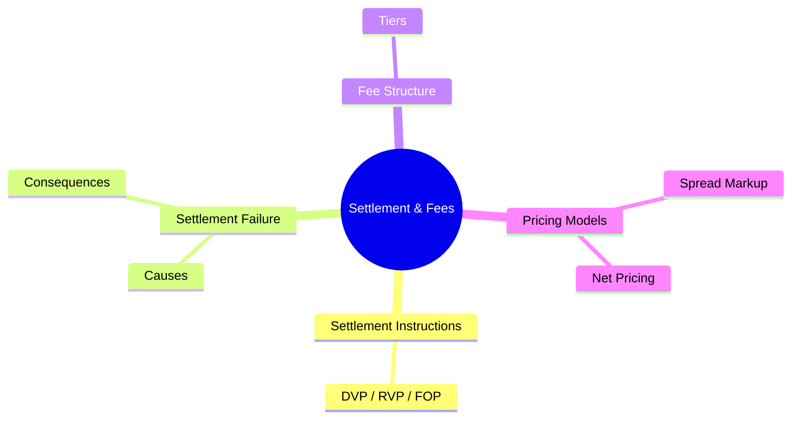

# Module 26: Settlement & Fees

Estimated time: 2h



## Learning Objectives (aligned with course CILOs)
- Understand block trade allocation workflow and partial fill allocation methodology — maps to CILO #3
- Distinguish between affirmation and confirmation — timing and use cases — maps to CILO #1
- Master DTCC NSCC/DTC clearing mechanics (CNS, netting, matching) — maps to CILO #4
- Understand the settlement lifecycle (T+0/T+1/T+2) and settlement instruction types (DVP/RVP/FOP) — maps to CILO #4
- Identify settlement failure causes and buy-in risk management — maps to CILO #5
- Master fee structure (commissions, exchange fees, clearing fees, SEC fee, FINRA TAF) and pricing models — maps to CILO #5
- Understand STP as the core post-trade KPI — maps to CILO #6

---

## Core Content

### 5. Settlement Instructions: DVP vs RVP vs FOP

These three instruction types determine "how cash and securities are exchanged":

| Instruction | Full Name | How It Works | Use Case |
|-------------|-----------|-------------|----------|
| DVP | Delivery Versus Payment | Deliver securities upon receiving payment. No cash → no delivery. | Institutional client buying (buy side). Payment protection. |
| RVP | Receive Versus Payment | Pay upon receiving securities. No securities → no payment. | Institutional client selling (sell side). Receipt protection. |
| FOP | Free of Payment | Transfer securities only, no cash exchange. | Collateral transfer, corporate actions (stock split/spinoff), internal account transfers. |

**Brokerage Scenario:**
```text
Block trade sub-accounts may have different instructions:
- Account A-1 (Pension Fund)    → DVP (buying, pay to receive shares)
- Account A-2 (Hedge Fund)       → DVP (buying)
- Account B-1 (Custody Client)   → FOP (need position record only, cash handled externally)
- Account B-2 (SMA)              → RVP (selling position)
```

**Common Error**: Allocation engine sets DVP as FOP → custodian bank receives no cash instruction → settlement fails.

> **Think**: If an account's settlement instruction has its DVP/RVP flag accidentally cleared during a migration, defaulting to FOP mode, what happens?
>
> *Answer: DTC only transfers securities, doesn't trigger cash settlement. The seller doesn't get paid; the buyer gets shares but the broker must finance the gap. This is credit risk for the broker — equivalent to an unsecured loan to the client. Operations must urgently correct the instruction on T+1 and request DTC reprocessing.*

---

### 6. Settlement Failure: Causes and Consequences

**Common Failure Causes:**
1. **DK (Don't Know)**: One party doesn't recognize the trade — most common from unaffirmed trades
2. **Instruction Mismatch**: Settlement instruction data mismatch (account number, custodian, DVP/RVP flag)
3. **Insufficient Cash**: Buyer's account lacks funds, DVP can't complete
4. **Insufficient Securities**: Seller's inventory insufficient, can't deliver (fail to deliver)
5. **CNS Pending**: CNS system comparison fails, trade stuck in queue

**Consequences (escalating severity):**
| Day | Consequence |
|-----|-------------|
| T+1 ~ T+2 | Open fail — broker must allocate internal capital |
| T+3 ~ T+4 | NSCC mandatory close-out process begins |
| T+5 | Buy-in executed — NSCC buys securities in the market, difference charged to defaulting party |
| T+5+ | FINRA / SEC regulatory notification, capital charge increases |

**Buy-in Risk:** If the stock being bought in is at a higher price than the original sale, the difference + penalties are entirely borne by the defaulting broker. A 1M share buy-in with a 2% price rise = USD 20,000 loss + NSCC fees.

> **Predict**: Three accounts in the brokerage's block trade fail settlement due to insufficient cash. If the market drops overnight, can these clients delay payment?
>
> *Answer: No. Settlement failure is not optional — even if the market drops, settlement obligations remain. The broker-dealer must advance funds (using its own capital to settle), then pursue reimbursement from the client. If the client ultimately can't pay, the broker forcibly liquidates the securities to recover funds; the client is still liable for any shortfall.*

---

### 7. Fee Structure

Post-trade fees divide into five categories:

**A. Commissions**
| Model | Rate | Application |
|-------|------|-------------|
| Per-share | $0.005/sh | Institutional high-volume |
| Per-trade | $15/trade | Retail |
| Tiered | Decreasing by volume | Large institutions |
| Wrap fee | Fixed annual fee | Wealth management |

**B. Exchange Fees**
- **Maker-Taker Model**: Providing liquidity (maker) → charges or rebates (e.g. -$0.001/sh); taking liquidity (taker) → pays fee (e.g. $0.003/sh)
- Fee structures vary by exchange (NYSE Arca vs IEX difference is significant)

**C. Clearing Fees**
- NSCC clearing fee: charged per trade (~$0.01/trade)
- DTC settlement fee: charged per settlement
- Brokers using a clearing broker (not self-clearing) pay an additional clearing spread

**D. Regulatory Fees**
- **SEC Section 31 Fee** (Sec. 31(a) of the Exchange Act): sell-side transaction fee (2024: ~$0.000008 per USD of trading volume). Funds SEC regulatory operations.
- **FINRA TAF** (Trading Activity Fee): flat fee per transaction (2024: ~$0.0000025/share, cap ~$7.99)

**Example — 1M shares AAPL @ $200 Trade Cost Estimate:**
```text
Trade value: 1M × $200 = $200M

Commission (per-share): 1M × $0.005     = $5,000
Exchange fee (taker):   1M × $0.003     = $3,000
Clearing fee:           ~$0.01/trade    negligible
SEC fee:                $200M × $0.000008 = $1,600 (sell side only)
FINRA TAF:              1M × $0.0000025  = $2.50

Total cost (buy side):  ~$8,000
Total cost (sell side): ~$9,600 (includes SEC fee)
```

> **Think**: Taker pays higher exchange fees than maker. How does this affect algo routing strategy?
>
> *Answer: The algo engine prioritizes providing liquidity as a maker (resting orders) to earn rebates or reduce costs. Taking liquidity to chase fill speed requires paying higher fees. This means routing strategy considers not just best price but net cost (price + fees). This is why TCA now incorporates fee impact.*

> **Cloze**: "The SEC Section 31 fee is calculated on {sell-side transaction value} and funds the SEC's regulatory operations. The FINRA TAF is a {fixed} fee per transaction with a per-trade cap."
>
> *Answer: sell-side transaction value, fixed*

---

### 8. Pricing Models: Spread Markup vs Commission Net Pricing

Institutional trade pricing directly affects brokerage profitability:

| Model | How It Works | Pros | Cons |
|-------|-------------|------|------|
| Spread Markup | Broker's quote includes an implicit bid-ask spread. No separate commission. | Looks cheaper / no commission listed | Opaque pricing / potentially unfair to clients / easy to overcharge |
| Commission + Net | Execution at market net price, plus explicit per-trade commission. | Fully transparent / MiFID II and best execution compliant | Higher apparent cost at quoting stage |

**Brokerage Scenario**: Institutional clients prefer commission + net model because they must prove best execution to regulators. Spread mark-up is considered "non-transparent pricing" under SEC/MiFID frameworks and is unsuitable for certain client types.

---

## Spot the Mistake

"FOP is the simplest settlement type, so all trades should use FOP."

**Why is this wrong?**

*Answer: FOP is only suitable for no-cash-exchange scenarios (collateral, corporate actions, internal transfers). For buy/sell trades, FOP means the cash flow isn't managed within the settlement system — the broker bears full credit risk. DVP and RVP exist to ensure "delivery versus payment," a core requirement of SEC 15c3-3.*

"Spread mark-up is cheaper for clients because there's no commission."

**Why is this wrong?**

*Answer: No commission doesn't mean no cost. Spread mark-up hides the broker's revenue inside the bid-ask spread — the client may end up paying more in spread cost than they would in commission, and can't verify if the execution price was truly the market best. Commission + net is more transparent. FINRA and SEC have penalized mark-up overcharging.*

---
