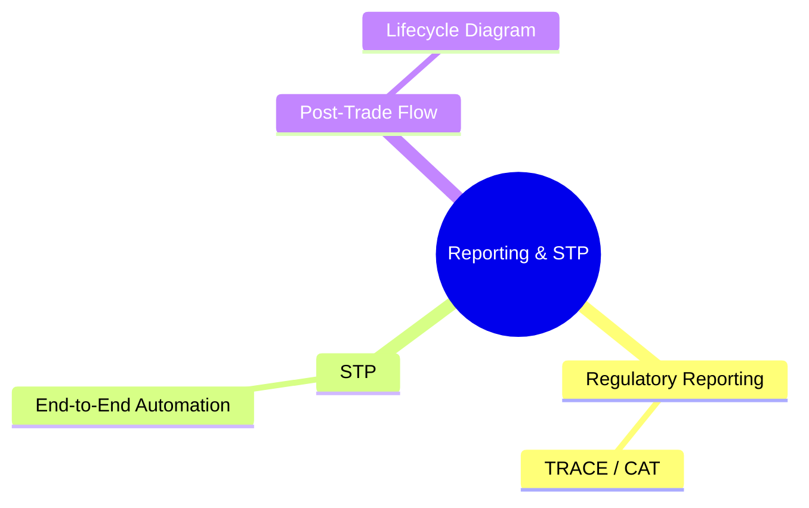
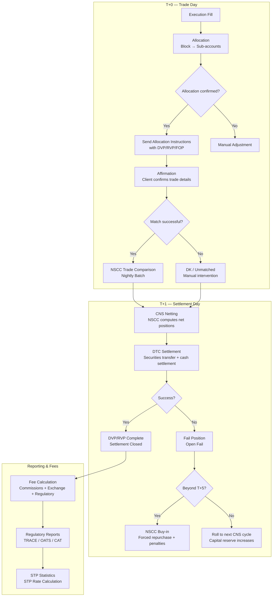

# Module 27: Reporting & STP

Estimated time: 2h



## Learning Objectives (aligned with course CILOs)
- Understand block trade allocation workflow and partial fill allocation methodology — maps to CILO #3
- Distinguish between affirmation and confirmation — timing and use cases — maps to CILO #1
- Master DTCC NSCC/DTC clearing mechanics (CNS, netting, matching) — maps to CILO #4
- Understand the settlement lifecycle (T+0/T+1/T+2) and settlement instruction types (DVP/RVP/FOP) — maps to CILO #4
- Identify settlement failure causes and buy-in risk management — maps to CILO #5
- Master fee structure (commissions, exchange fees, clearing fees, SEC fee, FINRA TAF) and pricing models — maps to CILO #5
- Understand STP as the core post-trade KPI — maps to CILO #6

---

## Core Content

### 9. Post-Trade Regulatory Reporting

After each trade completes, the broker-dealer must report to multiple regulators:

| Report | Jurisdiction | Coverage | Timing |
|--------|-------------|----------|--------|
| TRACE | FINRA | Fixed income (corp bonds, muni bonds, ABS) | T+1 (some T+0) |
| OATS | FINRA | Order routing and execution details (US equities, options) | Same day |
| CAT | FINRA/SEC | Comprehensive audit trail (all NMS stocks, options) | Real-time + T+1 |
| Blue Sheets | SEC | Trade data (large brokers on request) | On request |
| Non-US Reporting | Local regulators | Local securities trades (e.g. ESMA/MiFID II) | Varies by market |

**OATS vs CAT Key Differences:**
- OATS: Order-level tracking — full order journey from entry to execution
- CAT: More comprehensive audit trail — covers orders + account info + attribution to end client
- CAT aims to replace OATS and multiple custom blue sheet requests

> **Think**: Multiple coexisting regulatory reporting systems — what specific challenges does this create for the brokerage's post-trade systems?
>
> *Answer: First, data must be consistent — OATS and CAT reports for the same trade must not contradict each other. Second, formats differ — OATS via FINRA web interface, CAT via dedicated CAT Reporter Portal API. Third, timing pressure — CAT starts at T+1, some OTC trades require real-time reporting. Post-trade systems must support multiple output formats and deadlines simultaneously — one mapping bug can trigger regulatory fines.*

> **Cloze**: "FINRA's {TRACE} covers post-trade reporting for fixed income, while {OATS} and {CAT} cover equity and option order audit trails."
>
> *Answer: TRACE, OATS, CAT*

---

### 10. STP (Straight-Through Processing)

**Definition**: The complete post-trade flow — allocation → affirmation → clearing → settlement — completes without manual intervention.

**STP Rate Calculation:**
```text
STP Rate = (Automated Trades ÷ Total Trades) × 100%
```

**Industry Benchmarks (Institutional Brokerage):**
| Level | Threshold | Status |
|-------|-----------|--------|
| World Class | >95% | Top-tier brokerages |
| Good | 85-95% | Most large brokerages |
| Needs Improvement | <85% | Excessive manual intervention, high cost |

**Common STP Failure Causes:**
1. Allocation instruction format errors or expired account IDs
2. Uncompleted affirmation (client didn't confirm)
3. Settlement instruction mismatch (DVP/RVP flag, custodian code)
4. Cross-market, cross-asset instruction translation errors (e.g. US vs EU CSD format differences)

**Brokerage Scenario**: 1M share block trade with 50 accounts, 3 fail (STP rate = 47/50 = 94%). Looks good (>90%), but 6% manual intervention translates to 3 accounts' buy-in risk + labor hours + client complaints.

> **Think**: Why can't STP rate reach 100%? Which trades "legitimately" can't STP?
>
> *Answer: 1) First-time new accounts (no settlement instruction template yet); 2) Complex cross-border trades requiring manual confirmation; 3) Temporary account info changes; 4) Trades needing special compliance approval. These are legitimate manual touchpoints. But unreasonable manual intervention — e.g. allocation engine bugs, unsynchronized master data — reflects system design problems.*

---

### 11. Mermaid: Complete Post-Trade Lifecycle Flow



> **Predict**: NSCC's nightly trade comparison batch finds 5 trades unmatched, even though affirmation was completed earlier that day. What might be the cause?
>
> *Answer: Most likely — data in the CTM (affirmation platform) and NSCC have a time lag or mapping error. For example, CTM uses the client's internal account ID for affirmation, but NSCC uses DTC participant numbers. If the cross-reference table between the two isn't synchronized, affirmation goes through but NSCC can't match. This is a classic inter-system reconciliation problem.*

---

## Spot the Mistake

Someone says "CAT is replacing OATS, so we can stop filing OATS and only build CAT."

**Why is this wrong?**

*Answer: CAT aims to replace OATS, but the two currently coexist with different scopes, formats, and deadlines — OATS via the FINRA web interface, CAT via the CAT Reporter Portal API. Dropping OATS before the formal phase-out leaves a regulatory gap and triggers fines.*

Ops lead says "STP rate 94% is above the 90% target — the 3 failed allocations are negligible."

**Why is this wrong?**

*Answer: The 3 fails carry real cost: buy-in risk, penalty fees, labor hours, client complaints — and in the T+1 era there is no buffer day to fix them. STP should be tracked by risk-weighted failure count, not just a headline percentage.*

---
