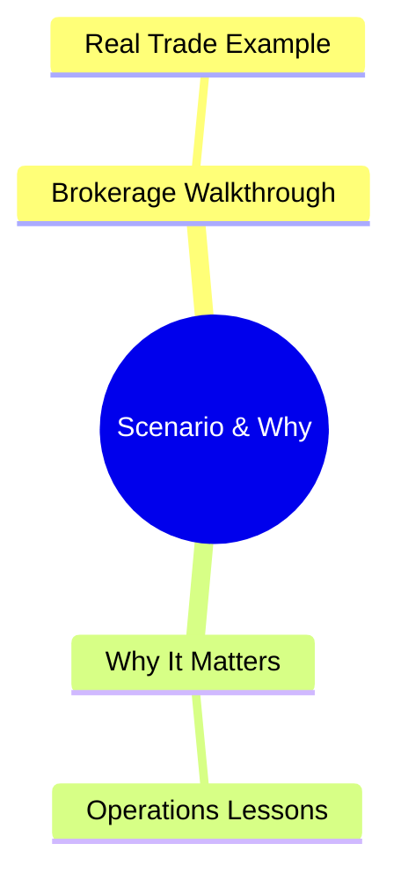

# Module 28: Scenario & Why Answers

Estimated time: 2h



## Learning Objectives (aligned with course CILOs)
- Understand block trade allocation workflow and partial fill allocation methodology — maps to CILO #3
- Distinguish between affirmation and confirmation — timing and use cases — maps to CILO #1
- Master DTCC NSCC/DTC clearing mechanics (CNS, netting, matching) — maps to CILO #4
- Understand the settlement lifecycle (T+0/T+1/T+2) and settlement instruction types (DVP/RVP/FOP) — maps to CILO #4
- Identify settlement failure causes and buy-in risk management — maps to CILO #5
- Master fee structure (commissions, exchange fees, clearing fees, SEC fee, FINRA TAF) and pricing models — maps to CILO #5
- Understand STP as the core post-trade KPI — maps to CILO #6

---

## Core Content

### 12. Brokerage Scenario Full Walkthrough

Back to the 1M share block trade case. The complete post-trade journey:

```text
10:00 AM   PM orders "Buy 1M AAPL, split 50 ways"
10:12 AM   EMS execution completes @ $198.50
10:15 AM   OMS Allocation Engine starts
               → Computes NAV-weighted quotas for 50 accounts
               → Generates allocation instructions per account
               → Validates each account's settlement instruction template
10:20 AM   Finds 3 accounts with missing DVP/RVP flags → auto-alerts ops team
               → 1 account deactivated but still in master file → flagged as error
11:00 AM   Allocation instructions sent to each client
               → CTM platform initiates affirmation process
2:00 PM    47/50 accounts affirmed
               → 3 accounts unresponsive (ops team calling)
4:30 PM    3 accounts affirmed (just before deadline)
5:00 PM    CNS batch starts — all 50 accounts matched
T+1        DVP settlement — 47 accounts succeed (sufficient funds)
               3 accounts insufficient cash → open fail
               → Broker-dealer advances funds to complete settlement
               → Pursues client reimbursement + penalty fees
T+3        2 accounts replenished funds → fail closed
T+5        1 account still unpaid → NSCC buy-in triggered
               Loss: 10,000 shares × ($200.50 - $198.50) = $20,000
```

> **Predict**: The one account still unpaid passes T+5. What happens next?
>
> *Answer: NSCC buy-in triggers — forced repurchase at the market price plus penalties. The broker eats the loss: 10,000 shares × ($200.50 − $198.50) = $20,000, then pursues the client for reimbursement.*

> **Predict**: 2 of the 50 accounts never affirm by 5:00 PM — no client response, no manual override. What happens through T+1?
>
> *Answer: CNS comparison marks them unmatched → fail positions. Under T+1 there is no buffer day: the broker advances funds or opens a fail, and if the client stays unresponsive the NSCC buy-in fires — the $20K buy-in loss scenario from this block.*

> **Think**: If the allocation instructions for this block trade were sent at midday T+0 (due to OMS batch delay), how would the overall timeline be affected?
>
> *Answer: Allocation delay → CTM affirmation window shrinks. If clients receive allocation instructions at 4:30 PM, they can't complete affirmation the same day. CNS comparison flags these as unmatched → T+1 can't settle → fail position. Under the old T+2 regime there was a buffer day. In the T+1 settlement era, missing T+0 cut-off means certain fail.*

---

### 13. Why This Matters

Post-trade is the best example of "execution is just the beginning." For the brokerage's technical staff:

1. **$ Impact**: Settlement failures — whether buy-in losses or capital charges — cost tens of thousands to millions of dollars. One allocation engine bug can wipe out an entire quarter's profit in an hour.

2. **STP is an efficiency metric**: Post-trade team headcount accounts for 40%+ of ops spend. Each manual touch costs $10-50. Moving STP from 85% to 95% shows directly in P&L.

3. **Regulatory Risk**: Settlement failure rates above SEC/FINRA thresholds → expanded regulatory scrutiny → stricter capital requirements. OATS/CAT reporting errors → FINRA fines.

4. **System Design Constraints**: Post-trade systems must handle settlement instruction variety (DVP/RVP/FOP), cross-CSD mapping, multi-jurisdiction report formats. Schema design errors can stall the entire post-trade pipeline.

5. **T+1 Era Pressure**: 2024 T+1 shortened every time window. Batch processing is no longer fast enough — real-time affirmation and real-time settlement instruction validation have become essential.

> **Predict**: Ops staff cuts push the STP rate from 95% down to 85%. What is the financial impact?
>
> *Answer: Each manual touch costs $10-50 and 40%+ of ops spend is post-trade headcount. Losing 10 STP points means far more manual allocations and affirmations, higher fail count, and more buy-in/capital-charge risk — a direct drag on P&L.*

---

## Key Takeaways

- Block trade → allocation (pre-trade / post-trade / pro-rata partial fill) → affirmation (T+0) → clearing (CNS) → settlement (DVP/RVP/FOP)
- Affirmation is the institutional T+0 confirmation mechanism; confirmation is the T+1 formal record
- NSCC's CNS handles net settlement; DTC executes securities transfer; CNS comparison failure → unmatched → fail
- US equities T+1 settlement (effective 2024/5/28), US Treasuries T+0, FX T+2, European equities T+2
- DVP = delivery versus payment (cash and securities simultaneous), RVP = receive versus payment, FOP = free of payment (securities only)
- Settlement failure → buy-in risk, capital charge escalation, regulatory penalties
- Fees: commissions (per-share/per-trade/tiered), maker-taker fees, clearing fees, SEC 31 fee, FINRA TAF
- STP rate is the core post-trade KPI — measures automation, affects ops cost and risk
- Regulatory reports: TRACE (fixed income), OATS (order routing), CAT (comprehensive audit trail)

---

## Common Misconceptions

**Misconception**: "Settlement happens automatically — once a trade fills, it's done."

**Fact**: Settlement is one of the most manual parts of the post-trade system. Every settlement needs correct instructions (DVP/RVP flag, custodian, account ID), T+0 affirmation confirmation, and successful CNS comparison. Any mistake means the trade won't auto-settle. With the T+1 window since 2024, there's no time to manually fix — STP and pre-validation are critical.

**Misconception**: "The buyer using DVP means 'I paid so I definitely get the stock.'"

**Fact**: DVP ensures "payment and receipt of stock are simultaneous," but only if the seller has sufficient securities in DTC. If the seller fails to deliver, DVP can't force delivery — you must wait for CNS to initiate buy-in. DVP reduces risk but doesn't eliminate it.

---

## Spot the Mistake

A systems engineer designing a post-trade API schema defines the `settlementType` field as `enum {"DVP", "FOP"}` and sets `custodianBankId` as optional.

What's wrong?

*Answer: Missing RVP (Receive Versus Payment). RVP is extremely common for sell-side trades — without it, the schema can't represent sell-side payment protection. Furthermore, making `custodianBankId` optional is risky — while FOP might not need a custodian, DVP/RVP trades missing a custodian ID produce incomplete settlement instructions that can't execute through DTC. Schema design flaws in the post-trade pipeline won't surface until T+1.*

---

## Feynman Explain

(Explain "why execution doesn't mean the trade is over" in the simplest terms. Example: You buy a car — paying doesn't mean you instantly have the car and title. There's the purchase agreement, loan approval, title transfer. Stock trades are similar — execution is just both sides agreeing on a price; the confirmation, clearing, settlement, and fee calculation that follow are what make you truly own the stock.)


---

## Reframe

(Pause. Evaluate the "post-trade workflow" framework: Why hasn't the financial industry achieved 100% STP? Based on your work experience, which manual touchpoints are "necessary evils" and which are "system design improvements"? In a 100% STP world, which roles would disappear? Write your assessment.)

---

## Drill

Complete the quiz. MCQs test from different angles — recall, application, scenario.

Run: `learn.sh quiz brokerage-ops 28`
