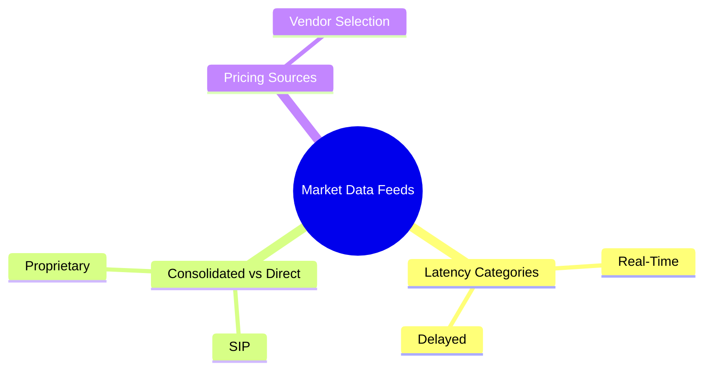
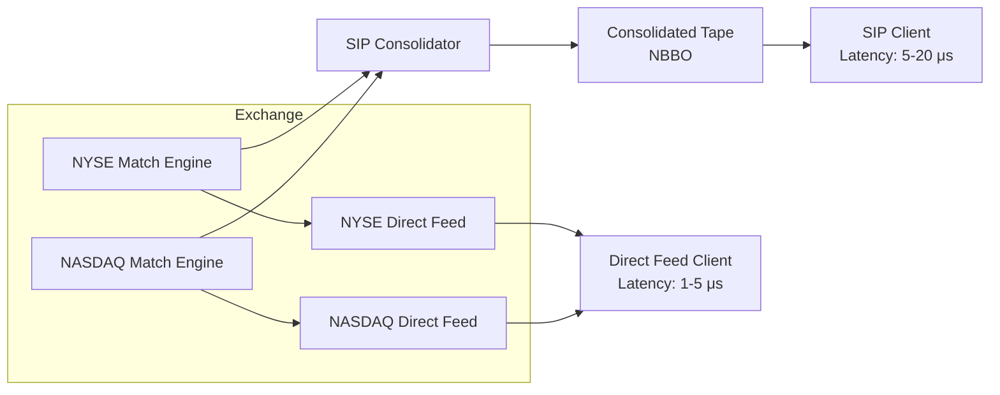
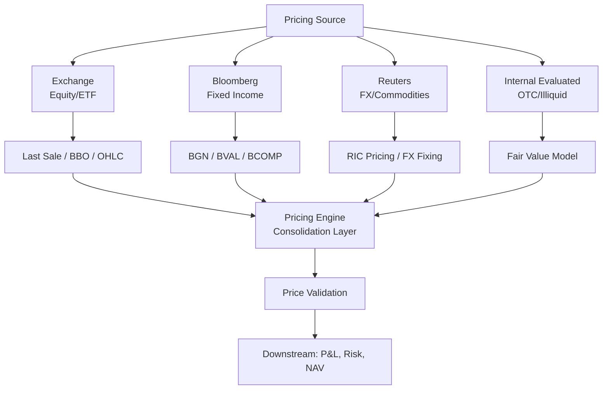

# Module 29: Market Data Feeds

Estimated time: 2h

## Learning Objectives (aligned with course CILOs)
- Distinguish real-time, delayed, and end-of-day data — latency and cost characteristics — maps to CILO #1
- Understand exchange consolidated feeds (SIP) vs direct feeds — latency tradeoffs — maps to CILO #1
- Master multiple pricing sources: exchange, Bloomberg, Reuters, internal evaluated pricing — maps to CILO #2
- Apply price validation rules: tolerance bands, stale price detection, cross-source checks — maps to CILO #3
- Understand FX rate handling for multi-currency portfolios: rate sources, fixing vs spot — maps to CILO #2
- Analyze corporate action impact on price adjustments — maps to CILO #4
- Identify market data licensing types, exchange fees, redistribution rules — maps to CILO #5

---

## Real-World Scenario

A brokerage operates a multi-asset pricing engine processing 500K pricing requests daily across US equities, HK equities, European equities, fixed income, and mutual funds. One day ops team receives numerous client complaints:

- US equity prices show 20-minute delay (should be real-time)
- Hong Kong stock prices use prior-day closing price (not HKEX real-time quotes)
- A EUR-denominated bond shows as USD 101.50 in system, Bloomberg quotes EUR 98.20 — FX rate uses 3-day-old fixing instead of today's spot
- A stock's price was not adjusted on ex-dividend date, causing phantom gain in portfolio

Investigation reveals: exchange cut off the brokerage's market data feed due to licensing audit non-compliance. Ops switched to backup feed urgently but did not fully validate across all asset classes.

> **Think**: Why does one market data feed outage simultaneously impact pricing, FX, and corporate actions teams? Which link in the pricing pipeline is most fragile?
>
> *Answer: Multiple downstream systems depend on the same market data feed. Price errors cascade: wrong pricing → wrong P&L → wrong margin calculation → wrong client statement. The most fragile link is "undetected stale prices" — the system does not auto-alert until clients complain.*

---

## Core Content

### 1. Market Data Latency Categories

Market data falls into three categories by latency:

| Category | Latency | Typical Use | Cost |
|----------|---------|-------------|------|
| **Real-time** | < 1 second | Trade execution, market making, algo trading | Highest (per-subscriber fee) |
| **Delayed** | 15-20 minutes | Public websites, retail investors, non-trading decisions | Free or very low |
| **End-of-day (EOD)** | After daily close | NAV calculation, risk reporting, client statement | Medium (per-asset count) |

**Key Regulatory Rules:**
- SEC/NMS requires exchanges to offer real-time data, but may charge fees
- FINRA requires brokers to provide price information on trade confirmations to clients
- MiFID II requires pre/post-trade transparency data available at "reasonable commercial cost"

> **Think**: What risk comes from using delayed data for execution price comparison?
>
> *Answer: Prices can move 1-5% during a 20-minute delay. A broker using delayed prices for trade confirmation may show deviations from actual fill prices, triggering client complaints.*

### 2. Exchange Consolidated Feed vs Direct Feed

**SIP (Securities Information Processor):**
- Consolidates each stock's latest best bid/offer across exchanges (NYSE, NASDAQ, ARCA, BATS)
- Official consolidated tape required by NMS
- Latency: 5-20 μs (microseconds) — slower than direct feed
- Cost: $10-50K/month (depending on subscriber count)

**Direct Feed:**
- Direct connection to a single exchange, no consolidation
- Includes full order book depth (level 2/3 data)
- Latency: 1-5 μs
- Cost: $50-200K/month (including switches, co-location, connectivity)

> **Mermaid: SIP vs Direct Feed Latency Comparison**

> **Note**: Direct feed gets raw data earlier, but requires custom logic to merge multiple feeds. SIP provides out-of-the-box NBBO but adds 5-15 μs latency.

**Decision Factors:**
- **Market makers / Algo trading**: must use direct feed (microsecond differences drive profitability)
- **Institutional brokerage / Asset management**: SIP suffices (NBBO needed for best execution reporting)
- **Retail brokerage**: SIP + delayed data mixed

> **Think**: Why do direct feed clients still need SIP?
>
> *Answer: Direct feed only has one exchange's data. To calculate NBBO (national best bid/offer), they still need SIP's consolidated data. HFT firms use both: direct feeds for alpha decisions, SIP for NBBO protection.*

> **Cloze**: "The Securities Information Processor (SIP) provides the consolidated tape for {NBBO} with latency around {5-20 μs}. Traders seeking minimum latency use {direct feeds} to access level 2/3 order book data, reducing latency to {1-5 μs}."
>
> *Answer: NBBO, 5-20 μs, direct feeds, 1-5 μs*

> **Predict**: Brokerage drops direct feeds to cut cost, keeps only SIP — then starts market-making a microsecond-moved small-cap. What happens?
>
> *Answer: SIP's extra 5-20 μs latency makes its quotes stale vs direct-feed competitors — adverse selection, worse fills, trading losses. Microsecond differences drive market-maker profitability.*

### 3. Pricing Sources

**Exchange Data:**
- Sources: NYSE, NASDAQ, LSE, HKEX, TSE, etc.
- Types: last sale price, best bid/offer, open/high/low/close, volume
- Use: real-time equity and ETF pricing
- Characteristic: industry's most authoritative trade price source

**Bloomberg:**
- Source: Bloomberg Terminal / B-PIPE (Bloomberg proprietary network)
- Types: BGN (Bloomberg Generic Price), BVAL (Bloomberg evaluated pricing), BCOMP (corporate action-adjusted price)
- Use: fixed income pricing, evaluated pricing, comparative pricing
- Characteristic: fixed income pricing standard, includes matrix pricing (model-derived when market quotes unavailable)
- Cost: extremely high ($20-30K/terminal/year + data licensing)

**Reuters / Refinitiv (now LSEG):**
- Source: Refinitiv Real-Time / Elektron
- Types: RIC code-based pricing sources
- Use: FX, fixed income, commodities alternative pricing
- Characteristic: strong in FX (Thomson Reuters FX fixing)

**Internal Evaluated Pricing:**
- Source: brokerage's internal pricing team or model
- Types: fair value estimate (when market has no active quotes)
- Use: mutual funds, OTC derivatives, illiquid bonds
- Characteristic: requires robust model governance, periodic back-testing

> **Predict**: Exchange last sale shows a liquid large-cap at $100.40 while Bloomberg BGN shows $100.10. Which price do you trust?
>
> *Answer: For equities, exchange last sale is the authoritative source — BGN is aggregated vendor data. The 0.3% divergence is under the ~1% cross-source tolerance, so the exchange quote is accepted for trade pricing.*

> **Predict**: Internal evaluated pricing feeds an illiquid bond's NAV but is never back-tested for a quarter. What shows up first?
>
> *Answer: Model drift → slightly-off fair values → wrong NAV. With no exchange quote to cross-check, nothing alerts until clients question their statements — the classic "undetected stale price" failure.*

> **Mermaid: Pricing Source & Asset Class Framework**

> **Think**: Fixed income vs equity pricing — why does fixed income rely more on evaluated pricing than exchange prices?
>
> *Answer: Equities trade on centralized exchanges with frequent quotes. Most bonds trade OTC with low liquidity, sparse trade frequency, no unified exchange. Bloomberg BVAL uses matrix pricing (referencing bonds with similar terms to derive fair value). This is the most significant multi-source pricing challenge.*

---

## Spot the Mistake

Someone says "Direct feed is lower latency, so a retail brokerage should use direct feed for all execution data."

**Why is this wrong?**

*Answer: Direct feed costs $50-200K/month vs SIP's $10-50K, and retail doesn't need microsecond latency. Retail mixes SIP with delayed data. Direct feed pays off only for market makers / algo desks where the microsecond edge drives profitability.*

Analyst says "We already pay for Bloomberg, so cut the exchange feeds — Bloomberg covers everything."

**Why is this wrong?**

*Answer: Exchange last-sale data is the authoritative trade-price source for equities; Bloomberg aggregates from exchanges and licenses that data separately. Cutting exchange feeds creates single-vendor dependency — the licensing-audit feed cut in the opening scenario shows exchange data can't simply be replaced.*

---
