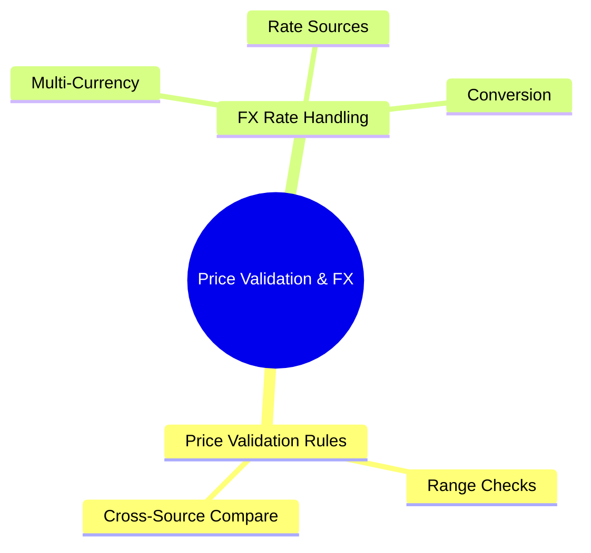
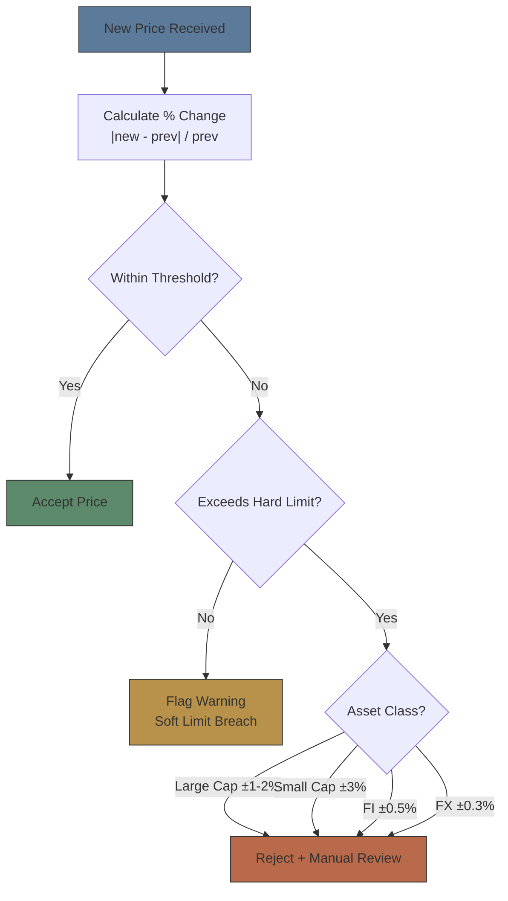
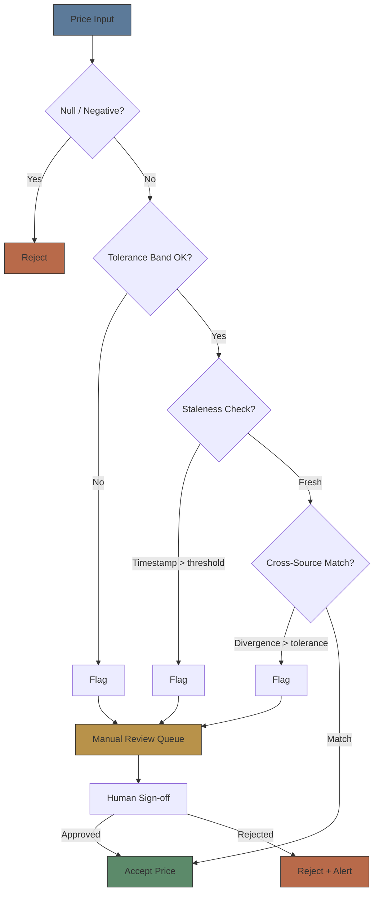

# Module 30: Price Validation & FX

Estimated time: 2h

## Learning Objectives (aligned with course CILOs)
- Distinguish real-time, delayed, and end-of-day data — latency and cost characteristics — maps to CILO #1
- Understand exchange consolidated feeds (SIP) vs direct feeds — latency tradeoffs — maps to CILO #1
- Master multiple pricing sources: exchange, Bloomberg, Reuters, internal evaluated pricing — maps to CILO #2
- Apply price validation rules: tolerance bands, stale price detection, cross-source checks — maps to CILO #3
- Understand FX rate handling for multi-currency portfolios: rate sources, fixing vs spot — maps to CILO #2
- Analyze corporate action impact on price adjustments — maps to CILO #4
- Identify market data licensing types, exchange fees, redistribution rules — maps to CILO #5

---

## Core Content

### 4. Price Validation Rules

The pricing engine must run multiple validation checks before data enters downstream systems.

**Tolerance Band Check:**

- Width varies by asset class and volatility:
  - Large cap equities: ±1% or ±2%
  - Small cap equities: ±3%
  - Fixed income: ±0.5% (except high-yield)
  - FX: ±0.3%

**Stale Price Detection:**
- Definition: quote timestamp exceeds configured age threshold
- Typical thresholds: equity 15 min, FX 30 min, bond 4 hours (OTC low liquidity)
- Fallback: use last good price, use evaluated price, or mark as stale

**Cross-Source Check:**

| Source Pair | Max Divergence |
|-------------|---------------|
| Bloomberg BGN vs Reuters RIC | < 0.5% |
| Exchange last vs Bloomberg BGN | < 1% |
| Internal evaluated vs external source | < 2% |

> **Predict**: Bloomberg BGN and Reuters RIC diverge 0.7% on a bond — outside the <0.5% threshold. What happens?
>
> *Answer: The price flags into the manual review queue instead of being auto-accepted. The analyst checks which source is wrong, then signs off or rejects. Without the cross-source check, the bad price would flow straight into NAV.*

**Outlier Processing Logic:**

> **Think**: What are the risks of setting tolerance bands too wide vs too narrow?
>
> *Answer: Too wide → missed real pricing errors. Too narrow → excessive false positives, ops team overwhelmed with manual reviews. Best practice: 2-3 staged tolerance bands — soft limit (warning) and hard limit (reject).*

### 5. Multi-Currency FX Rate Handling

A broker handling multiple markets (USD, HKD, EUR, JPY, GBP) must convert foreign-denominated holdings to base currency (portfolio valuation currency, typically USD).

**FX Rate Sources:**
- **Bloomberg FX Fixing**: daily 16:00 London fix (WM/Reuters 16:00 fix)
- **Reuters FX Fixing**: 12:00 CET ECB reference rate, 16:00 London WM/Reuters
- **Internal FX Desk**: actual execution rates from brokerage's FX trading
- **Spot Rate**: real-time market rate (for trade confirmations and real-time P&L)

**Fixing vs Spot:**

| Feature | Fixing Rate | Spot Rate |
|---------|-------------|-----------|
| Use case | NAV calculation, performance reporting, client statement | Trade settlement, real-time P&L, risk management |
| Timing | Daily fixed time (e.g., 16:00 London) | Any point in time |
| Consistency | Same rate across all portfolios, replicable | Varies by query time |
| Audit | Traceable, verifiable, regulator-accepted | Requires timestamp verification |

> **Predict**: Pricing team uses today's spot rate to recompute yesterday's NAV. What breaks?
>
> *Answer: NAV becomes non-replicable and inconsistent across portfolios — each query time gives a different value. NAV must use one daily fixing rate for auditability; mixing in spot breaks client statements and regulator-accepted traceability.*

**Multi-currency Pricing Challenge:**
> Problem: EUR bond in USD portfolio
>   Bond price: EUR 98.20 (from Bloomberg)
>   FX rate used: EUR/USD 1.0850 (3-day-old fixing)
>   Current spot: EUR/USD 1.0920
>
>   USD equivalent (old fixing): 98.20 × 1.0850 = 106.547
>   USD equivalent (spot):       98.20 × 1.0920 = 107.234
>   Difference: 0.64%
>
>   Portfolio size $500M at 20% EUR allocation → $640,000 P&L variance

**Best Practices:**
- NAV calculation uses one unified fixing rate (daily auditable)
- Trade settlement uses trade-time spot rate
- FX rates also need price validation (tolerance band, staleness check)
- Record FX rate source and timestamp for each pricing event

> **Predict**: An FX feed goes stale for an hour (threshold 30 min) and the system silently falls back to the last good rate. EUR moves 1% in that hour. What happens?
>
> *Answer: Every EUR-denominated holding is priced with the stale rate — one shared FX rate spreads the error across the whole portfolio, far wider than a single stale security price. The fallback must flag the staleness instead of silently substituting.*

> **Cloze**: "NAV calculation uses {fixing} rates for consistency and auditability. Trade settlement uses the {spot} rate at trade time. Stale FX rates are more dangerous than stale security prices because {every foreign-currency holding} is affected."
>
> *Answer: fixing, spot, every foreign-currency holding*

---

## Spot the Mistake

A pricing engineer sets equity tolerance band at ±2%. After close, system flags 10 stocks outside bandwidth.
Investigation shows 5 are on corporate action dates (stock split), 4 are the day after earnings release, 1 is a genuine data feed error.

**Why is this wrong?**

*Answer: Tolerance band should exclude corporate action dates or known event days. Adjusted prices post-corporate-action should be handled by separate logic. Major events (earnings) can cause >10% volatility — an event override list is needed.*

---
