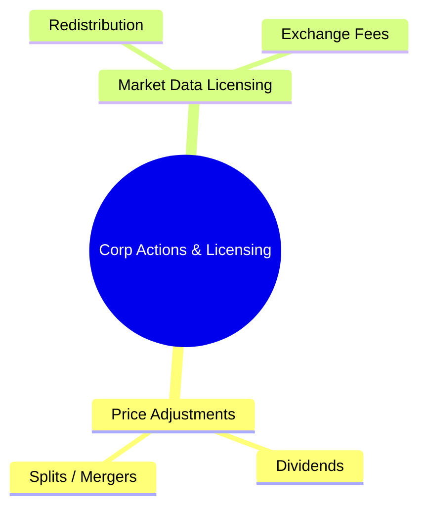
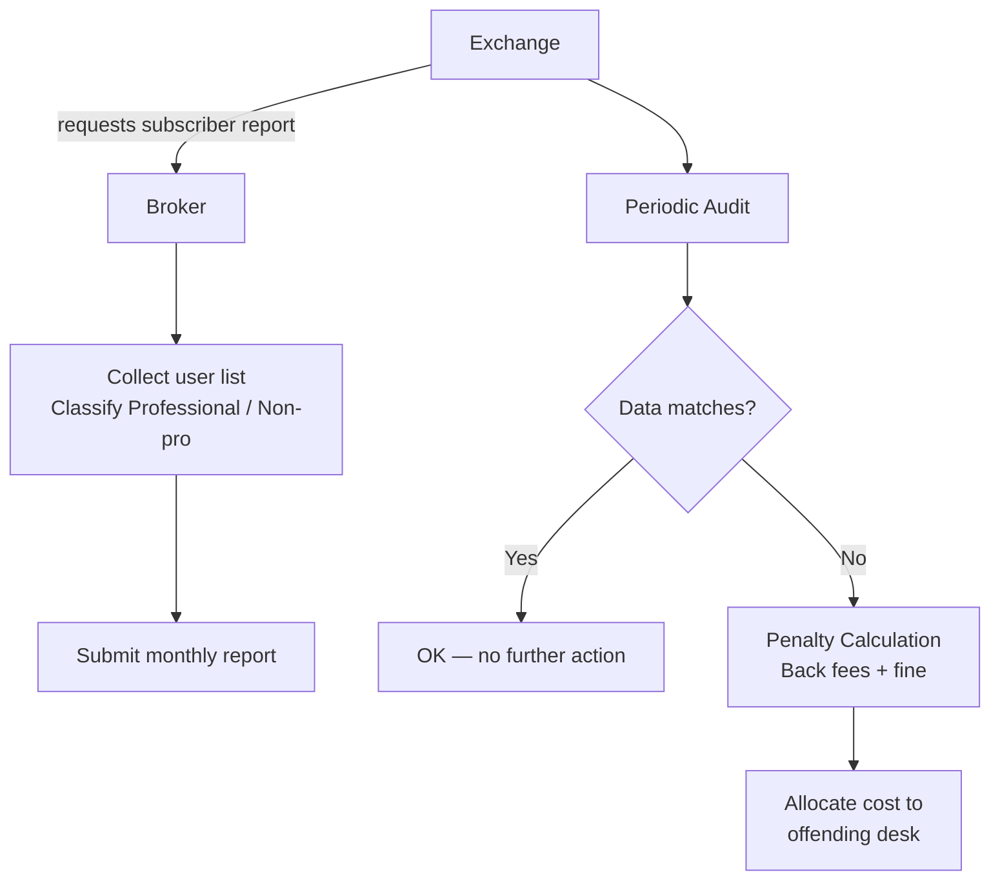
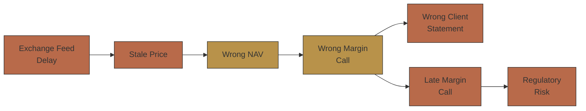

# Module 31: Corporate Actions & Licensing

Estimated time: 2h

## Learning Objectives (aligned with course CILOs)
- Distinguish real-time, delayed, and end-of-day data — latency and cost characteristics — maps to CILO #1
- Understand exchange consolidated feeds (SIP) vs direct feeds — latency tradeoffs — maps to CILO #1
- Master multiple pricing sources: exchange, Bloomberg, Reuters, internal evaluated pricing — maps to CILO #2
- Apply price validation rules: tolerance bands, stale price detection, cross-source checks — maps to CILO #3
- Understand FX rate handling for multi-currency portfolios: rate sources, fixing vs spot — maps to CILO #2
- Analyze corporate action impact on price adjustments — maps to CILO #4
- Identify market data licensing types, exchange fees, redistribution rules — maps to CILO #5

---

## Core Content

### 6. Corporate Action Price Adjustments

**What is a Corporate Action?**
- Events affecting outstanding securities: dividends, stock splits, mergers, acquisitions, spin-offs, rights issues
- Adjustment occurs on ex-date

**Common Adjustment Types:**

| Event | Adjustment Calculation | Example |
|-------|----------------------|---------|
| **Cash dividend** | Previous close - dividend amount | Close $100, div $0.50 → adj close $99.50 |
| **Stock split** | Previous close × (pre-split shares / post-split shares) | 2:1 split, close $200 → adj close $100 |
| **Stock dividend** | Previous close / (1 + dividend ratio) | 5% stock dividend, close $50 → adj close $47.62 |
| **Merger** | Adjusted by exchange ratio | 1 share A + 0.5 share B → formula more complex |

> **Cloze**: On a 2:1 stock {split}, a $200 close adjusts to $100 while share {quantity} must double to keep portfolio value constant. For data licensing, a {Professional} license costs $5-30/user/month; misclassifying users risks {fines} over $100K plus feed disconnection. Brokers forwarding data to clients need a {Redistribution} license.
>
> **Predict**: System applies a 2:1 split price adjustment (close $200 → $100) but forgets to double the share quantity. What happens to the client portfolio?
>
> *Answer: Portfolio value halves — a phantom 50% loss in client statements and NAV. A corporate action must adjust price AND quantity together; fixing only one side corrupts position value.*

**Brokerage Ops Must Handle:**
1. **Price adjustment data**: Bloomberg BCOMP, exchange-published adjustment factors
2. **Position adjustment**: changes to security quantity/value in client portfolio
3. **Cash correspondence**: dividend payment, tax withholding
4. **Cross-market differences**: ex-date and adjustment date may be separated differently by market

> **Predict**: Cash dividend ex-date passes. The price is adjusted, but the dividend's tax withholding is never booked. What shows up?
>
> *Answer: Client statements show gross dividend with no withholding record — the cash-correspondence leg (payment + tax withholding) is missing, so statements and tax lots don't reconcile. Corp-action handling must adjust price AND book cash events together.*

> **Think**: Why does the price "after" dividend adjustment not equal "previous close minus dividend amount" on the ex-date?
>
> *Answer: Market price incorporates other information (broad market moves, stock-specific news). Adjusted close is for historical performance calculation and tax tracking. Div adj close is NOT an opening price prediction — it is a statistical adjustment that isolates the dividend effect.*

### 7. Market Data Licensing & Exchange Fees

**Data License Types:**

| License Type | Fee Structure | Use |
|-------------|--------------|-----|
| **Professional** | $5-30/user/month (per exchange) | Traders, analysts, ops using real-time |
| **Non-professional** | Free ~ $5/user/month | Retail investors |
| **Enterprise** | $50-200K/year | Company-wide unlimited users |
| **Redistribution** | $10-50K/month + per-subscriber | Broker forwarding data to clients |

**Key Rules:**
- **Subscriber identification**: Brokers must report each real-time data user's identity, use purpose, professional/non-professional category to the exchange
- **Exchange audit**: NYSE, NASDAQ, CBOE conduct periodic compliance audits verifying user-fee alignment
- **Penalty**: Misclassification (professional reported as non-professional) can result in $100K+ fines + data disconnection
- **Redistribution rules**: Brokers forwarding real-time data to clients must pay redistribution fees and submit subscriber reports

**Typical Brokerage Market Data Cost Breakdown:**

| Data Source | Annual Cost | % of Total |
|-------------|------------|------------|
| NYSE/NASDAQ/ARCA real-time | ~$300K | 30% |
| Bloomberg Terminal (20 seats) | ~$500K | 50% |
| Reuters/Refinitiv | ~$100K | 10% |
| OPRA (options) | ~$50K | 5% |
| Other (FX, FI, delayed) | ~$50K | 5% |
| **Total** | **~$1M** | **100%** |

> **Mermaid: Data License Audit Flow**

**Practical Warnings:**
- Employee onboarding/offboarding data access must be system-wide — one broker was fined $40K by Bloomberg for not immediately deactivating a departed trader's Bloomberg license
- Per-exchange agreement terms differ — NYSE charges by "registered representative," NASDAQ by "screen-based user"
- Audits are retrospective (e.g., Q2 2024 reviews Q4 2023 data), so brokers must retain 2 years of subscriber records

> **Predict**: Broker classifies professional traders as non-professional users to cut per-user fees. The audit comes next quarter. What happens?
>
> *Answer: The retrospective audit catches the misclassification — back fees plus $100K+ fines and data disconnection, with cost allocated to the offending desk. The 2-year subscriber record retention makes the violation easy to prove.*

> **Think**: Why do NYSE and NASDAQ classify "professional users" differently?
>
> *Answer: NYSE uses the "registered representative" definition (FINRA-registered persons), while NASDAQ uses "screen-based user" (anyone who sees real-time prices). This classification difference forces brokers to maintain two separate user tracking systems.*

---

## Pattern Recognition & Advanced Concepts

**Single Pricing Engine vs Multi-Source Aggregation:**
- Single source: simple, consistent, but vendor lock-in, no cross-validation
- Multi-source aggregation: flexible, redundant, but increased data alignment overhead

**Data Lag Cascade Effect:**

**Tax & Reporting Impact of Price Adjustments:**
- Corporate action adj must reflect simultaneously in tax lot reporting and client statements
- Different custodians may use different adjustment methodologies — reconciliation requires extra logic

---

## Summary

Market data and pricing form the brokerage back-office infrastructure layer:

1. **Real-time / delayed / EOD** data each serve different purposes at different costs
2. **SIP vs direct feed** is a latency vs cost tradeoff
3. **Multiple pricing sources** need cross-validation — exchange, Bloomberg, Reuters, internal evaluated
4. **Price validation** requires multi-layered rules: tolerance, staleness, cross-source
5. **FX handling** must differentiate fixing (NAV) from spot (trade settlement)
6. **Corporate action** adjustments must isolate synthetic noise from actual price changes
7. **Data license mismanagement** can lead to fines and feed disconnection

> **Feynman Challenge**: Explain why the same thing shows different prices in different places, and how we decide which one is right, in language a five-year-old can understand.
>
> *Hint: Use a toy selling at two different stores (Toy Store 1 and Toy Store 2) to illustrate price differences. Add the currency concept — what conversion you need if buying a European toy with US dollars.*

---

## Spot the Mistake

A wealth desk forwards real-time exchange quotes to its clients, arguing the enterprise license covers all users.

**Why is this wrong?**

*Answer: Enterprise license covers the firm's own users only. Forwarding data to external clients is redistribution — it needs a separate redistribution license plus per-subscriber reporting. Missing it = audit failure, back fees, and feed disconnection.*

Ops says "Subscriber reports just need the user count — exchanges only care about the total."

**Why is this wrong?**

*Answer: Exchanges require each real-time user's identity, use purpose, and professional/non-professional class. Count-only reports fail the audit; misclassification triggers $100K+ fines and feed disconnection.*

---
