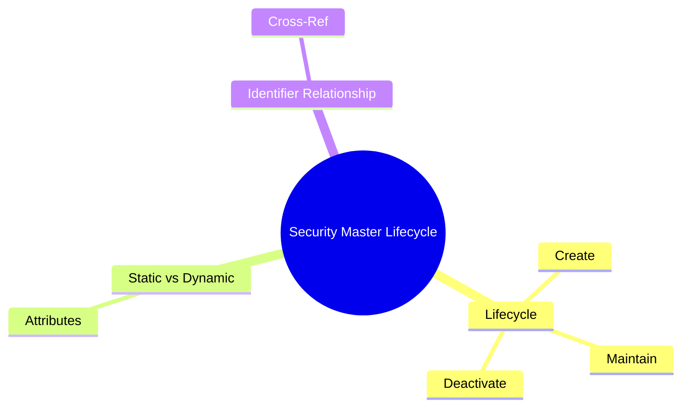
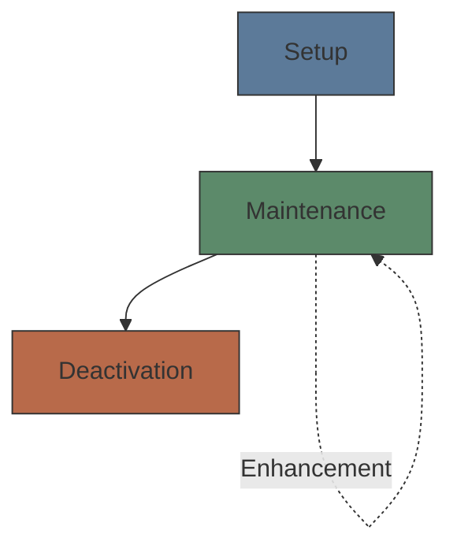

# Module 32: Security Master Lifecycle

Estimated time: 2h

## Learning Objectives (aligned with course CILOs)
- Understand security master lifecycle: setup, maintenance, deactivation — maps to CILO #1
- Distinguish static vs dynamic attributes — maps to CILO #1
- Master golden copy and multi-source data aggregation strategies — maps to CILO #2
- Identify major vendor data sources: Bloomberg, Refinitiv, exchanges — maps to CILO #2
- Apply data quality checks: completeness, accuracy, timeliness, consistency — maps to CILO #3
- Understand corporate action event classification and key dates in security master — maps to CILO #4
- Analyze new security setup workflow and deactivation rules — maps to CILO #5
- Understand relationship between security master and identifiers (Module 05) — maps to CILO #1

---

## Real-World Scenario

A mid-sized brokerage reference data team (RefData) receives three urgent requests on Monday morning:

1. **New IPO setup**: A hot tech company lists on NASDAQ tonight — trading desk requires security master ready before market open
2. **Corporate action update**: A large-cap stock announces stock split — ex-date is T+7, but RefData has not yet received official Bloomberg BCOMP adjustment factors
3. **Data quality alert**: Automated dashboard shows 47 Taiwan Depositary Receipts (TDRs) have empty "Country" fields, and 12 have ISIN checksum validation failures

The RefData team has only 4 people maintaining 12,000+ security master records. The new IPO must be completed within 6 hours; stock split adjustment factors must be confirmed in 3 days; data quality issues must be 95% resolved by Friday.

> **Predict**: RefData estimates the split ratio by hand instead of waiting for the official BCOMP factors, to save time before ex-date. What risks does this create?
>
> *Answer: If the ratio is wrong, price and shares outstanding adjust incorrectly on ex-date — positions, NAV, and tax lots all corrupt. That's why the factors must be confirmed from official sources (3-day deadline) before the ex-date.*

> **Think**: How can a 4-person team manage 12,000 security records? If each record requires 5 minutes of manual review, how long would one full review cycle take?
>
> *Answer: Most fields update via automated vendor feed ingestion — manual intervention rate is ~10-15%. At full manual review: 12,000 × 5 min = 60,000 min = 1,000 hours = 125 business days. Automation investment is the only path to team scalability.*

---

## Core Content

### 1. Security Master Lifecycle

A Security Master is the brokerage's central record for all security-related data. Each security passes through three stages:

| Stage | Trigger | Main Activities | Responsible Party |
|-------|---------|-----------------|-------------------|
| **Setup** | New issuance, IPO, new product onboarding | Data collection, validation, approval, activation | RefData + Compliance + Trading |
| **Maintenance** | Corporate actions, data updates, error correction | Attribute updates, periodic review, data quality monitoring | RefData + Vendor Feeds |
| **Deactivation** | Maturity, delisting, merger, redemption | Status change, position freeze, historical archiving | RefData + Operations |

> **Predict**: RefData updates a stock's ISIN without recording an effective date. Compliance later asks "What was this stock's ISIN on 2024-06-15?" What happens?
>
> *Answer: The retrospective query fails — without effective dating the master can't reconstruct history, so the snapshot is unrecoverable. Every attribute change must record who/what/when/why to support time-travel queries.*

**Key System Design Decisions:**

- **Effective dating**: All attribute changes should record effective dates, supporting retrospective queries — "What was this stock's ISIN on 2024-06-15?"
- **Audit trail**: Every change must record who / what / when / why
- **Soft delete vs hard delete**: Deactivation should use status flags, not record deletion (preserve historical position snapshots)

> **Think**: Why should deactivation never delete the record? If a client held a now-deactivated stock in 2023 and requests a historical report in 2025, what happens?
>
> *Answer: Hard deletion breaks historical position snapshots — they cannot match to security names. Keep deactivated records (status = INACTIVE + deactivation_reason + deactivation_date), so all historical trades trace back to the correct security description.*

### 2. Static vs Dynamic Attributes

This is the core concept in security master design. Not all attributes change the same way over the lifecycle.

**Static Attributes:**
Rarely change after setup; changes require strict controls.

| Attribute | Example | Change Frequency | Change Reason |
|-----------|---------|-----------------|---------------|
| **ISIN** | US0378331005 | Never | Fixed for security life |
| **CUSIP** | 037833100 | Never | Same as ISIN, US settlement |
| **SEDOL** | B0YX8Z5 | Never | UK settlement system |
| **FIGI** | BBG000B9XRY4 | Very rare | Corporate restructuring |
| **Issuer** | Apple Inc. | Very rare | Name change (rebrand) |
| **Currency** | USD | Never | Fixed at issuance |
| **Issue Date** | 1980-12-12 | Never | Set once |

**Dynamic Attributes:**
Change with market conditions, corporate actions, or time.

| Attribute | Example | Update Frequency | Update Source |
|-----------|---------|-----------------|---------------|
| **Price** | $150.25 | Real-time/daily | Exchange feed, Bloomberg |
| **Volume** | 15,432,000 | Real-time/daily | Exchange feed |
| **Shares Outstanding** | 15,500,000,000 | Quarterly/events | Corporate action feed |
| **Dividend** | $0.96/year | Quarterly | Company announcement |
| **Rating** | AA- | Ad hoc | S&P, Moody's, Fitch |
| **Status** | Active | Event-driven | RefData team |
| **Coupon Rate** | 4.50% | Fixed (fixed-rate bond) or reset date | Issuance terms |

> **Think**: Is Shares Outstanding static or dynamic? Why?
>
> *Answer: Dynamic. Companies change share counts through buybacks or new issuance. Stock splits and reverse splits also change shares outstanding. However, change frequency is much lower than price (quarterly or event-driven).*

> **Cloze**: "In the security master, {ISIN}, {CUSIP}, and {issue_date} are static attributes — never change after setup. {price}, {volume}, and {shares_outstanding} are dynamic attributes that change with {market conditions} or {corporate actions}."
>
> *Answer: ISIN, CUSIP, price, volume, shares_outstanding, market conditions, corporate actions*

### 3. Identifiers and Security Master Relationship (Module 05 Review)

Module 05 introduced security identifiers (ISIN, CUSIP, SEDOL, FIGI, Ticker). Understanding the distinction between identifiers and security master is crucial:

- **Identifier = National ID number**: Uniquely identifies the security, serves as the master record key
- **Security Master = ID card**: Contains all attributes (name, address, DOB, photo...)

**One-to-Many Relationship:**
One security may have multiple identifiers (ISIN + CUSIP + SEDOL + Ticker), all stored in the same security master record.

| Field | Value | Notes |
|-------|-------|-------|
| Record ID | SM-12345 | Internal primary key |
| ISIN | US0378331005 | Global identifier |
| CUSIP | 037833100 | US domestic identifier |
| SEDOL | 2046251 | UK identifier |
| FIGI | BBG000B9XRY4 | Open identifier |
| Ticker | AAPL | Market symbol |
| Issuer | Apple Inc. | |
| Currency | USD | |
| Sector | Technology | |
| Status | Active | |

> **Think**: If Bloomberg Ticker changes (company rename, ticker from GOOG to GOOGL), should you create a new master record or update the existing one?
>
> *Answer: Update the existing master record. The ticker is just one identifier attribute — the entity (issuer) has not changed. Creating a new record would break the link to historical trades. The ISIN (US02079K1079) serves as the cross-time anchor maintaining continuity.*

---

## Spot the Mistake

Analyst auto-fills Country="TW" for all 47 TDRs with empty fields to hit the 95% Friday target.

**Why is this wrong?**

*Answer: Blanket fill assumes every TDR is Taiwan-domiciled — but 12 already have ISIN checksum failures and issuer domicile varies. Bulk-filling bakes wrong static data into the master; each record must be verified against the source before an update.*

Analyst says "ISIN never changes, so I'll use ISIN as the internal primary key for the security master."

**Why is this wrong?**

*Answer: ISIN is stable but it's an identifier attribute, not an internal key — a new issue can temporarily lack a final ISIN, and the master needs a permanent Record ID (like SM-12345) that survives any identifier change. Primary key must be internal; identifiers stay attributes.*

---
