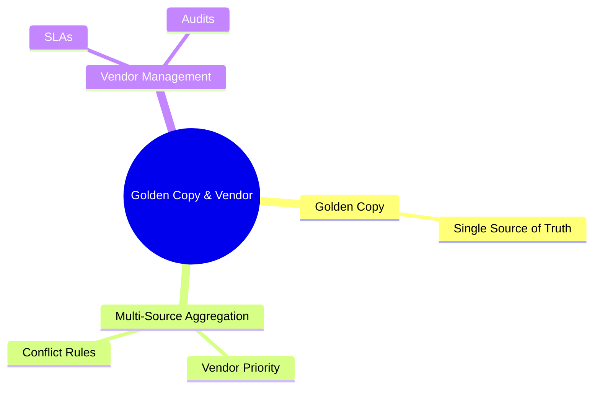
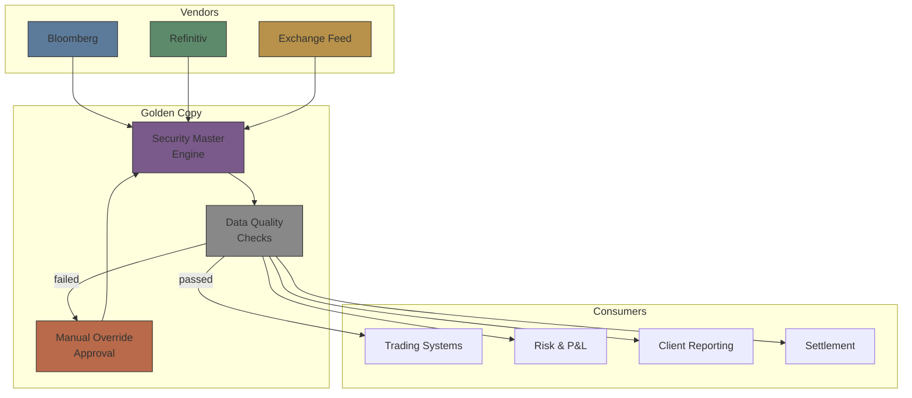
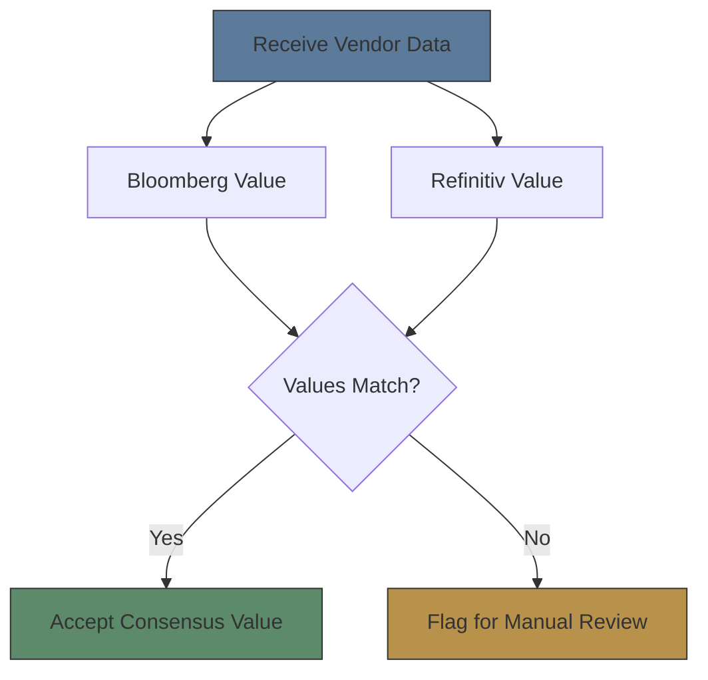
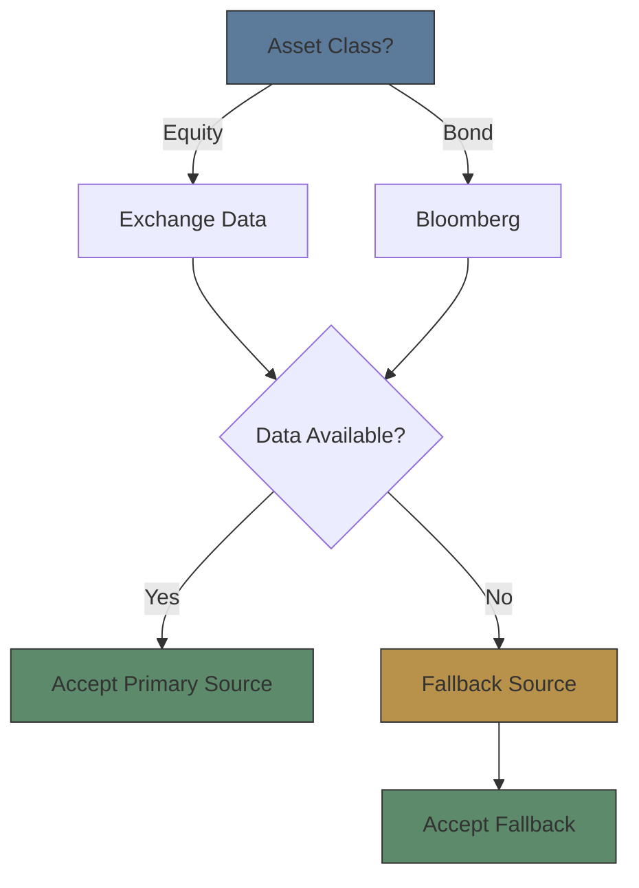
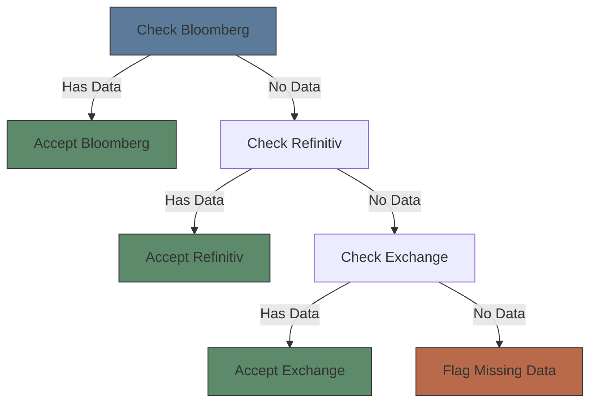

# Module 33: Golden Copy & Vendor

Estimated time: 2h

## Learning Objectives (aligned with course CILOs)
- Understand security master lifecycle: setup, maintenance, deactivation — maps to CILO #1
- Distinguish static vs dynamic attributes — maps to CILO #1
- Master golden copy and multi-source data aggregation strategies — maps to CILO #2
- Identify major vendor data sources: Bloomberg, Refinitiv, exchanges — maps to CILO #2
- Apply data quality checks: completeness, accuracy, timeliness, consistency — maps to CILO #3
- Understand corporate action event classification and key dates in security master — maps to CILO #4
- Analyze new security setup workflow and deactivation rules — maps to CILO #5
- Understand relationship between security master and identifiers (Module 05) — maps to CILO #1

---

## Core Content

### 4. Golden Copy Strategy

The reference data team's most critical responsibility is maintaining the "golden copy" — the brokerage's single source of truth.

**Golden Copy Core Principles:**
1. **Authority**: Each field has one designated authoritative source (who is empowered to define this value)
2. **Overrides**: Manual overrides must record override reason + approval
3. **Propagation**: Downstream client systems do not touch raw vendor feeds — all traffic goes through the golden copy
4. **Backup**: The golden copy itself requires disaster recovery mechanisms

> **Cloze**: The golden copy enforces four principles: each field has one designated {authority}; manual {overrides} must record reason + approval; downstream systems never touch raw vendor feeds — all traffic flows through the {golden copy}; and the golden copy itself needs {disaster recovery}. Under Vendor Priority, a systematic vendor {error} propagates everywhere with no cross-check.

**Golden Copy Data Flow:**

> **Predict**: A client system patches a raw Bloomberg feed directly to fix a price discrepancy, bypassing the golden copy. What happens?
>
> *Answer: The golden copy is bypassed, so downstream systems get conflicting values and the fix is overwritten on next sync. All traffic must flow through the golden copy.*

### 5. Multi-Source Data Aggregation Strategies

Brokers typically receive data on the same security from multiple vendors. When vendor data disagrees, a strategy is needed to decide which value to use.

**Three Main Strategies:**

**A. Consensus:**

- Pros: Reduces errors, auto-detects vendor anomalies
- Cons: Needs at least 2 vendors; unusable with vendor lock-in
- Use: Non-critical attributes (sector, industry classification)

**B. Primary Source:**

- Pros: Each attribute has clear owner, fewer disputes
- Cons: No cross-check when primary vendor errs
- Use: Critical pricing data (price, yield)

**C. Vendor Priority:**

- Pros: Simple to implement, single path
- Cons: Systematic vendor errors propagate everywhere
- Use: Small brokers / resource-constrained RefData teams

> **Predict**: Bloomberg is first in a Vendor Priority chain and its feed publishes a wrong price for a bond. What happens?
>
> *Answer: The bad value is accepted and broadcast — Vendor Priority has no cross-check, so the vendor's systematic error propagates to every downstream system.*

> **Think**: A broker using Consensus strategy finds Bloomberg and Refinitiv consistently disagree on "industry classification" for the same security. The team spends 10 hours per week on manual review. How to optimize?
>
> *Answer: (1) Confirm authority assignment — who is the authoritative source for this attribute? (2) If undecidable, set auto-accept threshold — accept Bloomberg values within reasonable variance and log exception. (3) Submit data correction requests upstream to vendors for root-cause fix.*

### 6. Vendor Management

The reference data team manages multiple external data providers, each with distinct data formats, update frequencies, and billing models.

**Major Vendor Comparison:**

| Vendor | Core Product | Strength | Billing Model | Notes |
|--------|-------------|----------|--------------|-------|
| **Bloomberg** | Data License / B-PIPE | Fixed income, corporate actions, reference data | Per-security + per-field | Broadest security master coverage in industry |
| **Refinitiv (LSEG)** | Real-Time / Elektron | FX, commodities, corporate actions | Per-RIC + per-user | Dominant in UK and European markets |
| **ICE Data Services** | Consolidated Feed | US equities, options, fixed income | Per-exchange + per-user | Multi-exchange consolidated feed |
| **Exchange Direct** | Native Feed | Exchange-specific data | Per-exchange fee | Minimum latency, requires multi-source handling |
| **D&B / S&P** | Entity Data | Issuer entity data (incorporation, parent structure) | Per-entity + per-year | Used for KYC, compliance screening |

**Vendor Management Practical Points:**

**Vendor Data Quality SLA:**

| Metric | Target |
|--------|--------|
| Data update latency (real-time) | ≤ 15 min |
| Data update latency (reference) | T+1 |
| Accuracy rate | ≥ 99.5% |
| Missing rate | ≤ 0.5% |
| New security notification | ≤ T+1 |

**Vendor Selection Criteria:**

| Criterion | Consideration |
|-----------|--------------|
| Coverage | Does it include all markets I need? |
| Data quality | Historical accuracy vs verified sources |
| SLA and support | Response time, issue resolution cycle |
| Cost | Per-security vs per-user vs enterprise |
| Compliance | Can data be redistributed to clients? |

> **Think**: If Bloomberg discontinues data for a certain asset class (e.g., small Asian markets), what sequence of actions should RefData take?
>
> *Answer: (1) Confirm impact — which securities are affected? How broad? (2) Activate backup vendor feeds (Refinitiv / ICE / Exchange Direct). (3) Validate backup data completeness and accuracy. (4) Notify downstream systems of source change. (5) Assess need for new vendor relationship to fill the gap.*

> **Predict Next**: A broker switches from "Bloomberg primary" to "Consensus" strategy. The team expects:
> - (a) Decreased manual review workload
> - (b) Increased manual review workload (previously uncompared vendor differences now trigger alerts)
> - (c) No change
>
> *Answer: (b). Switching to Consensus initially surfaces many Bloomberg-vs-Refinitiv differences (previously undetected vendor divergence), causing a short-term surge in manual review. Long-term, systematically resolving differences reduces the load.*

---

## Spot the Mistake

A RefData analyst overrides a bad price to fix a client complaint but skips recording the override reason and approval.

**Why is this wrong?**

*Answer: Golden Copy Overrides rule requires reason + approval. Without it there is no audit trail, and the next vendor sync overwrites the fix.*

---
