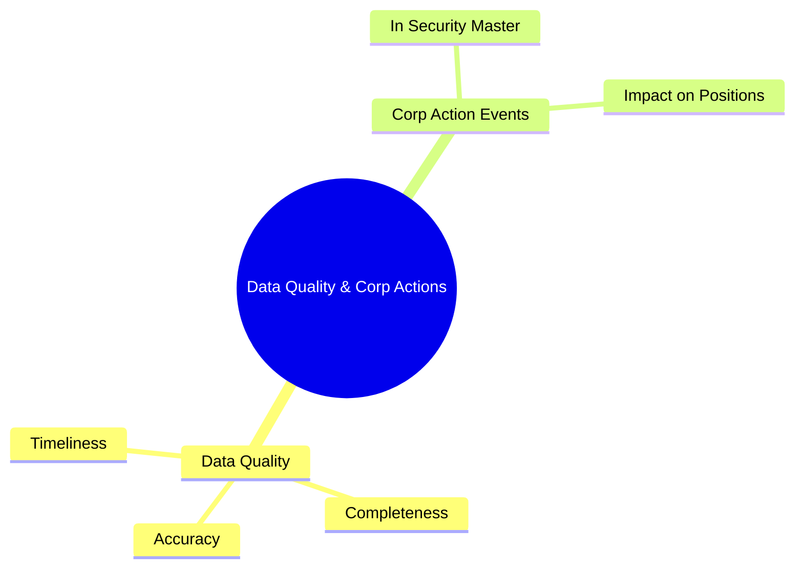
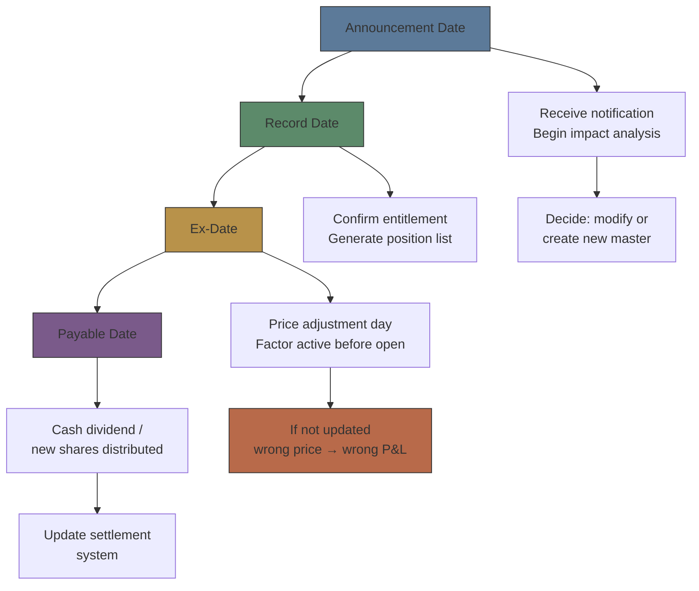

# Module 34: Data Quality & Corporate Actions

Estimated time: 2h

## Learning Objectives (aligned with course CILOs)
- Understand security master lifecycle: setup, maintenance, deactivation — maps to CILO #1
- Distinguish static vs dynamic attributes — maps to CILO #1
- Master golden copy and multi-source data aggregation strategies — maps to CILO #2
- Identify major vendor data sources: Bloomberg, Refinitiv, exchanges — maps to CILO #2
- Apply data quality checks: completeness, accuracy, timeliness, consistency — maps to CILO #3
- Understand corporate action event classification and key dates in security master — maps to CILO #4
- Analyze new security setup workflow and deactivation rules — maps to CILO #5
- Understand relationship between security master and identifiers (Module 05) — maps to CILO #1

---

## Core Content

### 7. Data Quality Management

Reference data quality directly impacts all downstream systems — trading, risk, settlement, client reporting. The RefData team builds a DQ framework for continuous monitoring.

**Four Dimensions:**

| Dimension | Definition | Check Items | Fix Method |
|-----------|-----------|-------------|------------|
| **Completeness** | Required fields have values | ISIN non-null, ticker non-null, currency non-null | Vendor feed fill / manual entry |
| **Accuracy** | Values match authoritative source | ISIN checksum, CUSIP check digit, country code in ISO list | Vendor correction / manual override |
| **Timeliness** | Updates within SLA | Corporate action updated before ex-date, price update latency | Feed monitoring / escalation |
| **Consistency** | Cross-system values match | Trading system vs risk system vs settlement system ISIN/ticker same | System reconciliation |

**Automated DQ Rule Examples:**

| Rule | Check | Failure Action |
|------|-------|---------------|
| ISIN Checksum Validation | ISO 6166 checksum algorithm | Tag INVALID_ISIN → manual review |
| Completeness Gate | ISIN, Ticker, Currency, Country, AssetClass, Status non-null | Tag INCOMPLETE → auto-request from vendor |
| Cross-System Consistency | Security Master vs Trading System ISIN match | Create reconciliation ticket |
| Timeliness Alert | CA announcement > ex-date − 3 days without update | Auto-notify RefData lead |

> **Predict**: A corporate action announcement arrives two days before ex-date. What does the Timeliness Alert rule do?
>
> *Answer: It auto-notifies the RefData lead (announcement > ex-date − 3 days without update); the master must be updated before ex-date or price and P&L go wrong.*

> **Predict**: A vendor feed updates a bond's ISIN with a value that fails the ISO 6166 checksum. What happens to that record?
>
> *Answer: The ISIN checksum rule tags it INVALID_ISIN and routes it to manual review instead of broadcasting — the bad identifier never reaches downstream systems.*

> **Cloze**: "The four dimensions of data quality are: {completeness} (required fields have values), {accuracy} (values match authoritative source), {timeliness} (updates within SLA), and {consistency} (cross-system values match). ISIN checksum validation belongs to the {accuracy} dimension."
>
> *Answer: completeness, accuracy, timeliness, consistency, accuracy*

### 8. Corporate Action Events in Security Master

Corporate actions are the most complex part of security master maintenance. Each security undergoes attribute changes during corporate actions, which must be tracked accurately and propagated to downstream clients.

**Event Classification:**

| Category | Event Type | Impact | Master Change |
|----------|-----------|--------|---------------|
| **Cash Dividend** | Regular dividend, special dividend | Price adjustment, cash distribution | Update dividend field, price adjustment factor |
| **Stock Split** | Forward split, reverse split | Share count change, price adjustment | Update shares outstanding, price adjustment factor |
| **Merger** | Acquisition, stock-for-stock merger | Security disappears or converts | Add target master, update acquirer, deactivate target |
| **Spin-off** | Subsidiary separation | New security created | Add spun-off entity master, adjust parent |
| **Maturity** | Bond maturity, warrant expiry | Security deactivation | Update status to MATURED, record maturity date |
| **Redemption** | Callable bond called by issuer | Security deactivation | Update status to REDEEMED, record redemption price |

**Key Date Chain:**

Corporate actions follow a precise timeline. RefData must complete corresponding actions before each date.

**Practical Notes:**

- **Ex-date miss is costly**: One broker failed to update stock split adjustment factor before ex-date, causing 2 days of incorrect price display across all client portfolios, resulting in $500K in compensation

> **Predict**: A broker updates a stock split adjustment factor one day after ex-date. What happens?
>
> *Answer: The factor must be active before open on ex-date; a late update leaves wrong prices displayed and wrong P&L across client portfolios — a costly miss.*
- **Cross-border CA complexity**: The same corporate action may have different ex-dates across markets. Taiwan market ex-date = trading day before record date; US market ex-date = business day after
- **Multi-legged CA**: Complex events (e.g., merger + cash election) require creating multiple security master records

> **Think**: Why can't corporate action processing be fully automated? Which steps still require human judgment?
>
> *Answer: (1) Event classification — same announcement could be stock split or stock dividend, requiring economic substance judgment. (2) Multi-leg events — merger exchange ratios need manual verification. (3) Error handling — if vendor adjustment factor contradicts issuer official announcement, human decides which is correct. (4) Exception handling — some markets have chronically delayed CA announcements, requiring manual tracking.*

---

## Spot the Mistake

RefData receives a Data Quality Dashboard alert: 47 TDRs have empty "Country" fields.
Investigation reveals ISS (Institutional Shareholder Services) classifies them as Taiwan (TW), but Bloomberg classifies them as Cayman Islands (KY).
The automated ingestion system left the Country field empty due to the inconsistency.

**Why is this wrong?**

*Answer: Root cause is Vendor Consensus conflict — two vendors give different values, system does not know which to pick. Solutions: (1) Confirm authority — if broker designates Bloomberg as country authority, set auto-select Bloomberg. (2) Or add dual fields "Country_Bloomberg" and "Country_ISS" to record separately, not forcing consensus. (3) Establish an override workflow — manually confirm and lock the Country value.*

---
