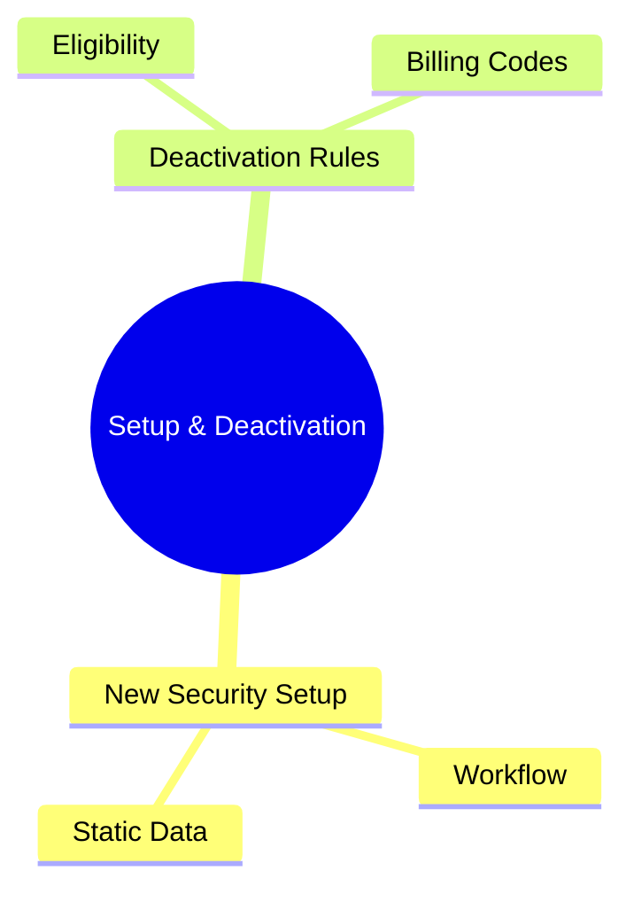
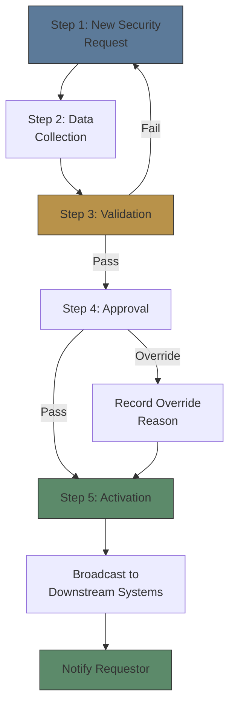
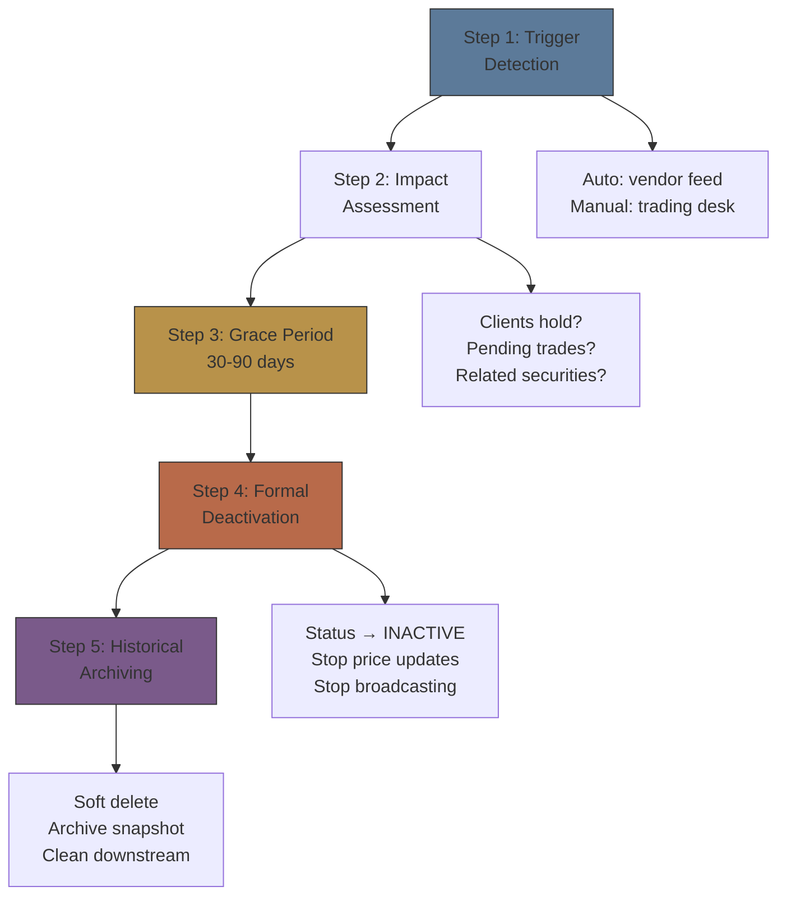

# Module 35: Setup & Deactivation

Estimated time: 2h

## Learning Objectives (aligned with course CILOs)
- Understand security master lifecycle: setup, maintenance, deactivation — maps to CILO #1
- Distinguish static vs dynamic attributes — maps to CILO #1
- Master golden copy and multi-source data aggregation strategies — maps to CILO #2
- Identify major vendor data sources: Bloomberg, Refinitiv, exchanges — maps to CILO #2
- Apply data quality checks: completeness, accuracy, timeliness, consistency — maps to CILO #3
- Understand corporate action event classification and key dates in security master — maps to CILO #4
- Analyze new security setup workflow and deactivation rules — maps to CILO #5
- Understand relationship between security master and identifiers (Module 05) — maps to CILO #1

---

## Core Content

### 9. New Security Setup Workflow

New instrument setup is the most common RefData task, typically initiated by trading desk or onboarding team.

**Standard Workflow:**

> **Cloze**: "The new security setup workflow runs {request} → {data collection} → {validation} → {approval} → {activation}, then broadcasts to downstream systems."
>
> *Answer: request, data collection, validation, approval, activation*

**Expedited Setup (Rush):**

IPOs or new product launches typically have time pressure. Typical SLA:
- **Normal**: T+2 (T = request date)
- **Expedited**: T+0 (within 6 hours)
- **Rush**: T+0 (within 2 hours)

> **Cloze**: "The normal setup SLA is T+{2}, expedited is T+0 within {6 hours}, and rush is T+0 within {2 hours}."
>
> *Answer: 2, 6 hours, 2 hours*

Expedited process differences:
- Pre-validation: RefData pre-screens key fields by phone before formal submission
- Parallel approval: Approval runs concurrently with data collection
- Post-go-live cleanup: Rush setup allows some deferred fields to be completed T+1 (e.g., SEDOL, FIGI)

> **Think**: Rush setup allows conditional activation with fields deferred to T+1. What risk does this create?
>
> *Answer: Downstream systems receive an incomplete security master on T+0. If a trading system tries to trade the security but SEDOL is missing (required for European settlement), settlement may fail. Conditional activation needs a deferred-fields tracking list with auto-reminders to complete them.*

### 10. Security Deactivation Rules

Security master deactivation is the most commonly neglected but highest-regulatory-risk area for most brokers.

**Deactivation Triggers and Handling:**

| Deactivation Reason | Example | Master Change | Historical Data to Retain |
|--------------------|---------|--------------|--------------------------|
| **Delisted** | Company fails exchange listing standards | Status → DELISTED, deactivation_date = last trade date | All historical trades, dividend records |
| **Matured** | Bond past maturity date | Status → MATURED, maturity_date | Price history, coupon payment records |
| **Merged** | Target acquired, shares converted to acquirer | Status → MERGED, surviving_entity SM-ID | Exchange ratio, holder records |
| **Redeemed** | Callable bond called by issuer | Status → REDEEMED, redemption_price | Redemption notice, holder records |
| **Closed** | Mutual fund/ETF wound up | Status → CLOSED, final_NAV_date | NAV history, distribution records |
| **Expired** | Warrant/option expired | Status → EXPIRED, expiry_date | Strike price history |

**Deactivation Workflow:**

> **Predict**: A broker deactivates a security immediately on trigger detection, skipping the 30–90 day grace period. What happens?
>
> *Answer: Impact assessment is skipped — pending trades, client holdings, and related securities go unhandled, causing settlement failures and missed client notifications.*

> **Cloze**: "Deactivation is a {soft delete}: the record status changes to {INACTIVE}, price updates and broadcasting {stop}, and an archive {snapshot} preserves historical data."
>
> *Answer: soft delete, INACTIVE, stop, snapshot*

**Common Deactivation Errors:**

- **Premature deactivation**: Deactivating on merger effective date, but T+2 settlement trades are still in flight → settlement failure
- **Missing related securities**: Deactivating target company stock but forgetting its warrants / corporate bonds
- **No client notification**: Regulation may require advance notice to clients (e.g., SEC Rule 10b-17 requires advance announcement)

> **Predict**: RefData deactivates a target stock on the merger effective date while T+2 settlement trades are still in flight. What happens?
>
> *Answer: The trades cannot settle against a deactivated master — premature deactivation causes settlement failure. Deactivation must wait for in-flight settlements.*

> **Think**: A bond matures on 2025-03-15 (Saturday). On which date should RefData formally set its status to MATURED?
>
> *Answer: 2025-03-17 (Monday). If maturity date falls on a non-business day, market convention shifts to the next business day. Setting MATURED too early may affect the final interest payment accounting.*

---

## Pattern Recognition & Advanced Concepts

**Security Master as Product Lifecycle:**
- Setup = Product launch
- Maintenance = Product operations (continuous data updates, event processing)
- Deactivation = Product retirement (not destruction, but archiving)

**Golden Copy vs Distributed Master Model:**

| Dimension | Golden Copy | Distributed |
|-----------|-------------|-------------|
| Control | Central team controls all changes | Each business system maintains subset |
| Consistency | Single firm-wide source of truth | Cross-system reconciliation required |
| Flexibility | Changes require central approval, slower | Each system can customize fields quickly |
| Maintenance cost | High system, medium labor | Medium system, high labor (reconciliation) |

**Data Lineage Tracking:**
- Golden copy should record data lineage for each field (which vendor, when updated, last verified)
- Lineage is critical for audits and vendor disputes

---

## Summary

Security master and reference data form the data backbone of brokerage operations:

1. **Lifecycle** has three stages — setup, maintenance, deactivation — each with specific SLAs and approval workflows
2. **Static vs dynamic attributes** determines update strategy and permission controls
3. **Identifiers** (Module 05) are the master record keys; the master is the record holding all attributes
4. **Golden copy strategy** ensures firm-wide single source of truth, preventing data fragmentation
5. **Multi-source aggregation** has three strategies: consensus, primary source, vendor priority
6. **Vendor management** requires ongoing data quality and SLA monitoring, maintaining backup vendors
7. **Data quality** is monitored across four dimensions: completeness, accuracy, timeliness, consistency
8. **Corporate actions** are the most complex maintenance process — missing ex-date can cause significant losses
9. **New security setup** follows request → collect → validate → approve → activate standard workflow
10. **Deactivation rules** require historical record retention (soft delete), grace periods, and ensuring pending settlements are not disrupted

> **Feynman Challenge**: Explain what a security master is and why not all fields can be changed randomly, in language a five-year-old can understand.
>
> *Hint: Use a library book as analogy. Each book (security) has: title, author, ISBN (cannot change) vs times borrowed, current location (change frequently). The librarian cannot change the ISBN but can update the borrowing count.*

---

## Spot the Mistake

A desk treats rush setup as "everything can be deferred to T+1" and requests deferral of the ISIN alongside SEDOL.

**Why is this wrong?**

*Answer: Only selected fields (e.g., SEDOL, FIGI) defer; settlement-critical identifiers like ISIN cannot, or trading and settlement break.*

An analyst frees up space by hard-deleting a matured bond's master record.

**Why is this wrong?**

*Answer: Deactivation must be a soft delete — status to INACTIVE, archive snapshot, and historical data (price history, coupon records) retained.*
