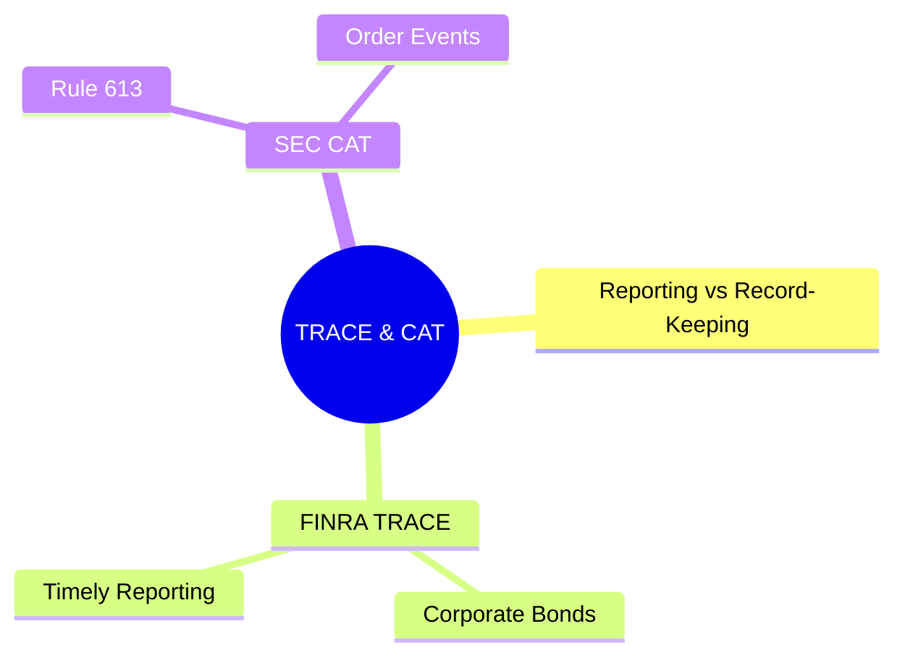
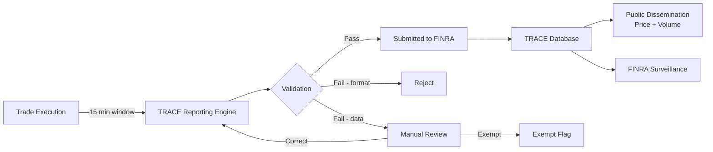
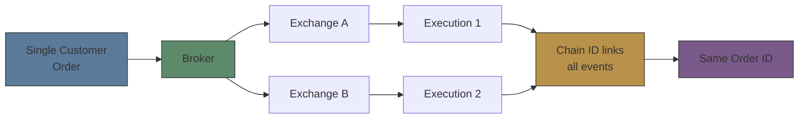
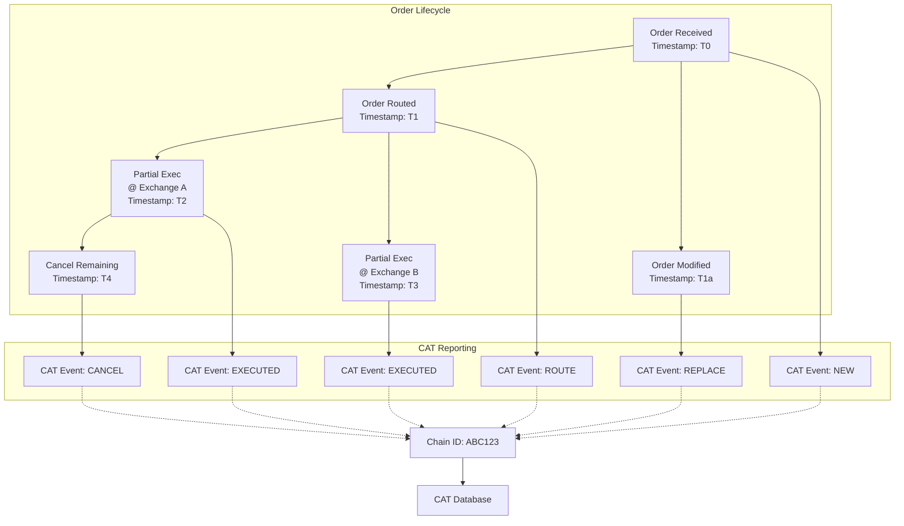

# Module 36: FINRA TRACE & SEC CAT

Estimated time: 2h



## Learning Objectives (aligned with course CILOs)
- Distinguish regulatory reporting from internal record-keeping — legal requirement differences — maps to CILO #5
- Master FINRA TRACE corporate bond trade reporting — timeframes, reportable vs exempt trades — maps to CILO #1
- Understand SEC Rule 613 CAT order lifecycle capture scope — maps to CILO #2
- Identify MiFID II / EMIR / SFTR transaction reporting — core data fields and deadlines — maps to CILO #2
- Apply best execution reporting rules: NMS market quality metrics, MiFID II tick test — maps to CILO #3
- Execute Reg SHO short sale rules: locate requirement, close-out timeline — maps to CILO #4
- Manage Large Trader identification (SEC Form 13H) and activity reporting — maps to CILO #4
- Handle ETD real-time CCP trade reporting — maps to CILO #1
- Operate error correction and amendment workflows: break root cause analysis and resubmission — maps to CILO #3
- Navigate regulatory calendar: cutoff times, late fees, penalty structure — maps to CILO #5

---


## Real-World Scenario

A mid-size brokerage's regulatory reporting team discovers multiple alerts on T+1 morning for prior day's trade data:

- A $5M corporate bond trade was not submitted to FINRA TRACE — ops found it after the 15-minute reporting window expired
- A client modified an order three times after placement; CAT record shows order lifecycle gap (missing event type)
- Three ETF short sales had no locate documentation attached; Reg SHO close-out deadline already passed
- A large trader account activity exceeded 13H filing threshold but system had not flagged it
- Futures trade submitted to CCP had timestamp 4 seconds off from brokerage internal record — exceeded tolerance

Investigation reveals: brokerage uses three different reporting engines (TRACE, CAT, CCP), each connecting to different data sources. The TRACE engine had a configuration issue from prior night's system maintenance — bond trade feed was interrupted for 23 minutes.

> **Think**: Why does one reporting engine configuration issue simultaneously trigger TRACE late reporting AND CAT data gaps? What is the dependency between regulatory reporting systems and trade execution systems?
>
> *Answer: Reporting engines depend on trade capture system data feeds. If a config issue interrupts the feed, not only TRACE is late — all report types depending on the same feed are affected. The core problem: reporting systems typically lack independent data validation layers — "garbage in, gospel out." Regulatory reporting is a legal obligation, not an optional add-on.*

---

## Core Content

### 1. Reporting vs Record-Keeping

**Core Distinction:**

| Feature | Regulatory Reporting | Record-Keeping |
|---------|---------------------|----------------|
| Audience | Regulator (FINRA, SEC, ESMA) | Internal broker (+ regulator on request) |
| Format | Specified schema (XML, JSON, CSV) | Free format (must be readable) |
| Deadline | Strict cutoff (T+1 06:00, 15 min) | No real-time requirement (retain 3-7 yrs) |
| Error consequence | Fines, enforcement, business restrictions | Compliance sanction but lighter |
| Content scope | Specific trade/activity subset | All business records |
| Modification | Amendment workflow | Changes require audit trail |

**Key Regulations:**
- SEC Rule 17a-3 / 17a-4: broker-dealer record types and retention periods
- FINRA Rule 4511 / 4512: member firm record-keeping requirements
- MiFID II Article 25(3): transaction record retention 5 years
- EMIR Article 9: derivative trade record retention 10 years

**Legal Status of Regulatory Reports:**
> Regulatory report once submitted carries legal force.
> If error discovered later:
>   - Must submit amendment
>   - Original report + amendment = complete audit trail
>   - Intentional false submission = violation of SEC Rule 10b-5 (anti-fraud)

> **Think**: Why do regulators require brokers to retain both original records AND submitted reports? What is the significance of reconciling the two?
>
> *Answer: Record-keeping provides "raw facts"; regulatory reports provide "interpreted submission." Reconciliation ensures reports reflect true trade activity. If they diverge, it signals system error or worse (e.g., wash trading concealment). Regulators cross-compare reports across brokers — buy-side and sell-side reports for the same trade must match.*

### 2. FINRA TRACE Corporate Bond Trade Reporting

**TRACE (Trade Reporting and Compliance Engine):**
- FINRA-operated corporate bond trade reporting system
- Covers: US corporate bonds, government agency bonds, ABS, MBS
- Purpose: market transparency + regulatory surveillance

**Reporting Timeframes:**

| Trade Type | Reporting Window | Dissemination |
|-----------|-----------------|---------------|
| Investment Grade Corporate Bond | Within 15 minutes | Immediate |
| High Yield Corporate Bond | Within 15 minutes | Immediate |
| Convertible Bond | Within 15 minutes | Immediate |
| Government Agency Bond | Within 15 minutes | Immediate |
| ABS / MBS | Within 15 minutes | Immediate |
| Certain exempt transactions | T+1 | Not disseminated or delayed |

**Reportable vs Exempt Trades:**

**Must Report:**
- All secondary market corporate bond trades (investment grade and high yield)
- Agency pass-through MBS transactions
- Certain private placements (Rule 144A)

**Exempt Trades:**
- Primary market issuance (must report at settlement though)
- Repurchase agreements (repos)
- Certain non-US securities (based on SEC Rule 144A eligibility)
- Face value $1MM+ certain agency bonds (delayed dissemination eligible)

> **Mermaid: TRACE Reporting Flow**

>
> **Note**: TRACE reject is NOT a late report. If reject occurs within 15-min window and corrected resubmission is made, it still counts as compliant. First submission AFTER 15 minutes is the late event.

> **Predict**: A TRACE report is rejected at minute 14 for a format error; the corrected resubmission goes out at minute 16. Is this a late report?
>
> *Answer: No — a reject inside the 15-minute window plus corrected resubmission stays compliant; only the first submission after 15 minutes is late.*

**TRACE Certifications:**
Brokerage firms must designate:
- **Compliance Person**: internal monitoring for TRACE reporting quality
- **Technical Contact**: system connectivity and technical issue handling
- **Procedures**: written supervisory procedures (WSP)

**Key TRACE Data Elements:**
```text
Message Header (sender, receiver, timestamp)
Trade Side (Buy / Sell / Cross)
Security Identifier (CUSIP / ISIN)
Trade Date and Time
Price (dirty / clean indicator)
Yield (if applicable)
Principal Amount
Commission / Markup-Markdown (if applicable)
Contra-Party Identifier (MPID)
Capacity (Agent / Principal)
Special Condition Codes (if any)
```

> **Think**: A $10M corporate bond trade is reported to TRACE 17 minutes after execution. What violation is this? What remedial steps are needed?
>
> *Answer: Exceeds 15-min deadline — late trade reporting. Must: submit trade report immediately (even though late), AND submit a separate late trade notification to FINRA. Persistent lateness triggers escalated fines. Remediation: review systemic root cause (config issue / data feed latency / validation bottleneck).*

> **Cloze**: "FINRA TRACE requires {corporate bond} trades to be reported within {15 minutes} of execution. Reportable trades include {investment grade} and {high yield} bonds. Exempt trades include {primary issuance} and {repo agreements}. Late trades must still be submitted, along with a {late trade notification}."
>
> *Answer: corporate bond, 15 minutes, investment grade, high yield, primary issuance, repo agreements, late trade notification*

### 3. SEC Rule 613 — Consolidated Audit Trail (CAT)

**CAT (Consolidated Audit Trail):**
- Market-wide order database mandated by SEC Rule 613
- Goal: capture complete order lifecycle for NMS securities (stocks, options)
- Operator: CAT NMS Plan (SROs + FINRA joint operation)
- Status: phased implementation (large brokers compliant, small brokers transitioning)

**CAT Capture Scope:**

| Lifecycle Event | Reportable? | Description |
|----------------|-------------|-------------|
| Order Received | Yes | Client places order (incl. modify/cancel) |
| Order Routed | Yes | Broker routes order to exchange/ATS |
| Order Cancelled | Yes | Order cancelled (any reason) |
| Order Replaced | Yes | Order modified (price/size/type change) |
| Order Executed | Yes | Full or partial execution |
| Trade Break | Yes | Trade cancel/correct |
| Allocated | Yes (chain) | Order allocated to client accounts |

**CAT Key Reporting Requirements:**
```text
Customer ID:
  - Retail: Customer Account Information (CAI) — non-sensitive PII
  - Institutional: Large Trader ID (LTID) or CAT Customer ID
  - Anonymous: no SSN/TIN transmitted, uses CAT-assigned or broker-assigned identifier

Order Lifecycle:
  - Linkage: all events under same original order linked via Chain ID / Order ID
  - Timestamp: nanosecond precision required — use NTP sync
  - Sequence: each event must have sequence number to rebuild execution order

Reporting Timeline:
  - Submit all event records by T+1 08:00 ET
  - Correction: 24/7 window — can submit correction any time
```

**CAT Cross-Market Linkage:**



> **Mermaid: CAT Order Lifecycle Tracking**


**Common CAT Compliance Issues:**
- **Missing event**: order lifecycle events not continuous (e.g., missing route event, or missing new order event after modify)
- **Timestamp precision**: system clock not NTP-synced, causing nanosecond timestamp drift
- **Chain ID broken**: modified order's Chain ID fails to link back to original order
- **Customer ID format error**: CAI format fails CAT spec (length, checksum, prefix)
- **Duplicate records**: same event submitted twice

> **Think**: CAT requires nanosecond timestamp precision. What technical challenges does this pose for legacy order management systems?
>
> *Answer: Legacy OMS may only support millisecond or microsecond precision. Needed: ① hardware upgrade (NTP-synced NIC); ② middleware layer inserting monotonic timestamps; ③ acceptance test validating precision. Some brokers use "event sequencing number + timestamp" combination to guarantee ordering — even if timestamp precision is insufficient, sequence numbers still reconstruct order.*

---

## Spot the Mistake

CAT report contains the following data:
```text
Order Received: 09:30:00.123456789
Order Modified: 09:30:00.123456788
(10 nanoseconds before receive!)
```

**Why is this wrong?**

*Answer: Modified event timestamp is 10ns earlier than Receive event — physically impossible (modification requires order receipt first). Cause: system clock drift or event sequence reordered in middleware. Fix: event sequencing numbers must be monotonic; timestamp is supplementary.*
