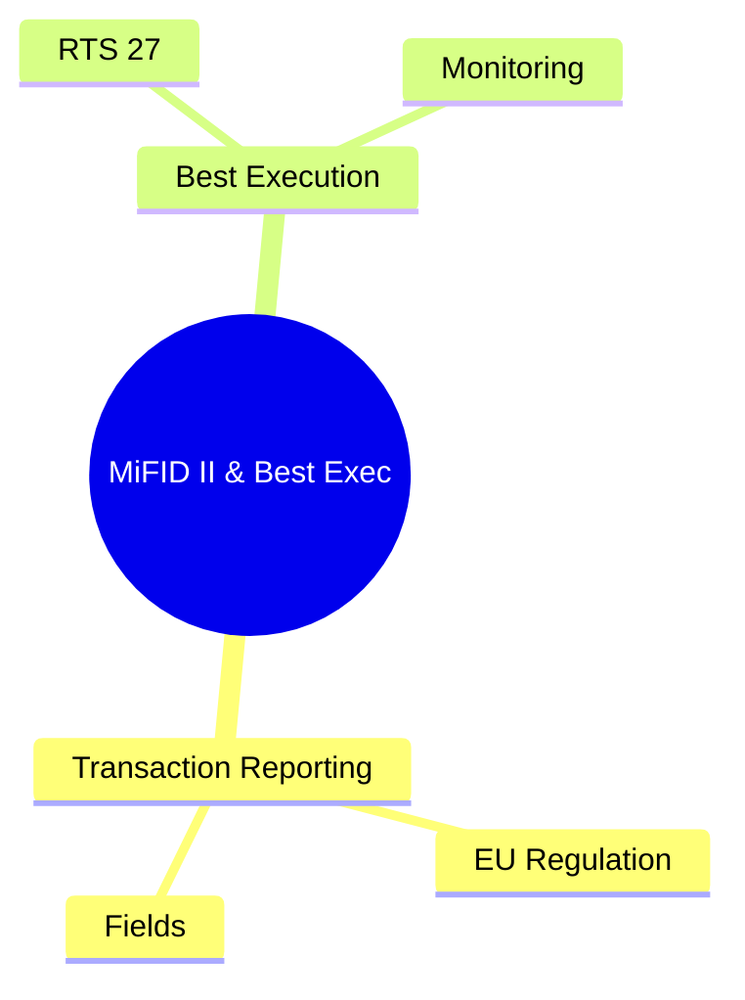
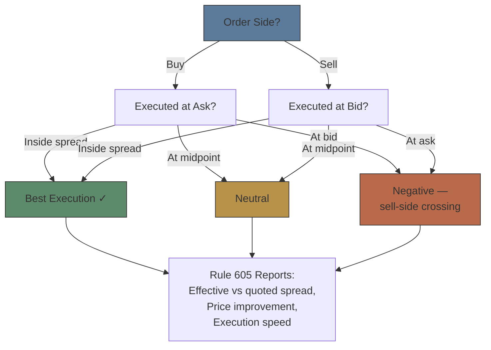
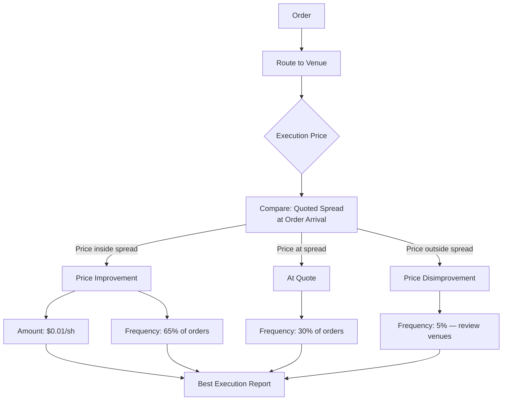

# Module 37: MiFID II & Best Execution

Estimated time: 2h



## Learning Objectives (aligned with course CILOs)
- Distinguish regulatory reporting from internal record-keeping — legal requirement differences — maps to CILO #5
- Master FINRA TRACE corporate bond trade reporting — timeframes, reportable vs exempt trades — maps to CILO #1
- Understand SEC Rule 613 CAT order lifecycle capture scope — maps to CILO #2
- Identify MiFID II / EMIR / SFTR transaction reporting — core data fields and deadlines — maps to CILO #2
- Apply best execution reporting rules: NMS market quality metrics, MiFID II tick test — maps to CILO #3
- Execute Reg SHO short sale rules: locate requirement, close-out timeline — maps to CILO #4
- Manage Large Trader identification (SEC Form 13H) and activity reporting — maps to CILO #4
- Handle ETD real-time CCP trade reporting — maps to CILO #1
- Operate error correction and amendment workflows: break root cause analysis and resubmission — maps to CILO #3
- Navigate regulatory calendar: cutoff times, late fees, penalty structure — maps to CILO #5

---

## Core Content

### 4. MiFID II Transaction Reporting (EU Regulation)

**MiFID II Transaction Reporting Architecture:**
- **Purpose**: market surveillance, abuse detection, systemic risk tracking
- **Reporting entity**: Approved Reporting Mechanism (ARM) submits to competent authority (FCA, BaFin, AMF)
- **Coverage**: all financial instruments (equities, bonds, derivatives, structured products)
- **Reporting firm**: Investment firm (broker, proprietary trader, asset manager)

**Core Report Types:**

| Report Type | Regulation | Deadline | Content |
|------------|-----------|----------|---------|
| Transaction Report | MiFID II RTS 22 | T+1 | Trade details (instrument, counterparty, price, quantity, client ID) |
| EMIR Trade Report | EMIR Article 9 | T+1 (business day) | OTC derivative trades, valuation, collateral |
| SFTR | SFTR Regulation | T+1 | Securities financing transactions (repo, securities lending) |
| Order Record Keeping | MiFID II Article 25(3) | Real-time (internal) | Order lifecycle (similar to CAT but broader) |

**MiFID II Transaction Report Fields (RTS 22 — 65 fields total):**

```text
Required Fields (subset):
  - Trading Capacity (DEAL / MTCH / AOTC)
  - Instrument ID (ISIN / AII / CFI Code)
  - Transaction Date/Time (UTC, microsecond precision)
  - Price (monetary / percentage / yield / points)
  - Quantity (nominal / number of units)
  - Counterparty ID (LEI or Natural Person ID)
  - Client Identification (Natural Person / Small / Medium Enterprise)
  - Venue (MIC code — XOFF for OTC)
  - Transaction Category (SINT / BORL / LEND, etc.)
```

**EMIR and SFTR Complements:**
```text
EMIR:
  - All OTC derivatives (interest rate swaps, CDS, FX forwards, commodity derivatives)
  - Report: trade detail + ongoing lifecycle events (novation, termination, valuation update)
  - Trade Repository (TR) receives reports — DTCC, Regis-TR, UnaVista, etc.
  - Double-sided reporting: BOTH parties must report!

SFTR:
  - Securities financing transactions (repos, securities lending, buy-sell backs, margin lending)
  - Also double-sided reporting
  - Shares some infrastructure with EMIR
```

> **Predict**: A broker reports an on-exchange trade but fills the venue field with XOFF (reserved for OTC). What happens?
>
> *Answer: The venue code contradicts the trade, so the ARM / competent-authority reconciliation flags a mismatch and the report must be corrected and resubmitted.*

> **Think**: Why does EMIR require double-sided reporting (buyer and seller each report separately)? How does this differ from TRACE's single-report design?
>
> *Answer: Double-sided allows the trade repository to perform automatic reconciliation. Both parties submit matching data → trade confirmed. Mismatch → break resolution triggered (both sides investigate the discrepancy). TRACE uses seller-only reporting — single point of truth but lacks cross-validation. Double-sided architecture is more robust but increases ops burden — both sides must align data.*

**Instrument Reference Data:**
- MiFID II established Financial Instruments Reference Data System (FIRDS)
- All financial instruments must be registered in ESMA database before trading
- Broker must ensure ISIN / CFI codes used are accurate and not expired

> **Cloze**: "MiFID II transaction reports must be submitted by {T+1}. EMIR requires {double-sided reporting}, meaning both buyer and seller report separately. SFTR covers {securities financing transactions}, including repos and {securities lending}. Instrument reference data is managed by the {FIRDS} system using {ISIN} as the instrument identifier."
>
> *Answer: T+1, double-sided reporting, securities financing transactions, securities lending, FIRDS, ISIN*

### 5. Best Execution Reporting

**NMS Best Execution Obligation (US):**
- SEC Rule 606: order routing reports (quarterly, disclose routing venue selection statistics)
- SEC Rule 605: execution quality reports (market centers publish execution quality statistics)
- FINRA Rule 5310 (Best Execution): member firm must ensure price received is not inferior to current market

**MiFID II Best Execution (EU):**
- RTS 28: annual execution quality report
- Must categorize by asset class, transaction type, execution venue
- Analysis dimensions: price, cost, speed, likelihood of execution, settlement

**Tick Test (Pricing Quality Assessment):**



> **Predict**: A client buy order executes at the bid. What does the tick test conclude?
>
> *Answer: Negative — a buy filled at the bid is sell-side crossing (price disimprovement), failing the best-execution expectation.*

> **Mermaid: Best Execution Analysis Layers**


**Best Execution Reporting Burden:**
- Data collection: obtain execution quality stats from each routing venue
- Venue analysis: evaluate routing decisions quarterly (Rule 606 must disclose routing logic)
- Client disclosure: provide execution quality data to institutional clients
- Audit: regulator may verify routing logic prioritizes client best interest

> **Think**: If a broker routes to a venue that has the fastest execution speed but worst price quality (multi-penny disimprovement for clients), does this violate best execution obligation?
>
> *Answer: "Best" in best execution is multi-factor (price, cost, speed, likelihood, settlement). Optimizing for speed alone while disregarding price likely violates the obligation. FINRA and FCA both emphasize "price is the most important factor." Overall tradeoff needed: if speed gain is offset by price deterioration, routing must be adjusted.*

---

## Spot the Mistake

An EMIR-reporting broker reports only its own side of a swap, assuming the trade repository will reconcile against its internal books.

**Why is this wrong?**

*Answer: EMIR mandates double-sided reporting — both counterparties must report. A one-sided report leaves an unmatched record that triggers a break/valuation mismatch at the TR.*

A broker starts trading a new instrument whose ISIN is not yet registered in FIRDS.

**Why is this wrong?**

*Answer: MiFID II requires instruments to be registered in ESMA's FIRDS before trading; an unregistered ISIN breaks transaction reporting and CFI-code validity.*
