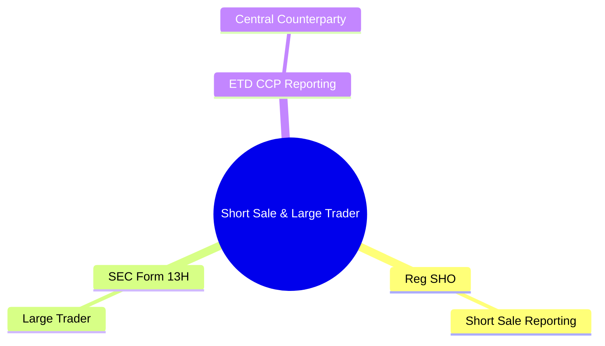
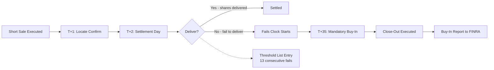
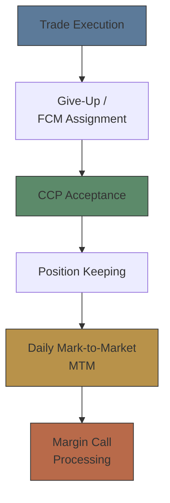

# Module 38: Short Sale, Large Trader & ETD

Estimated time: 2h



## Learning Objectives (aligned with course CILOs)
- Distinguish regulatory reporting from internal record-keeping — legal requirement differences — maps to CILO #5
- Master FINRA TRACE corporate bond trade reporting — timeframes, reportable vs exempt trades — maps to CILO #1
- Understand SEC Rule 613 CAT order lifecycle capture scope — maps to CILO #2
- Identify MiFID II / EMIR / SFTR transaction reporting — core data fields and deadlines — maps to CILO #2
- Apply best execution reporting rules: NMS market quality metrics, MiFID II tick test — maps to CILO #3
- Execute Reg SHO short sale rules: locate requirement, close-out timeline — maps to CILO #4
- Manage Large Trader identification (SEC Form 13H) and activity reporting — maps to CILO #4
- Handle ETD real-time CCP trade reporting — maps to CILO #1
- Operate error correction and amendment workflows: break root cause analysis and resubmission — maps to CILO #3
- Navigate regulatory calendar: cutoff times, late fees, penalty structure — maps to CILO #5

---

## Core Content

### 6. Short Sale Reporting — Reg SHO (US)

**Regulation SHO Architecture:**
- **Purpose**: prevent naked short selling and short sale abuse
- **Coverage**: all equity securities (NMS stocks)
- **Core rules**: Rule 200 (locate), Rule 201 (circuit breaker), Rule 203 (close-out)

**Rule 200 — Locate Requirement:**
```text
Before executing a short sale, broker-dealer must:
  1. Locate shares available for borrowing
  2. Have reasonable grounds that shares can be borrowed by settlement date
  3. Document locate source in order management system

Locate Sources:
  - Prime broker / clearing firm (easy-to-borrow list)
  - Securities lending desk
  - Third-party lenders (custodian banks, hedge funds)

Exemptions:
  - Market maker hedging (bona-fide market making)
  - Certain ETF creation/redemption activities
  - Odd lots (but still reportable)
```

**Rule 203 — Close-Out Requirement:**
```text
Threshold Securities (stocks with significant fails-to-deliver):
  13 consecutive settlement days on fail-to-deliver list

Close-out timeline:
  - T+4 settlement for equity trades (standard)
  - Fail-to-deliver by settlement date: countdown starts
  - T+35 (calendar days) from trade date: forced close-out
    → Must buy-in the security by T+35

Pre-close-out actions:
  - No additional short sales on threshold securities
    unless shares are pre-borrowed
```

> **Predict**: A short sale is located via the easy-to-borrow list, but on settlement day no shares are available to deliver. What happens?
>
> *Answer: The trade fails to deliver, the fails clock starts, and if it becomes a threshold security it must be bought in by T+35.*

**Reg SHO Reporting Requirements:**
```text
Short Sale Transaction Reports:
  - FINRA Rule 4560: monthly short interest reporting (all NYSE/NASDAQ/NMS stocks)
  - Marking requirement: each order marked "long / short / short exempt"

Exception Reporting:
  - Fail-to-deliver report: threshold securities daily fail list
  - Close-out status report: close-out execution status
```

> **Mermaid: Short Sale Lifecycle and Reg SHO Timeline**


> **Think**: A hedge fund asks its broker to execute a large short sale. How should the broker ensure Reg SHO compliance?
>
> *Answer: ① Execute locate — confirm hedge fund has borrowable source (if not easy-to-borrow, manual approval needed); ② Mark order as short (not exempt unless bona-fide market making); ③ Monitor settlement — if fail, start close-out countdown; ④ If security on threshold list, no additional short positions before close-out. All locate records retained for 3 years.*

> **Cloze**: "Reg SHO {Rule 200} requires brokers to perform a {locate} before executing a short sale, ensuring shares can be borrowed by {settlement} date. {Rule 203} requires threshold securities to be forcibly closed out by {T+35}, with a mandatory {buy-in} if not settled. Short orders must be marked {long}, {short}, or {short exempt}."
>
> *Answer: Rule 200, locate, settlement, Rule 203, T+35, buy-in, long, short, short exempt*

### 7. Large Trader Reporting — SEC Form 13H

**SEC Rule 13h-1 (Large Trader Reporting):**
- **Purpose**: identify and monitor traders with systemic market impact
- **Threshold**: accounts reaching certain volume or value criteria
- **Trigger**: broker must identify large traders and submit Form 13H to SEC

**Large Trader Identification Thresholds:**

| Metric | Daily Threshold | Monthly Threshold |
|--------|----------------|------------------|
| NMS stock trading volume | 2 million shares | 20 million shares |
| NMS stock trading value | $20 million | $200 million |
| Options (contracts) | 200,000 contracts | 2 million contracts |

**Broker Obligations:**
```text
1. Identify large traders
   → Monitor account activity; notify client when threshold triggered
   → Client must submit Form 13H to obtain Large Trader ID (LTID)

2. Report large trader activity
   → Record order/execution data for each large trader account
   → SEC may request specific time-period data

3. Maintain records
   → Retain all large trader order and execution records (3 years)
   → Retain identification records (client Form 13H copies)

4. Internal controls
   → System automatically monitors account activity levels
   → Periodic review whether any account newly meets the threshold
```

> **Think**: An account trades 5 million shares of NMS stocks per week. Is it necessarily a large trader?
>
> *Answer: Not necessarily. Large trader definition is based on daily OR monthly thresholds. 5M shares/week ≈ 20M shares/month — just hits the monthly threshold (20M). However, trigger depends on "whether threshold is met in a given calendar month." System should monitor rolling 30-day activity, not fixed calendar month. Activity volatility may cause intermittent threshold crossing. Best practice: proactively notify client to prepare Form 13H filing when approaching threshold.*

> **Predict**: An account that has never approached the limits executes 25 million shares in a single day. What must the broker do?
>
> *Answer: It now meets the daily threshold — the broker must identify it as a large trader, notify the client to file Form 13H, and record its activity.*

### 8. ETD CCP Reporting — Central Counterparty Trade Reporting

**Futures CCP Reporting Flow:**

**US Futures (CME, ICE, Eurex):**



**Reporting Requirements:**
- **Real-time**: report to CCP immediately after execution
- **Position report** (end-of-day): daily position report
- **MTM report**: daily settlement price and variation margin
- **Exception report**: give-up not accepted, position limit breach

**CCP Reporting Key Timelines:**
```text
US Futures (CME):
  - Give-Up: within 10 minutes of execution
  - Position capture: daily after market close (16:30 CT)
  - Margin call: 17:30-18:00 CT
  - Settlement: T+1 08:00 ET

Options:
  - Give-Up within 15 minutes of execution
  - Exercise / assignment report: T+1 06:00 CT
```

**European Futures (Eurex, ICE Europe):**
```text
  - Trade confirmation: within 15 seconds (best effort)
  - Give-Up: within 15 minutes
  - Position report: 19:00 CET (daily)
  - Margin call: 20:00 CET
```

**ETD Reporting vs OTC Trade Reporting:**

| Feature | ETD (Central Clearing) | OTC (e.g. TRACE/EMIR) |
|---------|----------------------|----------------------|
| Report destination | CCP (clearing house) | Regulator / Trade Repository |
| Reporting speed | Real-time to 15 min | 15 min to T+1 |
| Bilateral confirmation | CCP automatic (cleared) | Both sides must match |
| Lifecycle | CCP full lifecycle management | Flat file amendment needed |
| Risk management | CCP margin system | Bilateral or third-party collateral |

> **Think**: What happens if a futures give-up is not accepted by the CCP within 10 minutes?
>
> *Answer: Give-up rejection means CCP will not accept the trade for clearing. Broker must: ① check reject reason (invalid account, position limit exceeded, insufficient credit limit); ② correct and resubmit give-up; ③ if beyond CCP's acceptance window, may need to handle as non-give-up trade (losing give-up flexibility) or execute as exchange for physical (EFP). Persistent give-up failures may trigger FCM credit restrictions.*

---

## Spot the Mistake

Ops batches futures give-up processing for the end-of-day run, treating CCP reporting like a T+1 report.

**Why is this wrong?**

*Answer: ETD give-up is real-time — within 10 minutes (CME) or 15 minutes (Eurex). Batched too late, the CCP may not accept the trade for clearing.*
