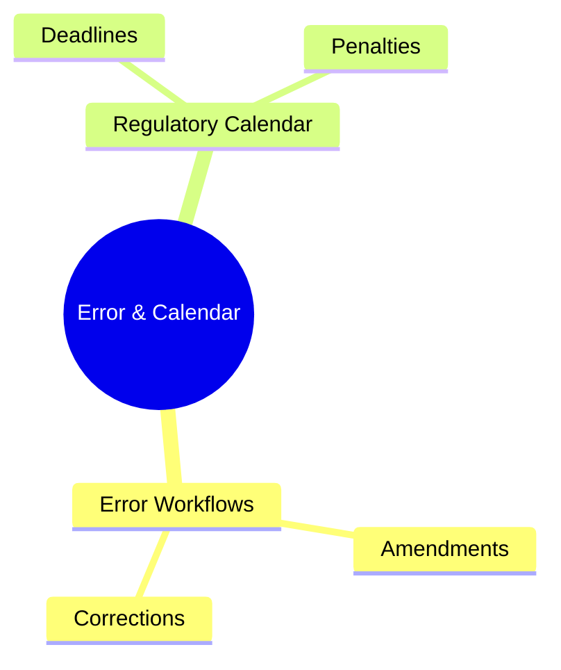
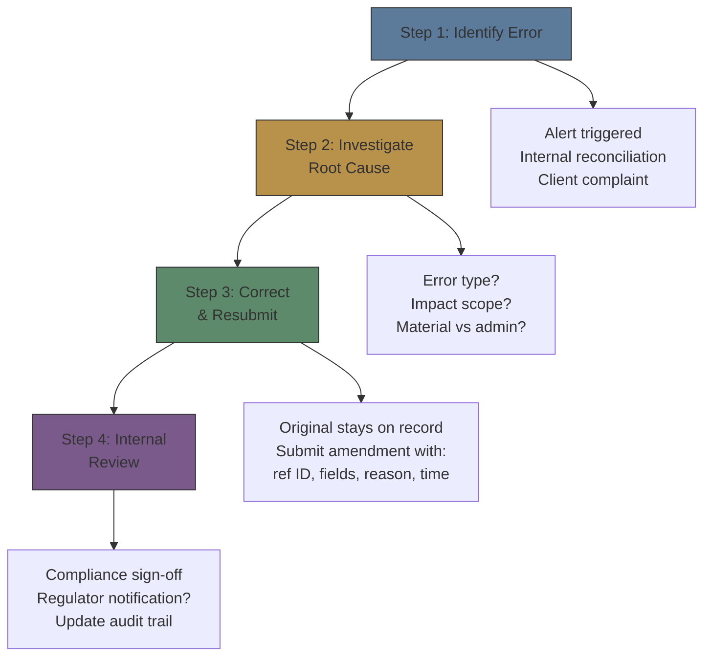
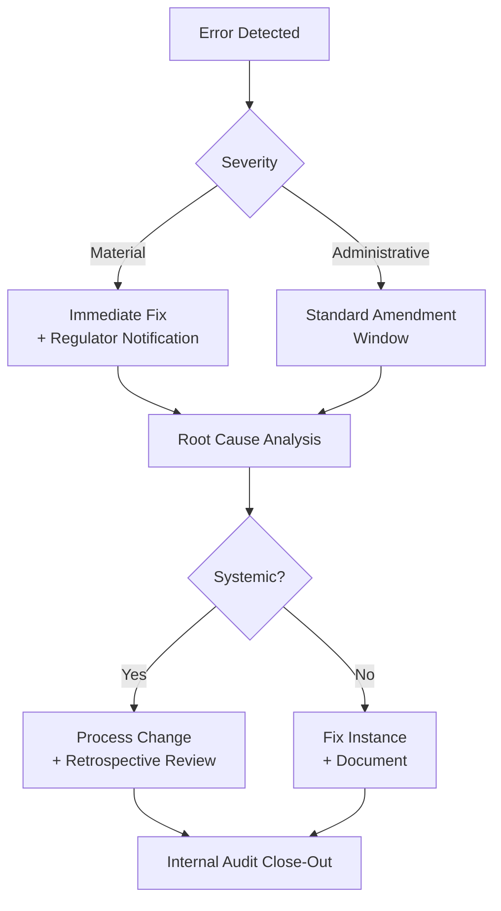

# Module 39: Error & Calendar

Estimated time: 2h



## Learning Objectives (aligned with course CILOs)
- Distinguish regulatory reporting from internal record-keeping — legal requirement differences — maps to CILO #5
- Master FINRA TRACE corporate bond trade reporting — timeframes, reportable vs exempt trades — maps to CILO #1
- Understand SEC Rule 613 CAT order lifecycle capture scope — maps to CILO #2
- Identify MiFID II / EMIR / SFTR transaction reporting — core data fields and deadlines — maps to CILO #2
- Apply best execution reporting rules: NMS market quality metrics, MiFID II tick test — maps to CILO #3
- Execute Reg SHO short sale rules: locate requirement, close-out timeline — maps to CILO #4
- Manage Large Trader identification (SEC Form 13H) and activity reporting — maps to CILO #4
- Handle ETD real-time CCP trade reporting — maps to CILO #1
- Operate error correction and amendment workflows: break root cause analysis and resubmission — maps to CILO #3
- Navigate regulatory calendar: cutoff times, late fees, penalty structure — maps to CILO #5

---

## Core Content

### 9. Error Correction and Amendment Workflows

**Why Error Correction Is Needed:**
- Data entry error (trade side, CUSIP, amount, price)
- System error (feed interruption, timestamp drift, duplicate)
- Allocation error (wrong account, wrong client ID)
- Internal logic error (marking error, capacity error)

**Amendment Workflow Structure:**



**Amendment Types by Regulation:**

| Regulation | Amendment Type | Method | Time Limit |
|-----------|---------------|--------|-----------|
| FINRA TRACE | Cancel / Correct | TRACE amendment message | 24x7 window |
| SEC CAT | Correct / Cancel / Replace | CAT correction file | T+3 calendar days |
| MiFID II | Cancel / Correction | ARM resubmission | No hard limit (ASAP) |
| EMIR | Update lifecycle | Trade state update | No hard limit (late affects reconciliation) |
| CCP | Mismatch resolution | CCP portal / give-up retry | CCP-specific window |

**Common TRACE Amendment Reason Codes:**

| Code | Description |
|------|-------------|
| 101 | Administrative error (wrong CUSIP/price) |
| 102 | Trade side error (buy vs sell) |
| 103 | Counterparty error |
| 104 | Allocation error (amount split) |
| 105 | Late trade reporting (original not submitted on time) |
| 201 | Cancelled trade (both parties agree) |
| 202 | Trade break (full cancellation) |

> **Cloze**: TRACE requires bond trades reported within a {15 minute} window; a wrong CUSIP is corrected via an amendment with reason code {101}. SEC CAT captures the full order lifecycle with corrections due T+{3} calendar days. A broker keeping a 1% late-TRACE rate faces roughly ${2.4M} in annual fines.
>
> **Predict**: A broker leaves a wrong CUSIP on a TRACE report for three weeks, treating it as low-risk admin work. What happens?
>
> *Answer: The error still needs a TRACE amendment (reason code 101), and the delayed correction counts as a data-quality error with escalating fines.*

> **Mermaid: Error Correction Workflow**


> **Think**: A broker discovers that 50 TRACE reports submitted yesterday had incorrect CUSIPs due to a corrupted system mapping table. What type of error is this? How should it be handled?
>
> *Answer: Systemic material error. Handling: ① Immediately pause TRACE feed (prevent more errors); ② Submit corrections for all 50 trades; ③ Notify FINRA compliance contact (some cases require formal notification); ④ Fix mapping table before re-enabling feed; ⑤ Review systemic controls (why did validation fail to catch it?). Do not attempt cancel + resubmit for all — corrections directly modify the original report.*

### 10. Regulatory Calendar, Deadlines and Penalty Structure

**US Market Regulatory Reporting Timeline:**

**US Market Regulatory Reporting Timeline:**

| Frequency | Reports & Deadlines |
|-----------|-------------------|
| **Daily** | TRACE: 15 min window for bond trades; CCP give-up: 10-15 min; CAT: T+1 08:00 ET; Short sale marking: real-time at order entry |
| **Weekly** | TRACE late trade reports: FINRA monitors rolling 5-day |
| **Monthly** | FINRA Rule 4560: Short interest report (mid-month); Monthly CAT compliance metrics |
| **Quarterly** | SEC Rule 606: Order routing report; SEC Rule 605: Execution quality report; FINRA TRACE data quality review |
| **Annually** | Large Trader Form 13H update; Best execution review (MiFID II RTS 28); Licensing/subscription confirmation |

**Late Reporting and Error Penalty Structure (FINRA):**

| Violation Type | First (warning) | Subsequent (minor) | Severe or Systemic |
|---------------|----------------|-------------------|-------------------|
| Late TRACE (15 min - 1 hr) | Letter of Caution | $1,000-5,000 | $25,000+ |
| Late TRACE (>1 hr) | $1,000-5,000 | $5,000-25,000 | $100,000+ |
| Missed TRACE | $5,000-25,000 | $25,000-100,000 | $500,000+ |
| CAT data quality errors | $1,000-10,000 | $5,000-50,000 | $250,000+ |
| CAT missing events | $1,000-5,000 | $5,000-25,000 | $100,000+ |
| Reg SHO marking errors | $5,000 | $10,000-25,000 | $100,000+ |
| 13H unidentified large trader | $10,000 | $25,000-100,000 | $250,000+ |

**EU Penalty Framework (ESMA / NCAs):**
```text
MiFID II Administrative Penalties:
  - Individual civil fines: up to €5M or 10% of annual turnover
  - Entity civil fines: up to €5M - €10M or 10% of total turnover
  - Additional sanctions: trading ban, license suspension, public censure

EMIR Penalties:
  - Non-reporting: up to €5M (individual) or €15M (entity)
  - Late/incorrect reporting: case-by-case assessment
  - Daily penalty on late submission (some NCAs)
```

**Case Study: Late Reporting Fine Accumulation**
> Scenario:
>   - Mid-size broker, ~10,000 bond trades/month
>   - 1% exceed 15-min window = ~100 late trades/month
>   - Average lateness 22 min (67% within 1 hour)
>   - FINRA potential penalty:
>     - 100 trades × $2,000 avg = $200,000/month
>     - 12 months = $2.4M
>     - + investigation cost + compliance review fee
>
> Preventive investment:
>   - TRACE monitoring tool: $50-100K setup + $10-20K/month
>   - Automated validation layer: $100K development
>   - Cost vs penalty: <$200K/year vs $2.4M/year

> **Predict**: A broker keeps a 1% late-TRACE rate (~100 bond trades/month) for a full year. What is the approximate fine exposure?
>
> *Answer: ~$2.4M — 100 trades × ~$2,000 average × 12 months, plus investigation and review costs.*

> **Think**: Why does FINRA impose significantly higher fines for systemic errors than for isolated human errors?
>
> *Answer: Systemic errors reflect control failures — the broker lacks proper monitoring, validation and prevention mechanisms. FINRA views this as governance failure. Human errors are unavoidable (but require secondary verification procedures). The penalty structure is designed to incentivize brokers to invest in reporting infrastructure rather than accepting fines as "cost of doing business."*

---

## Pattern Recognition & Advanced Concepts

**Three Reporting Models:**

1. **Single-sided reporting** (TRACE): seller reports, no automatic cross-validation
2. **Double-sided reporting** (EMIR): both parties report, automatic reconciliation
3. **Central repository** (CAT, CCP): single database aggregating full lifecycle events

**Common System Architecture Issues:**
- **Siloed reporting engines**: each report type on separate system, data inconsistency
- **Garbage in, gospel out**: no independent validation layer
- **Timestamp drift**: multiple system clocks unsynchronized
- **Event sequencing**: modify/cancel event order errors
- **Data lineage missing**: cannot trace report data back to original source

**Cross-References to Other Modules:**
- Module 2 (Trade Lifecycle): order → execution → allocation is foundation of CAT/TRACE reporting
- Module 5 (T&S/Settlements): settlement fail affects Reg SHO close-out timeline
- Module 6 (P&L): price validation errors directly impact reporting quality
- Module 8 (Risk): CCP margin reporting linked to risk management systems
- Module 10 (Compliance): regulatory reporting is core compliance deliverable

---

## Summary

Regulatory reporting is the legal obligation baseline for brokerage operations:

1. **Reporting ≠ Record-Keeping** — reports have format and deadlines; record-keeping has retention requirements
2. **TRACE** requires corporate bonds within 15 minutes — late fines can reach $500K+
3. **CAT** captures complete order lifecycle — nanosecond timestamp precision
4. **MiFID II / EMIR / SFTR** form the EU reporting three pillars — double-sided reporting needs reconciliation
5. **Best Execution** reports prove routing quality — price is most important factor
6. **Reg SHO** short sales require locate + close-out — threshold securities T+35 forced buy-in
7. **Form 13H** flags large traders — monitor daily/monthly activity thresholds
8. **CCP reporting** is real-time — give-up timelines are strict
9. **Error correction** must retain original record + amendment trail
10. **Penalty structure** escalates — one systemic error can exceed years of accumulated fines

> **Feynman Explanation Challenge**: Explain in language a five-year-old can understand "why a broker must tell the government (SEC, FINRA) about every trade, and what happens if they forget."
>
> *Hint: Imagine you run a lemonade stand. Every time someone buys lemonade, you need to tell town hall. If you forget, town hall fines you. If you intentionally report the wrong number, they get even angrier. Same for brokers — they must report every trade to ensure the market is fair.*

---

## Spot the Mistake

An ops team reads "No hard limit (ASAP)" on MiFID II corrections and queues them for a quarterly cleanup.

**Why is this wrong?**

*Answer: ASAP still means immediate best effort; deferring corrections leaves wrong reports on record and invites NCA scrutiny — it is not a free deferral.*

An ops team finds a CAT data error two weeks after discovery and argues "the correction window is 24/7, so timing does not matter."

**Why is this wrong?**

*Answer: CAT accepts corrections any time, but the T+3 correction benchmark still applies — late corrections are data-quality errors that draw escalating fines.*
