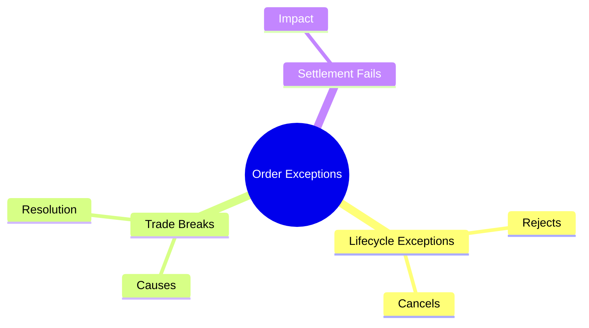
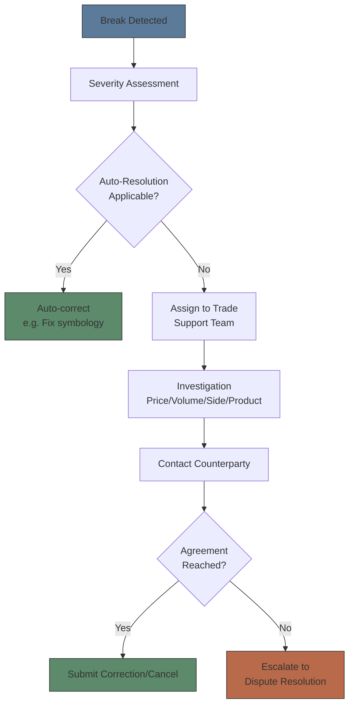
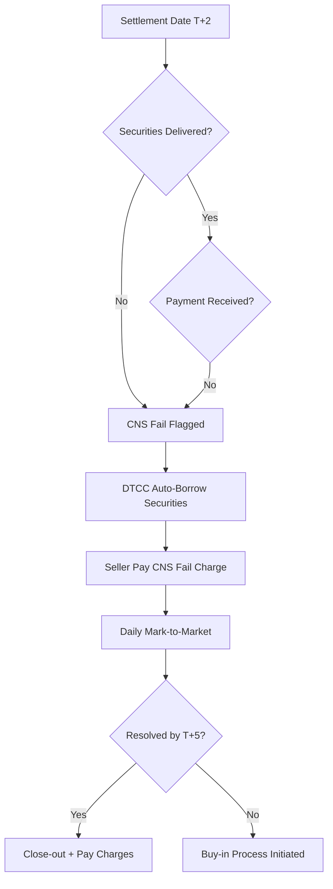
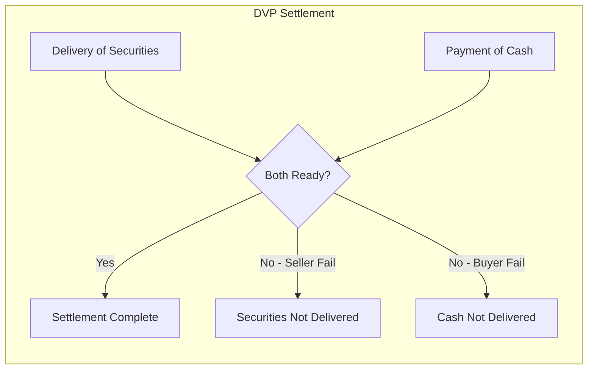

# Module 40: Order Exceptions

Estimated time: 2h



## Learning Objectives (aligned with course CILOs)
- Distinguish exception types across order lifecycle stages and their root causes — maps to CILO #1
- Identify trade break categories and resolution workflows — maps to CILO #2
- Master settlement fail mechanisms and remedial actions — maps to CILO #1
- Design alert queue severity levels and escalation rules — maps to CILO #3
- Calculate and interpret exception metrics to drive process improvement — maps to CILO #4
- Distinguish manual vs automated exception handling application scenarios — maps to CILO #5
- Apply alert fatigue management strategies — threshold tuning and noise control — maps to CILO #3
- Trace failed trade lifecycle from exception generation through resolution — maps to CILO #4

---


## Real-World Scenario

A large brokerage's exception management team discovers extensive red alerts on Monday morning:

- 30 OMS returns "New order rejected" — Reason: Risk check limit breach (exceeded client credit limit by $2M)
- 12 trade break alerts — Price outside reference market range by over 3%
- 8 CNS settlement fails — DTCC flagged as "Non-Settlement"
- System sent over 200 duplicate alerts at 07:23 — Communication channels near saturation
- 2 DVP fails — Client did not wire funds by 14:00
- 5 cancel/replace rejects — Orders were partially executed

Ops team finds: Risk control system had a credit limit update on Friday but was not synced to OMS. Additionally, alert routing rules did not distinguish critical vs warning — all exceptions set to critical severity.

> **Think**: Why does a risk limit sync failure simultaneously trigger new order rejects AND cancel/replace rejects? What system dependency weaknesses does this reveal?
>
> *Answer: OMS depends on risk control system for credit limit assessment. If limit defaults to 0 (unsynced value), all new orders AND modifications (which re-check limit) are rejected. Cancel/replace of partially filled orders is especially problematic — the system checks net exposure post-cancellation and may reject any change with limit=0. Weaknesses: parameter sync lacks validation layer, no health check mechanism, no manual override procedure during downtime.*

---

## Core Content

### 1. Order Lifecycle Exceptions

**Exception Definition:** Any event in system processing that falls outside expected parameters, requiring manual or automated intervention to proceed.

#### Three Order Exception Types

**New Order Reject:**
- OMS receives new order, pre-trade validation fails
- Common causes:
  - Risk limit breach (credit/exposure exceeded)
  - Symbology error (CUSIP/SEDOL unresolvable)
  - Market status (market closed or halted)
  - Capacity constraint (market maker inventory limits)
  - Compliance check (restricted list block)
- Workflow: ① Confirm reason → ② Correct parameters → ③ Resubmit

```text
New Order → Pre-Trade Validation → [Fail] → Return: order rejected(reason code)
                                                      ↓
                                               Manual review: correct and resend
```

> **Cloze**: Upon receiving a new order, OMS first performs {pre-trade validation}; if it fails, the order returns {rejected} status with a reason code.

**Cancel/Replace Reject:**
- Client attempts to modify order (price, quantity, validity), OMS cannot execute
- Common causes:
  - Order partially filled — cannot modify remaining quantity
  - Order fully filled — cannot modify executed order
  - Price change exceeds market protection limits
  - Modified order fails new limit check (risk limit reassessment)
- Workflow: ① Check original order status → ② Cancel original + ③ Place new order (two-step method)

> **Predict**: A cancel/replace on a partially filled order is rejected; the desk then cancels the original and places a fresh order. What happens?
>
> *Answer: The fresh order is accepted — cancel-original-then-new-order is the correct two-step path for partially filled orders.*

**Cancel Reject:**
- Client requests order cancellation, order cannot be canceled
- Common causes:
  - Order filled
  - Order accepted by exchange and in execution process
  - Past cancel window (late cancel window)
  - Regulatory halt restricts cancellation
- Workflow: Confirm execution status, notify client — cannot force cancel

#### Reason Code Reference

| Code | Description | Typical Handling |
|------|------------|-----------------|
| 101 | Unknown symbol | Fix symbology, resubmit |
| 102 | Invalid side | Verify buy/sell direction |
| 103 | Price exceeds limit | Adjust limit or confirm market price |
| 104 | Order quantity below minimum | Meet minimum quantity requirement |
| 105 | Risk limit breach | Request limit increase or split order |
| 106 | Duplicate ClOrdID | Replace with unique ClOrdID |
| 107 | Market closed | Wait for open or use alternate market |
| 108 | No liquidity | Handle as indication or wait for recovery |

> **Predict**: A desk resends a rejected order unchanged (reason 105: risk limit breach). What happens?
>
> *Answer: It is rejected again — the pre-trade check fails identically. The desk must request a limit increase or split the order before resubmission.*

### 2. Trade Breaks

**Trade Break Definition:** After trade execution, back-office processing reveals data mismatch — trade not yet confirmed, in "break" state.

#### Major Break Types

**Price Outside Range:**
- Execution price deviates from reference market price beyond tolerance (typically 2-5%)
- Trigger mechanism: post-trade price validation vs reference price
- Reference price sources: VWAP, last sale, bid-ask midpoint, indicative price
- Workflow: ① Check execution time vs market quotes → ② Confirm if erroneous execution → ③ Negotiate adjustment or cancel with counterparty

> **Think**: Trade executed at $52.30, reference market price $50.10, deviation 4.4%. Reference price from a snapshot 2 minutes ago. Is this truly a trade break?
>
> *Answer: Not necessarily. If market moved sharply in 2 minutes (news release, large order execution), $52.30 could be valid. Check tick data for trade-time market conditions. Trade break thresholds should use tick-level real-time prices, not snapshots. Mislabeling volatile market normal trades as breaks = false positive.*

> **Predict**: A price-outside-range break is confirmed as an erroneous execution and the counterparty agrees to a correction. What happens next?
>
> *Answer: The counterparty submits the correction/cancel, internal records are fixed, and the break closes — the two sides no longer disagree.*

**Duplicate Execution:**
- Same order executed multiple times (systemic or human error)
- Causes:
  - FIX session disconnect/reconnect — unsure if execution report was already sent
  - OMS resends order but exchange already received original
  - Human duplicate order entry
- Workflow: ① Identify duplicate execution reports → ② Notify counterparty → ③ Request cancel bust trade

> **Cloze**: When the same order is executed multiple times, it is called a {duplicate execution}, commonly caused by {FIX session disconnect/reconnect} with uncertain status.

**Wrong Side:**
- Execution direction opposite to order instruction (Buy executed as Sell)
- Usually caused by human entry error or OMS/EMS mapping error
- Workflow: ① Immediately notify counterparty → ② Request trade correction or reversal → ③ Fix internal records

**Unauthorized Symbol:**
- Executed product type outside client authorization scope
- Common scenario: Client authorized equities only, broker executed options
- Workflow: ① Determine responsible party → ② Broker absorbs loss, apply correction → ③ Strengthen authorization matrix



### 3. Settlement Fails

**Settlement Fail Definition:** Trade cannot settle on scheduled settlement date — delivery instructions rejected by DTCC, Euroclear, or other CSD.

#### Three Settlement Fail Types

**DTCC CNS Fail:**
- Participant cannot deliver securities or funds within DTCC Continuous Net Settlement system
- CNS auto-manages fail — maintains settlement continuity through stock loan/borrow
- Impact: Seller pays CNS fail charge (increasing per fail day)
- Workflow: ① Confirm fail reason (short securities vs short funds) → ② Procure securities or arrange financing → ③ Submit CNS close-out



**Counterparty Fail:**
- Counterparty cannot deliver in bilateral trade (non-CNS transaction)
- Common in: OTC derivatives, foreign exchange, private placements
- Workflow: ① Notify counterparty → ② Negotiate extension → ③ Escalate to legal if unresolved

**DVP Fail (Delivery vs Payment):**
- Seller ready to deliver securities but buyer lacks funds
- Or buyer has funds ready but seller lacks securities
- Workflow:
  - Buyer insufficient funds: Notify client → delayed settlement
  - Seller short securities: Borrow securities → delayed delivery



**Settlement Fail Summary:**

| Fail Type | Typical Cause | Remedial Action |
|----------|--------------|-----------------|
| CNS fail - sell side | Insufficient securities | Borrow securities or buy-in |
| CNS fail - buy side | Insufficient funds | Notify client to fund |
| DVP fail | Settlement instruction mismatch | Correct and resubmit |
| Counterparty fail | Counterparty credit issue | Negotiate extension |
| FX settlement fail | Currency settlement time-zone gap | CLS or pre-funding |

---

## Spot the Mistake

Ops receives cancel/replace request, directly modifies original order price and resends. System returns reject.

**Why is this wrong?**

*Answer: Directly modifying a partially filled order's price is incorrect. Correct method: send cancel request for original order first, then submit as new order (cancel + new order). Modifying a partially filled order's price triggers reject.*

Ops team identifies a CNS fail and assumes DTCC auto-resolution means no action required.

**Why is this wrong?**

*Answer: DTCC CNS auto-borrows securities to maintain settlement continuity, but the failing seller still pays daily fail charge and must proactively close-out before deadline. Waiting passively accumulates fail charges and may trigger buy-in. CNS fail is not a free pass — automation mitigates settlement disruption but the cost remains with the failing party.*
