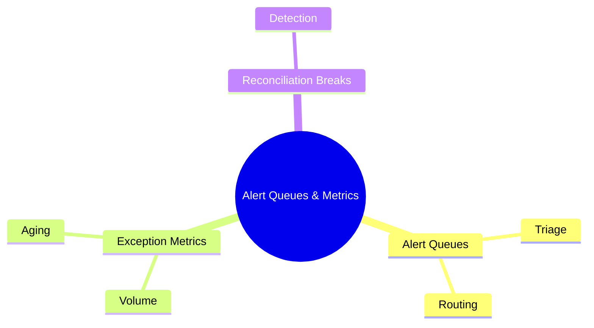
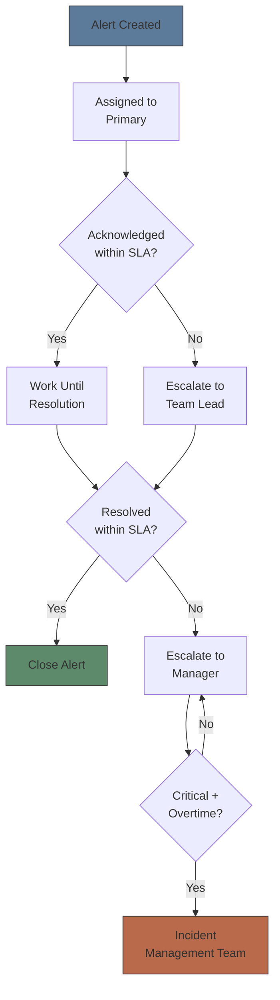
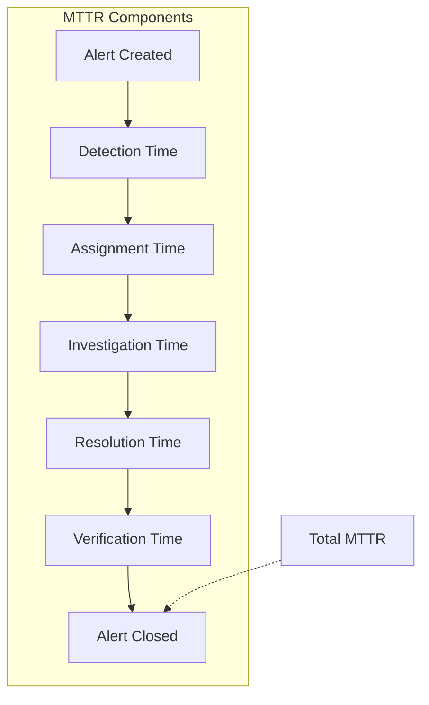
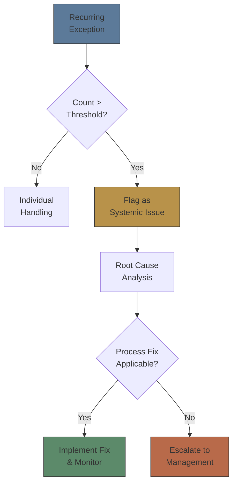
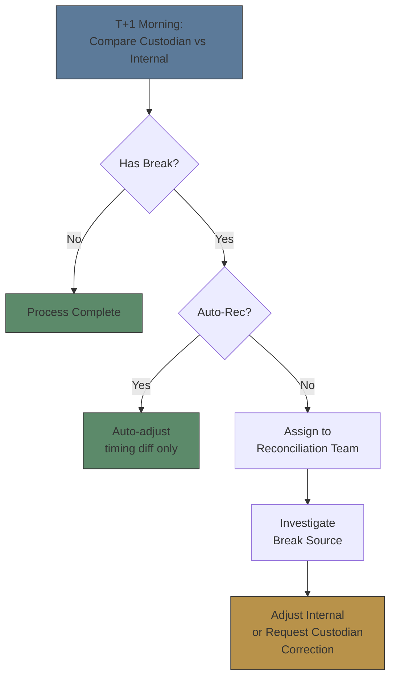

# Module 41: Alert Queues & Metrics

Estimated time: 2h



## Learning Objectives (aligned with course CILOs)
- Distinguish exception types across order lifecycle stages and their root causes — maps to CILO #1
- Identify trade break categories and resolution workflows — maps to CILO #2
- Master settlement fail mechanisms and remedial actions — maps to CILO #1
- Design alert queue severity levels and escalation rules — maps to CILO #3
- Calculate and interpret exception metrics to drive process improvement — maps to CILO #4
- Distinguish manual vs automated exception handling application scenarios — maps to CILO #5
- Apply alert fatigue management strategies — threshold tuning and noise control — maps to CILO #3
- Trace failed trade lifecycle from exception generation through resolution — maps to CILO #4

---

## Core Content

### 4. Alert Queues

**Alert Queue Structure:**

Exception management typically relies on alert queue systems to centralize, classify, and assign all abnormal events.

#### Severity Levels

| Level | Label | Definition | Response Time | Handler |
|-------|-------|-----------|--------------|---------|
| P0 | Critical | Trade cannot settle, monetary loss risk, regulatory violation | < 15 minutes | Team lead + escalation |
| P1 | Warning | Trade requires confirmation, exception interaction, process blocked | < 1 hour | Ops analyst |
| P2 | Info | Informational, system state change, non-urgent | < 24 hours | Auto-logged or scheduled |

> **Cloze**: The response time target for P0 (Critical) alerts is {< 15 minutes}, handled by {team lead + escalation}.

#### Routing Rules

- **By exception type:** CNS fail → settlement team; Trade break → trade support; Alert noise → ops review
- **By product class:** Equity exceptions → Equity desk; Fixed income → FI desk; Derivatives → Derivatives ops
- **By account:** High net worth client exceptions → Priority team
- **By time of day:** Intraday (real-time routing) vs Night batch (accumulated then routed)

> **Predict**: A CNS fail alert is routed to the trade support team instead of the settlement team. What happens?
>
> *Answer: It sits with the wrong handler, the acknowledgement SLA passes, and the fail ages — escalation and settlement costs accumulate. Routing must match exception type.*

#### Escalation Rules



> **Predict**: A P0 alert is not acknowledged within its 15-minute SLA. What happens?
>
> *Answer: It escalates to the team lead, then to the manager, and if critical and overtime, to the incident management team.*

#### Auto-Resolution

Certain low-risk exceptions can be auto-resolved without manual intervention:

| Exception Type | Auto Action | Conditions |
|---------------|------------|-----------|
| Symbology mapping error | Auto-correct and resubmit | Deterministic mapping |
| Duplicate ClOrdID | Generate unique ID and resubmit | Not a duplicate order |
| Minor price deviation | Auto-adjust to reference price | Deviation < threshold |
| Late allocation | Allocate to default account | Allocation rule exists |

> **Think**: Auto-resolution saves time, but when does automation increase risk instead?
>
> *Answer: When auto actions execute without sufficient validation. Example: symbology auto-correction with a corrupted mapping table = auto-propagating errors. Auto price adjustment if market conditions changed (gap open) may produce even more deviant prices. Automation should set confidence thresholds — below threshold, force manual review.*

### 5. Exception Metrics

**Key Performance Indicators:**

**MTTR (Mean Time to Resolve):**
- Definition: Average time from exception creation to resolution
- Calculation: Σ(resolution time - creation time) / total exceptions
- Targets: P0 < 30 min; P1 < 4 hrs; P2 < 24 hrs
- Trend tracking: Daily MTTR vs rolling 30-day average



**Volume Trends:**
- Daily/weekly/monthly exception volume
- By type: order rejects vs trade breaks vs settlement fails
- Spike analysis: correlation with events (market volatility, system upgrades, new product launch)

**Recurring Patterns:**
- Repeat exceptions from same account/product/counterparty
- Identify systemic issues (not independent events)
- RCA trigger conditions:
  - Same exception type > 3x/week
  - Same account causes > 5 exceptions/month
  - Same product has persistent settlement fails



### 6. Reconciliation Breaks

**Reconciliation Definition:** Comparing two or more data sources for consistency; discrepancies are reconciliation breaks.

#### Major Reconciliation Types

**Custody vs Internal:**
- Compare custodian position records vs broker internal system records
- Common break causes:
  - Trade record timing differences (trade date vs settlement date)
  - Corporate action not reflected correctly (dividend, stock split)
  - Fee/commission differences causing cash balance mismatch
  - Settlement fail not flagged in internal system

```text
Break Severity = |Custody Position - Internal Position| / Internal Position

< 1%    → Warning (automatic recheck)
1-5%    → Manual investigation
> 5%    → Critical (immediate escalation)
```

> **Predict**: Reconciliation finds custody vs internal position differ by 7%. What happens?
>
> *Answer: That exceeds the 5% critical threshold — immediate escalation, no auto-adjust.*

**Position Mismatch:**
- Quantity discrepancy
- Workflow: ① Line-by-line trade comparison → ② Check settlement status → ③ Confirm corporate action handling → ④ Correct discrepancy

**Cash Mismatch:**
- Cash balance discrepancy (including accruals)
- Common causes:
  - FX conversion rate difference
  - Fee/commission calculation difference
  - Interest/dividend accrual difference
  - Settlement cash flow timing difference



> **Think**: Why is internal position greater than custodian position more concerning than the reverse?
>
> *Answer: Internal > Custody (overstated position) means broker believes it holds securities it does not — may lead to sell-side settlement failure, unauthorized trading, or client claims. Understated (internal < custodian) means broker underestimates holdings — safer with a margin of safety at settlement. Overstated is the risk direction: selling what you don't have.*

---

## Spot the Mistake

MTTR report shows P1 exception average resolution time of 20 minutes, looks great. But audit finds 80% of P1 exceptions actually took 5 hours to begin processing.

**Why is this wrong?**

*Answer: MTTR mean is skewed by fast-resolution outliers. Correct approach: review median (unaffected by extremes) and P95 (shows worst case). If mean = 20min but P95 = 6h, most exceptions processed slowly but masked by a few quick closures.*
