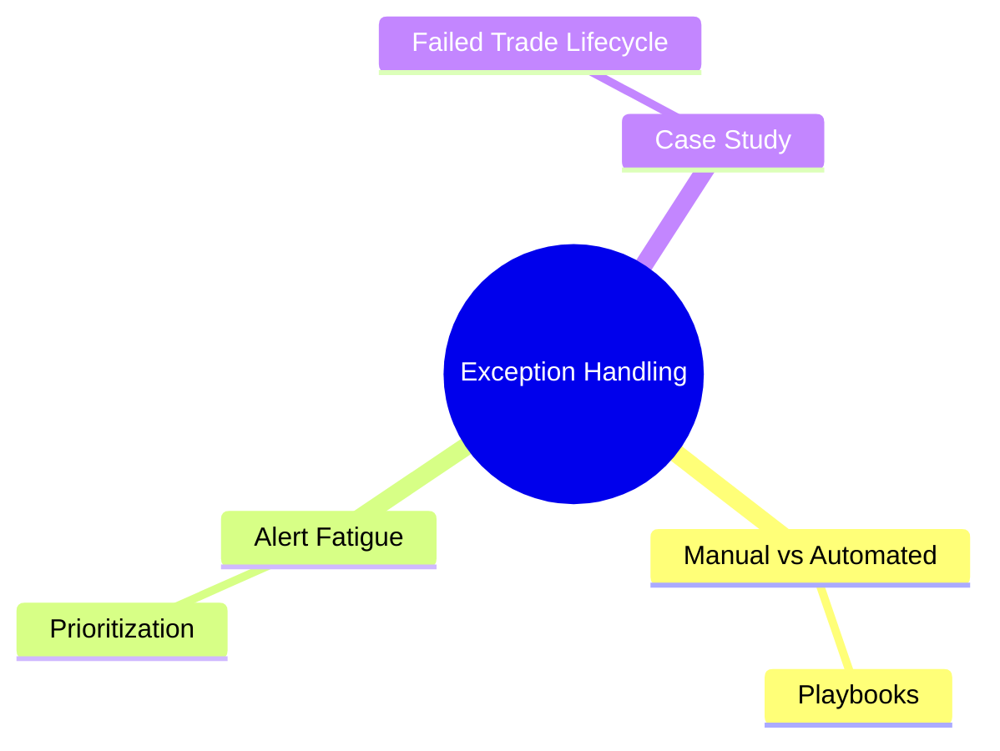
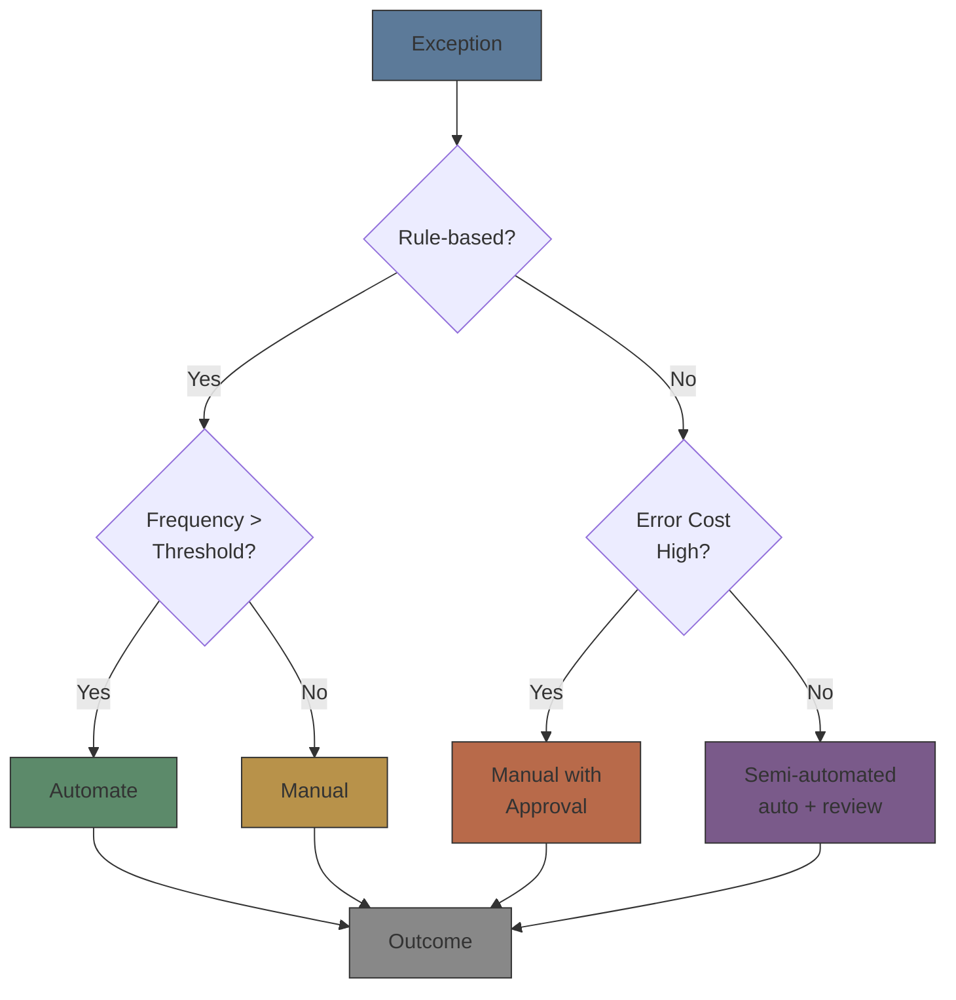

# Module 42: Exception Handling

Estimated time: 2h



## Learning Objectives (aligned with course CILOs)
- Distinguish exception types across order lifecycle stages and their root causes — maps to CILO #1
- Identify trade break categories and resolution workflows — maps to CILO #2
- Master settlement fail mechanisms and remedial actions — maps to CILO #1
- Design alert queue severity levels and escalation rules — maps to CILO #3
- Calculate and interpret exception metrics to drive process improvement — maps to CILO #4
- Distinguish manual vs automated exception handling application scenarios — maps to CILO #5
- Apply alert fatigue management strategies — threshold tuning and noise control — maps to CILO #3
- Trace failed trade lifecycle from exception generation through resolution — maps to CILO #4

---

## Core Content

### 7. Manual vs Automated Exception Handling

**Decision Framework:**

| Factor | Manual | Automated |
|--------|--------|-----------|
| Exception frequency | Low (< 5/day) | High (> 50/day) |
| Decision complexity | Requires judgment | Rules are clear |
| Error cost | High (auto-propagation risk) | Low (few errors tolerable) |
| Variability | Exception types change frequently | Exception types stable |
| Regulatory requirement | Human review/sign-off needed | Auto-processable |



**Automation Levels:**

| Level | Description | Example |
|-------|------------|---------|
| L0 | Fully manual | Disputed trade negotiation |
| L1 | Detection automation | System detects + human handles |
| L2 | Diagnosis automation | Detects + suggests cause + human decides |
| L3 | Routine decision automation | Low-risk exceptions auto-repaired |
| L4 | Full automation | No human intervention (high confidence) |

> **Predict**: A rule-based, low-risk exception occurs 200 times a day. What automation level applies?
>
> *Answer: L3 routine decision automation — rules clear, frequency high, error cost low → auto-repair with monitoring.*

**Manual Handling Risks:**
- **Latency risk:** Human processing slower than automation
- **Inconsistency:** Different handlers treat same exception type differently
- **Knowledge dependency:** Senior staff departure causes knowledge loss
- **Fatigue error:** High-volume repetitive exceptions degrade attention

### 8. Alert Fatigue

**Alert Fatigue Definition:** Excessive alerts cause personnel to ignore or delay processing truly important alerts.

#### Fatigue Causes

- **False positives:** Thresholds too sensitive
- **Duplicate alerts:** Same event triggers multiple times
- **Low significance alerts:** Events with no material impact
- **Unclear alert content:** Cannot immediately determine cause

> **Think**: A team receives 500 alerts daily: 450 info, 45 warning, 5 critical. Ops checks queue every hour. What happens?
>
> *Answer: Information overload. 450 info + 45 warning drown 5 critical alerts. Ops struggles to prioritize amid noise. Consequence: critical alert response time increases, may miss SLA. Solutions: ① Drastically reduce info alerts (only for critical state changes) ② Aggregate warnings into daily summary ③ Critical only as real-time notification.*

#### Noise Control Strategies

**Threshold Tuning:**
- Adjust trigger thresholds to reduce false positives
- Method: Percentile-based thresholds (P95, P99) using historical data
- Example: Price deviation alert from 1% to 3% — reduces false positives by 60%

> **Predict**: The price-deviation alert threshold is raised from 1% to 3%. What improves and what worsens?
>
> *Answer: False positives drop about 60%, but genuine 2-3% deviations stop alerting — missed true positives trade off against noise. Both FPR and miss rate must be watched together.*

```text
Alert Threshold = Baseline ± N × StdDev

Adjust N based on:
  - Too many false positives → Increase N
  - Missed true positives   → Decrease N
  - Target FPR < 5%         → N ≥ 1.96
```

**Deduplication:**
- Merge duplicate alerts for same event into single alert
- Based on: exception object (trade ID, order ID) + exception type
- Display: first trigger time, trigger count, latest time

> **Predict**: The same order fires the identical alert 10 times in a minute. After dedup is enabled, what does the queue show?
>
> *Answer: One merged alert — first trigger time, trigger count, and latest time — instead of ten duplicates.*

**Alert Aggregation:**
- Group related alerts into summary
- Example: 10 exceptions from same client → 1 alert: client overview
- Group by: account, product, counterparty

**Escalation Throttling:**
- Cool-off period between escalations
- Prevents same exception from continuously escalating

#### Optimization Workflow

```text
Step 1: Audit current alert volume by severity
Step 2: Calculate false positive rate (FPR) per alert type
Step 3: Tune thresholds — target FPR < 5% for critical alerts
Step 4: Implement deduplication rules
Step 5: Design aggregation summaries
Step 6: Monitor alert fatigue metrics (ack time, miss rate)
Step 7: Quarterly review and recalibrate
```

> **Cloze**: The first step in alert fatigue management is {auditing current alert volume by severity}, the second step is {calculating false positive rate per alert type}.

### 9. Case Study: Failed Trade Full Lifecycle

**Scenario:** Ops analyst discovers a CNS settlement fail for a $10M equity trade in the alert queue.

**Full Resolution Workflow:**

**Day T+2 (Settlement Date):**
```text
09:30 — Alert: CNS fail for Trade ID TK78432
         Fail reason: Seller short 50,000 shares
         
09:32 — Analyst acknowledges alert
         → Check position: Internal system shows short position
         
09:35 — Investigation:
         ① Original trade: Sold 50,000 XYZ @ $200.00
         ② Was locate done? Yes — locate record exists
         ③ Locate expired? Yes — locate was T+1, now T+2
         ④ Borrow coverage: No borrow arranged
         
09:45 — Action plan:
         ① Request security borrow from lending desk
         ② If borrow fails → Buy-in process
         ③ Notify client of potential buy-in cost
```

**Day T+3 (Settlement Date + 1):**
```text
10:00 — Borrow failed: No shares available
         → Initiate buy-in
         
10:15 — Send buy-in instruction to execution desk
         → Buy 50,000 XYZ @ market
         
10:30 — Execution at $205.00
         → Buy-in cost: 50,000 × ($205 - $200) = $250,000 loss
         → Client liable for buy-in cost per agreement
         
11:00 — Settlement instruction matched
         → CNS fail resolved
         
11:15 — Close alert: MTTR = 1h 45min
         → Log root cause: Locate management system did not check expiry
```

**Post-Mortem:**
```text
Root Cause:
  Locate management system performs locate at order entry (T+0)
  but does not monitor locate expiry at settlement (T+2)
  
Fix:
  ① Add T+1 locate refresh check
  ② Add T+2 settlement day auto-borrow trigger
  ③ Add CNS fail predictive alert (T+1 early warning)
  
Process Change:
  Locate confirmation now includes expiry datetime
  Settlement team receives daily locate expiry report
```

> **Think**: MTTR in this case is 1h 45min. If this processing time is normal but market enters high volatility, buy-in price may deviate further. How to reduce processing time?
>
> *Answer: ① T+1 early warning system (predict CNS fail before it happens): monitor pending settlement positions, flag when position difference > 0. ② Auto-borrow on fail trigger: send borrow request to lending desk without waiting for analyst confirmation. ③ Pre-arranged buy-in threshold: set auto buy-in price deviation range, avoiding case-by-case approval. Target: MTTR < 30 minutes.*

---

## Concept Summary

| Concept | Key Points |
|---------|-----------|
| Order lifecycle exceptions | New order reject, cancel/replace reject, cancel reject — each stage has distinct reason codes and workflows |
| Trade breaks | Price outside range, duplicate execution, wrong side, unauthorized symbol — found via post-trade validation |
| Settlement fails | CNS fail, counterparty fail, DVP fail — settlement date delivery failure, each type has specific remediation |
| Alert queues | P0/P1/P2 levels, routing rules, escalation mechanism, auto-resolution |
| Exception metrics | MTTR (mean/median/P95), volume trends, recurring patterns for process improvement |
| Reconciliation breaks | Custody vs internal, position mismatch, cash mismatch — daily comparison required |
| Manual vs automated | Decision based on frequency, rule clarity, error cost, variability |
| Alert fatigue | False positives, duplicates, noise → requires threshold tuning, dedup, aggregation, throttling |

---

## Spot the Mistake

Broker decides to automate all P2 exceptions because "P2 is low risk, automation won't cause problems."

**Why is this wrong?**

*Answer: P2 is severity classification, not "automation suitability" classification. Some P2 exceptions (e.g., symbol mapping warning) suit automation, but others (e.g., allocation mismatch > threshold) need human judgment. Automation decision should be based on: rule clarity, error frequency, error cost — not severity level alone.*

---

## Feynman Teaching Prompt

Explain the following concepts to a junior ops analyst in your own words. Goal: enable them to apply in daily work:

1. Why do settlement fails need three separate handling categories — CNS, counterparty, DVP?

2. How do you decide whether an exception should be automated or handled manually?

3. If your team receives 1000 alerts daily but only handles 10 critical, how would you optimize step by step?

4. Same client has price deviation trade breaks 3 days in a row — independent exceptions or systemic issue? How to determine?

5. What practical impact does the difference between median MTTR and mean MTTR have on management decisions?

> *Self-check: Can explain in own words, give examples, identify common pitfalls.*
