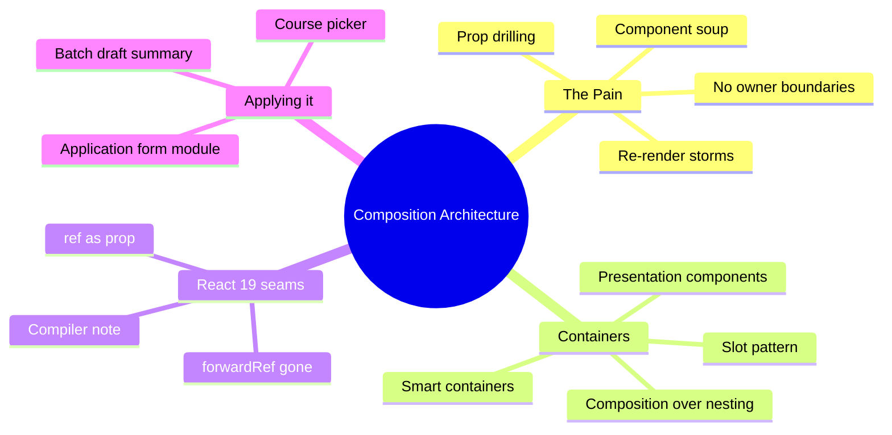
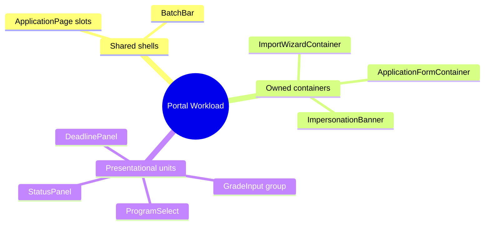

# Module 01: Composition Architecture

Est. study time: 1.2h
Language: en
Description: Divide the university application UI into composable containers that survive enterprise growth.

## Knowledge Map



---

## Learning Objectives (maps to course CILOs)
- Decide container vs component boundaries from data ownership, not aesthetics — serves CILO 1
- Compose pages as slots that never know their children's internals — serves CILO 1
- Recognize prop drilling and re-render symptoms before refactor — serves CILO 1
- Apply React 19 ref-as-prop and composition seams safely — serves CILO 1

---

## Meet Aissa

Aissa is the senior frontend engineer anchoring this course's running case study. She has 7 years of React experience, owns the university application portal at a mid-size ed-tech company, and reports to a tech lead who reviews her PRs. Her team has grown from 2 to 9 in the last year, and the patterns in this course come from what she wishes she had known on day one.

Aissa is not a beginner. She has shipped production React since 2018, debugged enough class-component legacy to have opinions about `componentDidUpdate`, and is comfortable with hooks, context, and the modern build pipeline. What she struggles with is **scale**: patterns that work for a 2-person team break under a 9-person team, and the official React docs don't cover the multi-team, multi-app, multi-year decisions she faces.

When you see Aissa in a lesson, you'll see her applying the pattern — sometimes correctly, sometimes making the trade-off the lesson is about to warn against. Her role is to make the pattern concrete, not to be a model to copy uncritically. If you find yourself disagreeing with Aissa's choice, that's the lesson working.

Aissa's product: a university application portal. Students fill out one application and apply to multiple programs. Aissa's concerns: form complexity, network reliability, accessibility, i18n, performance, design system constraints, and the simple fact that she can't rewrite the whole app every quarter.

Every example, every "in the wild" note, every code block that mentions a feature — assume it's part of Aissa's portal unless the lesson says otherwise.

---

## Real-World Example

Aissa starts a university application portal. Two weeks in, the `ApplicationForm` component is 800 lines: it renders inputs, fetches programs, holds draft state, calculates remaining spots, and renders the summary panel. Every feature request lands in this one file. A change to the "save draft" button forces a full re-render of the entire form. The team calls the file "the god component" and is afraid to touch it.

Why did this happen? The component grew because nobody asked a harder question first: who owns what? The god component mixes data-owning logic, layout, and pure display under one roof, so every concern shares every render.

> **Think**: Why did the single-component approach feel faster at first?
>
> *Answer: It was. One file, one mental model, nothing to wire. The cost compounds only after ~500 lines and 3+ owners. Enterprise work pays the cost daily, so the boundary investment is worth it early.*

---

## Core Content

### Section 1: The Blob and Its Symptoms

An enterprise screen is rarely one concern. The application form above has at least five:

1. Fetch and validate program data (server data ownership)
2. Read and write the draft (form state ownership)
3. Arrange sections on screen (layout)
4. Render fields and statuses (display)
5. Emit save/submit events (behavior)

In the god component, all five re-render whenever any one changes, because one unit of React state change re-renders the whole function component. Symptoms you should recognize before you refactor:

- A keystroke in one field re-renders unrelated sections
- Tests must mount the whole form to assert one label
- "Just add a prop" is the standard fix, and the prop count keeps climbing

> **Think**: You add one counter to the header and the entire application form re-renders. Is that always bad, and how do you know?
>
> *Answer: Not always. Re-rendering is cheap if the tree is small and children are memoized. It is bad when the subtree is large or has heavy work—virtual lists, remote validation calls, big JSON diffs. Measure, don't assume; but component boundaries make the problem controllable rather than structural.*

> **Cloze**: "When one feature grows so large it mixes data ownership, layout, display, and behavior, it's called a {god component}, and every state change re-renders the whole unit."
>
> *Answer: god component*

**Rule of thumb formula:**

```text
boundary_needed = (files touched per feature) + (independent owners) + (unrelated re-render blast radius)
```

When any of the three terms is large, you need a container boundary.

> **Predict**: The team adds server-side search to the program list while the form is open. What happens in the god component?
>
> *Answer: Search results state lives in the same component, so every keystroke in the search box re-renders the typed-but-unsaved draft fields, resetting cursor positions and firing remote validation. Two unrelated features are now coupled through one render path.*

### Section 2: Smart Container, Presentational Children

The fix is to split by data ownership, not by visual chunk. A **smart container** owns state, data fetching, and event handlers. **Presentational children** receive props and render. This split is the oldest enterprise composition pattern and still the most reliable.

```tsx
// ApplicationFormContainer — owns state, fetch, submit
export function ApplicationFormContainer() {
  const draft = useDraftStore(s => s.draft);
  const updateField = useDraftStore(s => s.updateField);
  const submit = useSubmitHandler();

  return (
    <ApplicationFormLayout
      draft={draft}
      onChange={updateField}
      onSubmit={submit.apply}
      validation={submit.validation}
    />
  );
}

// ApplicationFormLayout — presentational, owns layout only
export function ApplicationFormLayout({ draft, onChange, validation }: Props) {
  return (
    <div className="form-grid">
      <ProgramSelect value={draft.programId} onChange={onChange('programId')} />
      <GradeSection grades={draft.grades} onChange={onChange('grades')} />
      <StatusPanel validation={validation} />
    </div>
  );
}
```

The container knows about stores and servers; the child knows nothing beyond props. That single rule kills the god component.

> **Think**: The container still re-renders on every draft keystroke. Isn't that just moving the god component up?
>
> *Answer: Partly, but the blast radius shrank: `GradeSection` and `ProgramSelect` can be memoized, and the container does no heavy work. The display components own their subtree renders. Moving the god component up but isolating the children is the actual point.*

> **Cloze**: "A {smart container} owns state, data fetching, and events, while presentational children receive data through props and render it."
>
> *Answer: smart container*

### Section 3: Composition Over Nesting — Slots

A second, newer pattern: prefer **composition** (children, slots, render props) over deep generic nesting. An enterprise page is often a shell that places sections in a layout and knows nothing about their internals.

```tsx
<ApplicationPage
  header={<ProgressHeader currentStep={3} />}
  main={<ApplicationFormContainer />}
  aside={<DeadlinePanel deadline={deadline} />}
  footer={<BatchSummaryLink count={batchCount} />}
/>
```

`ApplicationPage` owns the grid seating only. The sections are injected as **slots**. Why this beats nesting a giant tree of configurable `Panel`s:

- Each slot is independently tested and evolved
- The page doesn't render what it doesn't need
- Replacing a section (new deadline panel design) is a one-line change at the call site

> **Think**: When would slots be overkill versus plain nested components?
>
> *Answer: When the shell is stable and sections never change independently—a fixed admin form rarely needs slots. Slots pay off when layout is shared across visibly different regions (dashboards, multi-role portals, pages with optional panels).*

> **Predict**: Marketing swaps the aside panel for a new urgency block. Under slot composition, what is the blast radius?
>
> *Answer: One file changes—the page call site swaps one JSX element. The page layout and the rest of the sections re-render on the swap, but no child implementation changes.*

### Section 4: React 19 Seams for Composition

React 19 changed two seams relevant to composition:

1. **ref as a normal prop**: class components are gone as a reason for `forwardRef`. Function components can receive `ref` in props directly.
2. **The compiler**: automatic memoization means you stop hand-adding `React.memo` as a first instinct. The compiler is analyzed in depth in `advanced-react-19`; here we note it changes *why* boundaries matter — you compose for ownership, not for micro-optimization.

```tsx
// React 19: no forwardRef wrapper needed
export function ProgramSelect({ ref, options, ...rest }: Props & { ref?: Ref<HTMLSelectElement> }) {
  return <select ref={ref} {...rest}>{options /* ... */}</select>;
}
```

> **Think**: If the compiler memoizes automatically, do container/child boundaries still matter?
>
> *Answer: Yes—but the reason shifts. Before the compiler, boundaries optimized rending; with the compiler, boundaries describe ownership and testability. State explosion and prop soup are architecture problems, not rendering problems, and no compiler fixes those.*

> **Spot the Mistake**: A team "fixes" the god component by memoizing the largest child with `React.memo` and calls it done.
>
> What's wrong?
>
> *Answer: Memoization reduces re-renders but the god component still owns five concerns in one file. Tests still mount the world, features still collide, and the memo breaks for any inline prop (new callback each render). Memory optimization is not an ownership fix.*

---

### Section 3.5: Application in the University Portal

Map the pattern onto the portal pieces you'll build across this course:



Each later module opens with a container that owns its problem. `Batch Update Engine` (m14) will own draft state; `Tracker Table` (m10) will own pagination and URL state; `Impersonation Flow` (m6) will own the actor session. Composition is the invariant across all of them.

> **Think**: The `BatchSummaryLink` in the shell slot needs the count of drafts. Who fetches it — the shell or a container?
>
> *Answer: A small container like `BatchSummaryLinkContainer` fetches its own count. The shell only positions it. Slots free the shell from knowing data sources, which keeps layout components trivially testable.*

---

### Why This Matters

Every enterprise course topic in this syllabus—session, modals, dependent fields, batch updates, races—assumes you can place code where it belongs. Composition is the load-bearing wall; the rest hangs off it. Get it wrong and each later pattern lands in a god component and dies.

---

## Key Takeaways
- Split by data ownership: smart containers own state/fetch/events; presentational children render props
- A god component shows itself through cross-feature re-renders, prop soup, and heavy test mounting
- Compose shells with slots (children/passed JSX) so layout knows nothing about section internals
- Composition judgments first serve ownership and testability; the React compiler changes the rendering reason, not the ownership reason
- React 19 delivers `ref` as a prop — refresh your `forwardRef` habits

---

## Common Misconception

*"More components = better architecture."* Wrong. Splitting a god component into 20 tiny files without ownership rules just moves the soup into a forest. The value is in the *rule*: one owner per concern, presentational children, explicit slots. Same concerns, ordered.

---

## Spot the Mistake

```tsx
export function ApplicationPage() {
  const draft = useDraftStore(s => s.draft);
  const [programs, setPrograms] = useState([]);
  // ... fetch, draft edits, submit, validation rendering all here
  return <div>{/* five concerns, one component */}</div>;
}
```

What's wrong?

*Answer: `ApplicationPage` is a god component with a friendly name. It owns draft state, fetches programs, edits, validates, and submits. Move state+fetch into containers; keep `ApplicationPage` a slot shell.*

---

## Feynman Explain
(Tell a friend how one screen divides into boxes that each own one job: the manager box holds the data and tells the worker boxes what to show. If a worker needs new info, the manager fetches it; workers never fetch on their own. Simple words, no jargon.)

---

## Reframe
(Judge: is container/presentational always right? Consider drag-and-drop editors, high-frequency graphs, form libraries that blend logic and display. When does the boundary blur and how do you decide then?)

---

## Drill
Take the quiz. MCQs test different angles — recall, application, scenario.

Run: `learn.sh quiz enterprise-react-ui-patterns 01-composition-architecture`