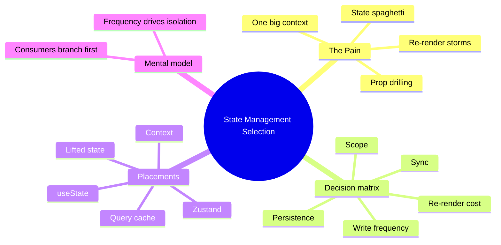
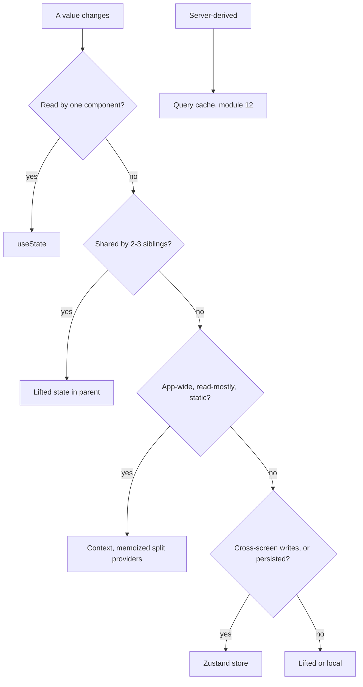

# Module 02: State Management Selection

Est. study time: 1.3h
Language: en
Description: Pick where state lives from measurable conditions, not habit: useState, lifted, context, zustand, or the Query cache.

## Knowledge Map



---

## Learning Objectives (maps to course CILOs)
- Choose a state placement from five measurable conditions, not vibes — serves CILO 2
- Predict the failure of one big context, and know when the re-render tax is invisible — serves CILO 2
- Build a persisted zustand batch draft with selector-safe reads, and a useState local flag — serves CILO 2
- Apply the mental model "state lives where its consumers branch first; frequency drives isolation" to real screens — serves CILO 2

---

## Real-World Example

Aissa's portal lets a student apply to several courses at once; each course fills its own draft. State scatters fast: `useState` in three components, a `useAuth` context, and an `ApplicationContext` someone added "to stop prop drilling." Draft data, the selected program, validation errors, and modal-open flags now live in different drawers with no map. A keystroke in the essay field re-renders the header, the deadline panel, and two modals that are not open. Fixing the "save draft" button breaks the summary panel, and nobody can say where any value comes from.

The failure is unexamined state: every placement was chosen by habit — "context is for global data" — not by what each value actually needs.

> **Think**: Why did the team reach for context for everything?
>
> *Answer: Context is the only "global" primitive React gives for free, and it removes one level of prop drilling. But it couples every consumer to a single re-render path, so the fix for one screen becomes the re-render tax on every screen. Convenience that brands itself as architecture.*

---

## Core Content

### Section 1: The Pain — State Spaghetti

For each state value, ask three questions before touching code: who writes it, who reads it, how often? In the unexamined portal:

1. `programId` lives in `useState` on the page, threaded through four components as a prop
2. Draft text lives in a `DraftContext` — every keystroke re-renders the whole provider tree
3. Validation errors live in another `useState`, duplicated against what the server said
4. Modal-open flags live inside each modal component, so two modals can be "open" at once

Same three symptoms as composition (m1): unrelated re-renders, prop drilling, and tests that mount the world to assert one label. The portal is not broken yet — it is one *undone* decision away from being broken.

> **Cloze**: "When draft data, selected program, validation errors, and modal flags scatter across {useState} and context with no placement rule, that's state spaghetti."
>
> *Answer: useState*

### Section 2: The Naive Fix — One Big Context

The naive fix: one `PortalContext` at the app root holding every mutable value.

```tsx
const PortalContext = createContext<PortalState | null>(null);

export function PortalProvider({ children }: { children: ReactNode }) {
  const [drafts, setDrafts] = useState({});
  const [programId, setProgramId] = useState<string | null>(null);
  const [errors, setErrors] = useState({});

  return (
    <PortalContext.Provider value={{ drafts, programId, errors }}>
      {children}
    </PortalContext.Provider>
  );
}
```

Every keystroke calls `setDrafts`, so React creates a brand-new provider value object `{ drafts, programId, errors }`. Every consumer of `PortalContext` re-renders — even the `ProgramSelect` that reads only `programId` and never looks at drafts. Context offers no per-slice subscription: the only isolation mechanism it ships is "split into more providers," which recreates the spaghetti you were fixing.

What the team reports next: "the app is slow and I don't know why." They are not wrong.

> **Think**: Is a context that re-renders all consumers always wrong?
>
> *Answer: No. If the value changes rarely (theme, static config) and consumers are cheap, the tax is invisible — a few milliseconds nobody measures. Context fails when the value changes at typing frequency and consumers are expensive. So frequency is a decision condition, not an afterthought.*

### Section 3: The Solution — A Decision Matrix, Not a Gut Feeling

A value's home is decided by conditions. Five questions, in priority order:

1. **Scope** — how wide is the readership (single component, siblings, a feature, the whole app)?
2. **Change frequency** — rare (login/logout), mid (a few times a minute), or hot (per keystroke)?
3. **Persistence** — must it survive a reload or re-login?
4. **Sync** — must it mirror the server, the URL, or another store?
5. **Re-render cost** — what does re-rendering every consumer actually cost?



The mapping, made concrete:

- **`useState`** → local, low-frequency, ephemeral. The select's open flag, one input, a toggle.
- **Lifted state** → 2–3 siblings under one parent. Keep the "most common ancestor" rule.
- **Context** → app/feature-wide, read-mostly, stable value. Memoize it, split providers by change rate.
- **Zustand** → app-level high-frequency writes, cross-screen reads, persistence needed.
- **TanStack Query cache** → server-derived data, stale-while-revalidate. Module 12 owns it; do not put fetched JSON in zustand. Server data has a different boss: the network.

> **Predict**: Marketing adds a live "spots remaining" counter to the header, fetched from the server. A teammate "just puts it in the zustand draft store" for convenience. What breaks?
>
> *Answer: Now every high-frequency draft keystroke re-renders consumers that only cares about spots, and the spot value goes stale exactly when drafts churn. Server-derived data does not belong in a hand-rolled store — it needs the cache layer's invalidation and staleness rules. Wrong placement, wrong lifecycle.*

### Section 4: Code — A Zustand Batch Draft, a useState Flag, a Split Context

**The batch draft** is written at typing frequency, read by the batch bar and summary panel on other routes, and must survive a reload. All four conditions push to zustand with the `persist` middleware:

```tsx
import { create } from 'zustand';
import { persist } from 'zustand/middleware';

interface DraftState {
  drafts: Record<string, Record<string, string>>;
  updateField: (programId: string, field: string, value: string) => void;
}

export const useBatchDraft = create<DraftState>()(
  persist(
    (set) => ({
      drafts: {},
      updateField: (programId, field, value) =>
        set((s) => ({
          drafts: {
            ...s.drafts,
            [programId]: { ...s.drafts[programId], [field]: value },
          },
        })),
    }),
    { name: 'batch-draft-v1' },
  ),
);
```

`persist` writes the slice to localStorage under `batch-draft-v1` and rehydrates on boot — reload survival with one line. The component that uses it subscribes to a slice, not the whole store:

```tsx
const programName = useBatchDraft((s) => s.drafts[programId]?.name);
```

**The dropdown's open flag** is read by one component and dies on unmount. `useState`; nothing else:

```tsx
export function ProgramSelect({ options, value, onChange }: Props) {
  const [open, setOpen] = useState(false);
  return (
    <div suppressHydrationWarning>
      <button aria-expanded={open} onClick={() => setOpen(!open)} aria-haspopup="listbox">
        {value}
      </button>
      {open && (
        <ul role="listbox">
          {options.map((o) => (
            <li key={o.id} role="option" onClick={() => { onChange(o.id); setOpen(false); }}>
              {o.name}
            </li>
          ))}
        </ul>
      )}
    </div>
  );
}
```

**The user profile** is read in headers and footers, changes only at login/logout, and its consumers are cheap — the read-mostly case. Context, but split and memoized so a profile update re-renders only profile consumers:

```tsx
const ProfileContext = createContext<UserProfile | null>(null);

export function ProfileProvider({ profile, children }: Props) {
  const value = useMemo(() => profile, [profile]);
  return <ProfileContext.Provider value={value}>{children}</ProfileContext.Provider>;
}
```

> **Think**: Why not put the profile in zustand "for consistency"?
>
> *Answer: Consistency without conditions is how spaghetti returns. Profile writes are rare, so context's whole-tree re-render is a rounding error. Zustand's subscription indirection buys nothing when nobody needs per-slice isolation on a value that changes twice a day. Conditions, then tool.*

**Selector pitfall** — the one bug that defeats all of the above. Selectors must return stable references:

```tsx
const count = useBatchDraft((s) => Object.keys(s.drafts).length);      // primitive — fine

const draft = useBatchDraft((s) => ({ ...s.drafts[programId] }));      // NEW OBJECT every snapshot — bad
const same  = useBatchDraft((s) => s.drafts[programId]);               // stable stored reference — fine
```

The spread selector builds a new object on every store change. Zustand's default equality check (`Object.is`) sees a different reference, so the component re-renders on *any* keystroke in *any* draft — the storm you fled in context, re-imported through the selector. Select primitives, select the stable stored slice, or use `useShallow` when you must pick multiple fields:

```tsx
import { useShallow } from 'zustand/react/shallow';

const slice = useBatchDraft(
  useShallow((s) => ({ name: s.drafts[programId]?.name, cohortId: s.drafts[programId]?.cohortId })),
);
```

> **Predict**: A teammate "improves" the summary panel with `useBatchDraft((s) => ({ ...s.drafts[programId] }))` and the panel flickers on every keystroke in every course draft. Why?
>
> *Answer: Selector creates a new object each snapshot → `Object.is` fails → component subscribes to "everything". The fix is identity discipline, not more memoization: select the primitive field, or return the stable stored reference, or `useShallow` for multi-field reads.*

### Section 5: [State Decision] — Four Real Portal Fields

Walk four real fields through the matrix, conditions → home:

1. **Program select open/close** → `useState`. One consumer, ephemeral, dies on unmount. Scope=1, freq=rare, persist=no → any other placement is ceremony.
2. **Unsaved batch draft across screens** → zustand + `persist`. Scope=app, freq=typing, persist=reload, sync=read on other routes → the four-condition sweep has exactly one answer.
3. **User profile** → context (memorized, split). Scope=app-wide, freq=login/logout only, consumers cheap → whole-tree re-render tax ≈ 0.
4. **Program options (catalog)** → Query cache (m12). Server-derived, must match server's staleness rules → not a client store at all.

Same procedure every time: conditions first, tool second. This beat returns in every later module (m10 pagination, m14 batch engine, m17 race guards) and each maps its own value through the same five questions.

### Section 6: Mental Model — Consumers Branch First, Frequency Drives Isolation

**"State lives where its consumers branch first; frequency drives isolation."**

- *Consumers branch first*: place the value at the first fork in the consumer graph. One consumer → the component. Siblings → the parent. App-wide → a global store. The readership decides the floor; the write frequency decides the ceiling.
- *Frequency drives isolation*: the hotter the value, the more you isolate subscribers from everything else. Context isolates nothing (all consumers of a provider re-render per change). Zustand isolates per slice (only subscribers whose selected slice changed re-render). Pick isolation that matches heat.

| Tool | Scope | Change freq | Persist | Sync | Re-render behavior | Pick when |
|------|-------|-------------|---------|------|--------------------|-----------|
| `useState` | 1 component | low | no | none | owner only | local ephemeral: open flag, single input |
| Lifted state | 2–3 siblings | low–mid | no | via props | parent subtree | siblings share a value, no app reach |
| Context | feature/app | rare, read-mostly | no | provider value | every consumer per change | static config, theme, profile |
| Zustand | app | high (typing) | via `persist` | any slice | subscribed slice only | cross-screen drafts, hot writes, reload survival |
| Query cache | app (server) | server-driven | re-fetch | server = truth | selected-data (m12) | program list, availability, any API data |

> **Cloze**: "The mental model: state lives where its consumers {branch} first, and frequency drives isolation."
>
> *Answer: branch*

> **Spot the Mistake**: "Context and zustand are basically the same thing — zustand is just context with prettier syntax."
>
> What's wrong?
>
> *Answer: They differ on the metric that matters: subscription isolation. Context re-renders every consumer when a provider value changes. Zustand re-renders only components whose selected slice changed. That difference is exactly why frequency is the deciding condition, and syntax is not an architectural argument.*

### Section 7: Verify — Tests Around Store-Backed Components

State placement changes *how* you test. A `useState`-backed component is tested by rendering it and acting through the DOM. A store-backed component is tested by resetting the store to a known state, acting through the UI, and asserting on the DOM — you never mock the store, you start it.

```tsx
// BatchSummary test: typing on one screen appears on another (cross-screen proof)
beforeEach(() => useBatchDraft.setState({ drafts: {} }));

it('shows a keystroke from the program screen on the summary screen', async () => {
  const user = userEvent.setup();
  render(<BatchSummary />);
  render(<ProgramScreen />); // separate "route", same store

  await user.type(screen.getByLabelText('Personal statement'), 'physics');

  expect(await screen.findByText(/physics/)).toBeInTheDocument();
  expect(screen.getByText('Draft saved locally')).toBeInTheDocument();
});
```

Two renders, two screens, one store — the cross-screen property is proven by the store, not drilled through props. The full technique lives in `advanced-react-testing` and m3; the contract you honor here: **components read state through real hooks; tests drive behavior, not implementation.**

> **Think**: Should the test assert that `updateField` was called, or that the summary's text changed?
>
> *Answer: That the summary's text changed — observable behavior. Asserting the store action is implementation detail that survives no refactor. Behavior-first is the m3 discipline applied to state.*

### Section 8: Variant — React 19, External Stores, and the Server Cache

React 19's `useSyncExternalStore` is the primitive zustand builds on: it lets React subscribe to an external store and read it without tearing or missed updates. You almost never call it directly — `zustand-state-management` covers its mechanics, the `persist` middleware, and `useShallow` in depth; today, understand it as the substrate underneath zustand's selectors.

**Zustand vs Context + reducer** (the Redux-style instinct): a reducer centralizes *writes* but still broadcasts every change through a single provider value. Same whole-tree re-render; you added ceremony without adding isolation. Zustand removes the boilerplate because the store is the subscription boundary — slices, not provider trees, decide who re-renders.

The **Query cache is a different category**, not a fourth placement for the same data: server-derived state belongs to TanStack Query (m12), where staleness, retries, and refetch are handled by a system built for the network. The React Compiler from `advanced-react-19` auto-memoizes renders, which narrows re-render *cost* — but it does not change store topology. No compiler decides where state lives; scale of consumers and heat of writes do.

---

### Why This Matters

Every later module assumes state sits where it is needed: m7's modal-open flags, m10's URL-backed pagination, m14's batch engine, m17's race guards. Decide each home by conditions and the patterns compose cleanly. Decide by habit and every module re-fights the same re-render storm in a new costume. This is the cheapest decision in the course with the widest blast radius — get it right once, and the rest of the syllabus stays boring.

---

## Key Takeaways
- Decide placement from five conditions: scope, write frequency, persistence, sync, re-render cost
- One big context provider re-renders every consumer per value change — invisible for static reads, fatal at typing frequency
- Zustand earns its place for cross-screen, high-frequency writes with persistence; `useState` owns local ephemeral state
- Context belongs to app-wide, mostly-read, stable values; the Query cache owns server data (m12), never zustand
- Selectors must return stable references — a new object in a selector re-renders on every store change
- State placement changes testing: reset the store, drive the UI, assert on DOM

---

## Common Misconception

*"Context is the global state solution."* Wrong. Context is dependency injection with a per-change re-render tax. Excellent for static config and read-mostly profile data; the wrong tool whenever a value changes at typing frequency across many consumers. The tax is the product feature you did not order.

---

## Spot the Mistake

```tsx
const AppContext = createContext(null);

export function AppProvider({ children }) {
  const [drafts, setDrafts] = useState({});
  const [page, setPage] = useState('editor');
  return (
    <AppContext.Provider value={{ drafts, page, setDrafts, setPage }}>
      {children}
    </AppContext.Provider>
  );
}
```

What's wrong?

*Answer: The inline object `{ drafts, page, ... }` is a new reference every render, so consumers re-render even when nothing changed, plus `page` and `drafts` share one provider value → changing page re-renders draft consumers and vice versa. Drafts are hot, page is mid — they belong in separate contexts (split by change rate) or drafts move to zustand with slice selectors.*

---

## Feynman Explain
(Tell a friend: state is like a notebook. A note you alone use lives in your pocket — `useState`. You and one teammate both need it — pin it on the shared table — lifted state. Everyone reads it and it rarely changes — hang it on the wall — context. Many people edit it, fast, from different rooms, and it must survive the lights going out — a locked filing cabinet — zustand. The more people edit a thing, and the more often, the more it needs its own cabinet with its own locks.)

---

## Reframe
(Judge by counterargument: is zustand always right once frequency rises? A small app, one screen, a team that already knows Context+reducer (m5) — the isolation is a feature you spend a dependency to buy. When does context's honest simplicity beat zustand's isolation? Weigh "works today with zero deps" against "the re-render tax grows as the app grows." The matrix does not always answer "zustand".)

---

## Drill
Take the quiz. MCQs test different angles — recall, application, comparison, scenario.

Run: `learn.sh quiz enterprise-react-ui-patterns 02-state-management-selection`