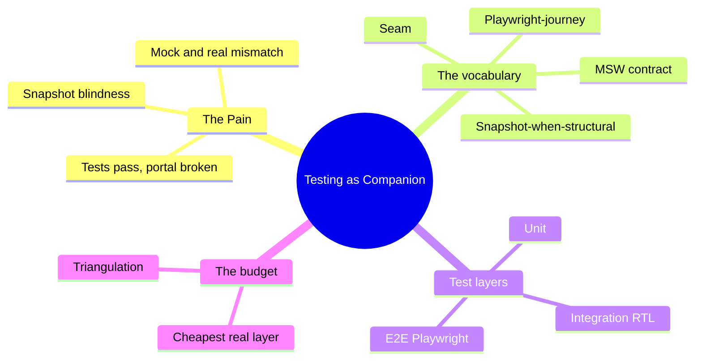
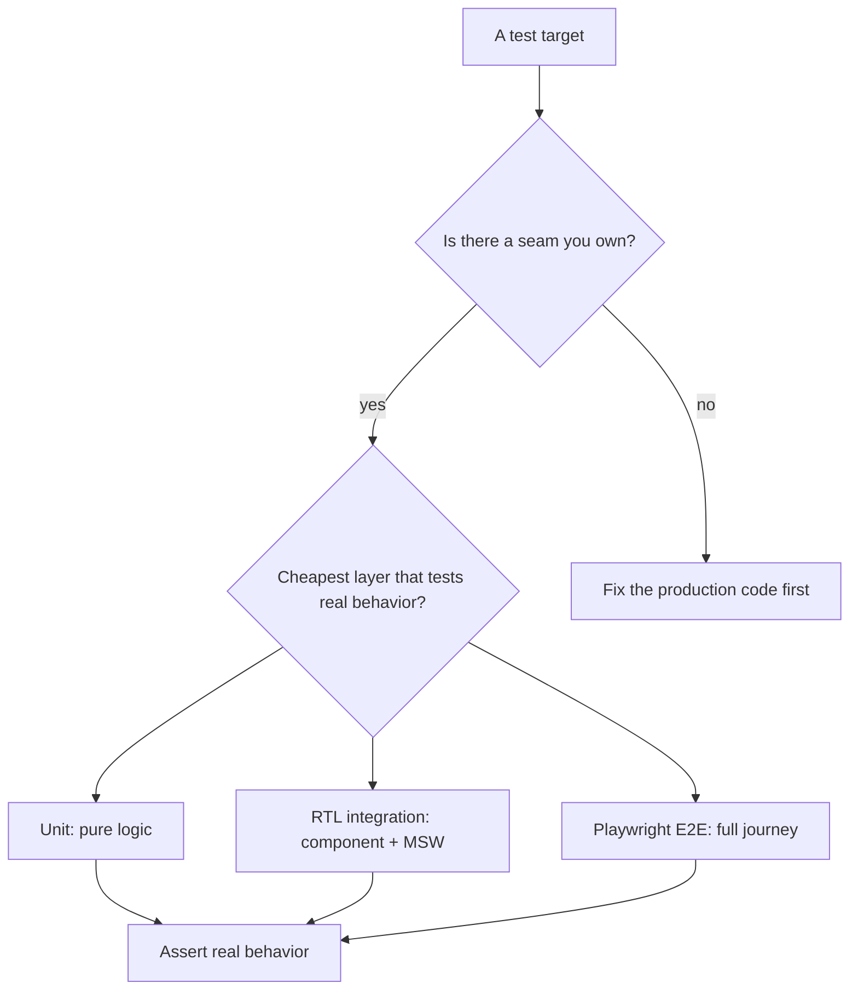

# Module 03: Testing as a Companion

Est. study time: 1.2h
Language: en
Description: Make tests a confidence source you can trace flat, not a checkbox ritual — seams, MSW contracts, structural snapshots, and Playwright journeys with the right budget.

## Knowledge Map



---

## Learning Objectives (maps to course CILOs)
- Define the seam you own, mock the seam you don't, and trace any test back to one — serves CILO 3
- Apply the four terms later modules cite: seam, MSW contract, snapshot-when-structural, Playwright-journey — serves CILO 3
- Choose unit / integration / E2E as a budget, not a ladder, with the triangulation rule — serves CILO 3
- Build a userEvent-driven RTL test over an MSW handler and a compact Playwright smoke journey — serves CILO 3

---

## Real-World Example

The portal ships. 312 tests pass. The summary panel renders blank for every real applicant, the deadline tab is invisible, and the program search shows nothing — while CI was green the whole sprint.

What broke: the `ProgramSelect` test mocked a fetch adapter with hard-coded array data. The real `GET /api/programs` returns `{ results: [...] }` with pagination. The seams never met — the mock and the real network diverge, and every test stands on the mock side, blind to the contract. On top of that, the team snapshotted the tracker table, so spurious timestamp diffs failed CI twice a week, which taught the team to press "update snapshot" without reading. High confidence, pointed at the wrong things.

> **Think**: 312 green tests and a broken portal — where is the failure located?
>
> *Answer: Not in the code — in the test's relationship to the code. The tests mock a seam that does not match the real seam, so they pass against a fiction. Confidence that points the wrong way is worse than honesty about not knowing.*

---

## Core Content

### Section 1: The Pain — High Confidence About Wrong Things

The portal's failure was not missing tests. It was tests that pass while the real system breaks, for three reasons:

1. **Seam mismatch** — the mock and the real boundary drift apart (fake adapter vs real `fetch`, fake clock vs real timer)
2. **Snapshot blindness** — tests assert *captured text*, not *meaningful behavior*, so a changing timestamp fails CI while a changed sort order passes by
3. **E2E gaps** — the full user journey (log in → open a course → fill fields → batch submit) was never exercised, so cross-screen breakage shipped

A test suite that passes against a fiction manufactures confidence. The job here is not "more tests"; it is *traceable* tests: every test you can name the seam it stands on.

> **Cloze**: "When a mock and the real boundary drift apart, the tests pass {against} a fiction — call that a seam mismatch."
>
> *Answer: against*

### Section 2: The Naive Fix — Snapshot Everything

The naive response to "we need better tests": snapshot large DOM trees and call it coverage.

```tsx
// naive — snapshot the whole tracker table
it('render tracker', () => {
  const { asFragment } = render(<TrackerTable rows={fixtureRows} />);
  expect(asFragment()).toMatchSnapshot();
});
```

Every styling tweak, timestamp, and reordered column rewrites the snapshot. CI breaks twice a week on noise, and reviewers stop reading the diffs — "approved, just update it." The snapshot now pins *implementation text* while real bugs (sort order wrong, deadline now gone) slip through because the snapshot only proves "some tree rendered this text once."

> **Think**: The team updates 40 snapshots per PR without reading them. What did the snapshots cost?
>
> *Answer: They cost attention. Someone must review a diff to catch the bug hidden inside it; empty "accept all" clicks turn snapshots into a noise filter — the noise is what they keep, the signal is what they approve over.*

### Section 3: The Solution — A Shared Testing Vocabulary

Name four tools the whole course depends on. Later modules cite these terms verbatim in their [Verify] beats.

**Seam** — an integration point you own, where your code meets something you do not fully control: a fetch boundary, a clock, a browser API, a third-party component. "Owned" is the testable part — a seam is yours if you can swap either side of it without touching the app.

**MSW contract** — mock the network at the HTTP boundary, not inside your adapters. One MSW handler stands exactly where `fetch` stands, and serves *realistic fixtures* (same shape, same fields, same pagination envelope as production). When the backend changes shape, the handler breaks — and that break is the contract being enforced.

**Snapshot-when-structural** — snapshots only for stable *structural* output: API fixture shape, error-boundary output, a list of stable keys. Never large DOM trees, never style-adjacent markup, never timestamps.

**Playwright-journey** — what moves to E2E: full user journeys that cross screens and route boundaries, and browser-only behavior (autofill, focus, real layout) that no component test can fabricate.

The decision rule, one line, commit it: **test the seam you own; mock the seam you don't.**



### Section 4: Working Code — ProgramSelect, the MSW Contract, and a Smoke Journey

**:CONTRACT**: Later modules cite these terms in their [Verify] beats: seam, MSW contract, snapshot-when-structural, Playwright-journey.

**Layer map** — what lives where:

- **Unit** — pure logic, no rendering: validators, date math, field-derivation functions
- **Integration** — RTL: one component + MSW + userEvent → assert user-visible behavior
- **E2E** — Playwright: full journeys across screens and routes

**A.** Unit — a validator is a pure function, so it is a unit test:

```ts
// validators.test.ts
describe('isTranscriptComplete', () => {
  it('flags 11 of 12 expected grades as incomplete', () => {
    expect(isTranscriptComplete({ instituição: 'UFRJ', grades: grades11of12 })).toBe(false);
  });
});
```

**B.** Integration — `ProgramSelect` over an MSW contract. Mock at the HTTP boundary, not inside the adapter:

```ts
// setup/server.ts — one handler set, imported by every test file that needs it
import { http, HttpResponse } from 'msw';
import { setupServer } from 'msw/node';

export const server = setupServer(
  http.get('/api/programs', () =>
    HttpResponse.json({ results: [programFixtureA, programFixtureB], total: 2 }),
  ),
);
```

The fixture matches the production envelope (`{ results, total }`). Typecheck the handler's response against the zod schema from m4 so the shape cannot silently age.

```tsx
// ProgramSelect.test.tsx
beforeAll(() => server.listen());
afterEach(() => server.resetHandlers());
afterAll(() => server.close());

it('filters options as the user types', async () => {
  const user = userEvent.setup();
  render(<ProgramSelect />);

  await user.type(screen.getByRole('combobox'), 'phy');
  expect(await screen.findByRole('option', { name: 'Physics' })).toBeInTheDocument();
  expect(screen.queryByRole('option', { name: 'Law' })).not.toBeInTheDocument();
});
```

**Never `fireEvent`, always `userEvent`.** `fireEvent` dispatches a synthetic event instantly; `userEvent` fires typed keystrokes with real timing and real focus management, the way a person acts. Clicking, tabbing, and keyboard shortcuts behave like the browser, so tests catch focus and keyboard bugs that `fireEvent` cannot see.

**C. Negative test** — the same seam, a failing server:

```ts
it('renders the error UI when the programs service fails', async () => {
  server.use(http.get('/api/programs', () => HttpResponse.error()));
  render(<ProgramSelect />);

  expect(await screen.findByText(/couldn.t load programs/)).toBeInTheDocument();
  expect(screen.queryByRole('option')).not.toBeInTheDocument();
});
```

Same component, same seam, one line differentiates success from failure. That is the MSW contract paying off.

**D. Playwright smoke journey** — the full path, compact:

```ts
// e2e/smoke.spec.ts
test('student logs in, opens a course, submits the application', async ({ page }) => {
  await page.goto('/');
  await page.getByLabel('Email').fill('aissa@uni.edu');
  await page.getByLabel('Password').fill('letmein');
  await page.getByRole('button', { name: 'Sign in' }).click();
  await page.getByRole('link', { name: 'Physics' }).click();
  await page.getByLabel('Personal statement').fill('I want to study particles.');
  await page.getByRole('button', { name: 'Save draft' }).click();
  await expect(page.getByText('Draft saved locally')).toBeVisible();
});
```

> **Predict**: The team fills 95% of gaps with Playwright journeys and 5% with component tests. What regresses?
>
> *Answer: Debugging cost and isolation. E2E failures name the screen, not the line — every failure is a forensic hunt through real network and real timing. The pyramid is a budget precisely because journeys cost 100× an integration assertion while hiding where things broke. Fill behavior gaps at the cheapest real layer first.*

> **Spot the Mistake**: A dev "revisits" the naive snapshot phase: "I'll snapshot ProgramSelect's entire rendered output so we never lose coverage."
>
> What's wrong?
>
> *Answer: The program list is server data — the fixture's rendered labels change as the catalog changes, and legitimate UI detail (badges, empty states) reshapes the tree. A full-DOM snapshot asserts captured text, not behavior; options filtering, keyboard nav, and error states need behavioral assertions (userEvent + queries), not a text dump. Large DOM snapshots are the noise filter from Section 2.*

### Section 5: Mental Model — The Pyramid Is a Budget, Not a Ladder

"Test at the cheapest layer that still tests the real behavior." The three layers are not a climb to the top — they are a spending plan.

- Unit is cheapest and fastest: pure functions, zero mounts.
- Integration is the workhorse: real kernel, real DOM, real user-event, seam mocked at HTTP.
- E2E is the reconciliation: the price of a journey buys the only check that cross-screen, cross-route reality holds together.

**Triangulation rule** (from `advanced-react-testing`, cited, not re-taught): duplicate coverage at two layers is a deliberate signal (component behavior + journey); duplicate coverage at all three is waste — you paid three times to assert the same string. Snapshot ROI, MSW boundaries, and Playwright test-isolation details also live in `advanced-react-testing`; today you internalize the *budget*.

> **Cloze**: "Test at the {cheapest} layer that still tests the real behavior — the pyramid is a budget, not a ladder."
>
> *Answer: cheapest*

### Section 6: Variant — Two Snapshots and One Honest E2E

**Error-boundary output — good snapshot.** The element is structural and stable: a fix, a label, a role. It changes when the boundary's contract changes, and never when the data beneath it changes:

```tsx
it('snapshots the error boundary fallback', () => {
  render(<ErrorBoundary fallback={<FallbackUI />}><Boom /></ErrorBoundary>);
  expect(screen.getByRole('alert')).toMatchSnapshot(); // structural, stable
});
```

**Table with timestamps — bad snapshot.** Rendered `new Date()` for every row churns daily; the diff teaches "accept all" and dims the signal for the diff that matters. Assert the column exists and sorts correctly instead.

**When a test genuinely should be E2E:** the behavior only exists across screens or in the real browser — autofill against a real login, a batch that splits submission across program screens, focus order inside the modal tunnel (m7). Those cannot be fabricated by a component test; they are journeys, and the journey test is the honest price.

> **Think**: Deadline panel shows "Due in 2 days". Integration passes at 09:00, E2E fails at 23:59. Why?
>
> *Answer: The integration assertion froze the fixture, or the journey rendered the live date across midnight — a real time seam. The journey exposed an honest relationship with the clock that the integration test froze. That is the budget working, not broken: the E2E caught what the cheap layer could not see.*

---

### Why This Matters

Every later module ends with a [Verify] beat built on this vocabulary: m5 mocks the auth seam with MSW fixtures, m7 asserts focus traps in Playwright journeys, m14 snapshots structural batch-output state, m17 races are integration-tested with controllable timers. If this vocabulary is fuzzy — if "seam" and "mock" blur, if snapshots shrug at every style change — every later Verify beat inherits the fuzz. Get the traceability here and each later test names its seam, its layer, and its honest cost.

---

## Key Takeaways
- Test the seam you own; mock the seam you don't — every test must name its seam
- MSW contract: mock at the HTTP boundary with realistic fixtures; a shape change should break the handler, not go unnoticed
- Snapshot-when-structural: API shapes, error-boundary output, stable keys — never large DOM, never style-adjacent, never timestamps
- Playwright-journey: full cross-screen journeys and real-browser behavior belong to E2E — not single-screen component assertions
- The pyramid is a budget: cheapest layer that still tests real behavior; triangulate at two layers, waste at three
- `userEvent` over `fireEvent`: real timing, real focus, real keyboard semantics

---

## Common Misconception

*"More tests = better."* Wrong. The suite that manufactures false confidence — snapshots that break on noise, mocks that fake the seam, mountains of integration assertions for one string — is a liability in a costume. What matters is not the count: it is whether each test could fail on the real bug. A test that never fails on the real bug is a headlight pointed at the wrong road — it projects confidence exactly where the crash will happen.

---

## Spot the Mistake

```tsx
// "we mock the server so tests are fast"
global.fetch = vi.fn(async () => ({
  json: async () => [{ id: 1, name: 'Physics' }], // bare array — production returns { results, total }
}));
```

What's wrong?

*Answer: The mock sits inside the adapter, not at the HTTP boundary, and its shape diverges from production. When the real handler changes to a paginated envelope, every test still passes against the fiction while the app breaks. Replace with an MSW handler at `/api/programs` typed against the m4 zod schema so the fixture is the contract.*

---

## Feynman Explain
(Tell a friend: tests are a guard dog. A guard dog is useless if it barks at every leaf falling (snapshots on ticks) and ignores the burglar (sort order wrong). The trick: teach the dog to bark at the door the app actually uses — one door, the fetch. That door has an exact shape; we put a fake door with the same shape there so we can test without the internet. And once in a while, one slow test walks the whole route a real person walks: in, pick a program, write, submit. Three kinds of checking, each spends time only where it counts.)

---

## Reframe
(Judge by counterargument: is "cheapest layer first" always right? For complex-valued flows — multi-step modals (m8), race-heavy autosave (m17) — the E2E catches interactions state machines only hint at; is the integration layer ever the wrong cheapest layer? Weigh speed of feedback against fidelity to reality: a journey that fails at 23:59 taught the team about the clock; the cheap layer would have frozen the bug into passing.)

---

## Drill
Take the quiz. MCQs test different angles — recall, terminology, scenario, comparison.

Run: `learn.sh quiz enterprise-react-ui-patterns 03-testing-as-companion`