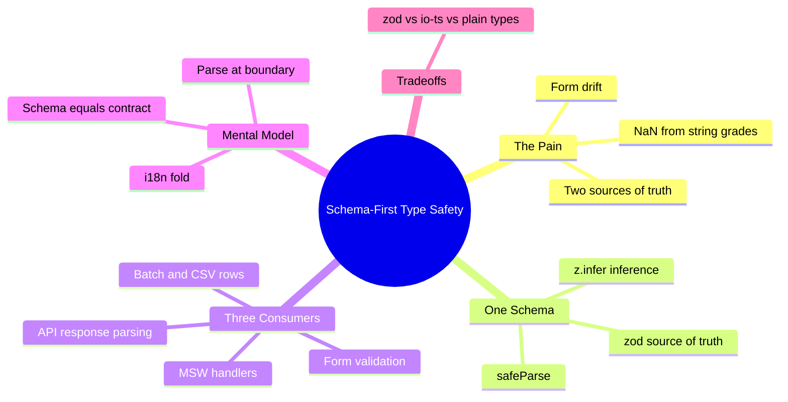
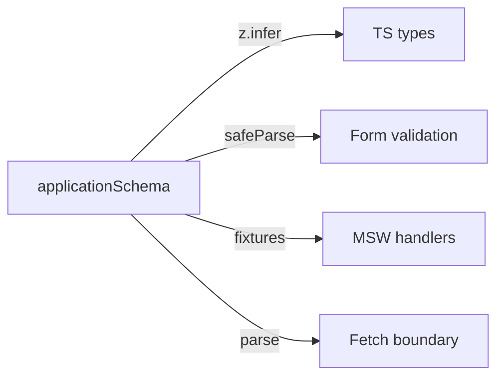

# Module 04: Schema-First Type Safety

Est. study time: 1.3h
Language: en
Description: Kill form drift by deriving types and validation from one shared zod schema.

## Knowledge Map



---

## Learning Objectives (maps to course CILOs)
- Derive end-to-end TypeScript types from a single shared zod schema — serves CILO 4
- Apply one schema across form validation, mock server handlers, and API response parsing — serves CILO 4
- Decide validation-error state placement from ownership rules — serves CILO 2
- Compare schema libraries and know when plain types are enough — serves CILO 4

---

## Real-World Example

Aissa's admissions portal records grades per course. The team hand-writes a TypeScript interface:

```ts
interface ApplicationDraft {
  programId: string;
  cohortId: string;
  grades: number[];
  campusId: string | null;
}
```

The backend (here: the mock server) actually returns grades as strings — `["8.5", "7.0", "6.2"]` — because the CSV feed upstream stores them as text. The UI averages grades for a "GPA preview", and the preview renders `GPA: NaN` in production. No compile error. A bug found by a student, not by the type system.

This is **form drift**: two sources of truth for one shape — the type you declared and the data the server actually sends — moving apart. Every hand-written interface is a promise nobody verifies.

> **Think**: TypeScript said `grades: number[]`, the server sent strings, and the app crashed. Who is to blame?
>
> *Answer: The hand-written interface. A type is a claim about data; nothing checks the claim, so the compile-time promise was never backed by runtime verification.*

---

## Core Content

### Section 1: The Naive Fix — "Just Add Types"

The natural instinct: declare the interface, feel safe. But it is **unverified** — the compiler assumes the interface is true and never tests it against a real response, so "just add types" moves the same bug later. A hand-written type is a **second description** of the shape, living alongside the real one (the API contract). Two descriptions drift. The fix: **one description, derived everywhere else**.

> **Cloze**: "A hand-written interface is an unverified promise: the compiler assumes it is true but never checks it against reality. It is a {second description} of the shape, and two descriptions always drift."

> **Predict**: The team adds a field `nationality` to the interface but the server never sends it. What breaks, and when?
>
> *Answer: Nothing at compile time — the field is just `undefined` at runtime, and the UI renders "Nationality: undefined" in production. Drift is discovered by users, not the type system.*

### Section 2: The Schema as Single Source of Truth

**zod** describes the shape once, as a runtime value, and infers the TS type from it — the type is derived, not duplicated.

```ts
import { z } from 'zod';

const applicationSchema = z.object({
  programId: z.string().min(1),
  cohortId: z.string().min(1),
  grades: z.array(z.number().min(0).max(20)),
  campusId: z.string().nullable().optional(),
  declaredAt: z.coerce.date(), // accepts "2026-08-01"
  // dependent rule: campus required unless program is 'online'
}).refine((d) => d.campusId ?? d.programId.startsWith('online'),
  { message: 'Campus required for on-campus programs' });

type ApplicationDraft = z.infer<typeof applicationSchema>; // derived
```

Three properties matter: `z.coerce.date()` converts strings at parse time; `.refine()` encodes the dependent `campusId` rule so the *same* rule feeds form and server; and `z.infer` derives the type from the schema — change one, the other changes, they cannot drift.

Now the mock server sends `grades: ["8.5"]`:

```ts
const parsed = applicationSchema.safeParse(serverPayload);
if (!parsed.success) {
  // parsed.error.issues: [{ path: ['grades', 0], message: 'Expected number, received string' }]
  return setValidationErrors(formatIssues(parsed.error));
}
```

`safeParse` returns `{ success, data | error }` instead of throwing, so errors flow into UI state instead of crashing the render.

### Section 3: Three Consumers, One Schema

The same `applicationSchema` feeds every layer that touches an application:

```ts
// (a) Form validation — same schema as the server
const result = applicationSchema.safeParse(draftFromForm);

// (b) Typed MSW handler — replies with schema-valid data
http.get('/api/applications/:id', () =>
  HttpResponse.json(applicationSchema.parse(fixtureFrom('grades.csv'))));

// (c) Batch rows — every CSV row parsed as the same shape
const rows = csvRows.map((row) => applicationSchema.safeParse(mapRow(row)));

// (d) API response parsing — kill drift at the fetch boundary
async function fetchDraft(id: string) {
  const res = await fetch(`/api/applications/${id}`);
  return applicationSchema.parse(await res.json()); // throw if server drifted
}
```

Note `(d)`: `.parse` (throwing) is right at the **trust boundary** — a wrong response should fail loudly, not fizzle into `NaN` later. `safeParse` (non-throwing) is right in the form, where a failed parse is expected.

> **Cloze**: "The same schema serves {validation} in the form, {type} derivation at compile time, and {serialization} of API responses — one schema, three consumers."

### Section 4: [State Decision] Where Validation Errors Live

By m2's ownership rules: form validation errors are **high-frequency, per-field, local** state — a small zustand store (or `useState` for a single-screen form), keyed by `programId` → error, `grades` → error array. No other screen reads a field error.

Server-side resources — program list, cohort options, campus list — are **server cache** state: fetched, cached, invalidated. That lives in the TanStack Query cache (m12). Rule: *validation errors travel with the form; server data travels with the Query cache.*

> **Think**: A remote-validation call (m13) returns an error for `programId`. Should it go into the Query cache?
>
> *Answer: No. It is one field's transient validation state, scoped to the draft being edited. The Query cache holds server resources; a field error is form state.*

### Section 5: Mental Model — Schema Is the Contract

The mental model: **one schema, three consumers — validate, type, serialize.** The schema is the *contract* between client and mock server (and, in a real deployment, the real server). Everyone reads from it; nobody writes their own copy.



The TS types are a *derived* artifact, like a compiled binary. You edit the schema, never the types; when the server changes a field, every consumer re-validates against the new truth.

**i18n fold**: grades and dates arrive as text (`"8.5"`, `"2026-08-01"`) and get parsed with **locale-aware parsing** (`Intl.NumberFormat` / `Intl.DateTimeFormat` round-trips) rather than ad-hoc regex. The schema validates *shape*; the i18n formatting beat (m13) handles *presentation* per locale. Keep the schema locale-independent.

> **Think**: Where do you draw the line between the schema validating structure and the i18n layer formatting presentation?
>
> *Answer: The schema accepts a parseable value in a valid range; the i18n layer decides whether `8.5` displays as "8,5" (fr) or "8.5" (en). Schema asks "is this a valid shape?"; i18n asks "how does it read to a person?"*

### Section 6: Verify — Tests as Companion

From m3's vocabulary, the schema is a **seam** — a narrow, pure boundary testable in isolation.

- **MSW contract tests**: the mock server is built *from* the schema, so handler fixtures are always schema-valid. Test that a drifted payload fails `safeParse` with the right path — `snapshot-when-structural`: assert on the shape of `parsed.error.issues`, not error text.
- **Form-level test** (RTL): type `"8.5"` in a grade field, assert the "Expected number" error and that `GPA: NaN` never renders.
- **Playwright-journey test**: student fills one application, submits the batch, sees the GPA preview — the path that would have caught the original `NaN`.

```ts
it('rejects string grades at the fetch boundary', () => {
  const payload = { ...validDraft, grades: ['8.5'] };
  expect(applicationSchema.safeParse(payload).success).toBe(false);
});
```

> **Predict**: The team removes the schema from the fetch boundary and reverts to `await res.json()` plus an untyped cast. What does the test suite now miss?
>
> *Answer: The MSW contract test still passes, but the runtime drift test fails — the fetch-boundary test can no longer observe `safeParse` rejecting a drifted payload. The `NaN` regression becomes invisible again.*

### Section 7: Variant — zod vs io-ts vs Plain Types

| Approach | Runtime validation | Type derivation | Cost |
|---|---|---|---|
| Plain TS types | none | yes | zero deps |
| zod | yes | yes | dep, schema upkeep |
| io-ts | yes (fp-ts ecosystem) | yes | heavier learning curve |

Plain types suffice for **internal-only shapes** that never cross a boundary — a component's local config, a memo key. Drift risk is zero when one team owns both sides and nothing serializes. Rule: *validate where data enters your trust boundary; skip runtime validation for shapes that never leave the process.*

zod extras: custom error messages (`errorMap`, per-locale), `z.lazy` for recursive shapes, `.transform` for normalization. For advanced zod — preprocessing, discriminated unions on `programType`, `superRefine` for cross-field checks — see `external-lib-patterns`.

> **Spot the Mistake**: A team replaces the interface with zod *only* for form validation, but still types API responses with a hand-written interface and casts with `as unknown as ApplicationDraft`.
>
> What's wrong?
>
> *Answer: The schema now exists twice as truth: one for the form, one (hand-written) for the fetch boundary — the exact place drift enters. Skipping `.parse` there lets string grades flow straight into the UI again.*

---

### Why This Matters

Form drift is the top runtime bug in typed client apps: it compiles green and fails in production. The schema makes the mock server, the form, the batch engine (m15), and the fetch boundary agree on one shape. Later modules (dependent fields m13, batch m14, CSV m15) push data through shapes; if the shapes drift, their features silently corrupt.

---

## Key Takeaways
- A hand-written interface is an unverified claim; derive types from a schema instead
- One schema, three consumers: validate (form), type (inference), serialize (API boundary)
- `.parse` at trust boundaries (fetch); `safeParse` where failure is expected (form)
- Validation-error state lives beside form state; server resources live in the Query cache (m12)
- The schema is a seam: MSW contract, form tests, and journey tests all verify against it

---

## Common Misconception

*"More TypeScript annotations = more safety."* Wrong. Annotations describe intent; only runtime verification describes reality. `grades: number[]` is a wish; `applicationSchema.parse(response)` is a check. Safest code: fewer annotations, one verified schema, every derived type inherits the check.

---

## Spot the Mistake

```ts
const result = applicationSchema.parse(formDraft); // form, not fetch
```

What's wrong?

*Answer: `.parse` throws on the first bad field — one keystroke mid-typing an incomplete draft crashes the screen. Forms need `safeParse` and issue collection; `.parse` belongs at the fetch boundary.*

---

## Feynman Explain
(Teach a child: you have one official recipe card for what an application looks like. The form, the pretend server, and the import machine all read that same card. Nobody writes their own copy of the recipe, because copies go stale and the cake comes out wrong. One card, everyone reads it.)

---

## Reframe
(Judge: schema-first assumes one canonical shape per domain object. When does it break? Streaming data, legacy endpoints that genuinely differ per consumer, GraphQL where the schema lives server-side. When one shape has many legitimately different views, where does the boundary move — does `.transform` rescue you or just multiply schemas?)

---

## Drill
Take the quiz. MCQs test different angles — recall, application, scenario.

Run: `learn.sh quiz enterprise-react-ui-patterns 04-schema-first-type-safety`
