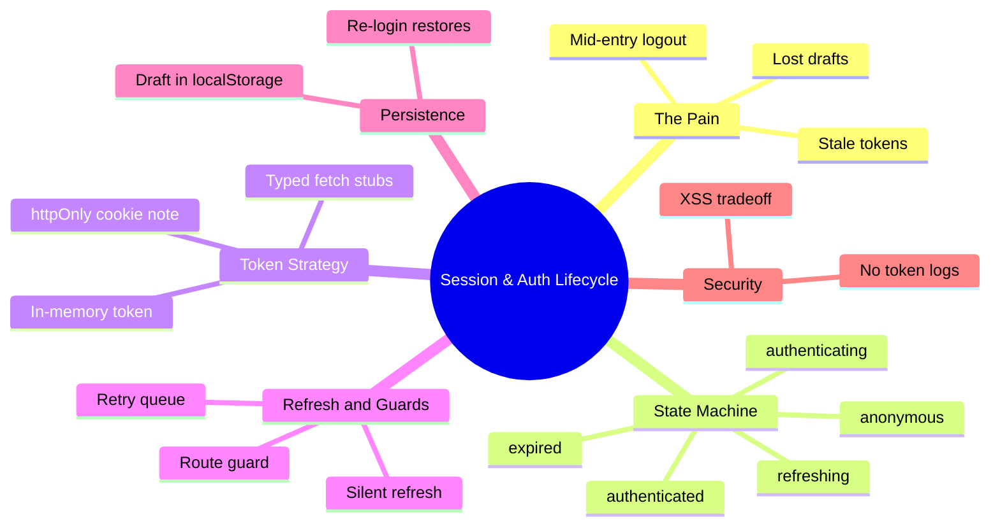
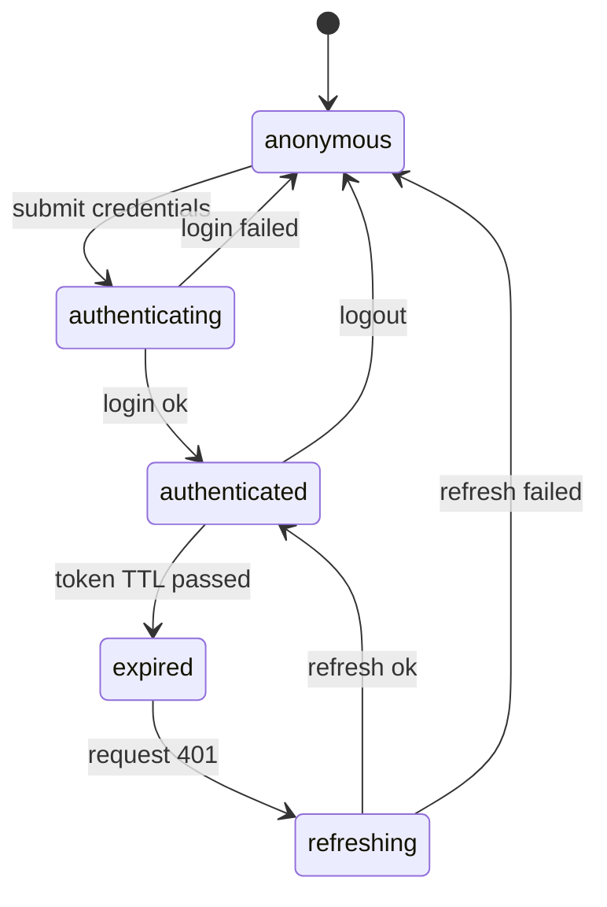

# Module 05: Session & Auth Lifecycle

Est. study time: 1.2h
Language: en
Description: Model the session as a state machine with silent refresh, guards, and draft recovery.

## Knowledge Map



---

## Learning Objectives (maps to course CILOs)
- Model the session as an explicit state machine, not a boolean — serves CILO 5
- Implement silent refresh with a retry queue for concurrent 401s — serves CILO 5
- Build route guards and session context for read-mostly session data — serves CILO 5
- Preserve drafts across session loss with store plus localStorage persistence — serves CILO 5

---

## Real-World Example

Liam spends 30 minutes on his application draft — three programs, grades, a campus choice. He clicks away to check the deadline calendar. Back in the tab, the app has silently logged him out: the token expired at minute 22. Saving redirects to login, the draft is gone. Or worse: the token expired but the app keeps sending it, the server rejects everything with 401, and the UI shows a generic "something went wrong".

The root cause: the app treated the session as a **boolean** — `hasToken ? loggedIn : loggedOut`. Reality is a **lifecycle**: a token is born, matures, expires, refreshes, dies. A boolean cannot represent "expired but recoverable" or "refreshing, hold on".

> **Think**: Why did the app both lose Liam's draft AND crash to login instead of recovering?
>
> *Answer: It never modeled expiry. On mount it checked `token != null` once and stopped — no refresh, no guard, no draft persistence. Expired was indistinguishable from logout, and the draft lived only in memory.*

---

## Core Content

### Section 1: The Naive Fix — "Check the Token Exists"

The naive approach: on mount, `setLoggedIn(Boolean(localStorage.getItem('session')))`. Failures, in order:

1. **Expiry ignored**: a token can exist and be dead. The UI says logged in; the server says 401.
2. **No refresh**: once expired, the student must fully re-login and lose context.
3. **No guard**: a dead session renders private screens that then error.
4. **Silent staleness**: "authenticated" UI that fails on every action.

A boolean collapses all of this into two states and hides the recoverable ones.

> **Cloze**: "Checking `token != null` once treats the session as a {boolean}, which cannot represent the recoverable state where a token exists but is {expired}."

### Section 2: The Session State Machine

Model the session as explicit states and transitions:



Every state maps to UI behavior: `anonymous` shows login, `authenticating` disables the button, `authenticated` renders the portal, `expired` can show a non-blocking "reconnecting" notice, `refreshing` replays pending requests. The session is read by many screens, changes rarely, and needs instant notification — a small store fits:

```ts
type SessionState = 'anonymous' | 'authenticating' | 'authenticated' | 'expired' | 'refreshing';

const useSessionStore = create((set) => ({
  state: 'anonymous' as SessionState,
  token: null as string | null,
  login: async (creds) => {
    set({ state: 'authenticating' });
    try {
      const { token } = await api.auth.login(creds);
      set({ state: 'authenticated', token });
    } catch { set({ state: 'anonymous' }); }
  },
  logout: () => set({ state: 'anonymous', token: null }),
}));
```

> **Think**: Why does `expired` exist as its own state instead of jumping straight to `refreshing`?
>
> *Answer: Because it must be observable. A 401 can show "reconnecting" UI and keep the authenticated screen mounted instead of flashing login. A boolean cannot hold this pause; the state machine can.*

### Section 3: Token Storage and the Client-Only Constraint

Where does the token live? Three real options:

| Storage | Survives reload | XSS exposure | Enterprise verdict |
|---|---|---|---|
| `localStorage` | yes | readable by any script | risky |
| in-memory (module/store) | no | not readable by XSS | safest client token |
| `httpOnly` cookie | yes | not readable by JS | best, needs a server |

This course is **client-only**: there is no real server, so the server is a **black box contract** — the client knows only what the API functions and the MSW handlers promise. We use an **in-memory token in the zustand store**: it survives navigation, cannot be scraped by XSS (m6's impersonation module builds on this), and reload simply returns to `anonymous`. A real deployment uses `httpOnly` cookies; the client-side lifecycle is identical, and swapping storage is one function.

Because the server is a black box, the API is a set of **typed fetch stubs** — functions returning schema-typed Promises (m4's contract):

```ts
export const api = {
  auth: {
    login: (creds: Credentials): Promise<{ token: string; expiresAt: number }> =>
      httpPost('/api/auth/login', creds),
    me: (): Promise<Profile> => httpGet('/api/auth/me'),
    refresh: (): Promise<{ token: string; expiresAt: number }> =>
      httpPost('/api/auth/refresh', {}),
  },
};
```

The stub is the seam (m3): tests swap its implementation without touching components, and MSW fulfills the real path.

> **Think**: Why not store the token in `localStorage` in this client-only course?
>
> *Answer: It teaches the wrong habit. `localStorage` is XSS-readable, and in-memory forces you to rebuild session state on boot (→ anonymous → login) — exactly the lifecycle a real app handles anyway.*

### Section 4: Silent Refresh with a Retry Queue

The hard part: three parallel requests, all with an expired token, all 401. Naive fix refreshes three times, or errors three times. Correct fix: **single refresh, queued replays**.

```ts
let refreshPromise: Promise<string> | null = null;

async function ensureToken(): Promise<string> {
  if (Date.now() < session.expiresAt) return session.token;
  if (!refreshPromise) {
    refreshPromise = api.auth.refresh()
      .then((r) => { session.token = r.token; session.expiresAt = r.expiresAt; return r.token; })
      .finally(() => { refreshPromise = null; });
  }
  return refreshPromise;
}
```

Every 401-triggered request calls `ensureToken()`. The first starts the refresh and stores the shared promise; the rest await the *same* promise and replay with the fresh token. Exactly one network refresh — no thundering herd, no lost requests. If refresh fails, `refreshing → anonymous` and the queued requests reject with a clear session-expired error.

> **Cloze**: "Concurrent requests that hit a dead token share a single {refresh} request; the rest await the shared promise and replay — the {retry queue} pattern."

> **Predict**: The refresh endpoint returns a token that expires in 10 minutes, and a long batch import (m14) runs for 20. What happens to the import?
>
> *Answer: Mid-import the token expires again. A 401 triggers a second `ensureToken()` cycle and the replay resumes — as long as each refresh extends the session. If refresh fails, the import aborts with a session error and the draft stays safe in the store (m14 handles resume).*

### Section 5: Guards and Session Context

Two consumers of session state, two mechanisms:

1. **Route guard** — a wrapper reading the store that redirects: `state !== 'authenticated'` → `/login`, remembering `returnTo`.
2. **Session context** — components that need the *profile* (avatar, name, role), a read-mostly read. By m2's rules, read-mostly + rare writes → context or a small store. We use the store for the lifecycle and derive the profile from it, so every consumer reads one source.

```tsx
function RequireSession({ children }: { children: ReactNode }) {
  const state = useSessionStore((s) => s.state);
  if (state === 'anonymous') return <Navigate to="/login" replace state={{ returnTo: location }} />;
  if (state === 'expired' || state === 'refreshing') return <Reconnecting />;
  return children;
}
```

The guard is a **seam** (m3): the redirect is testable with a fake store state, no network.

> **Think**: Why does the route guard live as a wrapper rather than a check scattered in each screen?
>
> *Answer: One choke point, one behavior, one test. Screens stay unaware of the lifecycle — the guard answers "may this render?" and nothing else. Scattered checks drift (one screen checks `token`, another checks `state`).*

### Section 6: [State Decision] Session, Draft, and Server Data

By m2's selection rules (scope, frequency, persistence, sync):

- **Session token + lifecycle**: cross-screen, high-frequency reads (every guard), near-instant sync, survives navigation but not reload. → **tiny zustand store**. Context works for read-mostly profiles, but the lifecycle *writes* on login/logout/refresh, and store actions keep those writes testable without provider re-renders.
- **Draft**: the student's typed work. Needs persistence across reload *and* re-login. → **zustand store + `localStorage` sync** (persist middleware). The draft is *not* session data — it outlives the session.
- **Program/cohort/campus options**: server resources. → **TanStack Query cache** (m12), never in the session store.

Draft preservation is the fix for Liam's loss:

```ts
const useDraftStore = create(persist(
  (set) => ({ draft: null, setDraft: (d) => set({ draft: d }), resetDraft: () => set({ draft: null }) }),
  { name: 'draft-v1' },
));
// logout keeps the draft; login restores it from the persisted store
```

On re-login the draft is still there — the store survived the session. m8 (unsaved-guards) and m14 (batch) build on this: the draft store is the single source the workflow guards and batch engine read.

> **Think**: Why should the draft outlive the session instead of being wiped on logout?
>
> *Answer: Work belongs to the student, not the token. The draft persists independently; login gates access to it, never destroys it.*

### Section 7: Verify — Tests

MSW contract (m3): `/api/auth/login` and `/api/auth/me` handlers return schema-typed fixtures; `/api/auth/refresh` hands out a token with a short `expiresAt` for expiry tests.

- **Guard redirects unauthenticated**: render a protected screen with the store in `anonymous`, assert `<Navigate to="/login">` fires. No network.
- **Refresh replays the queued request**: fire two parallel `fetchDraft` calls against an expired token, assert exactly one `POST /api/auth/refresh` in the MSW call log and both drafts succeed.
- **Expired token refreshes once**: set `expiresAt` in the past, call `fetchDraft`, assert the request retries after one refresh and succeeds.

```ts
it('replays concurrent requests on one refresh', async () => {
  const calls: string[] = [];
  server.on('request:start', (req) => calls.push(req.request.url));
  const [a, b] = await Promise.all([fetchDraft('1'), fetchDraft('2')]);
  expect(calls.filter((u) => u.includes('/auth/refresh'))).toHaveLength(1);
  expect(a.programId).toBe('1');
  expect(b.programId).toBe('2');
});
```

> **Predict**: The refresh handler starts failing intermittently (network flake). What do the tests reveal?
>
> *Answer: The refresh test fails intermittently too — the queue is only as deterministic as the refresh endpoint. Fix: retry-with-backoff around refresh (m18), plus a test mocking refresh failing once then succeeding.*

### Section 8: Variant — Auth Libraries and React 19

- **Clerk / Auth0 / Cognito**: production apps often buy the lifecycle instead of building it. The state machine above is what those SDKs implement; integration is covered in `external-lib-patterns`. Build-your-own fits the black-box contract discipline here; buy when you need real phishing-resistant flows.
- **React 19**: wrap login submit in `useTransition` so the button stays interactive and `isPending` drives the `authenticating` UI; `useOptimistic` can preview "Signed in as you". Both get depth in m14.

**Security beat**: never log tokens (`console.log(session)` is a bug); never store tokens in `localStorage` where XSS risk exists — any injected script reads them. In-memory trades reload-persistence for XSS-resistance; prefer `httpOnly` cookies in production so JS never sees the token. Treat mock tokens like secrets in tests too.

> **Spot the Mistake**: A developer "improves" the app by persisting the session token to `localStorage` so reloads keep the student logged in.
>
> What's wrong?
>
> *Answer: Any XSS vulnerability now exfiltrates a live session token — the most dangerous value in the app. Reload-persistence is not worth permanent compromise. The draft persists; the token stays in memory (or an `httpOnly` cookie in production).*

---

### Why This Matters

Session handling sits on the boundary between frustrating and fatal UX. A boolean session loses drafts, misleads users, and hides stale-token failures until the server errors. A state machine gives every state a behavior, a refresh queue survives real network races, and draft persistence means 30 minutes of work survive a session's death. Every guarded screen, the impersonation flow (m6), and the batch engine (m14) depend on this lifecycle being honest.

---

## Key Takeaways
- Model the session as a state machine (anonymous → authenticating → authenticated → expired → refreshing), not a boolean
- Token storage tradeoff: in-memory for XSS safety, `httpOnly` cookie in production, avoid `localStorage`
- One shared refresh promise plus retry queue: concurrent 401s cause one refresh, not a herd
- Route guard is a single choke-point seam; session data is read-mostly → store or context
- The draft persists in store + localStorage and outlives the session; options live in the Query cache
- Never log tokens; treat the token as a secret in code and tests

---

## Common Misconception

*"If the token exists, the user is logged in."* A token is a credential with a deadline, not a fact. Existence does not equal validity, and validity does not equal freshness. The only honest signal is a state machine driven by the token's TTL and the server's 401s.

---

## Spot the Mistake

```ts
const fetchDraft = async (id: string) => {
  const res = await fetch(`/api/applications/${id}`, {
    headers: { Authorization: `Bearer ${localStorage.getItem('session')}` },
  });
  if (res.status === 401) window.location.assign('/login'); // draft lost
};
```

What's wrong?

*Answer: The 401 immediately bounces to login, destroying the mounted UI and the typed draft. It neither attempts refresh nor preserves the draft. Correct: intercept 401 → `ensureToken()` → replay once → only then route to login, with the draft still in its store.*

---

## Feynman Explain
(Teach a child: being signed in is like a library card that stops working after a while. If your card fails mid-homework, the library should quietly hand you a new card and let you keep writing — not kick you out and eat your homework. Your writing is saved on your desk (the draft), so even if the library closes, your work is still there when you come back.)

---

## Reframe
(Judge: is the state machine always worth it? For a 3-screen tool with a 24-hour token and no background work, a boolean may genuinely suffice. Where does the machine earn its complexity — concurrent requests, background sync, long workflows, multi-tab? And when a real auth library owns the lifecycle, does your code still need the machine or just the guard? Consider multi-tab: two tabs share one token; when one refreshes, must the other re-sync?)

---

## Drill
Take the quiz. MCQs test different angles — recall, application, scenario.

Run: `learn.sh quiz enterprise-react-ui-patterns 05-session-auth-lifecycle`