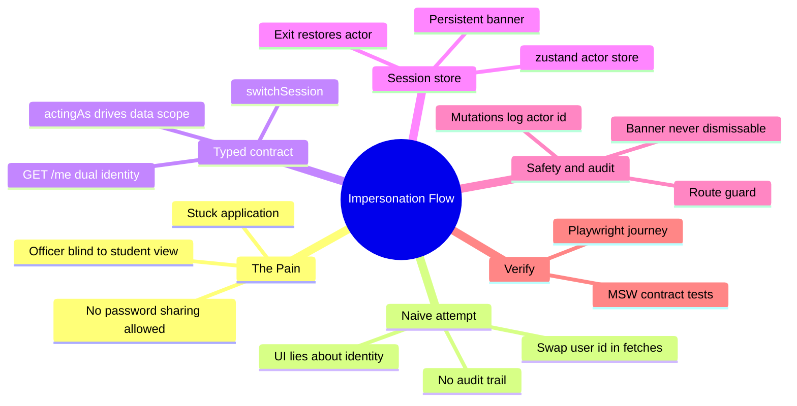
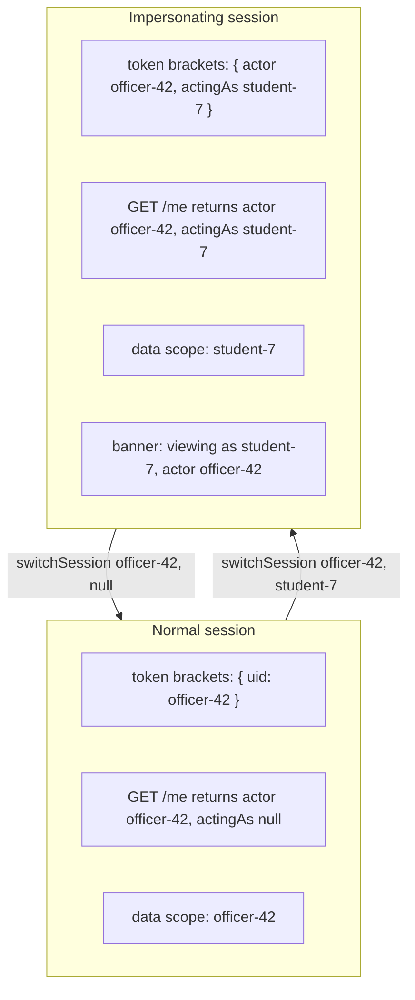

# Module 06: Impersonation Flow

Est. study time: 1.1h
Language: en
Description: Let admissions officers see the student's exact view through an explicit, audited, dual-identity session — never password sharing.

## Knowledge Map



---

## Learning Objectives (maps to course CILOs)
- Explain impersonation as a dual-identity session contract: `actor` versus `actingAs` — serves CILO 5
- Build the typed `switchSession` client and `GET /me` contract over the mock server — serves CILO 5
- Place impersonation actor state in a zustand store and wire a persistent banner plus exit — serves CILO 2, CILO 5
- Design the audit and guard floor: mutations carry the actor id, restricted routes block — serves CILO 5

---

## Real-World Example

Officer Kumar picks up a ticket: applicant Jane Doe says her application "submitted three weeks ago", but the portal shows it stuck at "Payment verified" for months. Kumar's officer view renders the record cleanly — grades filled in, documents uploaded. He cannot see what Jane sees: a hidden validation error blocking her submit button. His old workaround — call Jane, borrow her password — is now against policy. He needs to see **her** screen, as **her**, without becoming her and without losing the audit trail that he was the one looking.

> **Think**: Why is "let me just try it myself real quick" risky for an officer?
>
> *Answer: the officer's session is the officer's. Any refetch, edit, or submit is attributed to the officer and scoped to officer data. Working on Jane's record means acting with student scope while holding officer privileges — and if the log later says "officer Kumar changed Jane's grades", someone must be able to prove he was impersonating, and why.*

---

## Core Content

### Section 1: Two Identities, One Screen

The core tension: an impersonating officer holds two identities at once — the **actor** (who logged in: officer Kumar, privileges intact) and the **actingAs** identity (whose view and data the session serves: student Jane).

Every failed solution in this module treats impersonation as "a different user id". It is not. It is **a session that asserts both identities**, and the UI must reflect both, always.

> **Cloze**: "The officer who logged in is the {actor}; the person whose data the session currently serves is the {actingAs} identity."
>
> *Answer: actingAs*

Formula:

```text
data_scope  = actingAs   (whose data every fetch returns)
privilege   = actor      (which permissions the session keeps)
blame       = actor      (whom the audit log records as responsible)
```

> **Predict**: `getMe()` reveals `actingAs`, but the fetching layer still sends the actor's id in every request body. Who shows up in the audit log as the author of a save?
>
> *Answer: the actor. The server authorizes by token and attributes to the token owner; a stray id in the body changes nothing. Watching the /me field is not enough — the token is what drives scope and blame.*

### Section 2: The Naive Attempt — Swap the User ID in a Fetch

The tempting shortcut:

```ts
const selectedStudentId = 'student-7';

// "view as student": just use her id everywhere
const apps = await fetch(`/api/applications?owner=${selectedStudentId}`).then(r => r.json());
```

Every request still carries Kumar's session token. The server authorizes by *token*, not by URL query — so:

1. If the server ignores the query param for authorization, the response is *Kumar's* data while the UI labels it "Jane's application". The screen lies.
2. If the server honors the query param blindly, any student can pass another student's id and read their data. Authorization became a URL string.
3. Nothing in the UI signals "you are inside Jane". Kumar edits a grade, closes the tab believing he was on his own record, and the log holds no trace of who was responsible or when.

> **Think**: Why does id-swapping "work" in demos but fail in a shared portal?
>
> *Answer: in a demo the server has one user, so swapping happens to be authorized. In a real portal every employee and student share one server, and the server decides scope from the token, never from a query param a client could forge. The contract must live server-side.*

> **Predict**: Kumar swaps the id in the fetch and clicks Save Grade. The server records the mutation as his own — impersonation carries no marker. What audit question becomes unanswerable a month later?
>
> *Answer: "was this grade changed while the officer was impersonating, or was it a direct officer action?" The token never expressed the dual identity, so the log looks identical to a normal edit. Impersonation invisible to the audit is impersonation that cannot be defended.*

### Section 3: Impersonation as a Typed Contract

Fix: keep the server the single authority on identity, and expose impersonation as an **explicit typed contract**. The mock server defines:

```text
POST /session/switch     body { actorId, asUserId }
                         -> { token }         // token asserts BOTH identities
GET  /me                 -> { actor: "officer-42", actingAs: "student-7" }   // impersonating
                         -> { actor: "officer-42", actingAs: null }          // normal
```

Every subsequent request uses the impersonation token. The server scopes *all data* to `actingAs`, keeps *privileges* from `actor`, and records *actor* as the responsible party. The client never invents identities — it only switches sessions.

```ts
// server-data.ts — typed client shared with the mock server (zod everywhere)
import { z } from 'zod';

export const SessionDto = z.discriminatedUnion('actingAs', [
  z.object({ actor: z.string(), actingAs: z.null() }),
  z.object({ actor: z.string(), actingAs: z.string() }),
]);
export type SessionDto = z.infer<typeof SessionDto>;

export async function switchSession(actorId: string, asUserId: string | null) {
  const res = await fetch('/api/session/switch', {
    method: 'POST',
    headers: { 'content-type': 'application/json' },
    body: JSON.stringify({ actorId, asUserId }),
  });
  const { token } = await res.json();
  authClient.setToken(token);                 // m5: token lives in the session layer
  return getMe();
}

export async function getMe() {
  const res = await fetch('/api/me');
  return SessionDto.parse(await res.json());
}
```

The zod schema comes from `04-schema-first-type-safety` — one shared type drives the client and every test. The token lifecycle is `05-session-auth-lifecycle`; impersonation nests inside it as a richer session shape.

> **Cloze**: "The server decides whose data to return from the session {token}, so the client cannot forge scope; the frontend's job is to display both the actor and the {actingAs} identity without ever inventing one."
>
> *Answer: token*

### Section 4: [State Decision] — The Actor Store

Impersonation state has an unusual read profile — app-level, cross-screen, high-frequency:

| Reader | What it reads | Frequency |
|---|---|---|
| banner component | `actingAs`, `actor` | every render |
| data hooks | `actingAs` (fetch scope) | every fetch |
| route guards | `actingAs` | every navigation |
| mutation handlers | `actor` (audit stamp) | every submit |

That combination is a genuinely earned zustand use case, per the scope/frequency/persistence/sync rubric in `02-state-management-selection`. Mechanics — selectors, subscriptions, shallow equality — come from `zustand-state-management`, not re-taught here. This store is deliberately tiny: it owns *identity*, nothing else.

```ts
// stores/session.ts
import { create } from 'zustand';

interface ImpersonationState {
  actor: string | null;
  actingAs: string | null;
  begin: (actor: string, as: string) => void;
  exit: () => void;
}

export const useImpersonation = create<ImpersonationState>((set) => ({
  actor: null,
  actingAs: null,
  begin: (actor, as) => set({ actor, actingAs: as }),
  exit: () => set((s) => ({ actingAs: null })),
}));
```

The draft data keeps its own store; impersonation owns identity, not form content.

> **Think**: Why shouldn't `actingAs` live in the draft store beside the form data?
>
> *Answer: lifetime and reads differ. Draft state dies with the form; impersonation spans every screen, including screens with no form open — the tracker, the dashboard, the batch bar. Colocate state with its consumers, not with unrelated data.*

### Section 5: The Banner — the UI Never Lies

The banner is the visible contract. It must be everywhere, permanently, while impersonation is active.

```tsx
// ImpersonationBanner.tsx
export function ImpersonationBanner() {
  const actingAs = useImpersonation((s) => s.actingAs);
  const actor = useImpersonation((s) => s.actor);
  const exit = useImpersonation((s) => s.exit);
  if (!actingAs) return null;

  return (
    <div role="status" aria-label="Impersonation active" className="impersonation-banner">
      Viewing as <strong>{actingAs}</strong> — acting as officer {actor}
      <button onClick={() => exit()}>Exit impersonation</button>
    </div>
  );
}
```

Rules that make it safe:

- **non-dismissable** — no close button, no hide toggle; only *exit* ends it
- **persistent layout slot** — the banner lives in the app shell (m9 layout composition), above every route
- **visual emphasis** — a strong border and background on every impersonating screen (theming from `modern-css-with-react`; a red identity frame is conventional)
- **exit = `switchSession(actor, null)`** — restores a normal session token and then clears store state

Data hooks read scope from the store, never from a hardcoded id:

```ts
const actingAs = useImpersonation((s) => s.actingAs);
const apps = useApplications(actingAs || viewerId); // scope: actingAs, or actor when normal
```

> **Predict**: The exit button clears `actingAs` in the store but skips the `switchSession` call. The banner disappears. What does the next fetch return?
>
> *Answer: Jane's data, because the token still says impersonating and the server trusts the token. The banner lied. Exit must complete the server-side switch before clearing store state — otherwise the UI is the authority, which is exactly the bug impersonation exists to prevent.*

### Section 6: Audit and Guards — Doing No Harm

Impersonation is a spotlight, not invisibility. The audit story is *who acted*:

1. **Start and stop recorded** — both `switchSession` calls are logged by the mock server: who, acting as whom, when.
2. **Mutations carry the actor id** — any write while impersonating payloads `{ actorId: actor, actedOnBehalfOf: actingAs }`. The log keeps both, so "who changed what for whom" is always answerable.
3. **The token itself is never logged** — a leaked impersonation token is a standing key to another user's data. Log identities, never credentials.
4. **Route guard** — screens that make no sense inside another user's view (submitting payment, editing own profile) refuse to render while `actingAs` is set.

```ts
type MutationMeta = { actorId: string; actedOnBehalfOf: string | null };
```

> **Think**: A guard silently redirects while impersonating. Should it, or should it warn?
>
> *Answer: warn or block loudly. A silent redirect looks like a bug and erodes trust in the banner. If a route is not allowed, say so — "impersonation sessions cannot submit payments" — and offer exit.*

### Section 7: Mental Model — Two Identities, One Session

Think of the session as a pair of glasses: the officer's privileges are the frame; the student's view is the lens. Normal sees with the officer's own eyes; impersonation swaps the lens but keeps the frame.



Mental rule: **the UI must always display both identities.** `actingAs === null` is the only normal state; any non-null `actingAs` means impersonation — banner renders, guards apply, mutations get stamped. If token says impersonating but the UI says normal, you have a bug.

> **Cloze**: "The single field that distinguishes an impersonating session from a normal one is {actingAs} on the session, so the UI must read it — never guess from URLs or routes."
>
> *Answer: actingAs*

### Section 8: Verify — Tests as the Witness

m3 (`03-testing-as-companion`) gives the vocabulary: the mock server is a **seam**, MSW defines the **contract**, structural asserts snapshot the banner shape, and the end-to-end journey belongs to Playwright.

```ts
// impersonation.test.tsx — MSW as the server contract
it('GET /me reports actingAs while impersonating', async () => {
  server.use(switchAndAct('officer-42', 'student-7'));
  const me = await getMe();
  expect(me).toEqual({ actor: 'officer-42', actingAs: 'student-7' });
});

it('exit restores the officer view', async () => {
  await impersonate('officer-42', 'student-7');
  await exitImpersonation();
  expect(await getMe()).toMatchObject({ actingAs: null });
});

it('mutations while impersonating carry the actor audit id', async () => {
  // MSW inspects the request body and asserts actorId + actedOnBehalfOf
});
```

Checklist: `/me` returns `actingAs` (MSW contract test); banner renders when `actingAs` is set (RTL); exit clears `actingAs` and the officer view returns (state + contract); mutations while impersonating include the actor audit id (contract assert on the request body). Snapshot the banner when the shape is structural.

The full journey — login, impersonate from a record, browse as the student, edit, exit — crosses the Playwright boundary from m3: it spans routes, the persistent banner, and a server that keeps session state. That is E2E, not unit.

> **Predict**: You drop the audit-assertion test because "the server handles it". What regresses first?
>
> *Answer: the frontend payload. A refactor drops `actedOnBehalfOf` from the mutation body, the server accepts the request, and for days every impersonating mutation logs a blank on-behalf field. The contract test is the only tripwire.*

### Section 9: Variants — Level Up the Spotlight

- **Multi-level impersonation** — officer to reviewer to student: a *chain* of identities. `actingAs` shows the leaf; the audit log keeps the full chain. Multi-level nesting is rare in this portal; the invariant still holds at every hop.
- **Limited windows** — impersonation expires (say 30 minutes): the token is short-lived, the actor re-authenticates to extend, and the banner shows time remaining with a countdown re-fetch.
- **Read-only lens** — strict shops allow impersonation only for viewing: the mutation guard rejects writes and the banner reads "read-only view".

The invariant survives every variant: **server asserts both identities, UI displays both, audit records the actor.**

---

### Why This Matters

Impersonation is the difference between a support team that guesses and one that *sees*. It is also a sharp edge: get the state model wrong and the UI lies, the audit log says nothing, and a student's data is one URL query from exposure. This pattern shows the safe shape: contract first, identity owned in one store, banner everywhere, exits verified, mutations stamped.

---

## Key Takeaways

- Impersonation is a dual-identity contract — actor (privileges and blame) plus actingAs (scope) — never "a different user id"
- The server decides scope from the token; the client invents nothing, it only switches sessions
- `GET /me` is the single truth of who the session is; `actingAs === null` is the one normal state
- Identity state belongs in an app-level zustand store read by banner, fetches, guards, and mutation handlers
- A non-dismissable banner, audit-stamped mutations, and a route guard are the safety floor; the token is never logged

---

## Common Misconception

*"Impersonation is just a flag on the user record."* Wrong. A flag on a user record says nothing about *who is acting*. The session must carry both identities — otherwise the server cannot scope data to the student while attributing blame to the officer. The flag is the visible banner; the session contract is the enforcement.

---

## Spot the Mistake

```ts
export function GradeEditor() {
  const selectedStudent = useSelectedStudent();
  const me = await getMe(); // returns { actor: 'officer-42', actingAs: 'student-7' }
  const apps = await fetch(`/api/applications?owner=${me.actingAs}`).then(r => r.json());
  saveGrade(selectedStudent.id, apps[0].grade); // no actor id in the mutation
}
```

What's wrong?

*Answer: two leaks. First, `saveGrade` sends no actor metadata, so the audit log cannot attribute the impersonating edit. Second, the scope comes from a possessive query param `?owner=` when it should come from the token — a client that can set owner can impersonate anyone. Pass the impersonation token consistently and let `/me` drive scope and mutation stamps.*

---

## Feynman Explain

Tell a friend: an officer wants to look through a student's glasses without becoming the student. He borrows special glasses handed over by the server; the glasses carry two labels — who cares (the officer) and whose eyes (the student). Everywhere he looks shows the student's desk, but a red strip at the top always says "you are watching Jane, officer Kumar is the watcher", so nobody forgets, and every pencil he moves is stamped with Kumar's name.

---

## Reframe

Judge: is impersonation always the answer for "what does the user see"? Counterarguments: log-replay of a session, screenshots, or a shadow user reproduce the view *without* write risk. Impersonation earns its complexity only when the officer must interact with the form itself — re-trigger validation, test the submit. When read-only answers the question, a read-only lens or a replay beats the write path.

---

## Drill

Take the quiz. MCQs test recall, contract reasoning, and audit scenarios.

Run: `learn.sh quiz enterprise-react-ui-patterns 06-impersonation-flow`