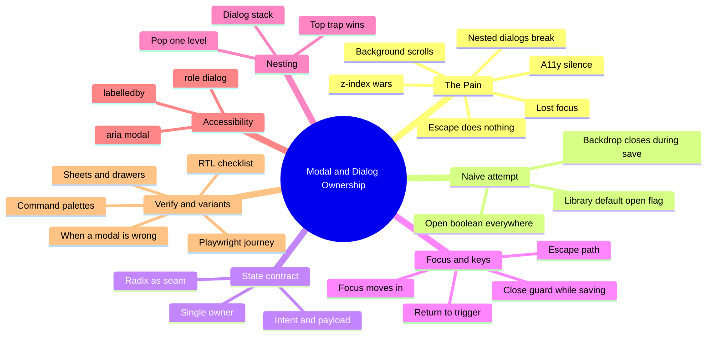
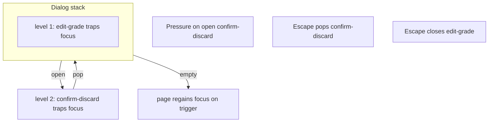
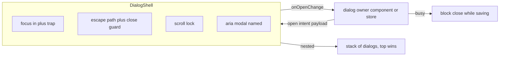

# Module 07: Modal & Dialog Ownership

Est. study time: 1.2h
Language: en
Description: Own the modal's state contract, focus behavior, and escape path so dialogs never break a screen — even nested, even mid-save.

## Knowledge Map



---

## Learning Objectives (maps to course CILOs)
- Diagnose the six modal failure modes and explain why a library alone does not fix state ownership — serves CILO 1
- Model modal state as one controlled contract — open, intent, payload, onOpenChange — owned by one component or store — serves CILO 2
- Build a DialogShell with focus-in, trap, focus return, scroll lock, Escape with a close-guard, and aria wiring — serves CILO 6, CILO 7
- Manage nested dialogs as a stack and choose local useState vs zustand by ownership scope — serves CILO 2
- Verify focus, escape, close-guard, nesting, and aria with RTL, and route the full journey to Playwright — serves CILO 3

---

## Real-World Example

Officer Priya works the tracker grid (m10), fixing a grade record. She opens the **edit grade** dialog, changes an A-minus to an A, and clicks Save. The network is slow. Impatient, she clicks the dark backdrop behind the dialog — it closes instantly, mid-save, and focus jumps to the page body while the row still shows her optimistic A. When the batch eventually settles (m14), the server says the grade never changed. Meanwhile a colleague who uses a screen reader opens the same dialog and hears nothing — no role, no title — so she cannot tell a dialog opened at all.

Six distinct failures, one root cause: nobody *owned* the dialog contract.

> **Think**: Which failure can no component library alone fix — not by its API, not by its docs?
>
> *Answer: all six are bookkeeping you must own. The library renders the box; the open/close decision, the busy guard, the stack depth, the scroll lock, and the aria wiring are your React state. A library ships a box, not a contract.*

---

## Core Content

### Section 1: The Six Failure Modes

A dialog is a portal plus a keyboard contract. It is the rare element where the absence of a bug looks like nothing happened — which is exactly why these bugs ship.

1. **Focus loss** — on open, focus stays on the trigger or jumps to the body; keyboard users tab into the page behind.
2. **Focus trap broken** — focus cycles out of the dialog into the page, or two focus managers fight.
3. **Escape silence** — Escape does nothing, or closes mid-save with no guard.
4. **Background scroll** — the page scrolls behind a scrollable dialog; the wheel lands in two places.
5. **z-index war** — magic numbers (z-index: 9999) collide with tooltips, dropdowns, and stacked dialogs; the fix-up is another 100000.
6. **Accessibility silence** — no role="dialog", no aria-modal, no accessible name; screen readers never announce the context change.

> **Think**: Why is the z-index war usually a *nesting* problem in disguise?
>
> *Answer: two panels fighting for top is usually two open dialogs with no stacking rule — a state-ownership problem before it is visual. Correct nesting gives one answer: the deepest open dialog is on top because it joined the stack last.*

> **Cloze**: "A modal that looses focus, ignores Escape, scrolls the page behind, and never announces itself has six separate failures with one origin: nobody {owns} the dialog contract."
>
> *Answer: owns*

### Section 2: The Naive Attempt — the Library's Default Open Flag

The instinct: "we use @radix-ui/react-dialog — done." The trap:

```tsx
// naive — uncontrolled open flags scattered across five components
<Dialog.Root open={gradeDialogOpen}>
  <GradeForm onSaved={() => setGradeDialogOpen(false)} />
</Dialog.Root>

// meanwhile three more copies of the same boolean exist elsewhere
const [viewDialogOpen, setViewDialogOpen] = useState(false);
const [confirmOpen, setConfirmOpen] = useState(false);
const [noteDialogOpen, setNoteDialogOpen] = useState(false);
```

Symptoms show within a week: backdrop click closes a dialog that is saving; nothing knows the dialog is busy so no guard runs; a second dialog opens from the first and both fight for page focus; focus returns nowhere because nobody recorded the trigger.

The library solves *rendering* — portaling, focus-scoping primitives, styling. It does not solve *control* — who may open, what the dialog is for, when closing is allowed. That control is React state you own. This is the adapter discipline of `external-lib-patterns`: wrap the library as a seam, keep the contract yours.

> **Predict**: Five components each hold their own open boolean. Marketing asks that the header approvals count open the same confirm dialog. What happens?
>
> *Answer: a fifth boolean — or worse, components start reading each other's flags and the dialog renders twice. Scattered state is the symptom of lost ownership; the fix is one contract and one owner.*

### Section 3: One State Contract — the Dialog Owner

Define one modal-state contract and let everything flow through it:

```text
type DialogState<Intent, Payload> =
  | { mode: 'closed' }
  | { mode: 'open'; intent: Intent; payload: Payload; busy?: boolean; onOpenChange: (open: boolean) => void };
```

`intent` names which dialog variant is showing, `payload` carries the data it needs, `busy` signals a blocking operation, and `onOpenChange` is the controlled seam where your guard runs — not the library's internal callback.

```ts
// useDialogState.ts — owned by the component that triggers the dialog
type Guard = { busy: boolean };

export function useDialogState<Intent, Payload>(initial: Payload) {
  const [guard, setGuard] = useState<Guard>({ busy: false });
  const [state, setState] = useState<DialogState<Intent, Payload>>({ mode: 'closed' });

  const openDialog = useCallback((intent: Intent, payload: Payload) =>
    setState({ mode: 'open', intent, payload, busy: false, onOpenChange: (o) => { if (!o) close(); } }), []);

  const close = useCallback(() => {
    setState((s) => {
      if (s.mode !== 'open') return s;
      if (s.busy) return s;                 // close-guard: busy blocks close
      return { mode: 'closed' };
    });
  }, []);

  return { open: state.mode === 'open', dialogState: state, openDialog, close };
}
```

The library never decides to open or close; a component or store — the **owner** — does. The rule that ends the wars: **one dialog, one owner.** If two components want the same dialog, the owner is whatever state both read — and that is when state moves up (m8 builds on this).

> **Cloze**: "The modal state contract names the dialog variant through its {intent} field and carries its data in payload, while {onOpenChange} is the controlled seam where the close-guard runs."
>
> *Answer: intent*

### Section 4: [State Decision] — Where Modal State Lives

Apply the scope/frequency rubric from `02-state-management-selection`:

- **Local useState, one owner** — one screen, one trigger, one dialog: the edit-grade dialog opened from a row action stays in the screen. Nothing else reads it.
- **App-level store (zustand), many triggers** — the same dialog opens from the tracker, the batch bar, and the workflow modal (m8): multiple triggers across screens share one instance. State moves to a small modal store keyed by intent; `openDialog('confirm', payload)` works from anywhere and one shell renders it. Mechanics come from `zustand-state-management`.
- **Focus state — React refs, never the store** — the focus target is a DOM concern. Storing it would re-render the app just to move focus. Record the trigger in a ref locally and restore it on close.

```ts
// stores/modal.ts — cross-screen dialogs only
export const useModal = create<ModalStore>((set) => ({
  intent: null,
  payload: null,
  open: (intent, payload) => set({ intent, payload }),
  close: () => set({ intent: null, payload: null }),
}));
```

Rule of thumb: the moment a second component wants to open the same dialog, lift the state one level — component state, then a store, in that order.

> **Think**: Why does focus state stay in refs even when dialog state moved to a store?
>
> *Answer: focus is a side effect on the DOM, not data. In a store, every focus move triggers selectors, shallow equality checks, and re-renders of unrelated subscribers. A ref mutates the DOM directly and dies with its component — the right lifetime for a remember-where-I-was pointer.*

### Section 5: DialogShell — Focus, Escape, Scroll, Aria

The shell wraps the library (Radix Dialog primitives as the seam) and applies your owned contract on top.

```tsx
// DialogShell.tsx — Radix seam plus your ownership rules
export function DialogShell<Intent, Payload>({
  dialogState, titleId, children,
}: Props<Intent, Payload>) {
  const triggerRef = useRef<HTMLElement | null>(null);

  useEffect(() => {
    if (dialogState.mode === 'open') {
      triggerRef.current = document.activeElement as HTMLElement; // remember trigger
      document.body.style.overflow = 'hidden';                    // scroll lock
      return () => {
        document.body.style.overflow = '';
        triggerRef.current?.focus();                              // focus return
      };
    }
  }, [dialogState.mode]);

  if (dialogState.mode !== 'open') return null;

  return (
    <Dialog.Root open={true} modal onOpenChange={dialogState.onOpenChange}>
      <Dialog.Portal>
        <Dialog.Overlay />
        <Dialog.Content
          role="dialog"
          aria-modal="true"
          aria-labelledby={titleId}
          onEscapeKeyDown={(e) => { if (dialogState.busy) e.preventDefault(); }}
        >
          {children}
        </Dialog.Content>
      </Dialog.Portal>
    </Dialog.Root>
  );
}
```

Contract enforced here:

- **Focus moves in on open, returns to the trigger on close** — the triggerRef pair above.
- **Focus trap** — from the library's scoping primitives; your job is to *check it* in tests, not reimplement it.
- **Escape closes unless a blocking operation** — dialogState.busy intercepts the keydown and calls `preventDefault`: the **close-guard** the naive flag lost.
- **Scroll lock** — body overflow toggled on open, restored on close.
- **Aria** — role="dialog", aria-modal="true", and aria-labelledby pointing at the dialog title id; some dialogs add aria-describedby for a descriptive paragraph.

> **Spot the Mistake**: A team wires Escape through the library's event and, when busy, simply hides the dialog visually instead of blocking the close.
>
> What's wrong?
>
> *Answer: hiding keeps the open state alive while the user sees nothing; a second Escape unmounts, the request resolves, and the success toast fires into the void. Blocking the event is the honest contract: busy means the dialog stays, visibly, with a disabled save button. Never fake-close under a long task.*

### Section 6: Nesting — a Stack, Top Wins

Nested dialogs: the edit-grade dialog opens a confirm-discard dialog on top. Model the state as a **stack** — every push adds a level, Escape pops exactly one, focus transfers to the new top, and when the top closes, focus returns to the *previous* top's trigger, never to the page body.

```text
stack: [ edit-grade, confirm-discard ]   // outermost first
```

Rules that make nesting safe:

- The top-most dialog traps focus; levels below are live but keyboard-inert.
- Escape pops one level, never the whole pile — one Escape asks "discard changes?", a second one performs it.
- z-index is *produced* by nesting, not specified with magic numbers: a stacking context per level (later DOM order in a portal wins) removes the number race.
- Aria: the top dialog is the only live aria-modal; lower dialogs get aria-hidden.



> **Predict**: The nesting store exposes one boolean, so opening confirm-discard overwrites edit-grade's open state. What breaks on the second Escape?
>
> *Answer: the pop has nothing to return to — edit-grade was destroyed before the user answered, so one Escape closes everything. A single boolean models one dialog, never a pile; the stack must keep earlier levels until each is popped.*

Cross-ref: `08-workflow-driven-modal` builds the multi-step workflow modal on this same owned contract — the store version from Section 4 is its foundation.

### Section 7: Mental Model — a Portal, a Keyboard Contract, and One Owner

A modal is three things at once:

- a **portal** — rendered outside the DOM flow but never outside your state
- a **keyboard contract** — focus moves in, traps, Escape pops one level, focus returns
- a **single owner** — one component or store decides open, close, busy, and stack depth



If you can answer "who may open this dialog, and who may close it — and when not" in one sentence, the ownership is correct. If the answer is "everyone, whenever", you found the bug m8 will make urgent.

> **Cloze**: "Treat a dialog as a {portal} with a keyboard contract and a single owner; Escape pops one level of the stack, focus returns to the previous trigger, and busy blocks close."
>
> *Answer: portal*

### Section 8: Verify — Prove Focus, Escape, Nesting, Aria

m3 vocabulary applies: seams (DialogShell is the seam to test), structural snapshot for the stable shell markup, and a Playwright boundary — a modal journey across real DOM focus, portals, and routing belongs to E2E.

```ts
// dialog.test.tsx — RTL
it('moves focus into the dialog and returns it to the trigger on close', async () => {
  const user = userEvent.setup();
  render(<GradeEditor />);
  const trigger = screen.getByRole('button', { name: /edit grade/i });
  await user.click(trigger);
  await waitFor(() => expect(screen.getByRole('dialog')).toHaveFocus());
  await user.keyboard('{Escape}');
  expect(trigger).toHaveFocus();
});

it('blocks Escape while saving', async () => {
  // busy=true; Escape pressed; dialog still present; Save disabled
});

it('pops one level on nested dialogs, not the whole stack', async () => {
  // confirm-discard over edit-grade; one Escape returns edit-grade
});

it('exposes role, aria-modal, and a name', async () => {
  const dialog = screen.getByRole('dialog');
  expect(dialog).toHaveAttribute('aria-modal', 'true');
  expect(dialog).toHaveAccessibleName('Edit grade');
});
```

Checklist: focus lands in the dialog; focus returns to the trigger; Escape closes; the close-guard blocks during save; nested pop works one level at a time; aria attributes are present. The full student-facing journey — open from a tracker row, edit, save, verify the row — is the Playwright layer per the m3 boundary.

> **Predict**: You add a new dialog; RTL focus tests pass, but the Playwright journey fails on focus. What does that tell you about the test split?
>
> *Answer: RTL drives the DOM directly, Playwright drives a real browser where portals and focus order behave differently. The unit layer proves intent; the E2E near a human proves the browser. Both layers exist because each sees a different truth.*

### Section 9: Variants — When a Modal Is Wrong

- **Non-modal dialogs** — command palettes (Ctrl-K): no trap, no aria-modal, background stays interactive, Escape still closes. The keyboard contract changes — focus roams, and the palette must not steal Escape from the page.
- **Sheets and drawers** — docked panels that read as modal-lite: keep focus management, add drag-to-dismiss and responsive behavior, but they still need the same owner contract or they hit the same bugs behind a fancier visual.
- **When a modal is wrong** — long forms (a 40-field application section): a modal traps the user in a tiny scrolling bottleneck and blocks the save-slot flow. Use a page or a split panel; the workflow modal (m8) is the middle ground for flows that are short but must not be interrupted.

Decide by task size and interruption, not aesthetics. Confirmations, single-field edits, and short guards belong in a dialog; anything you would not want to reload mid-answer stays on a page.

---

### Why This Matters

Owned modals are the difference between "polished" and "broken on the second click". The failure modes are invisible on a happy-path demo — focus, Escape, busy-save, nesting, aria — and they bite exactly when a user is deep in a task: mid-save, mid-form, screen reader on. This module gives you the contract that makes a dialog predictable and the tests that keep it honest across library upgrades.

---

## Key Takeaways

- A library renders the dialog; you own the contract — open, intent, payload, and the controlled onOpenChange where guards run
- The six failure modes collapse into one question: who owns this dialog, and when may it close
- Modal state: local useState for a single trigger and owner; a store for cross-screen shared dialogs; focus always in refs
- DialogShell owns focus-in, trap, focus return, scroll lock, Escape with a close-guard, and aria naming
- Nested dialogs are a stack: top traps, Escape pops one level, z-index falls out of nesting
- RTL proves the contract; the real-browser journey goes to Playwright

---

## Common Misconception

*"Radix handles modals, so I do not need to think about state."* Wrong. Radix handles rendering and focus-scoping primitives, not the open/close decision, the busy guard, the nesting stack, or who may open the dialog. Those are app state. The library is a seam you trust; the ownership is the contract you test.

---

## Spot the Mistake

```tsx
function GradeEditor() {
  const [open, setOpen] = useState(false);
  const [busy, setBusy] = useState(false);
  return (
    <Dialog.Root open={open} onOpenChange={setOpen}>
      <GradeForm onSaving={setBusy} />
    </Dialog.Root>
  );
}
```

What's wrong?

*Answer: `onOpenChange={setOpen}` hands the close decision to the library, which knows nothing about busy. A backdrop click closes mid-save — the exact grade-record bug from the intro. The controlled seam must be `onOpenChange={(o) => { if (!o && !busy) setOpen(false); }}`, with busy also blocking Escape.*

---

## Feynman Explain

Tell a friend: a modal is like a security door you enter to finish one small errand. You step in and the door clicks shut behind you — now your attention stays in the room. If something is being saved, the door refuses to open even when you push Escape. Press Escape when you want out: it closes one door at a time — a sticky note on top asks "are you sure?", and only then leaves the row. Whenever you leave, you land back where you started. The door's name is spoken aloud, so a person using a screen reader always knows which room they are in.

---

## Reframe

Judge critically: is the single-owner rule always right? Command palettes and drawers blur it — they are partly modal, partly ambient, and a strict contract adds ceremony. Counterargument: ownership need not be one component; a store is still one owner, so the rule bends for global surfaces without breaking. The real test is interruption: does the UI *require* the user's attention, or merely offer a convenience? Required attention gets the full owned contract; convenience gets a lighter, non-modal touch.

---

## Drill

Take the quiz. MCQs test failure diagnosis, state scope, focus and escape behavior, and nesting.

Run: `learn.sh quiz enterprise-react-ui-patterns 07-modal-dialog-ownership`