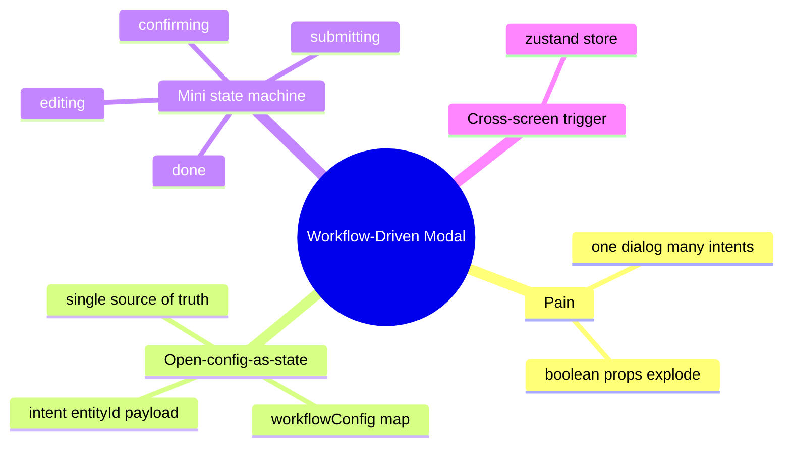
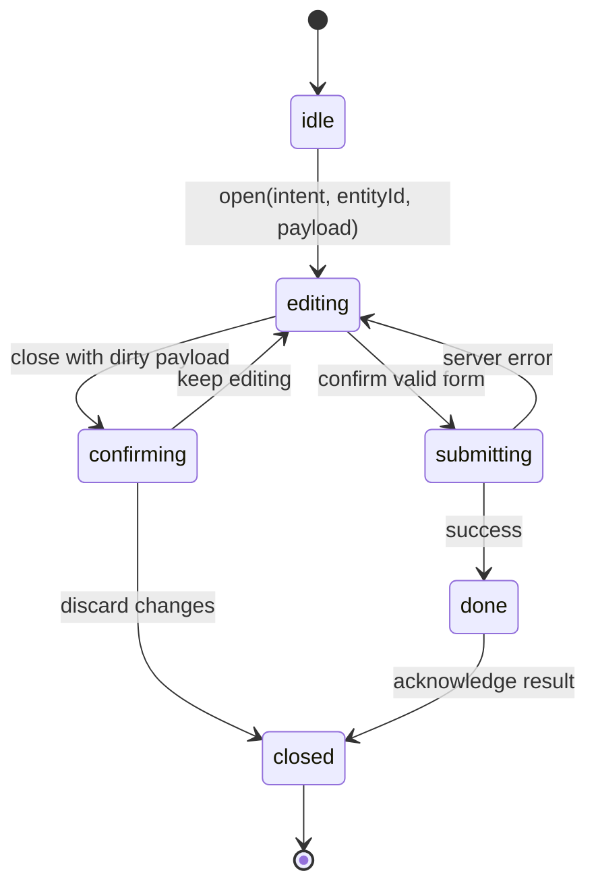

# Module 08: Workflow-Driven Modal

Est. study time: 1.3h
Language: en
Description: One dialog, many intents — drive it from a workflow config, not boolean props.

## Knowledge Map



---

## Learning Objectives (maps to course CILOs)
- Model dialog state as a single open-config object instead of boolean intent props — serves CILO 2
- Drive a dialog's title, fields, validation, and confirm behavior from a config map — serves CILO 5
- Run a small state machine inside the modal for multi-step flows and a dirty-close guard — serves CILO 5
- Move cross-screen modal state to a zustand store and prove it with RTL + MSW — serves CILO 3

---

## Real-World Example

Admissions portal. A student adds a new application, edits grades on an existing one, reviews the whole batch before one submit. Three dialogs that look alike: a title, fields, validation, a confirm button. Add a fourth — the batch summary shows "submit 5 applications", a different flow with review, loading, and result steps.

First attempt: one `<Modal>` with `isAdd`, `isEdit`, `isReview` props. Someone passes `isAdd isEdit`, someone forgets `isReview`, batch flow bolted on as `isReview && isBatch`. Minefield.

> **Think**: Why did boolean props fail even though each intent looked simple?
>
> *Answer: Intents are configurations, not flags — each differs across fields, validation, labels, submit action, step count. Three booleans make 8 combinations; only 3 are real, the rest dead states, and each new intent multiplies branching.*

---

## Core Content

### Pain: The Dialog Is Not a Rectangle

Module 7's `DialogShell` handles focus trap, ESC, `aria-modal`, the close guard — where the dialog lives, not *what* it does. A modal is a mini-application: opens with data, collects input, validates, submits, reports, closes. When one shell serves "add application", "edit grades", and "review batch", the body, buttons, validation, even step count change per intent.

The naive version encodes intent as booleans:

```tsx
// naive — grows without bound
<Modal isAdd={intent === 'add'} isEdit={intent === 'edit'} isReview={intent === 'review'}>
  {isAdd && <ApplicationForm />}
  {isEdit && <GradesForm id={rowId} />}
  {isReview && <BatchReview />}
</Modal>
```

Each new intent means another prop and another branch; nothing stops `isAdd={true} isEdit={true}`, and the batch flow needs state booleans cannot express.

> **Cloze**: Boolean props cannot express *multi-step* flows, so the batch flow needs what a flag is not: a {state machine}.
>
> *Answer: state machine*

### Solution: Open-Config-as-State

Replace the booleans with one object: modal state is `{ intent, entityId, payload }`. Opening the dialog is a store action — the *earned zustand* case of module 2 — because triggers live on different screens (empty batch bar, table row, batch summary).

```typescript
type ModalIntent = 'addApplication' | 'editGrades' | 'reviewBatch'

export const useWorkflowModal = create<{
  intent: ModalIntent | null
  entityId: string | null
  payload: Record<string, unknown> | null
  open: (o: { intent: ModalIntent; entityId?: string; payload?: Record<string, unknown> }) => void
  close: () => void
}>((set) => ({
  intent: null, entityId: null, payload: null,
  open: ({ intent, entityId, payload }) =>
    set({ intent, entityId: entityId ?? null, payload: payload ?? null }),
  close: () => set({ intent: null, entityId: null, payload: null }),
}))
```

Three triggers, one store:

```tsx
useWorkflowModal.getState().open({ intent: 'addApplication' })
useWorkflowModal.getState().open({ intent: 'editGrades', entityId: row.id, payload: row.grades })
useWorkflowModal.getState().open({ intent: 'reviewBatch', payload: { count: 5 } })
```

`intent` is the key into a config map — the single source of truth for dialog behavior:

```typescript
export const workflowConfig = {
  addApplication: {
    title: 'Add application',
    fields: ['program', 'cohort', 'campus'],
    validate: validateApplication,
    confirmLabel: 'Save application',
    submit: draftStore.submitApplication,
  },
  editGrades: { title: 'Edit grades', fields: ['grades'], validate: validateGrades,
    confirmLabel: 'Save grades', submit: draftStore.updateGrades },
  reviewBatch: { title: 'Review before submit', fields: [], validate: validateBatch,
    confirmLabel: 'Submit 5 applications', submit: draftStore.submitBatch },
} as const
```

> **Predict**: `reviewBatch` has no fields but needs a review list, progress, and a result state. What happens if the config map only holds `{ title, fields, confirmLabel }`?
>
> *Answer: The map cannot describe the flow, so the batch body hard-codes steps and the "one config" claim dies. Fix: add an optional `steps` array and a `render` body component per config, so multi-step flows stay in the config too.*

### Mini State Machine Inside the Modal

A modal that only ever shows one form needs no steps; one that reviews, confirms, submits, and reports does. Model the lifecycle:

```typescript
type Step = 'editing' | 'confirming' | 'submitting' | 'done'
```



```typescript
const [step, setStep] = useState<Step>('editing')
if (step === 'editing')
  return <WorkflowForm config={config} onConfirm={submit}
    onRequestClose={dirty ? () => setStep('confirming') : close} />
if (step === 'confirming')
  return <DiscardConfirm onKeep={() => setStep('editing')} onDiscard={close} />
if (step === 'submitting') return <SubmittingSpinner />
return <ResultView result={result} onAck={close} />
```

The **dirty guard** extends module 7's close guard: draft differing from saved payload + close attempt → `confirming`. Compare the draft against the open-time `payload` (or a `touched` flag), never `null`, or the guard fires on every open.

> **Think**: Why is `submitting → editing` on error, not `submitting → done`?
>
> *Answer: The user must fix the rejected field and resubmit. Skipping to a result screen hides the server's errors and forces reopening — destroying the draft. The error path returns to the only step that can edit.*

### State Decision

| Concern | Choice | Why |
|---|---|---|
| Which dialog is open | zustand store | Triggers span screens; module 7's local `useState` no longer reaches |
| Draft / payload | draft store (module 14) | The draft belongs to the batch engine; the dialog only reads/writes it |
| Step inside the dialog | local `useState` | Private to one open instance; no external consumer |
| Config map | static module constant | Read-mostly, no persistence, no sync |

### Mental Model: A Modal Is a Workflow, Not a Rectangle

The rectangle is an implementation detail. The workflow is the truth:

- `open` creates a workflow instance from `{ intent, entityId, payload }`.
- `workflowConfig[intent]` supplies every behavior the workflow needs.
- The state machine owns the life: edit, confirm, submit, done.

New dialog = new config entry. Changed flow = edit one config. Branching that lived in the render tree now lives in data.

### Verify (Tests)

Tests pin the contract, not pixels — module 3 vocabulary (seam, MSW contract, snapshot-when-structural).

```typescript
it('opens editGrades from a table row and renders that config', () => {
  render(<Table />)
  fireEvent.click(screen.getByRole('button', { name: /edit grades/i }))
  expect(screen.getByRole('heading', { name: 'Edit grades' })).toBeInTheDocument()
  expect(screen.getByRole('button', { name: 'Save grades' })).toBeInTheDocument()
})

it('blocks dirty close until confirmed', () => {
  render(<WorkflowModal />)
  typeInto('grades', 'A+')
  fireEvent.click(screen.getByRole('button', { name: /close/i }))
  expect(screen.getByText(/discard changes/i)).toBeInTheDocument()
  fireEvent.click(screen.getByRole('button', { name: /keep editing/i }))
  expect(screen.getByRole('heading', { name: 'Edit grades' })).toBeInTheDocument()
})

it('submits via the MSW contract and shows the result', async () => {
  server.use(contract.updateGrades)
  render(<WorkflowModal />)
  fireEvent.click(screen.getByRole('button', { name: 'Save grades' }))
  expect(await screen.findByText(/grades saved/i)).toBeInTheDocument()
})
```

The seam is the store's `submit` action — tests mock it or route through MSW, whose handler is the POST contract (module 3). Snapshot the shell structure, not the workflow logic; full journeys (batch summary → review → submit → result) go to Playwright. Watch false-positive assertions: `getByText('Edit grades')` matches a page header too — assert the intent-specific confirm label and fields so add and edit tests actually differ.

### Variant: Nested Workflows

"Add application" may need to chain a prerequisite dialog (a chosen program requires a prerequisite check). The store holds one `intent`; nesting means a second `open` with a new intent and a `parent` reference, stacked above the current dialog. Same shell, same config map, one extra `stack` in the store. Dynamic variant: the intent list comes from the server (`/workflows`), so the config map is built at runtime — the map becomes page-fetched data.

---

### Why This Matters

The one-dialog-many-intents problem appears in every serious app: applications, orders, tickets, users — all added, edited, reviewed, and batch-submitted through one modal shell. Boolean-intent props turn that dialog into a nesting ground for dead branches; every new flow costs a refactor instead of a config entry. Config-as-state keeps the shell dumb, makes each intent explicit, and gives tests a clean seam.

## Key Takeaways
- Modal state is one object — `{ intent, entityId, payload }` — never a pile of booleans
- `workflowConfig` is the single source of truth for title, fields, validation, labels, submit action
- Multi-step dialogs run a tiny state machine: `editing → confirming → submitting → done`
- Dirty close is a transition to `confirming`, compared against the open-time snapshot, not `null`
- Cross-screen triggers justify zustand for modal state — module 7's local state no longer suffices
- Tests assert the rendered intent config, submit through the MSW contract

---

## Common Misconception

**"A dialog with several modes is just a dialog with more props."**

The common move is a prop per mode. The trap: props model *presence*, not *behavior* — they cannot carry per-intent validation, confirm text, submit action, or step count, so those fork into `if` chains that grow with every intent and produce unreachable combinations. A config map + state machine models behavior directly: the intent is a key, everything else is data, and there is no combination space to get wrong.

---

## Spot the Mistake

```typescript
// suspect code — what breaks?
const dirty = payload !== null

function onRequestClose() {
  if (dirty) setStep('confirming')
  else close()
}
```

What's wrong?

*Answer: `payload !== null` is true the moment any dialog opens with data, so the guard fires on a pristine "Edit grades" dialog that never changed. Dirty must mean *changed since open* — compare draft against the initial snapshot (or a `touched` flag), not `null`.*

---

## Feynman Explain
(Explain to a child: a shop stall that sells different things from the same counter. The counter stays the same — same wood, same drawer — but a sign above it changes what it serves: ice cream, sandwiches, or a receipt for a whole picnic basket. The sign is the intent; the sign-to-menu lookup is the config map; "stir, pour, hand over" is the state machine. When someone walks away mid-order, you ask "are you sure?" before clearing the counter — the dirty guard.)

## Reframe
(Pause. Judge the pattern: does config-as-state always beat conditionals? Counterargument: near-identical intents (add vs duplicate application) can bloat the map with near-duplicate entries — compose configs (spread) instead of forking render branches. The state machine stays small only while steps are few; a ten-step dialog should be a routed flow, not a switch. Write your evaluation.)

---

## Drill
Take the quiz: config-as-state, the state machine, dirty-guard edge cases, test seams.

Run: `learn.sh quiz enterprise-react-ui-patterns 08-workflow-driven-modal`
