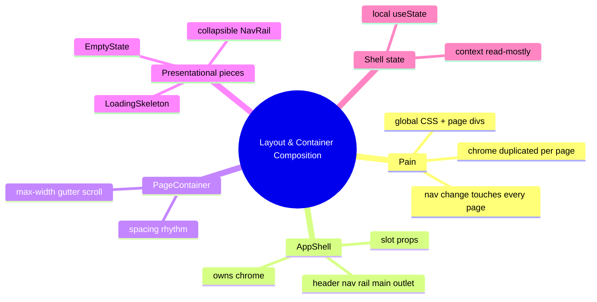
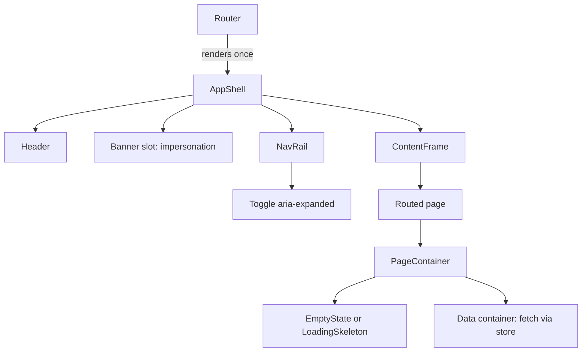

# Module 09: Layout & Container Composition

Est. study time: 1.4h
Language: en
Description: Stop re-implementing chrome on every page — compose an AppShell, slots, and page containers so layout lives in one place.

## Knowledge Map



---

## Learning Objectives (maps to course CILOs)
- Distinguish shell-owned chrome from page-owned content and container-owned data — serves CILO 1
- Compose a shared AppShell with slot props so pages stop re-implementing headers, rails, and margins — serves CILO 2
- Build PageContainer, EmptyState, and LoadingSkeleton as pure presentational units that enforce spacing rhythm — serves CILO 5
- Decide shell layout state placement (local state, context, or zustand flags) and prove composition with RTL + Playwright — serves CILO 3

---

## Real-World Example

Admissions portal launches three new screens — Applications list, Program catalog, and a Courses comparison page. Each one needs the same shell: top header with the logged-in student name, a nav rail with Applications / Programs / Support, a content area with a max width and side gutters, and an empty-looking state when a list has no rows yet.

Three developers, three copies of the same idea. One writes `.page{max-width:1200px;margin:0 auto}` into a global stylesheet and wraps content in `<div className="page">`. Another inlines the header into the page component. A third nests the whole thing in `<main>` with its own breakpoint handling. Then product adds a "Reviewer mode" impersonation banner under the header — and every page must be touched to reserve space for it, and one page forgets, and the banner overlaps the nav rail.

> **Think**: Why did three competent developers produce three different shells even though they all knew CSS?
>
> *Answer: The failure was composition, not CSS. Nothing in the codebase owned the chrome, so each page re-decided layout — width, gutter, header presence, breakpoints — independently. When a shared element appears (impersonation banner), there is no single home for it, so it gets bolted onto pages one by one and some get missed.*

---

## Core Content

### Pain: Layout Scattered Is Layout Nonexistent

The CSS primitives from `modern-css-with-react` — flex, grid, `clamp()`, breakpoints, container queries — are necessary but not sufficient. They are vocabulary, not structure. Without a structure that assigns *who owns which part of the screen*, every page re-implements the same decisions slightly differently.

The naive pattern is global CSS plus per-page wrapper duplication:

```tsx
// page A
<div className="page">
  <h1>Applications</h1>
  ...
</div>
// page B
<div className="page page--wide">
  <header className="page-header">...</header>  // copied from page A
  ...
</div>
```

Failure modes this guarantees:

- **N-page refactor**: adding a nav rail or banner means editing N files. Module 1 called this the composition violation — pages should compose, not copy.
- **Rhythm drift**: one page uses `1200px`, another `1100px`, gutters differ. The product feels assembled from spare parts.
- **Data containers doing presentation**: components that fetch data also lay out headers and margins, so they cannot be reused off-page (in a modal, m7, or a report view).
- **Specificity wars**: every page pads with its own classes; the global sheet grows until it predicts nothing.

> **Cloze**: The fix is to give layout a single owner: an {AppShell} that owns chrome, while pages supply only their own content.
>
> *Answer: AppShell*

### Solution: The Shell Is One Component

Think of the shell like the admissions portal's desk registration counter — fixed position, same countertop, same sign — while each course packet spread on it changes. The shell is a single presentational component that owns everything that repeats across pages:

- **Header**: logo, logged-in user, global actions (help, logout).
- **NavRail**: primary navigation, collapsible.
- **Main outlet**: the routed child — never the page's job to know how wide it should be.
- **Slots** (module 1): `headerActions`, `aside`, `banner` — places where pages inject their own widgets without owning the frame around them.
- **Banner slot**: module 6's impersonation banner lives here, in the shell, so every page reserves space for it for free.

```tsx
interface AppShellProps {
  nav: ReactNode       // nav rail content
  headerActions?: ReactNode // slot — page-specific buttons
  banner?: ReactNode   // slot — impersonation banner lives here
  children: ReactNode  // the routed outlet
}

export function AppShell({ nav, headerActions, banner, children }: AppShellProps) {
  return (
    <div className="shell">
      <Header actions={headerActions} />
      {banner ? <div className="shell__banner">{banner}</div> : null}
      <div className="shell__body">
        <NavRail>{nav}</NavRail>
        <ContentFrame>{children}</ContentFrame>
      </div>
    </div>
  )
}
```

The shell is **presentational** — no data fetching, no routing logic. Data containers fetch (module 1 contract), the shell composes. The router renders one `AppShell` above the outlet, so pages never mount chrome:

```tsx
<Route element={<AppShell nav={<PrimaryNav />} />}>
  <Route path="applications" element={<ApplicationsPage />} />
  <Route path="programs" element={<ProgramCatalog />} />
</Route>
```

> **Predict**: The impersonation banner appears only when an agent impersonates a student. Where does the banner's data come from — the shell, or the store?
>
> *Answer: The shell reads a shell-level flag from the store (session/impersonation from module 5-6) and renders the banner into its own slot. Pages stay banner-ignorant: they do not check session state, they do not reserve space. Adding a banner is a shell-only change again, forever.*

### Container Composition: Pages Are Thin

Pages should be nearly content: arrange data containers, hand off actions, and stop. Shared pieces that every page needs in the same visual rhythm:

```tsx
export function PageContainer({ children, maxWidth = 'var(--content-max)' }: {
  children: ReactNode; maxWidth?: string
}) {
  return <main className="page" style={{ maxWidth }}>{children}</main>
}

export function EmptyState({ icon, title, hint, action }: {
  icon: ReactNode; title: string; hint?: string; action?: ReactNode
}) {
  return (
    <div className="empty-state">
      <div className="empty-state__icon">{icon}</div>
      <p className="empty-state__title">{title}</p>
      {hint ? <p className="empty-state__hint">{hint}</p> : null}
      {action}
    </div>
  )
}

export function LoadingSkeleton({ lines = 4 }: { lines?: number }) {
  return <div className="skeleton" aria-busy="true">{[...Array(lines)].map((_, i) => (
    <div className="skeleton__line" key={i} style={{ width: `${100 - i * 12}%` }} />
  ))}</div>
}
```

One `PageContainer`, one `EmptyState`, one `LoadingSkeleton` used everywhere — the spacing rhythm is a single CSS definition, not an informal agreement. The day the design system says "content max is 1120px", one token changes (see variant: theme tokens) and every page follows at once.

> **Cloze**: A page that shows a list with no rows renders the same {EmptyState} as the catalog and the transcripts list — presentational units shared across pages.
>
> *Answer: EmptyState*

### NavRail: Collapsible with the Right Semantics

Navigation collapse is a layout concern, so it belongs to shell-owned chrome, not per-page state. The toggle is a button with `aria-expanded`, and the collapsed/expanded state is stored as a shell-level boolean.

```tsx
function NavRail({ items }: { items: NavItem[] }) {
  const [collapsed, setCollapsed] = useState(false)
  return (
    <nav aria-label="Primary" className={`nav-rail${collapsed ? ' nav-rail--collapsed' : ''}`}>
      <button
        className="nav-rail__toggle"
        aria-expanded={!collapsed}
        onClick={() => setCollapsed(c => !c)}
      >Toggle nav</button>
      {items.map(i => (
        <a key={i.href} href={i.href} className="nav-rail__item" aria-current={i.active ? 'page' : undefined}>
          <NavGlyph icon={i.icon} />
          {collapsed ? null : <span>{i.label}</span>}
        </a>
      ))}
    </nav>
  )
}
```

`aria-expanded` is what screen readers announce; without it, "Toggle nav" is a mystery button. On narrow screens this becomes a drawer (breakpoint via `modern-css-with-react`): below `800px` the rail slides over content with a backdrop, and the same `collapsed` state drives both — the state is layout truth, CSS decides how it looks.

> **Think**: Why does the "active section" highlight live in the shell and not in each page?
>
> *Answer: The nav rail renders once and must highlight only the current route. If pages painted their own highlight, two pages could both claim "active" (a dead-state pair, like module 8's booleans). One shell computing active from the current route keeps the invariant single-sourced.*

### State Decision

| Concern | Choice | Why |
|---|---|---|
| Rail collapsed / drawer open | local `useState` in NavRail | Private UI state, no consumer outside the shell; avoid premature zustand |
| Active section / current route | Router-derived (path match), read-mostly | Derive where possible; context or prop drill only if several shell bits need it |
| Shell-level flags (impersonation banner visible) | zustand store | Written by session at login, read by the shell on every page — cross-screen write, single read home. Never a server cache; it is UI state |
| Spacing tokens (max width, gutters) | CSS custom properties | Changed at one declaration site; impossible to drift per page |

The rule of thumb restates module 2: component-private visual state stays local; anything written on one screen and read on another goes to the store. The shell is presentational, so it must *not* fetch session data itself — the store hands it the flag through the same hook the session uses.

### Mental Model: Shell Owns Chrome, Containers Own Data, Pages Own Content



Read it top to bottom: the shell lays the frame, the banner slot reserves room without pages knowing, pages drop thin containers, shared presentational units enforce rhythm. Data flows stay in containers, never in the shell. Symmetric with module 8 — there the config map was the dialog's truth; here the shell tree is the page's truth. Adding a feature (a "Saved drafts" rail item, a promo banner) is a shell edit, not a page edit.

**Crossing the line that keep it clean:**

- Pages may compose `PageContainer` and data containers; they may not re-create headers, rails, or gutters.
- Shell renders chrome only; it may not fetch application data.
- Containers fetch and render; they may not wrap themselves in layout wrappers (that is container acquisition — the data unit stops being reusable).

### Verify (Tests)

Tests pin contracts, not pixels (module 3 vocabulary — seams, mock at the edge, Playwright for journeys).

```typescript
it('renders the banner slot when an impersonation flag is set', () => {
  store.setImpersonating(true)
  render(<AppShell nav={<PrimaryNav />}><FakePage /></AppShell>)
  expect(screen.getByRole('banner')).toHaveTextContent(/impersonat/i)
})

it('PageContainer enforces the spacing token', () => {
  render(<PageContainer>content</PageContainer>)
  const main = screen.getByRole('main')
  expect(main).toHaveStyle({ maxWidth: 'var(--content-max)' })
})

it('nav rail toggles aria-expanded', () => {
  render(<NavRail items={items} />)
  const toggle = screen.getByRole('button', { name: /toggle nav/i })
  expect(toggle).toHaveAttribute('aria-expanded', 'true')
  fireEvent.click(toggle)
  expect(toggle).toHaveAttribute('aria-expanded', 'false')
})
```

Assert shell structure seam — slot position, `role=banner`, `aria-expanded` — not pixel snapshots (snapshot-when-structural, module 3). The impersonation test mounts the shell with a fake page child: no router, no real store network — the seam is the store flag, replacing the real store with a stub keeps the test fast. Full journeys ("click Programs in the nav rail, land on catalog, navigate back") go to Playwright, because routing and layout persistence span screens. Watch the false-positive trap: `getByRole('banner')` matches the browser's implicit banner if you forget `role` on your header — assert on the slot content, not just the role.

### Variant: CSS Container Queries and Multi-Shell

Two upgrades when the app outgrows one shell:

- **Inner widths**: instead of a page max-width, let containers size to their context with CSS `container-type: inline-size` and `@container` queries (`modern-css-with-react`). The same "grades card" reflows when shown full-width in the catalog or narrow inside a modal. Tradeoff: container queries size to the *nearest named container*, so two containers can disagree on which one wins — name containers explicitly. And container queries handle *layout* reflow, not *viewport* features like safe-area insets or touch-target size; keep those on real `@media` queries (`modern-css-with-react`).
- **Theme tokens**: spacing/max-width as CSS custom properties (`--content-max`, `--gutter-s`, `--gutter-m`) means the rhythm is one declaration, not a hundred classes.
- **Multi-shell**: a reviewer shell (wide content, impersonation bar always on, audit breadcrumbs) versus a student shell (massive CTA buttons strike a different rhythm — they don't; the difference is scope of chrome). Two `AppShell` variants sharing `PageContainer` and rails: shells vary, containers remain identical, data containers are untouched.

---

### Why This Matters

Every routed app that grows past a demo dies the same way: chrome copied page by page, rhythm drift, one shell migration that touches every file. The shell + container split is not decoration — it is what lets a nav rail be added once, a banner appear everywhere, and a data container be dropped into a modal without scraping layout classes off it. Wrong composition costs the N-page refactor every sprint; right composition makes layout a solved problem you stop noticing.

## Key Takeaways
- The shell owns chrome — header, nav rail, main outlet, banner slot; pages own content; data containers own data
- Pages stay thin — PageContainer, EmptyState, LoadingSkeleton are shared presentational units
- Slots (module 1) let pages inject header actions and banners without owning the frame
- Navigation collapse is shell state, exposed with `aria-expanded`; breakpoint drawer reuses the same collapsed flag
- Shell layout stays local (or router-derived); cross-screen flags like the impersonation banner go to zustand — never a server cache
- Tests assert the shell seam — slots, roles, aria — and leave journeys to Playwright

---

## Common Misconception

**"You need a design system to have a good layout."**

Teams wait for a component library and meanwhile every page re-implements header, gutter, and rail "temporarily" — and the temporary becomes permanent. The layout problem is composition, not tooling. AppShell + slots + PageContainer delivers 80 percent of the win (single home for chrome, consistent rhythm) with zero dependencies; a design system then formalizes what the shell already owns. Solving composition first is what makes the later design system installable instead of a rewrite.

---

## Spot the Mistake

```tsx
// suspect — a data container shells itself
export function ApplicationsTable({ apps }: { apps: Application[] }) {
  return (
    <section className="page">
      <h2>Applications</h2>
      <table>...</table>
    </section>
  )
}
//
// and a page that wraps it again
export function ApplicationsPage() {
  return (
    <PageContainer maxWidth="1100px">
      <ApplicationsTable />
      <div className="page page--compact" style={{ maxWidth: '900px' }}>
        <ApplicationsTable apps={archived} />
      </div>
    </PageContainer>
  )
}
```

What's wrong?

*Answer: `ApplicationsTable` wraps itself in page chrome (`.page`, its own max-width), so it cannot be reused at different context widths — the second use fights a conflicting wrapper, and widths drift atom by atom. Layout belongs to the shell and container, never to the data unit. The table should be a bare component under `PageContainer`, which owns width and rhythm once.*

---

## Feynman Explain
(Tell a child: the school hall has a fixed stage, wings, and a light curtain. Every assembly, the same stage is up; only the acts change — choir, play, prize-giving. The stage is the shell: teachers paint it once. The acts are the pages: they only line up and perform, never rebuild the curtain. When a new rule says a banner hangs during exams, the caretaker hangs it on the stage once, and every act sees it. If each act dragged its own platform in, the hall would be a different room every hour — that is what layout without a shell looks like.)

## Reframe
(Pause. Judge the pattern: is "shell owns chrome" always right? Counterargument: a single AppShell centralizes layout until a page genuinely needs bespoke chrome (a full-bleed interview dashboard). Then the shell fights you — forcing rail + gutters where none fit. The pattern keeps working when exceptions are handled as shell *variants* (the multi-shell variant) rather than page-owned hacks, and when you resist putting every new state into the shell's props. Write your evaluation.)

---

## Drill
Take the quiz: shell ownership, slot composition, collapse semantics, container reuse, the rhythm invariant.

Run: `learn.sh quiz enterprise-react-ui-patterns 09-layout-container-composition`

Run: `learn.sh cloze enterprise-react-ui-patterns 09-layout-container-composition`