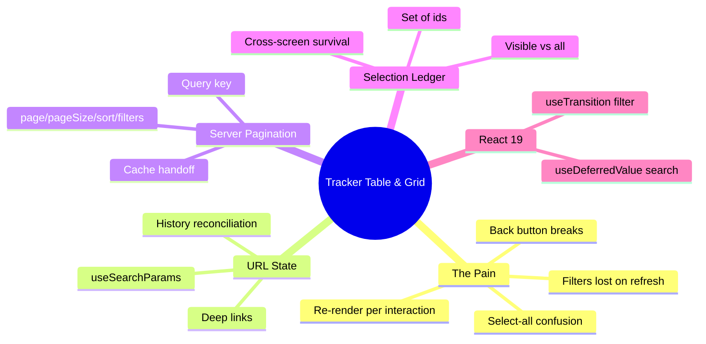

# Module 10: Tracker Table & Grid

Est. study time: 1.2h
Language: en
Description: Build the application tracker grid as a mirror of the URL plus a selection ledger, not a component living in memory.

## Knowledge Map



---

## Learning Objectives (maps to course CILOs)
- Drive the tracker grid from URL search params so filters, sort, and page are deep-linkable and back-button safe — serves CILO 7
- Separate row data (server cache) from selection (client store) so selection survives pagination — serves CILO 7
- Keep search responsive with `useDeferredValue` and filter transitions non-blocking with `useTransition` — serves CILO 7
- Distinguish select-visible from select-all semantics before the batch engine consumes it — serves CILO 8

---

## Real-World Example

Elena runs the "My Applications" tracker in the admissions portal: 3,000 applications across program cohorts. Every reviewer interaction restructures the screen:

- type "CS" in search → the table lags by half a second per keystroke
- click a filter tab → the browser freezes for a moment
- share a filtered URL to a colleague → the colleague lands on unfiltered default, because filters never lived in the URL
- select 40 visible rows, change page, come back → selection gone

Worst case: reviewer applies a cohort filter, navigates to the batch review, comes back — and the tracker forgot everything.

> **Think**: Why does a component-local `useState` for filters feel fine for the first month but breaks by month three?
>
> *Answer: Because "refreshing this page" and "sharing this view" are legitimate product actions, and both destroy component memory. State that describes the *view* is positional — it belongs in the URL, not in a component instance.*

---

## Core Content

### Section 1: The Naive Table and Why It Fails

The naive implementation is honest and wrong:

```tsx
function Tracker() {
  const [rows] = useState(allApplications);   // no server, bad
  const [filter, setFilter] = useState('');
  const [sort, setSort] = useState('deadline');
  // rows.filter(r => r.program.includes(filter)).sort(...)
  return <tbody>{filtered.map(r => <Row key={r.id} row={r} />)}</tbody>;
}
```

Failures, each mapped to a later solution:

1. **All rows in memory** — 3,000 DOM rows, re-rendered on every keystroke. Solved by server pagination (this module) + virtualization (m11).
2. **Filters in component state** — lost on refresh, not shareable, back button ignores it. Solved by URL state, next section.
3. **Sort by deadline while search filters** — recomputed whole dataset per interaction, no transition, so the UI blocks. Solved by `useTransition`.
4. **No selection semantics** — "select all" selects only the 40 mounted rows and nobody knows. Solved by the selection ledger.

> **Think**: Which of those four failures is hardest to discover in testing?
>
> *Answer: #4. Selection semantics look and test correct in isolation but break in the cross-screen flow that batch review (m14) drives. That's why [State Decision] for selection lands in a store, not a component.*

> **Cloze**: "State that describes the current {view} — filters, sort, page — belongs in the URL, while data belongs in the server cache and cross-screen intent belongs in a {store}."
>
> *Answer: view, store*

### Section 2: URL State Reconciliation

The grid becomes a controlled component whose props are the search params:

```tsx
function TrackerRoute() {
  const [sp, setSp] = useSearchParams();
  const page = parseInt(sp.get('page') ?? '1', 10);
  const program = sp.get('program') ?? '';
  const sort = sp.get('sort') ?? 'deadline';

  const setFilter = (k: string, v: string) => {
    setSp(prev => {
      const next = new URLSearchParams(prev);
      if (v) next.set(k, v); else next.delete(k);
      next.delete('page'); // any filter change resets to page 1
      return next;
    }, { replace: false }); // push → back-button history
  };
  return <TrackerGrid page={page} program={program} sort={sort} onChange={setFilter} />;
}
```

Rules that make this clean:

- **Serialization is the contract**: every grid prop round-trips to a search param and back. Tests assert `URLSearchParams → props → URLSearchParams`.
- **Filter change resets page**: otherwise the URL says "page 8 of the unfiltered set" and becomes wrong. Client-side to keep one source of truth.
- **Push vs replace**: user interactions push (back button steps through), internal reconciliation replaces.
- **Coalesce by history semantics**; rapid filter typing doesn't flood history — `useDeferredValue` (below) naturally groups keystrokes.

> **Predict**: The reviewer filters by "full" cohort and refreshes. What renders?
>
> *Answer: The URL still says filter=full, so the grid rehydrates exactly the prior view. Deep-linkable, bookwormable, back-button-correct — because the view lived in the URL, not in component memory.*

### Section 3: Server Pagination and the Query Key

Each view state maps to a query key by value, not by text:

```tsx
const { data, isPending } = useQuery({
  queryKey: ['applications', page, program, sort],
  queryFn: () => api.listApplications({ page, pageSize: 50, program, sort }),
});
```

- The query key is the *view identity*; TanStack Query (m12, cross-ref external-lib-patterns) caches each distinct view cheaply. Back-navigating to page 2 is a cache hit, not a refetch.
- `pageSize` 50 keeps DOM sane; deepening to virtualization covers 10k-row views (m11).
- `isPending` vs `isRefetching` distinguishes first load from background refresh — the old rows stay visible during refetch (stale-while-revalidate), no fl;ashing skeletons.

> **Think**: Why not store *rows* in the query key instead of the *filters*?
>
> *Answer: The filters are the identity; rows are the result. Keying by result invalidates on every data change and destroys the back-button cache. Key by identity — caching is a byproduct of view stability.*

### Section 4: The Selection Ledger

Row selection is cross-screen intent: the batch bar shows "12 selected", batch review (m14) consumes the ids. So selection lives in the selection store (zustand mechanics: cross-ref zustand-state-management):

```tsx
const useSelection = create<SelectionState>()((set, get) => ({
  ids: new Set<string>(),
  lastFilterWindow: null,            // identifies *which* set "all visible" referred to
  toggle(id: string) { /* ... */ },
  selectVisible(viewWindowId: string, ids: string[]) {
    set(s => ({ ids: new Set(ids), lastFilterWindow: viewWindowId }));
  },
  selectAllMatching(viewWindowId: string, ids: string[]) { /* replaces set, remembers window */ },
}));
```

**Select-visible vs select-all:** "select visible" = replace selection with the current page's ids. "select all" = select every id matching the current filter — which requires the query layer to tell you the *total matching count*, not the mounted rows. If you don't have the total (server didn't return it), select-all must be a server request, not a client guess.

> **Spot the Mistake**: `selectAll: (pageIds) => set({ ids: pageIds })` wired to a button labeled "Select all 3,000".
>
> What's wrong?
>
> *Answer: It selects only the 50 visible ids. The label promises a filtered universe; the code delivers a page. Track total-match-count from the server and gate the button on it, or rename the button "select these 50".*

### Section 5: Search Responsiveness and Transitions

Two React 19 tools make the grid feel instant even when the dataset is heavy (cross-ref advanced-react-19 for depth):

```tsx
const [query, setQuery] = useState('');        // typed value
const deferredQuery = useDeferredValue(query); // lagged value for the grid

const [isPending, startTransition] = useTransition();
const onFilter = (tab: string) => startTransition(() => setFilter(tab));
```

- `useDeferredValue` keeps the input's cursor/stutter free while the *grid* renders the lagged filter value. The keystroke and the expensive work stop competing.
- `useTransition` wraps the tab filter so navigation to the heavy view renders non-blockingly; `isPending` styles the tab as "pending".
- Order matters: you still want virtualization (m11) and server pagination underneath — deferral buys perceived speed, not DOM scale.

> **Cloze**: "`{useDeferredValue}` keeps the text input responsive while the expensive grid render uses the latest value, and `{useTransition}` makes heavy filter swaps non-blocking."
>
> *Answer: useDeferredValue, useTransition*

---

### Section 5.5: [State Decision] — Tracker State Map

| State | Where | Why |
|---|---|---|
| filters, sort, page | URL search params | positional, persistent, shareable |
| search input text | `useState` | typing buffer; deferred downstream |
| row data | query cache (m12) | server-derived, keyed by view |
| selected ids | zustand selection store | cross-screen batch intent, frequent writes |
| column widths / collapsed sections | `useState` per grid instance | cosmetic, local |

The grid owns none of the data it displays; it mirrors the URL and reads the cache.

---

### Why This Matters

Every batch operation in this course — selecting 12 applications and submitting them together (m14) — starts with a grid that must survive navigation, sharing, and refresh. A tracker that forgets its own view destroys reviewer trust; the URL pattern is the load-bearing fix.

---

## Key Takeaways
- Grid view state = URL state: serializable, deep-linkable, back-button safe
- Query key = view identity; cache the view, never the result list
- Selection is cross-screen intent → zustand ledger, with explicit select-visible vs select-all
- `useDeferredValue` for input lag, `useTransition` for heavy swaps, server pagination for scale
- Any filter change resets page to 1; internal reconciliation uses replace, user actions push

---

## Common Misconception

*"The grid component should own its state so it works standalone."* The tracker is never standalone — it feeds batch review, feeds impersonation checks, feeds the selection ledger. Components that hoard view state become untestable mirrors of a URL nobody can reach.

---

## Spot the Mistake

```tsx
function Tracker() {
  const [filters, setFilters] = useState({ program: '', page: 1 });
  useEffect(() => history.replaceState(null, '', buildUrl(filters)), [filters]);
}
```

What's wrong?

*Answer: Writing to history in an effect is a mirror, not a source of truth — the URL can be inconsistent with state on first paint, back button traverses stale mirrors, SSR/hydration flags. src = URL, mirror = component; read params, write back through the same API.*

---

## Feynman Explain
(Imagine a filing cabinet where the drawers are labeled by what's inside. You tell a friend: "The drawer labels are the page's memory — refresh the page and the labels are still there because they're written on the cabinet, not in your head." Components that keep memory in their own head forget it when they close.)

---

## Reframe
(Judge: what about grids that are purely in-memory tools — a draft spreadsheet the user never shares? When the URL pattern becomes ceremony and state should stay local?)

---

## Drill
Take the quiz. MCQs test different angles — recall, application, scenario.

Run: `learn.sh quiz enterprise-react-ui-patterns 10-tracker-table-grid`