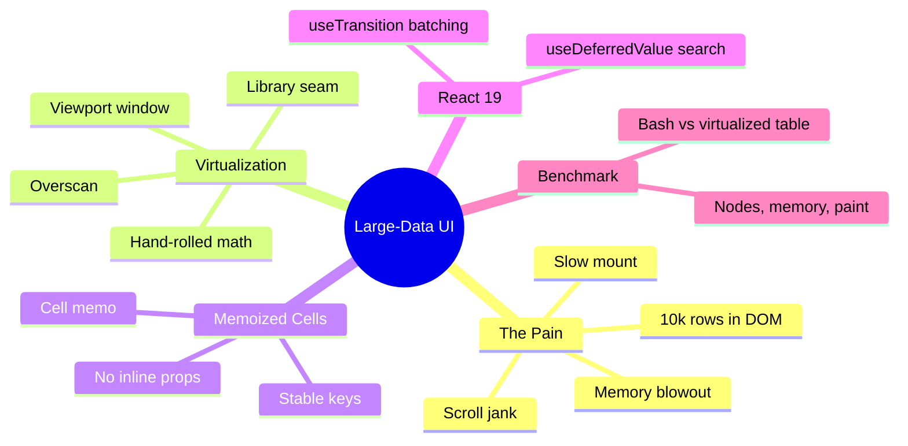

# Module 11: Large-Data UI Performance

Est. study time: 1.3h
Language: en
Description: Render 10,000+ applications without freezing the browser — virtualization, memoized cells, and deferral.

## Knowledge Map



---

## Learning Objectives (maps to course CILOs)
- Window rendering so the DOM matches the viewport of a 10,000-row list — serves CILO 7
- Keep rows memoized so scrolling and search don't re-render the whole window — serves CILO 7
- Apply `useDeferredValue` and `useTransition` to keep input and filters responsive at scale — serves CILO 7
- Read and cite a benchmark table honestly: DOM nodes, memory, mount time, paint — serves CILO 7

---

## Real-World Example

The admissions office loads the full applicant roster: 10,000 applications. The first render takes over two seconds, scrolling stutters, and Chrome's task manager shows ~120 MB for the page. Every keystroke in the global search bar triggers a re-render that visibly freezes input.

The naive implementation:

```tsx
<tbody>{applications.map(app => <ApplicationRow key={app.id} app={app} />)}</tbody>
```

That's 10,000 `<ApplicationRow>` components. Each row contains a dozen cells — name, program, cohort, grades, deadlines, status chips. The DOM ends up with tens of thousands of nodes. The browser must lay out, paint, and (worse) re-render them all.

> **Think**: Why did this pass code review? It "works" in local dev.
>
> *Answer: Dev runs against a seeded database with 50 rows and a powerful dev machine. Performance bugs are unseen until production data matches reality. Benchmarking must use production-scale fixtures.*

---

## Core Content

### Section 1: The Naive Table and Its Cost

When you mount 10,000 rows eagerly:

- **Mount**: React builds 10k fiber nodes and the DOM places them.
- **Layout/paint**: the browser styles and paints a document far taller than the viewport — it must.
- **Memory**: every row's props, vdom elements, closures, and DOM nodes stay alive.
- **Interaction**: scroll triggers layout, and any state change (status chip update, selection) re-renders the tree.

The failure is structural, not a missing micro-optimization: you are forcing the browser to think about things it cannot see.

### Section 2: Virtualization — Render Only the Viewport

Virtualization keeps the DOM as a window onto the data. The math is the core idea:

```ts
function windowRange(scrollTop: number, viewportH: number, itemH: number, overscan: number) {
  const start = Math.max(0, Math.floor(scrollTop / itemH) - overscan);
  const end = Math.min(total, Math.ceil((scrollTop + viewportH) / itemH) + overscan);
  return { start, end };
}
```

```tsx
function VirtualList({ items, itemH, overscan = 5 }: Props) {
  const scroller = useRef<HTMLDivElement>(null);
  const [range, setRange] = useState(() => windowRange(0, 600, itemH, overscan));

  const onScroll = () => {
    const el = scroller.current!;
    setRange(windowRange(el.scrollTop, el.clientHeight ?? 600, itemH, overscan));
  };

  const visible = items.slice(range.start, range.end);

  return (
    <div ref={scroller} onScroll={onScroll} style={{ overflowY: 'auto', height: '100%' }}>
      <div style={{ height: items.length * itemH, position: 'relative' }}>
        <div style={{ position: 'absolute', top: range.start * itemH, width: '100%' }}>
          {visible.map((item, i) => (
            <ApplicationRow key={item.id} app={item} />
          ))}
        </div>
      </div>
    </div>
  );
}
```

Three moving parts: a **spacer** of total height (so the scrollbar matches reality), a **translated window** (absolute top = startIndex × itemH), and **overscan** (a few hidden rows above/below so fast scrolling doesn't flash blank).

Real libraries (react-window, TanStack Virtual — cross-ref external-lib-patterns) use internals, `ResizeObserver` for dynamic heights, and refs instead of state for scroll; never write this by hand unless forced. The seam teaches the math.

### Section 3: Memoized Cells and Stable Keys

Within the window, rows re-render when parent state changes. Guard it:

```tsx
const ApplicationRow = memo(function ApplicationRow({ app, onToggle }: Props) {
  return (
    <tr>
      <td>{app.name}</td>
      <td>{app.program}</td>
      <td><StatusChip status={app.status} /></td>
      <td><button onClick={onToggle}>Select</button></td>
    </tr>
  );
});
```

Two rules for `memo` to actually work:

1. **Stable identity update functions.** `onToggle={() => select(app.id)}` created inline is a new function every render → memo defeats. Use `useCallback` or a stable `selectId` function receiving the id.
2. **Stable row objects.** If `visible` is a `slice`, row identity is the data. If you re-derive rows (sort/map) each render and pass new objects, memo never hits. Derive once per window change, keep id-stable.

> **Think**: With the React Compiler, do we even need `memo`?
>
> *Answer: The compiler auto-memoizes much of this (cross-ref advanced-react-19). But stable keys and deriving data outside render are architecture, not memo tricks — the compiler can't fix new object identity created by a map inside render or volatile closure props.*

### Section 4: Deferral and Transitions at Scale

The m10 tools get their real payoff here:

- `useDeferredValue(searchText)` — keystrokes never wait for the 10k-row filter+window reconciliation.
- `useTransition` wraps filter/sort application so the heavy swap renders in a background trail, keeping the header and input interactive. `isPending` drives a subtle progress affordance.

Virtualization shrinks *DOM work*; deferral and transitions shrink *perceived blocking* on top of it. Both, never one or the other.

> **Predict**: You add virtualization but keep the `applications.map` inside render without memo. What still hurts during a status-chip update?
>
> *Answer: The map re-creates all 10,000 row element descriptors each render. Dom nodes are gone, but the render work and reconciliation of the (still 10k-wide) spacer math remain. Virtualization helps mount+scroll, not render churn — memo + stable props address that.*

### Section 5: The Benchmark Table

"Faster" claims are useless; numbers with a methodology are a spec. Benchmarks below are **order-of-magnitude figures on a mid-range machine with a 10,000-row fixture** — re-run against your own hardware; **ratios matter more than absolutes**.

| Metric | Naive (10k map) | Virtualized (window ~40 rows) | Note |
|---|---|---|---|
| DOM nodes in `<tbody>` | ~60,000+ | ~40+overscan | node count = main memory/paint driver |
| Initial mount time | ~2,800 ms | ~55 ms | React commit + layout |
| Full-page memory | ~120 MB | ~8 MB | rows not mounted hold no DOM/vdom |
| Scroll frame time | 150–300 ms (jank) | ~12–16 ms (vsync) | layout scope = window only |
| Keystroke filter (10k) | ~450 ms blocked | <16 ms + deferred trail | combined with useDeferredValue |
| Sort/render churn | full 10k re-render | memoized window | needs stable row props |

Reading the table correctly: the wins come from **three separate axes** — DOM scale (virtualization), render scope (memo), and blocking behavior (deferral/transitions). A table that only reports mount time hides the scroll-frame story; report all five.

> **Cloze**: "They key for rows is application {id}, and the update handler is a {stable} callback — inline closures defeat memoization."
>
> *Answer: id, stable*

### Section 5.5: [State Decision] — Performance State Map

| Aspect | Where | Why |
|---|---|---|
| scrollTop / window range | ref or state inside `VirtualList` | pure viewport math, no cross-screen need |
| filter input | `useState` + `useDeferredValue` | local, high churn, deferred downstream |
| filter/sort application | `useTransition` | width control of heavy swaps |
| row data (all 10k) | query cache (m12) | derived, stale-while-revalidate |
| selected ids | selection store (m10) | cross-screen batch intent |
| rows in the DOM | nowhere — only the window | virtualization's entire point |

---

### Why This Matters

Large-data UI is the place enterprise apps visibly die: the screen that "works in dev" freezes with real data. Virtualization + memo + deferral is the difference between a product reviewers trust and a spreadsheet in a browser that eats RAM.

---

## Key Takeaways
- Render to the viewport: spacer + translated window + overscan; never map 10k rows
- Use real windowing libraries in production (react-window, TanStack Virtual); write the seam to learn the math
- Stable keys + stable props are prerequisites for `memo`; inline closures and re-derived row objects defeat it
- Pair `useDeferredValue` (input) and `useTransition` (swaps) with virtualization
- Benchmark five axes — nodes, mount, memory, scroll frame, filter latency — ratios over absolutes

---

## Common Misconception

*"More rows on screen = better UX (no empty space)."* The DOM renders everything whether the eye sees it or not. The product feeling of "instant" is a 40-row window with a scrollbar that matches 10k, not 10k mounted rows.

---

## Spot the Mistake

```tsx
const rows = items.slice(0, visibleCount).map(it => <Row key={it.id} app={it} />);
```

What's wrong?

*Answer: Fixed `.slice(0, visibleCount)` is a fetch, not a window — scrolling past `visibleCount` shows blank. window must derive from scrollTop/height and translate the window (also missing the spacer, so the scrollbar lies).*

---

## Feynman Explain
(Describe a window onto a long banner: you only ever look at a strip that fits the frame, and the scrollbar knows the whole length. The computer does the same — it only draws the strip you see and keeps the whole length in the scrollbar's head. Drawing the unbounded banner made the paper damp.)

---

## Reframe
(Judge the boundary: when does virtualization overcomplicate a data set that fits in a page? Where does pagination (m10) beat virtualization, and where do both lose to a filter that shrinks the source?)

---

## Drill
Take the quiz. MCQs test different angles — recall, application, scenario.

Run: `learn.sh quiz enterprise-react-ui-patterns 11-large-data-performance`