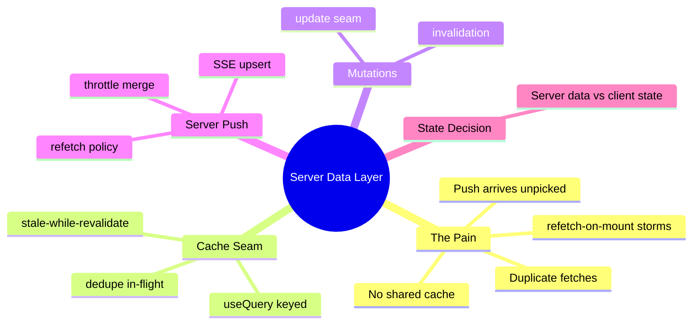

# Module 12: Server Data Layer

Est. study time: 1.2h
Language: en
Description: Replace refetch storms with a cache seam, coordinated invalidation, and server-push merged into one truth.

## Knowledge Map



---

## Learning Objectives (maps to course CILOs)
- Replace scattered `useEffect` fetches with a typed query cache that dedupes and caches by key — serves CILO 7
- Invalidate and update the cache from mutations so post-mutation refetch is coordinated, not a storm — serves CILO 7
- Merge server push (SSE) into the cache as an upsert and throttle bursts into single UI transitions — serves CILO 7
- Decide server-derived data (cache) vs client-authored state (zustand) against real conditions — serves CILO 2

---

## Real-World Example

Reviewer opens the dashboard. Behind the scenes the app fires:

- programs list (header) — one request
- cohort list (sidebar filter) — same data, one request
- status counts (summary bar) — another count
- maybe the tracker (m10) mounts and queries again

`useEffect(() => fetch('/api/programs'), [])` in every component means the same `/api/programs` payload travels three times. Add tab-focus refetch, filter change, and a push event that says "application 4213 status changed", and each client is orchestrating its own tiny network storm.

> **Think**: Why is "each component fetches what it needs" so appealing at small scale?
>
> *Answer: It is the simplest possible code — no shared contract, no cache invalidation, no coupling. It only collapses when many components need the same server truth, and the network behaves like a shapeless flood.*

---

## Core Content

### Section 1: The Naive Fetch Feud

```tsx
function ProgramSelect() {
  const [programs, setPrograms] = useState([]);
  useEffect(() => { fetch('/api/programs').then(r => r.json()).then(setPrograms); }, []);
  // ...
}
```

Costs compound: duplicate in-flight requests, no cache (same list n times), no stale-while-revalidate (every mount = spinner flash), no coordinated invalidation after a mutation, and every `.then(setPrograms)` is untyped (m4 schema seam kills that).

### Section 2: The Query Cache Seam

A query layer is a **cache keyed by identity with a state machine**. Simplified TanStack Query seam (real lib: cross-ref external-lib-patterns):

```tsx
const queryCache = new Map<string, QueryEntry>();

function useQuery<T>(key: string[], fetcher: () => Promise<T>) {
  const k = JSON.stringify(key);
  // dedupe in-flight: same key while loading shares ONE promise
  // stale-while-revalidate: show cached data + background refetch by default
  const { data, status } = useSyncExternalStore(queryCache.subscribe, () => queryCache.read(k));
  useEffect(() => { /* fetch on miss or stale; mark refetching */ }, [k]);
  return { data, status };
}
```

Contract beats implementation:

- **Key = identity** (m10 learned this for the grid). Same key, same data; separate keys are separate domains.
- **Dedupe**: two subscribing components with the same key get one in-flight promise.
- **Stale-while-revalidate**: first paint shows cache; background refetch replaces it silently.
- **Typed**: `fetcher` returns zod-`parse`d data (m4).

> **Think**: Where does the cache state machine sit — inside React?
>
> *Answer: No. It's an external store the components subscribe to, bridgeable with `useSyncExternalStore` (cross-ref advanced-react-19, zustand-state-management for the subscription bridge). React owns rendering; the cache owns truth.*

> **Cloze**: "Query caching is keyed by {identity}, dedupes {in-flight} requests, and serves {stale} data while revalidating in the background."
>
> *Answer: identity, in-flight, stale*

### Section 3: Mutations, Invalidation, Updates

A mutation changes server truth → the cache must learn. Two mechanisms, in order of preference:

1. **Optimistic update / cache write** (`updateCache(key, newRows)`) when the client knows the new shape — instant, no refetch. Deep-dived risks in m14.
2. **Invalidation** (`invalidateKeys(['applications'])`) → refetch on next read — correct, but a round-trip.

Rule of thumb: invalidate what you can't compute, optimistically set what you can. A broken update, like:

```tsx
await api.submitApplication(draft);
queryCache.invalidate(['applications']); // coordinator, not storm
```

replaces the pre-cache pattern where each component guessed when to refetch.

> **Predict**: An optimistic cache write is applied, then the server rejects with a 422 partial-failure. What does the update rule demand?
>
> *Answer: A rollback of the write plus reconciliation of the per-field errors — exactly the batch engine's cleanup in m14. Optimism without a rollback path is lying.*

### Section 4: Server Push Merged into the Cache

Status changes arrive from elsewhere (reviewer, admin, batch processing). Polling every five seconds is a wanton refetch storm. SSE delivers pushes; the client must **merge them as cache upserts**, not as imperatives to re-render:

```tsx
const statusStream = new EventSource('/api/applications/status-stream');
const queue: StatusEvent[] = [];

statusStream.onmessage = (e) => {
  queue.push(JSON.parse(e.data));          // merge/throttle beat
  clearTimeout(t);
  t = setTimeout(flush, 80);               // coalesce burst
};

function flush() {
  const batch = queue.splice(0);            // draught of recent changes
  queryCache.patch('applications', rows =>
    rows.map(r => batch.find(s => s.id === r.id)?.status ?? r.status));
  // ONE UI transition for the batch, not N re-renders
}
```

Rules: **upsert**, not replace (only touched rows change); **throttle/coalesce** bursts into one state transition (paint batching); push never refetches the world — it patches the cache entry.

> **Cloze**: "Server pushes are merged into the cache as {upserts}, and bursts are coalesced by a {throttle} so many events become one UI transition."
>
> *Answer: upserts, throttle*

### Section 4.5: [State Decision] — Cache vs Client State

| State | Home | Why |
|---|---|---|
| program/cohort/campus options | query cache | server-derived, shared, keyed by filter |
| application rows | query cache | source of truth is the server |
| draft field values | zustand (m2/m14) | client-authored, persisted locally |
| selection ledger | zustand (m10) | cross-screen intent |
| impersonation actor | zustand (m6) | app-level client session truth |
| theme / shell flags | context (m9) | read-mostly stable config |

The rule: **server truth lives in the cache, client truth lives in zustand**. Zusstand is not a cache; the cache is not a store of client intent. Violations reproduce the storms this module kills.

---

### Why This Matters

Everything later depends on this seam: dependent options (`m13`) refetch per chain selection; batch submit invalidates per form; CSV import (m15) writes in bulk. The query layer is the reason those modules stay calm instead of firing storms.

---

## Key Takeaways
- A query cache keyed by identity dedupes in-flight work and serves stale data during revalidation
- Mutations invalidate or optimistically patch the cache — coordination beats guess-by-component
- SSE pushes are cache upserts, throttled and coalesced into single UI transitions
- Never store server truth in zustand; never put client intent in the cache
- Typed fetchers (m4 zod) make the seam's contract testable at the MSW boundary (m3)

---

## Common Misconception

*"TanStack Query is just nicer fetch."* It is a cache with a life cycle. The textbooks error is using it as a fetcher-per-component wrapper — same storm, wrapped. The value is dedupe, invalidation, and push merge acting on one keyed truth.

---

## Spot the Mistake

```tsx
function StatusChip({ id }) {
  const [status, setStatus] = useState('pending');
  useEffect(() => { api.getStatus(id).then(setStatus); }, [id]);
  return <Chip>{status}</Chip>;
}
```

What's wrong?

*Answer: StatusChip bypasses the cache — N chips, N fetches, no rollup, no revalidate, and an SSE status change never reaches it. Cheap on screen, catastrophic across 10k applications.*

---

## Feynman Explain
(One shared whiteboard for "what the server told us". Each drawer labeled by what it holds. If two people need "programs", only one runs to fetch it; everyone reads the same board. When the server sends news, one person with a pen corrects the board — nobody re-runs the whole errand.)

---

## Reframe
(Judge: when is a query lib overkill — small data, single consumer, low churn? Where is the cost of the cache (staleness, invalidation bugs) worse than the fetch it removes?)

---

## Drill
Take the quiz. MCQs test different angles.

Run: `learn.sh quiz enterprise-react-ui-patterns 12-server-data-layer`