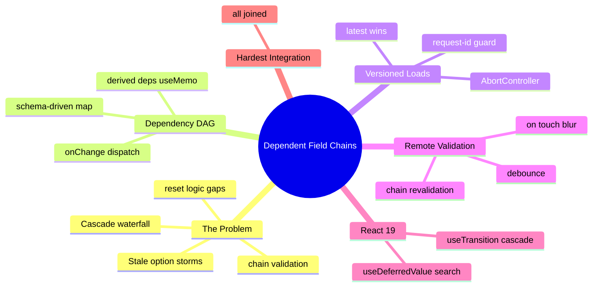

# Module 13: Dependent Field Chains

Est. study time: 1.4h
Language: en
Description: The integration module — program→cohort→campus cascades with live remote validation and versioned option loads.

## Knowledge Map



---

## Learning Objectives (maps to course CILOs)
- Model dependent fields as a schema-driven dependency DAG, not a useEffect waterfall — serves CILO 8
- Version option loads so stale responses can never overwrite a newer selection — serves CILO 8
- Validate per-touched field with correct sharing of a changing chain — serves CILO 8
- Keep the cascade and option search responsive with transitions and deferral — serves CILO 7

---

## Real-World Example

The application form asks: *Program* (BS in CS, BS in Math, ...), then *Cohort* (2026 Fall, 2026 Spring, ...), then *Campus* (Main, Rift Valley, ...). The rule is cascading:

- pick **Program** → the cohort list loads *for this program*
- pick **Cohort** → campus list loads *for this cohort*; grades suddenly required (some cohorts have a GPA floor)
- change **Program** → both cohort and campus reset to empty, and their hidden errors clear

Each field, when touched, remotely validates ("cohort is full", "campus closed for that term").

The naive cascade is a `useEffect` per select:

```tsx
useEffect(() => { fetchCohorts(programId).then(setCohorts); }, [programId]);
useEffect(() => { fetchCampuses(cohortId).then(setCampuses); }, [cohortId]);
```

It works until it doesn't. The reviewer selects *CS → Fall*, then quickly *Math → Spring*. The *CS/Fall* campus response arrives **after** the *Math/Spring* one and stomps the list with the wrong campuses. The UI shows 2026 Fall campuses under a 2026 Spring cohort.

> **Think**: Why does the naive selector-in-effect version look "correct" in a two-second demo?
>
> *Answer: In the demo, responses resolve in the order requested. Real networks reorder. The demo never screenshots the second of the race; production does, daily.*

---

## Core Content

### Section 1: The Dependency DAG, Not a Waterfall

Model the chain explicitly as data. The schema (m4) plus a dependency map:

```ts
const fieldDeps: DependencyMap = {
  cohort: {
    dependsOn: ['programId'],
    load: (deps) => api.listCohorts({ programId: deps.programId }),
    reset: ['cohortId', 'campusId'],          // selecting deranges children
    requiredWhen: (d) => d.programId != null,
  },
  campus: {
    dependsOn: ['cohortId', 'programId'],     // may need program to filter
    load: (deps) => api.listCampuses({ cohortId: deps.cohortId }),
    reset: ['campusId'],
    requiredWhen: (d) => d.cohortId != null,
  },
};
```

The cascade is **derived** state (a `useMemo` over current known values), not effect-driven. Selection events travel down the DAG in an explicit handler:

```tsx
function onProgramChange(id: string) {
  setValue('programId', id);
  cascadeReset('programId');               // children reset (their consumers)
  refreshDependents('programId');          // queue cohort fetch
  revalidateChain('programId');            // children validation re-run
}
```

`cascadeReset` clears child values by reading `fieldDeps`; the same map drives everything. No hidden couplings — the DAG *is* the source of the coupling.

> **Cloze**: "Dependencies are a {DAG}, not a waterfall: selection events travel down explicitly, children {reset} themselves from the same dependency map."
>
> *Answer: DAG, reset*

### Section 2: Version the Loads — Latest Wins

The race fix. Every option request gets a version; only the latest selection's response may write:

```tsx
let cohortReqId = 0;
function loadCohorts(programId: string) {
  const my = ++cohortReqId;                 // this program is now current
  aborter.abort();                          // cancel in-flight fetch
  const ctl = new AbortController();        // m17 cross-ref: races teach detail
  aborter = ctl;
  api.listCohorts({ programId }, ctl.signal)
    .then(opts => { if (my === cohortReqId) setCohorts(opts); })
    .catch(ignoreAbort);                    // AbortError is not a UI error
}
```

Two guards, each covers a failure mode:

- **request-id guard** — resolves don't overwrite a newer selection even if AbortController raced
- **AbortController** — the browser actually cancels the wire work and memory is freed

> **Predict**: Cohort A is selected, its fetch aborts mid-flight, then its response was already in the wire when the abort fired. What stops it from painting A's campuses under B?
>
> *Answer: The request-id guard: `my !== writer.id` → the stale data is dropped. Abort best-effort; the guard is the contract.*

### Section 3: Remote Validation Per Touched Field

"Remote" validations (server checks capacity, deadlines) can't go in a sync zod refine — they need a round-trip. Pattern per field:

```tsx
const validateField = useMemo(() => debounce(async (name: string, value) => {
  if (!touched[name]) return;                        // untouched is silent
  setFieldStatus(name, { state: 'validating' });
  const res = await api.validateField(name, value, getDependencies());
  setFieldStatus(name, { state: res.ok ? 'valid' : 'invalid', message: res.message });
}, 300), [getDependencies]);
```

Rules:

- **onBlur/touch, not every keystroke** — type-ahead validation is a network storm (m12 seams)
- **debounce** so the chain still reads a settled value
- **chain-aware**: when a dependency changes, children that were valid re-run (`revalidateChain`); a valid cohort under the old program is meaningless under the new one
- **begin status blocks submit** in the batch engine (m14)

> **Think**: You debounce 300ms. The visitor types in a field, then blurs at 150ms. Is the request sent?
>
> *Answer: On blur, flush the pending debounce — validate deterministically. Otherwise a fast user skips validation and submits into a server 422 (m14 partial-failure path).*

### Section 4: React 19 — Transitions and Deferral Keep It Responsive

The cascade and validation are async and heavy; the input must never freeze:

```tsx
const [isPending, startTransition] = useTransition();

function onProgramChange(id: string) {
  startTransition(() => {                       // mark cascade as transition
    setValue('programId', id);
    cascadeReset('programId');
    revalidateChain('programId');
  });
  refreshDependents('programId');               // option fetch outside render state
}

const deferredSearch = useDeferredValue(searchText);  // big option list filter lagged
```

`useTransition` makes the program swap feel instant while options hydrate after; `useDeferredValue` keeps the cohort search input stutter-free inside 10,000-option lists (m11 seam).

> **Cloze**: "`{useTransition}` wraps the cascade swap so the select feels instant; `{useDeferredValue}` keeps option list search responsive."
>
> *Answer: useTransition, useDeferredValue*

### Section 4.5: [State Decision] — Chain State Map

| State | Where | Why |
|---|---|---|
| field values, touched, status | form/draft store (m14) | client-authored, cross-screen batch |
| derived dependency list | `useMemo` over values + `fieldDeps` | stateless derivation |
| option list per chain edge | query cache (m12), key = deps | server truth, refetch on dep change |
| request version counters | module-level refs | NOT state — must not re-render on write |
| deferred search text | `useDeferredValue` | local, lagged |

The version counter is deliberately **not** React state: writing it re-renders; the guard only needs the latest number, refs serve that without a commit.

---

### Why This Matters

This module is the hardest because it joins schema, cache, races, validation, transitions, and accessibility (live-region errors land in m16). Every enterprise form with cascading selects — program→cohort→campus, country→city→district, plan→addon — hits exactly these bugs. Getting the DAG + versioned loads + chain validation right is the difference between shipping and hotfixing weekly.

---

## Key Takeaways
- Model cascades as a schema-driven dependency DAG; derived `useMemo`, explicit `onChange` dispatch — never effect-waterfall coupling
- Version every option load (request-id guard) and abort stale in-flight fetches; the guard is the contract, Abort is best-effort
- Remote-validate on touch/blur with debounce and chain revalidation; flush debounce on blur
- `useTransition` for cascade swaps, `useDeferredValue` for option search — responsiveness is a feature
- Version counters are refs, not state; server data is cache (m12), client values are the form store (m14)

---

## Common Misconception

*"AbortController alone fixes the race."* Abort is best-effort — browsers cancel, but a nearly-resolved response can still land. The request-id guard on resolution is the actual contract; Abort is an optimization + memory recycle.

---

## Spot the Mistake

```tsx
useEffect(() => {
  api.listCampuses({ cohortId }).then(setCampuses);
}, [cohortId]);
```

What's wrong?

*Answer: Who owns the reset when cohort changes? Nothing. Changing program to a program with no cohort leaves stale campuses mounted, and a late response from the old cohort can paint under the new one. Requires the DAG map + cascadeReset + request-id guard.*

---

## Feynman Explain
(A menu that asks three questions where answers narrow the next one. If you change the first answer, the second and third must be cleared — while the waiter may still be running back with an old menu. Keep a numbered ticket on every order; only the newest ticket's answer may be written on the board.)

---

## Reframe
(Judge: when should cascades come server-driven (a fields schema from `/api/form-schema`) instead of a client DAG map? What breaks first — the map's drift or the server's flexibility?)

---

## Drill
Take the quiz. MCQs test different angles — the hardest module deserves deliberation.

Run: `learn.sh quiz enterprise-react-ui-patterns 13-dependent-field-chains`