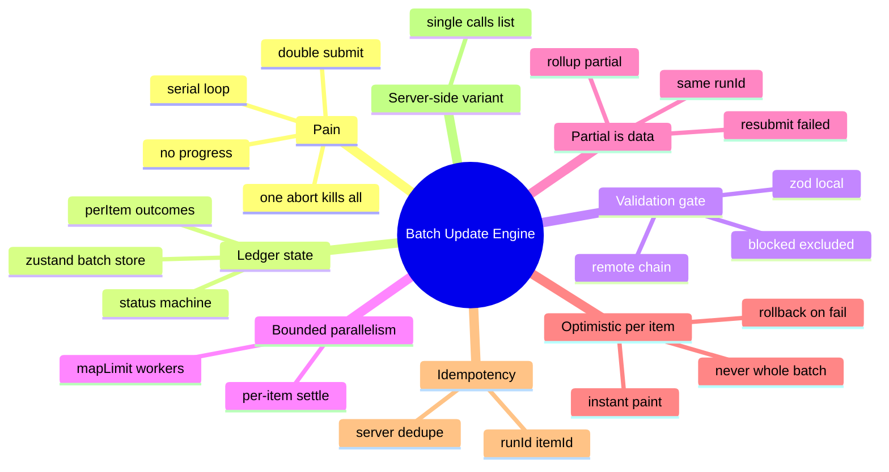
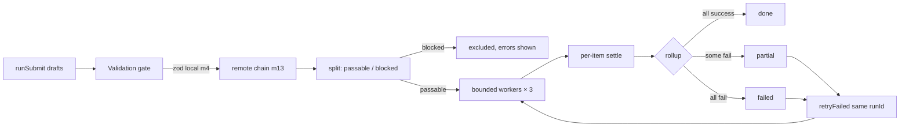

# Module 14: Batch Update Engine

Est. study time: 1.3h
Language: en
Description: Submit many applications in one batch — validation gate, bounded parallelism, per-item outcomes, idempotent retry, optimistic rollback.

## Knowledge Map



---

## Learning Objectives (maps to course CILOs)
- Model a multi-application submit as a per-item ledger state machine in zustand, not a serial await loop — serves CILO 8
- Gate the batch behind combined local and remote validation so blocked items never fire — serves CILO 8
- Run submission in bounded parallelism with independent per-item settlement and partial-failure rollup — serves CILO 8
- Make retries idempotent with `runId + itemId` keys and optimistic updates that roll back per item — serves CILO 8

---

## Real-World Example

Mia is a senior completing her application. She has five drafts: two favorites (CS, Math), a fallback (Physics), and two reach schools (Stats, Data Science). One click — "Submit all applications" — should send all five. It cannot be five sequential enter-tab-submit dances; the portal must feel instant while the server grinds.

The naive first version:

```tsx
async function submitAll(drafts: ApplicationDraft[]) {
  for (const draft of drafts) {
    await api.submit(draft);          // serial round-trips
  }
  toast('All applications submitted');
}
```

The demo passes. Production breaks in four ways at once:

1. **One rejection kills the rest.** Her Stats application violates a GPA floor the server enforces. The `await` rejects, the loop aborts, and Physics/Data Science/CS/Math never fire. Mia believes nothing happened and refreshes — loses her edits.
2. **No partial truth.** Even when some succeed, the UI cannot say *which* landed. The toast is a lie either way.
3. **Frozen UI.** Five sequential round-trips = a button that spins and blocks for seconds with zero progress signal. `await` in render-chained code means no paint between requests.
4. **Double-submit risk.** The server accepts, but the response is lost on the wire. The retry sends the identical application twice. The admissions office now holds duplicate enrollments.

> **Think**: Which of the four failures is the *data* problem and which is the *transport* problem?
>
> *Answer: Failure 2 is the data problem — outcomes exist per item but nothing records them. Failures 1, 3, 4 are transport — the loop's control flow fuses the fate of every item to one promise. A ledger decouples them.*

---

## Core Content

### Section 1: A Batch Is a Ledger, Not a Promise

**A batch is a transaction you can't have.** You cannot wrap five independent server submissions in one ACID transaction from the client — there is no cross-request rollback. What you *can* have is honest bookkeeping: one intent, many independently-settled outcomes.

So model it as a **state machine over per-item results** in the zustand store (m2). Three tiers of state, each with its own owner:

```ts
// The ledger. Lives in zustand — tracker, batch bar, and the
// workflow modal (m8) all render it, cross-screen.
export type BatchStatus =
  | 'idle' | 'validating' | 'submitting'
  | 'partial' | 'done' | 'failed';

export type ItemState =
  | { status: 'pending' | 'queued' | 'submitting' | 'success' }
  | { status: 'blocked'; errors: FieldErrors }
  | { status: 'failed'; reason: string };

interface BatchRun {
  runId: string;
  status: BatchStatus;
  perItem: Map<string, ItemState>;          // appId → outcome
  progress: { total: number; settled: number; succeeded: number; failed: number };
}

interface BatchStore {
  run: BatchRun | null;
  runSubmit: (drafts: ApplicationDraft[]) => Promise<void>;
  retryFailed: () => Promise<void>;
  reset: () => void;
}
```

The `perItem` map is the honest record. `status` is a *derived* rollup you compute after each settlement — never a guess made before the work.

> **Cloze**: "A batch is a {ledger} of per-item outcomes under one intent — partial failure is not an error state, it is the {honest} result."
>
> *Answer: ledger, honest*

### Section 2: The Pipeline — Validate, Submit, Rollup



Each stage has a job; none of them may swallow the fate of all items.

### Section 3: The Validation Gate — Block, Never Abort

Before a single POST goes out, all items validate together:

```ts
async function gateBatch(drafts: ApplicationDraft[]) {
  // 1. Local zod parse per draft (m4) — sync, no network.
  const local = drafts.map(d => ({ id: d.id, errors: applicationSchema.safeParse(d) }));

  // 2. Remote checks per draft (m13) — GPG floor, cohort capacity,
  //    deadline. Batch endpoint so the N round-trips stay one.
  const remote = await api.validateBatch(drafts.map(d => d.id));

  const perItem = new Map<string, ItemState>();
  for (const d of drafts) {
    if (localErr(d)) perItem.set(d.id, { status: 'blocked', errors: localErr(d).issues });
    else if (remoteErr(d)) perItem.set(d.id, { status: 'blocked', errors: remoteErr(d) });
    else perItem.set(d.id, { status: 'pending' });
  }
  return perItem;
}
```

Blocked items join the ledger as `blocked` with their field errors mapped to the form — Mia edits the GPA section, and *only that item* requeues. The other four are already passed; the gate does not re-run them into the void.

> **Think**: Why block-and-exclude instead of letting the server 422 each bad item mid-flight?
>
> *Answer: Rejections are cheap; batches through the server are not. Blocking before firing means the server never sees a known-invalid application, the failure is attributable to a field (`m13` remote validation conventions), and the user fixes edits instead of fighting per-item 422 banners.*

> **Predict**: Mia edits the fixed GPA field and hits "submit" again. What happens to items that already passed the gate?
>
> *Answer: `runSubmit` gates **all** drafts again — cheap local zod, one batch remote call. Statuses empty on submit, so the gate is the only entry. Re-gating everything is the safe default: cohort capacity may have closed since the first gate ran.*

### Section 4: Bounded Parallelism — Three Workers, Not Thirteen, Not One

The submission phase is `mapLimit` — a small worker pool over the passable ids. Each item settles **independently**; a rejection is data, never a thrown promise that aborts siblings:

```ts
async function mapLimit<T>(items: T[], limit: number, fn: (item: T) => Promise<void>) {
  const queue = [...items];
  const workers = Array.from({ length: limit }, async () => {
    while (queue.length > 0) {
      const item = queue.shift()!;
      await fn(item);               // one item's throw dies in THIS worker's frame
    }
  });
  await Promise.all(workers);
}
```

Why not all-at-once (`Promise.all`)? The server has one admissions write path. Thirteen concurrent writes are a connection storm, and the DB write path serializes them anyway — you pay the latency of the slowest anyway, minus fairness. Why not serial? Five apps × 300ms = 1.5s of wall time that a 3-lane window collapses to ~600ms, and progress streams sooner. Three is a lane count that saturates one round-trip per worker without melting the server's connection pool. Tune by measuring the top-level API's p95 in the mock server (m3 seam) — it is the load test you already have.

The settle happens inside the worker:

```ts
async function settleItem(id: string, draft: ApplicationDraft, runId: string) {
  const set = (s: ItemState) => run.perItem.set(id, s);
  set({ status: 'submitting' });                    // optimistic paint (Section 6)
  try {
    const res = await api.submitApplication({ runId, itemId: id, fields: draft.fields });
    set(res.ok ? { status: 'success' } : { status: 'failed', reason: res.reason });
  } catch {
    set({ status: 'failed', reason: 'network' });   // timeout DOES settle failed
  }
  bumpProgress();
}
```

The `catch` is crucial: **a network error is a settlement state, not a control-flow escape**. The item failed, its row shows it, and the retry (Section 5) owns recovery. Nothing propagates to abort siblings — and notice the *same* branch handles both the server 422 and the wire drop. Same failure mode for the user.

### Section 5: Partial Failure Is Data — Rollup and Resubmit

After all workers drain, roll up the ledger:

```ts
function rollup(): BatchStatus {
  const { perItem } = get().run!;
  let ok = 0, bad = 0;
  for (const s of perItem.values()) {
    if (s.status === 'success') ok++; else if (s.status === 'failed' || s.status === 'blocked') bad++;
  }
  if (bad === 0) return 'done';
  if (ok === 0) return 'failed';
  return 'partial';                                // some ok, some bad — the honest answer
}
```

The UI renders the rollup: the batch bar counts `4 submitted · 1 failed`, the tracker grid marks each row's settled state, and a banner offers **Resubmit failed** instead of a rerun of everything.

Resubmit targets **only** failed ids, and critically it reuses the **same `runId`**:

```ts
async function retryFailed() {
  const run = get().run!;
  const failedIds = [...run.perItem.entries()]
    .filter(([, s]) => s.status === 'failed')      // blocked excluded too
    .map(([id]) => id);
  if (failedIds.length === 0) return;
  await runSubmit(failedIds, { runId: run.runId }); // same run — idempotency is the contract
}
```

Why the same `runId`? Because the failure may be a *lost response*, not a failed write. The server kept a settlement ledger keyed by `(runId, itemId)`; when the retry lands, it sees the pair already recorded and returns the **stored outcome instead of re-processing**. No double enrollment. A new `runId` would manufacture a second submission out of the same click.

> **Cloze**: "Retry reuses the same {runId} — the server dedupes by {runId} + itemId, so a retried item whose write actually landed returns its stored outcome instead of double-submitting."
>
> *Answer: runId*

> **Predict**: The wire drops the response *after* the server committed Mia's Math application. The client marks it `failed: network`. She clicks resubmit. What does the server do?
>
> *Answer: It finds `(runId, app-math)` already settled and returns that stored `ok:true`. The client settles it `success`. One enrollment, one round-trip, zero duplicates.*

### Section 6: Optimistic Per Item — Paint First, Roll Back Deliberately

"I feel instant" is not a nicety here: a five-second frozen button reads as "the portal crashed", and users refresh — losing drafts. Two layers, one rule.

**Rule: optimistic-commit per item, never per batch.** The batch bar never shows 5/5 done before the last item settles. You can lie about being *in flight*; you may never lie about being *committed*.

**Layer 1 — the store is already optimistic.** `set({ status: 'submitting' })` in `settleItem` is a synchronous zustand write. Every screen subscribed to the store (tracker, batch bar, workflow modal m8) paints `submitting` a frame after the click, with zero awaits between click and paint. That *is* optimistic UI — the store write is the render pipeline.

**Layer 2 — `useOptimistic` for row-local previews** (see advanced-react-19 for the hook's mechanics). Use it where the row's *value* itself must flash forward while its truth round-trips:

```tsx
function ApplicationRow({ app }: { app: ApplicationDraft }) {
  const [display, addOptimistic] = useOptimistic(app, (cur, s: ItemState) => ({
    ...cur,
    displayState: s.status,            // 'submitting' → instant paint
  }));
  const engine = useBatchStore(s => s.run?.perItem.get(app.id));

  useEffect(() => {
    if (engine?.status === 'submitting') addOptimistic(engine);
    if (engine?.status === 'failed') addOptimistic({ status: 'idle' }); // explicit rollback
  }, [engine, addOptimistic]);

  return (
    <tr data-state={display.displayState}>
      <td>{display.program}</td>
      <td>{display.displayState}</td>
    </tr>
  );
}
```

Rollback mechanics matter. React discards the optimistic value **only when the base (external) value changes** — on success the query cache row commits (m12 `setQueryData`) and React drops the flash automatically. On failure the cache never changes, so **you must roll back explicitly**: re-dispatch the optimistic setter with the real state. Forgetting the failure branch is how rows sit frozen on "submitting" forever — the most common optimistic-UI bug in the wild.

### Section 7: [State Decision] — Where the Batch Lives

| State | Where | Why |
|---|---|---|
| batch status + `perItem` + progress | zustand batch store | cross-screen (tracker, bar, modal m8), high-frequency writes during submit, must outlive any one component |
| submitted row truth | query cache (m12) per-application | server is the source of truth; optimistic write + `setQueryData` on commit |
| selections / which drafts are checked | selection ledger store (m10) | selection has its own ownership, survives submits |
| request-id / runId counters | refs, not render state | written constantly by guards; must not trigger renders (m13 convention) |
| `useOptimistic` preview value | row component | component-local flash; base value is the store row |

The run ledger goes to zustand and not to the row component's `useState` because **five screens must agree at every frame**. Component state gives you five disagreeing progress bars. The store gives one truth; components are projections.

---

## Verify — Testing the Ledger

The m3 seam earns its keep: tests drive the MSW contract and assert on the *wire*, not on mocks. Draining order is deterministic when workers pick from a queue, so assertions are stable without fake timers.

```tsx
// m3: MSW contract — recording middleware asserts idempotency
const submitted: BatchPayload[] = [];
server.use(http.post('/api/applications/batch/submit', async ({ request }) => {
  const body = await request.json() as BatchPayload;
  submitted.push(body);
  if (body.itemId === 'app-2') return HttpResponse.json({ ok: false, reason: 'gpa_floor' });
  return HttpResponse.json(serverLedger.record(body));   // dedupe by runId+itemId
}));

test('2 of 5 fail → partial rollup, resubmit targets only failures', async () => {
  render(<BatchBar drafts={fiveDrafts} />);
  await user.click(screen.getByRole('button', { name: 'Submit all' }));

  expect(await screen.findByText(/3 submitted · 2 failed/)).toBeInTheDocument();

  await user.click(screen.getByRole('button', { name: 'Resubmit 2 failed' }));
  const resub = submitted.slice(-2).map(p => p.itemId);
  expect(resub.sort()).toEqual(['app-2', 'app-4']);      // never all five again
});
```

- **All-valid batch ends `done`** — bar reaches 5/5, no banner.
- **2-of-5 fail → `partial`** — rollup is the honest state; `done` is *not* reached.
- **Blocked item never fires** — the gated-out id appears zero times in `submitted`.
- **Optimistic rollback** — assert the row has `data-state="submitting"` before MSW resolves, then `failed` after; a delayed handler makes the flash observable (snapshot-when-structural, m3).
- **Idempotency** — make the *first* call for `app-1` return `504` (lost response), then retry: `serverLedger.record` proves the pair processed exactly **once**, and the second call returns the stored `ok:true`.

**Playwright journey (m3):** open tracker → checkbox five drafts → "Submit all" → the bar counts up live → partial banner → "Resubmit failed" → all rows `submitted` → refresh → five applications exist server-side, none doubled.

---

### Why This Matters

Every portal with a "submit many" gesture — multi-application admissions, document batches, enrollment pairs — is a ledger problem the moment it touches a network. The serial loop was never the trap; the trap is *fusing the fates of independent items into one promise*. Ship the ledger and you get progress, partial truth, safe retry, and honest UX for free. Ship the loop and you get angry users, duplicate enrollments, and a Monday hotfix. Retry safety (m17 discusses the general reconciliation machinery) exists in this module as a concrete, testable contract.

---

## Key Takeaways
- A batch is a ledger of per-item outcomes, not a loop — one promise per item, all independent
- Gate first (local zod m4 + remote batch m13) and **block**, so known-bad items never fire
- Submit with `mapLimit(3)` bounded parallelism; every settle is a branch, never a thrown abort
- Partial failure is **data**: rollup to `partial`, render per-item state, resubmit only failures
- Idempotency: `(runId, itemId)` key + server dedupe; retries reuse the **same runId**
- Optimistic per item, never per batch; roll back explicitly on failure, never rely on a redraw

---

## Common Misconception

*"If an error is thrown, the batch fails; catch it and the batch succeeded."* Both halves are wrong. A thrown promise kills *this item*, not the batch — per-item settlement means a 422 for Stats leaves Math untouched. And "caught = done" hides the truth that the item is still unsubmitted. The correct world is ternary: each item lands in exactly one of `success` / `failed` / `blocked`, and the rollup *derives* `done | partial | failed` from the counts. There is no exception-based batch result.

---

## Spot the Mistake

```tsx
await Promise.all(drafts.map(async (d) => {
  const res = await api.submit(d);
  if (!res.ok) setBatchStatus('failed');            // one bad item → whole batch 'failed'?
  else setBatchStatus('done');                      // but the first ok response races…
}));
```

What's wrong?

*Answer: Two bugs. (1) The atomic status set races — five parallel responses fight over one `status` string, and the last writer wins; with one good and one bad item, order decides whether Mia sees "failed" or "done". (2) It reports a batch status but not *which item* failed — nobody can act on the outcome. The per-item ledger removes both: each item carries its own state, and `rollup()` computes the batch status after all workers drain.*

---

## Feynman Explain

(Tell a child: imagine you mailed five letters in one go, and the post office tells you two have bad addresses. The honest post office story is: three letters delivered, two sent back with red stamps — not "your mail failed". You fix the two envelopes and post *those* again, you don't reprint all five. And you put a number on each envelope so that if the post office lost my receipt, sending it again just proves "this numbered letter was already delivered" instead of mailing a second copy.)

---

## Reframe

(Judge: the whole design assumes per-item independence is *acceptable* semantics. When is it not? When the server write path is genuinely atomic — a tuition payment batch, a contract-signing bundle — per-item partial success is illegal, and the right shape is a server-side `calls[]` endpoint that computes an all-or-nothing transaction, with the client only *rendering* the one verdict. The ledger still helps you *show* progress; it just cannot *decide* success. That is the boundary where client-parallel stops and server-batch begins — see the Variant below.)

---

## Variant — Server-Side Batch Endpoint

When outcomes *must* be atomic (payments, legal filings — not admissions), the client does not fan out; it posts one bundle:

```ts
await api.submitBatch({ runId, calls: drafts.map(d => d.fields) });
// one verdict: { ok: true } | { ok: false, failedAt: index, reason }
```

Tradeoffs vs. client-parallel `mapLimit`:

- **One round-trip** — no queue, no workers, less wiring; the "progress" story shrinks to a width-end spin: you trade granular per-item status for a single latency gate.
- **Atomicity on the server** — the DB wrap does what the client never could: all-or-nothing.
- **The failures still matter** — the `failedAt` index needs the same field-level error mapping, and the retry story becomes "resubmit the whole bundle" (the server's idempotency key is now the whole `runId`).
- **When to choose it** — the write is transactional *by nature*, or the total payload fits a single request. When items are independent files of record with per-item rules (admissions, document batch), `mapLimit` + ledger stays the better shape: no server has to reimplement per-item semantics twice.

At the folder level the decision reads as one line: *atomic by law → server batch; independent by nature → client ledger.*

---

## Drill
Take the quiz. MCQs test recall, the pipeline's ordering, the idempotency contract, and the partial-failure UX.

Run: `learn.sh quiz enterprise-react-ui-patterns 14-batch-update-engine`