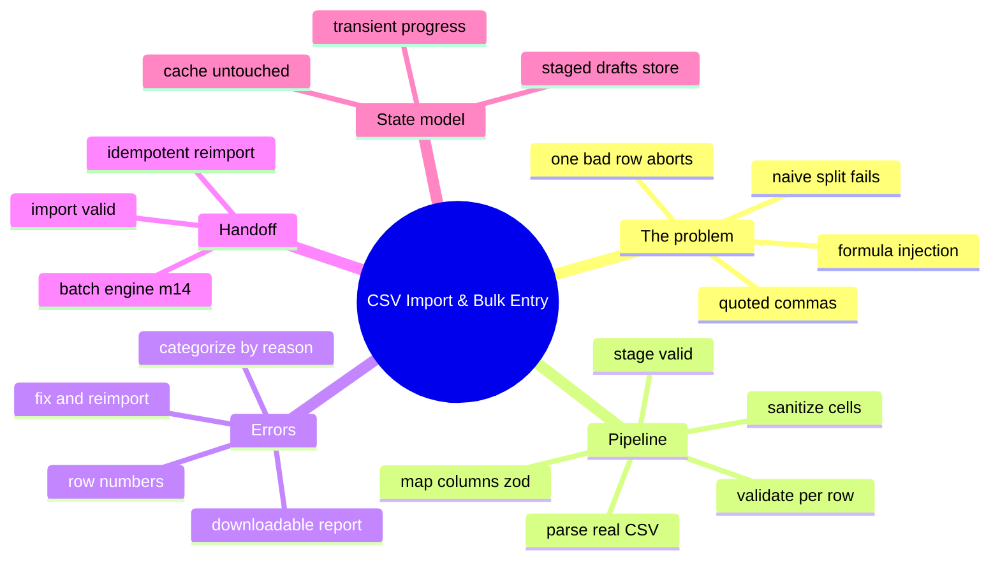
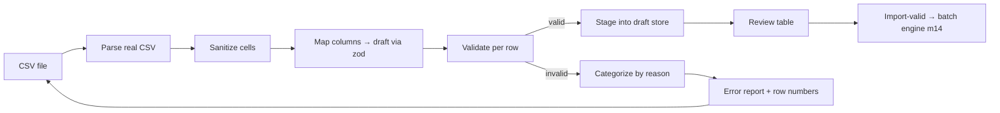

# Module 15: CSV Import & Bulk Entry

Est. study time: 1.3h
Language: en
Description: Ingest 1,000-row CSV into stages — real parsing, cell sanitization against formula injection, per-row honesty, staged review, then hand the batch to the engine.

## Knowledge Map



---

## Learning Objectives (maps to course CILOs)
- Parse CSV with a real parser that honors quotes, escaped quotes, embedded newlines, BOM, and CRLF — serves CILO 8
- Map and sanitize every cell so spreadsheet-formula injection and echoed XSS cannot survive import — serves CILO 8
- Validate per row and stage only valid rows, categorizing failures by reason with downloadable reports — serves CILO 8
- Hand staged rows to the batch engine with idempotent re-import, so a single bad row never blocks the rest — serves CILO 8

---

## Real-World Example

The registrar's office has 1,000 paper/offline applications from a rural intake, already pre-filled into `applications.csv`. The portal imports them as drafts for review and submission. Names contain commas (`Ng, Wing`), addresses contain embedded newlines, the file ends with CRLF, one sheet's grade column says `3.9/4.0`, another says `A-`, and one gifted soul pasted `=2+2+SUM(A1:A1000)` into the *notes* column with `4` already evaluating.

The naive import:

```ts
const lines = csvText.split('\n').map(line => line.split(','));
```

Four ways this detonates:

1. **`Ng, Wing` becomes two columns.** The comma inside an unquoted name shifts every field right by one; the GPA lands in the program-code column, the program code lands in the cohort column. Every row mis-files silently — the worst kind, because nothing errors.
2. **One bad row aborts everything, or everything imports unvalidated.** A missing required grade either crashes the whole import or (worse) silently sails through into the application store.
3. **No error report.** Nobody can name which rows failed, so nobody can fix them. The file goes back and forth by email.
4. **`=HYPERLINK(...)` and `+cmd|...` execute.** When a spreadsheet machine opens the exported report, the formula evaluates — or, if the portal echoes the cell through `dangerouslySetInnerHTML`, the payload runs *in your app*. This is the classic **CSV injection** (a.k.a. formula injection) belt-and-suspenders problem, here wearing both belts.

> **Think**: Which of the four failures is the *text-breaking* problem and which is the *trust* problem?
>
> *Answer: Splitting on commas/newlines is text-breaking — it mis-files commas and splits multi-line addresses. The formula at the front of a cell and HTML-echoed values are trust problems — ingestion must treat every cell as hostile data.*

---

## Core Content

### Section 1: The Pipeline — Parse, Sanitize, Map, Validate, Stage, Commit

Imports are batch operations (m14) with a nasty ingestion phase attached: **make cells inert, make rows honest, make commits incremental.**



Each gate accepts the whole file and emits a *per-row verdict*. Nothing aborts the pipeline; bad rows are routed to the report lane.

### Section 2: Parse With a Real Parser — Never Split, Ever

`split(',')` is not CSV parsing. CSV has a spec: quoted fields, escaped quotes (`""`), embedded newlines, CRLF line endings, and a BOM on files saved from Excel. Use a battle-tested parser — the `uuid` of ingestion — Papaparse or the parser in cross-referenced external-lib-patterns. The required behaviors:

```ts
export interface ParseResult<T> { rows: T[]; rowCount: number; warnedColumns: string[] }

const ROW_LIMIT = 1000;

export function parseCSV(fileText: string) {
  const parsed = Papa.parse(fileText, {
    header: true,              // first row = headers
    skipEmptyLines: 'greedy',
    transformHeader: (h, i) => normalizeHeader(h, i),
  });
  if (parsed.errors.length > 0) throw new ImportParseError(parsed.errors[0]);
  return parsed.data.slice(0, ROW_LIMIT);   // hard ceiling, m11 discipline
}
```

`normalizeHeader` is where legacy enters quietly: lowercase + strip surrounding spaces + collapse whitespace, so `Program Code`, `program code`, and `PROGRAM CODE` all map to the same zod key (m4). Unknown columns are **warned, not dropped silently and not accepted silently** — a header you never read is a data-loss feature you didn't design.

> **Cloze**: "`split(',')` is not CSV parsing — {quoted} commas, `""` escapes, embedded newlines, CRLF, and the {BOM} all break it. Use a real parser."
>
> *Answer: quoted, BOM*

> **Predict**: A CSV has BOM + CRLF, one cell is `"Two\nlines"`, another contains `""escaped""`. What happens to `split('\n')` output vs. a real parser?
>
> *Answer: split produces a garbage row count, boots the BOM into the first header, and cracks the two-line cell into two dangling rows. The real parser yields one clean record per logical line regardless of physical breaks.*

### Section 3: Make Cells Inert — Sanitize Before Anyone Can Trust Them

The security contract for the whole module: **a cell is hostile input until proven text.** Two explosives to neutralize:

**Formula injection**: a cell leading with `=`, `+`, `-`, `@` is interpreted by spreadsheet applications as an expression when someone opens the *exported* CSV. The classic neutralization is a leading tick that forces text mode — or outright rejection for fields where a formula is never legitimate.

```ts
const FORMULA_LEAD = /^[=+\-@]/;

export function sanitizeCell(raw: string, field: string): { ok: true; value: string } | { ok: false; reason: ImportErrorKind } {
  if (FORMULA_LEAD.test(raw)) {
    return { ok: false, reason: 'dangerous_formula' };      // reject — never echo back
  }
  return { ok: true, value: raw };
}
```

Rejection beats prefixing here because the value flows back *into* the portal: a `-1` or `@` cell that the app then renders as records is a quieter wound than `=HYPERLINK`. A rejected cell lands in the error report (`row 482: dangerous_formula in notes`) and the file gets fixed at the source.

**Echoed XSS**: the portal cannot control what a 1,000-row file contains, but it controls every byte it renders. Never `dangerouslySetInnerHTML` a cell, never build a `data:` URI from one, and let React's default escaping do the absurdly cheap heavy lifting. The sanitizer is defense-in-depth; the render convention is the actual wall. (Read as: the sanitizer proves the pipeline; the test proves nothing hostile survives to render.)

> **Think**: Why is sanitizing at parse better than sanitizing at render?
>
> *Answer: Render-time sanitizing defends the screen but leaks the hostile byte into the store, the error report CSV, and any downstream consumer. Sanitizing at parse means one hostile byte ever enters the system once.*

### Section 4: Map Columns → Validate Per Row — Honesty Per Row

With cells inert and headers normalized, map each row to an `ApplicationDraft` through the m4 zod schema — the same schema the interactive form uses, so imported and hand-typed drafts are the *same type*, validated by the *same code*:

```ts
export function mapRowToDraft(row: CsvRow, rowNo: number): DraftResult {
  const draft = {
    programCode: row['programCode'],
    cohort: row['cohort'],
    grades: { gpa: parseGpa(row['gpa']), subjects: splitSubjects(row['subjects']) },
    // …
  };
  const parsed = applicationSchema.safeParse(draft);        // m4: one truth
  if (!parsed.success) return { ok: false, errors: categorize(rowNo, parsed.error) };
  return { ok: true, id: createDraftId(), draft: parsed.data };
}
```

Per-row validation follows the m13 remote-validation patterns for the checks a schema cannot express (does this program code exist? is this cohort open?): a single batched validation call over all valid-parsed rows, settling each row `ok` or `flagged`. The shape of the loop mirrors m14's `perItem` ledger: **each row lands in a verdict; no row is anyone's hostage.**

```ts
export async function validateRows(drafts: ParsedDraft[]) {
  const remote = await api.validateImportBatch(drafts.map(d => d.id));
  return drafts.map(d => {
    if (remote.flagged.has(d.id)) return { ...d, ok: false as const };
    return d;
  });
}
```

### Section 5: Categorize, Report, Stage — Errors Are a Deliverable

Validation failures get **categorized by reason with source row numbers** — the error report is the product; the fix-and-reimport loop is the workflow:

```ts
export type ImportErrorKind =
  | 'missing_required' | 'bad_program_code' | 'invalid_gpa_format'
  | 'invalid_date' | 'cohort_closed' | 'dangerous_formula';

export type RowError = { row: number; kind: ImportErrorKind; field: string; value: string };

const kindByIssue: Record<string, ImportErrorKind> = {
  programCode: 'bad_program_code', gpa: 'invalid_gpa_format', birthDate: 'invalid_date',
};

export function categorize(rowNo: number, err: ZodError): RowError[] {
  return err.issues.map(issue => ({
    row: rowNo,
    kind: kindByIssue[String(issue.path[0])] ?? 'missing_required',
    field: String(issue.path[0]),
    value: issue.input ?? '',
  }));
}
```

The review screen shows the staged-valid count, the grouped failure counts (`12 bad program code · 4 invalid gpa · 1 dangerous formula`), each group expandable to row numbers, and a **"Download report"** button — the categorized errors serialized straight back to CSV so the registrar fixes the source column in place and re-imports:

```ts
function downloadErrorReport(errors: RowError[]) {
  const header = 'row,kind,field,value';
  const body = errors.map(e => `${e.row},${e.kind},${e.field},"${e.value}"`.replace(/,/g, ','));
  const blob = new Blob([`${header}\n${body.join('\n')}`], { type: 'text/csv;charset=utf-8' });
  // anchor download — the export is dead text, never routed through innerHTML
}
```

**Staging** writes the valid rows into the draft store (m2/m14) as pre-filled, un-submitted drafts. They are indistinguishable from hand-typed drafts except for a `source: 'import'` tag — because after mapping through the same zod schema they *are* the same thing. The user reviews them in the staged table, then "Import valid" hands the whole set to the m14 batch engine:

```tsx
function ImportReview({ staged, errorGroups }: ImportReviewProps) {
  const submit = () =>
    useBatchStore.getState().runSubmit(staged.map(s => s.draft));   // m14 ledger owns outcomes

  return (
    <section aria-label="Import review">
      <SummaryCard valid={staged.length} errors={errorGroups} onDownload={downloadErrorReport} />
      <table>
        <thead><tr><th>Row</th><th>Program</th><th>Cohort</th><th>GPA</th><th>State</th></tr></thead>
        <tbody>
          {staged.map(s => <StagedRow key={s.draft.id} draft={s.draft} source="import" />)}
        </tbody>
      </table>
      <button onClick={submit} disabled={staged.length === 0}>Import valid ({staged.length})</button>
    </section>
  );
}
```

The batch engine's ledger then owns the real submission — partial failure, per-item rollback, idempotent retry — without the import screen re-implementing any of it (m14 is the engine; this module is the intake).

> **Predict**: 512 valid rows and 3 bad rows import together. The user fixes the 3 in the source file and re-imports. What stops the 512 from being staged a second time?
>
> *Answer: A stable fingerprint per draft — (programCode, cohort, gpa, fields) hashed — dedupes re-imports against the staged set, and the batch engine's runId+itemId keys (m14) dedupe writes. The same file imported twice is the same intake twice, not double enrollment. General reconciliation machinery lives in m17.*

### Section 6: [State Decision] — Where Import Lives

| State | Where | Why |
|---|---|---|
| staged import drafts | zustand draft store (m2), tagged `source: 'import'` | client-authored data that must merge with manual drafts and feed cross-screen views |
| import progress / status | transient component state (or local store slice) | one screen drives upload; no other screen needs it mid-file |
| validated-row cache | none — ephemeral | parse→validate is seconds; caching it adds a seam with no consumer |
| fingerprint dedupe set | derive from staged store via hash map | purity — no second source of truth |
| query cache (m12) | **untouched until commit** | staged drafts are client truth; only the batch engine's success invalidates server views |

The discipline that keeps the import calm: everything before "Import valid" is **client-authored staging**, invisible to the query cache; everything after runs through the m14 engine, which owns all server interaction. Two seams, no overlap, no surprise network.

---

## Verify — Testing the Ingestion

Tests prove the three contracts: parsing honors the spec, cells stay inert through render, and per-row honesty survives mixed files.

```tsx
test('quoted comma and embedded newline survive parsing', () => {
  const rows = parseCSV('name,program\n"Wan, Yee",cs\n"Two\nlines",math\n');
  expect(rows[0].name).toBe('Wan, Yee');
  expect(rows[1].name).toBe('Two\nlines');   // one record, not three
});

test('formula-leading cell is rejected and reported, not echoed', () => {
  const result = importAnalyze('=HYPERLINK("http://evil","go")');
  expect(result.errorGroups.find(g => g.kind === 'dangerous_formula')).toBeDefined();
});

test('bad-grade row is categorized; valid rows still stage — m14 engine cited', async () => {
  // MSW (m3): 1 of 3 rows fails remote validation. Providers:
  const { staged, errors } = await importPipeline(mixedFixture);
  expect(errors.map(e => e.kind)).toEqual(['invalid_gpa_format']);
  expect(staged).toHaveLength(2);                        // no all-or-nothing
  await user.click(screen.getByRole('button', { name: 'Import valid (2)' }));
  const batch = useBatchStore.getState().run;
  expect(batch?.perItem.size).toBe(2);                   // clean m14 handoff
});

test('no script and no formula survive to render', () => {
  const { container } = render(<ImportReview staged={[...]} errorGroups={[...]} />);
  expect(screen.queryByText(/=cmd|HYPERLINK|<script>/i)).toBeNull();
  expect(container.querySelector('script')).toBeNull();  // escaped, never parsed
});

test('re-importing the same file does not duplicate staged drafts', async () => {
  await importPipeline(fixture);
  await importPipeline(fixture);
  expect(draftStore.getState().drafts).toHaveLength(2);  // not 4 — fingerprint dedupe
});
```

Constants: MSW contract fixtures (m3) serve the validate-import batch and the submit batch; the idempotent-write assertion is the m14 engine's own `(runId, itemId)` test, cited not re-written. **Playwright journey:** upload → staged counts render → the 3-error group expands to row numbers → download report → fix file → re-import (no duplicates) → "Import valid" → engine partial banner → resubmit.

---

### Why This Matters

CSV is the last wild-west data interface in every enterprise app, and programs like this module's portal live or die on intake correctness. A broken parser silently mis-files a thousand applications in a county with strict deadlines; a missing sanitizer turns a spreadsheet export into a weapon against the operator who opens it; an all-or-nothing import turns one malformed grade into a lost weekend. Real parsing + inert cells + per-row verdicts + staged commit is the difference between "CSV ingestion is dependable" and "CSV ingestion is why we hire fail-squads."

---

## Key Takeaways
- Never `split(',')` a CSV — a real parser owns quoting, escapes, embedded newlines, BOM, CRLF
- Treat every cell as hostile: neutralize formula leads and never HTML-echo — rejection beats prefixing for inbound rows
- Sanitize at parse, map through the m4 zod schema, validate per row with m13 remote checks — one truth for import and hand-typed
- Errors are a deliverable: categorize by reason, carry row numbers, ship a CSV report, close the fix-and-reimport loop
- Stage valid rows into the draft store, untouched by the query cache; hand off to the m14 engine with fingerprint dedupe

---

## Common Misconception

*"If the CSV parses without a thrown error, the import is fine."* Parsing success is the *first* gate of six; it says nothing about alignment honesty, cell safety, or per-row validity. The classic demo: a perfectly parseable file of 1,000 rows where every GPA is in the wrong column — zero exceptions, full corruption. Honesty comes from mapping through the schema and settling every row individually. No throw is a necessary condition of a healthy import, not a sufficient one.

---

## Spot the Mistake

```tsx
const imported = Papa.parse(file, { header: true })
  .data
  .map(row => ({ ...row, notes: row.notes?.replace('<', '&lt;') }));

dangerouslySetInnerHTML={{ __html: imported.map(r => r.notes).join('<br/>') }}
```

What's wrong?

*Answer: The `replace('<', '&lt;')` is a theater fix and the `dangerouslySetInnerHTML` is the real vulnerability. Escape-then-inject defeats its own escaping: `onerror` attributes, OWASP payload vectors, and multi-pass entities flow straight through the «br/>» join into the DOM. The cell was hostile at parse; it should have been sanitized there (formula leads rejected, value untouched thereafter) and rendered by React's default escape — never innerHTML.*

---

## Feynman Explain

(Tell a child: a big box of paper forms arrives. First you open the box carefully — split nothing, because some names contain commas that are *part* of the name, and some addresses run across two lines. Then you check every form's spellings against the rules: a wrong program code goes on the "fix me" pile with its receipt number, a proper one goes on the good pile. You hand the good pile to a clerk who already knows how to send everything safely. And if the same box arrives again, you tick the receipts you already stamped so you don't send two copies of anything.)

---

## Reframe

(Judge: sanitize-by-rejection deletes data with formula leads, which is correct for inbound drafts but wrong for a log exporter — some consumers genuinely need `-` values. The honest split: a *cell once parsed* is data; only *formulas and markup* are ammunition. When import surfaces become automated pipelines for many teams, the durable answer is a server-side import endpoint that does parsing + sanitization server-side and hands the client typed results — the client-only version here is the right teaching shape, and the seam is identical one abstraction up.)

---

## Drill
Take the quiz. MCQs test parser behavior, injection vectors, per-row honesty, staging dedupe, and the engine handoff.

Run: `learn.sh quiz enterprise-react-ui-patterns 15-csv-import-bulk-entry`