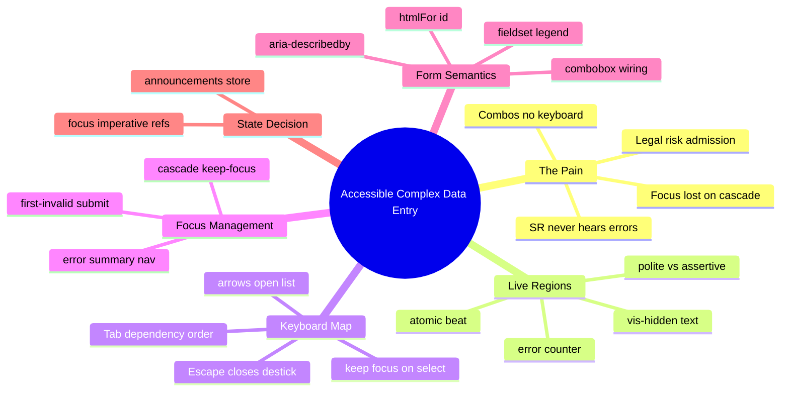

# Module 16: Accessible Complex Data Entry

Est. study time: 1.6h
Language: en
Description: Three accessibility contracts — what gets announced, where focus goes, how keys move — for the multi-application form that must survive legal scrutiny.

## Knowledge Map



---

## Learning Objectives (maps to course CILOs)
- Drive live-region announcements for validation beats so screen-reader users hear what sighted users see — serves CILO 8
- Keep focus predictable through cascade resets and submit errors via imperative focus management — serves CILO 8
- Wire the keyboard contract (open/close/navigate option lists, Tab order, Escape) reusing m7 dialog patterns — serves CILO 7
- Apply fieldset/legend/label/combobox semantics so names, states, and descriptions are queryable by assistive tech — serves CILO 8

---

## Real-World Example

A straight-A architecture applicant with low vision opens the portal, turns on VoiceOver, and tries to apply to six courses. What actually happens:

1. She Tabs into the Program select. No label is spoken — the visible text is a placeholder, not a label.
2. She chooses *BS in CS*. Focus blurs to `<body>` because the re-render swapped the select element (m13 cascade), orphaning her keyboard stroke.
3. The cohort field shows "full" — but only as red text. No announcement. Screen-reader as she never learns `cohort is full`. She submits... and the batch engine (m14) rejects the whole batch.
4. On submit the error summary renders — but invisible. No live region, no heading, no focus move. She Tabs forward ten fields hoping to find the problem.

Public-sector university. Admissions software is covered by accessibility law (WCAG 2.1 AA; US disability accommodation law; EU accessibility act). A complaint or an audit means remediation orders, legal exposure, and a PR nightmare — a student literally cannot apply.

> **Think**: The app "works" — every bug above is invisible to a sighted mouse user. Why do teams ship this state?
>
> *Answer: Accessibility is untestable by eyeballing a dev machine. No mouse user sees lost focus or unheard announcements. Only a keyboard-only session or an SR test trip it — which nobody runs on the happy path.*

---

## Core Content

### Section 1: Live Regions — What Gets Announced

Screen readers announce only what they're pointed at. Normal re-renders are silent. A validation message appearing in the DOM is—to a SR user—nothing. Fix: **live regions**, boxes the browser watches and announces when content changes.

```tsx
function LiveRegion({ msg, assertive = false }: { msg: string | null; assertive?: boolean }) {
  // visually-hidden but in the accessibility tree — real position without visual noise
  return (
    <span
      className="sr-only"                       // clip: position:absolute; 1px box (m7 seam)
      role="status"                             // polite live region; status role IS the semantics
      aria-live={assertive ? "assertive" : "polite"}
      ref={ref}
    >
      {msg ?? ""}
    </span>
  );
}
```

The rules that separate working from theatre:

- **`aria-live="polite"` for field status** — queued behind what the user is doing. **`assertive` only for submit-blocking** ("your batch was not submitted — 3 errors"). Over-assertive speech interrupts the user mid-sentence and is considered hostile.
- **Atomic beats, not partial typing.** Announce the *resolved* verdict, once: `Cohort: full for Fall 2026`. Never announce `Cohort: full for Fal` and `Cohort: full for Fall` — SR users now hear stuttering. The polite region coalesces rapid mutations, so send whole sentences.
- **One form-level region announces the error count on submit** — `role="status"`, `Your batch has 3 errors. First: Program 2 cohort is full.` Rehearsable: the error summary stays in the tree so the SR user can re-read it (rehearing requires persistent text, not a transient toast).
- **Visually-hidden text for SR-only messages** (`.sr-only`) — shows nothing to sighted, spoken by SR. The inverse of a toast, which is visual-only.

Message composition belongs in one place — a `useFieldAnnouncer` hook that dedupes identical verdicts (don't re-announce a status that just re-rendered with the same message):

```tsx
interface FieldStatusMsg { field: string; verdict: 'valid' | 'invalid' | 'info'; text: string; id: string; }

function composeStatus({ field, verdict, text }: FieldStatusMsg): string {
  if (verdict === 'invalid') return `${field}: ${text}`;
  return text; // info: "cohort options updated"
}

function useFieldAnnouncer(field: string) {
  const last = useRef<string | null>(null);
  const announce = useCallback((status) => {
    const msg = composeStatus({ field, ...status });
    if (msg === last.current) return;                 // dedupe identical — same beat, no re-announce
    last.current = msg;
    setFormEvent({ type: 'announce', msg });          // transient, read by LiveRegion
  }, [field]);
  return announce;
}
```

> **Cloze**: "Validation changes are only audible if they live in `{aria-live}` regions (`role="`{status}`"`); beats are sent `{atomic}` — the whole verdict at once — and deduped so a re-render never re-announces."
>
> *Answer: aria-live, status, atomic*

> **Predict**: You set every status box to `aria-live="assertive"`. Field 1 flips valid, field 2 invalid, field 3 info — all on one submit click. What does the SR user hear?
>
> *Answer: Three speech interrupts battling the submit announcement, mid-stream. Assertive is for submit-blocking verdicts only; routine field beats belong in polite regions which queue them cleanly.*

### Section 2: The Keyboard Map — How Keys Move

Mice can click anywhere; keyboards are serial. The contract: **Tab** moves between enabled fields, **ArrowUp/Down** navigates option lists, **Enter/Space** selects, **Escape** closes a list *without losing focus* (reusing m7 dialog retrieval patterns). Three failure modes the naive form hides:

1. **Cascade swap blurs the select.** m13 changes `programId` → `setState` → children reset/re-render. If the select's `value` prop points at a removed option, React keeps focus but the native list re-renders. If your reset *unmounts* the select (key prop change), the browser drops focus to `<body>`.

   Fix: **never unmount the select to reset it** — reset options, keep the element (stable key and position), and after the render assert focus:

```tsx
function ProgramSelect() {
  const ref = useRef<HTMLSelectElement>(null);
  const imperativeFocus = useCallback(() => { ref.current?.focus(); }, []);
  // after a cascade reset (m13: cascadeReset → refreshDependents), re-assert focus:
  useLayoutEffect(() => { if (activeAfterReset) imperativeFocus(); }, [activeAfterReset]);
  return <select ref={ref} ...>...</select>;
}
```

2. **Arrow keys don't open the list.** A native `<select>` opens its listbox on ArrowDown only in some browser/OS combos; a custom combobox (styled option list, ArrowDown/Up filtering—m13's 10k-option search) must implement it. Wire the combobox pattern: `role="combobox"`, `aria-expanded`, `aria-activedescendant` pointing at the highlighted option id — so the SR user hears "Cohort, expanded, Fall 2026, option 2 of 9" as focus *stays on the input* while the highlight roves inside the listbox.

```tsx
<input
  role="combobox"
  aria-expanded={open}
  aria-controls="cohort-listbox"
  aria-activedescendant={open ? `cohort-opt-${activeIndex}` : undefined}
  aria-autocomplete="list"
  onKeyDown={(e) => {
    if (e.key === 'ArrowDown' && !open) setOpen(true);      // open from closed
    else if (e.key === 'ArrowDown' && open) moveActive(1);
    else if (e.key === 'Escape') { setOpen(false); /* focus stays on input — m7 retrieval */ }
  }}
  ...
/>
```

3. **Tab order diverges from dependency order.** The visitor's path must follow the cascade: Program → Cohort → Campus → grades per application. Fix tab order with document order, not `tabindex` gymnastics — render fields in dependency order; m13's DAG *is* the layout. If a field is disabled until its parent is chosen, it's `disabled` (skipped by Tab) rather than `tabindex="-1"` hidden spam-focus.

> **Think**: The Escape handler sets `open=false` but focus stays on the input. Why is closing-without-moving essential here, and what pattern from m7 is it replaying?
>
> *Answer: Moving focus on Escape throws the user out of a field they may want to re-open — Escape is "dismiss this layer", not "leave the field". Same retrieval rule as the m7 modal: closing returns you to the exact element you opened from.*

### Section 3: Focus Management on the Cascade and on Submit

Where focus *goes* when structure changes — the second contract.

**Cascade (m13):** when Program changes, children reset. Choose one predictable behavior and stick to it. Recommended: **stay on the Program select**, then announce `cohort options updated` (info beat via the announcer). Never drop to body, never auto-jump to the first child (that hijacks the user's next keystroke). If you *do* move focus to the first reset child, say so — announcement first, then focus move, so the user knows where they are.

```tsx
function onProgramChange(id: string) {
  startTransition(() => {               // m13: cascade swap as a transition
    setValue('programId', id);
    cascadeReset('programId');
  });
  refreshDependents('programId');       // fetch new cohort list (m12 cache, keyed by programId)
  announce('cohort options updated');   // beat BEFORE focus work settles
  // focus intentionally stays on the Program select — stable element, ref focus re-asserted
}
```

**Invalid submit (m14 batch):** the batch engine returns per-application errors. Move focus to the **first invalid field**, and let the summary act as a jump table with real anchors:

```tsx
function focusFirstInvalid(errors: BatchErrors) {
  const first = errors.first();               // ordered by field dependency order
  document.getElementById(first.fieldId)?.focus();
}
```

`ErrorSummary` requirements: rendered as a heading + list, in the tree (rehearsable), each entry a link **to the offending field's id** so Tab-Enter lands the SR user in the exact control (`.focus()` after setState, via `useEffect`) — and the field's message region re-announces as they arrive.

> **Cloze**: "On a cascade reset, focus either {stays} on the origin select or moves with an {announcement} first — never drops to `body`; on a failed submit, focus moves to the first {invalid} field."
>
> *Answer: stays, announcement, invalid*

> **Predict**: You move focus to the first invalid field on submit, but you do it in the same render pass as the error state via `onClick` handler synchronously. The SR user lands on... nothing, because the field hasn't re-rendered invalid yet. What's the fix?
>
> *Answer: Focus imperatively in a `useEffect`/`useLayoutEffect` keyed on the errors state — after the DOM commits the invalid markers — `useEffect(() => { if (errors.first()) focusFirstInvalid(errors); }, [errors])`.*

### Section 4: Form-Level Semantics — Fieldsets, Labels, Describedby

The three contracts are worthless if elements are unidentifiable. Screen readers build a form from semantics, not pixels:

- **Labels bound to inputs** (`htmlFor`/`id`) — a bare placeholder is not a label; placeholder text vanishes on input. Never style `aria-label` over a visible label when both are possible (visible wins for translation + trust).
- **`aria-describedby` the error text** — the SR user hears field name + optional help + *error text* together. The error object *is* the description; `aria-invalid="true"` plus `role="alert"`-and-text also fine, but the describedby keeps the error reading attached to its field.
- **`fieldset`/`legend` per application group** — the six applications are six groups of sibling controls (grades per application). A fieldset announces the group name once, then every child is prefixed with it for free: "Application 3, GPA, invalid, 2.4".

```tsx
<fieldset>
  <legend>Application 3 — BS in CS, Fall 2026</legend>
  <label htmlFor="app3-gpa">GPA</label>
  <input
    id="app3-gpa"
    aria-describedby="app3-gpa-err"
    aria-invalid={!!gpaErr}
  />
  <p id="app3-gpa-err" className={gpaErr ? 'sr-only-err' : ''}>
    {gpaErr ?? ''}
  </p>
</fieldset>
```

- **`aria-required` vs `required`**: native `required` gives free validation on submit — but the portal validates every touched field remotely (m13) and needs controlled error text. Use `aria-required="true"` (announces it) with `required` only when the browser's built-in message is acceptable; here it's not — remote validation wins, so `aria-required` alone prevents the double-announce (browser + portal) and the browser blocking submit before the batch engine runs.

> **Think**: `aria-invalid` is set, `aria-describedby` links the error, everything is polite. The SR user still never hears new errors on fields they've already left. Why?
>
> *Answer: Descriptions only announce on field entry. If the user is elsewhere (or an error appears on a field far away), nothing reads it — that's exactly the job of the mutual live region from Section 1 that announces the new error globally.*

### Section 4.5: [State Decision] — Focus, Announcements, Field Status

| State | Where | Why |
|---|---|---|
| focus position | imperative refs + `imperativeFocus()` helper | DOM action, not state — never re-render to move focus |
| live-region messages | small announcement store/context (transient, low-frequency) | read by SR, cleared after beat; not durable app state |
| field values, touched, validity | form/draft store (m14) | authoritative client state, cross-screen batch |
| dropdown open/activeIndex | local component state | ephemeral UI, dies with the list |
| request version counters | refs (m13) | guards, not render input |

Two willingness rules: **focus never routes through zustand** — a store update triggers a render, and a render-driven focus is a race against the commit; imperative refs act on the DOM directly. **Announcements are transient by design** — they live long enough for the SR queue to pick them up, then clear; they are *not* undoable state, and repainting them on every render would double-announce.

---

### Why This Matters

The portal is not a toy: it is the front door to education, and it is legally obligated to be equally usable. Keyboard-and-SR support is not a garnish — it is a compliance gate that automated audits (axe, WCAG 2.1 AA) and real users enforce. And these three contracts (announce, focus, keys) must all **survive state changes** — the cascade, batch validation, and async loads of the previous modules are precisely when naive forms break. Nail the contracts and the same mechanics power keyboard power-users, voice-input users, and mouse users — one implementation, a wider human net.

---

## Key Takeaways
- Three contracts, three systems: live regions (announce), focus management (where), keyboard map (how); all three must survive state changes
- Polite vs assertive is not a preference — routine field beats queue politely; only submit-blocking verdicts interrupt
- Cascade resets must never drop focus to body: stable select elements, ref re-assert, announce-first if you move focus
- Form semantics (fieldset/legend, htmlFor/id, aria-describedby) make fields identifiable, re-announceable, and audit-passable
- Focus is imperative (refs), announcements are transient context; never route either through zustand

---

## Common Misconception

*"Making it look clean is accessibility — contrast, sizes, spacing."* Visual polish is one slice. A screen-reader user sees none of it. Accessibility is three invisible contracts (announced beats, predictable focus, a keyboard map), and the failures are undetectable in a sighted demo. WCAG-compliant code can still be unusable-by-keyboard; auditable code is structurally semantic.

---

## Spot the Mistake

```tsx
function ErrorSummary({ errors }) {
  useEffect(() => {
    if (errors.length) {
      document.getElementById('form-top')?.focus();   // "move focus to the summary"
    }
  }, [errors]);
  return <section aria-live="polite">{errors.map(renderRow)}</section>;
}
```

What's wrong?

*Answer: Three bugs. (1) Moving focus to a generic container doesn't read the errors — SR needs focus on a heading or the list itself, and ideally the first *offending field*, with the field then re-reading its describedby. (2) `aria-live` on a section that is itself the focus target double-speaks. (3) A polite region should not be re-announced every keystroke's re-render — dedupe identical verdicts. The working shape: summary is a focusable heading + link list; focus first link → field's `focus()`, errors stay persistent for rehearing.*

---

## Feynman Explain

(Imagine ordering dinner with your kitchen blindfolded. The waiter reads your choices back out loud — polite pause version — and only shouts about a dish you can't have. Every time the menu changes, the waiter tells you where you are. And the menu is arranged so you can walk through it in order. That's the whole trick: say changes, keep people where they are, let them walk the form one step at a time.)

---

## Reframe

(Judge: is everything custom-combobox here necessary, or is a native `<select>` with options the better accessibility? Native selects ship keyboard + listbox semantics free — but no typeahead filtering over 10,000 options, which is why m13 went custom. The honest divider: if the list is filterable/searchable, a custom combobox is justified; otherwise the native control beats your re-implementation almost every time. Where does your project's real line sit?)

---

## Drill
Take the quiz. MCQs probe all four systems — announce, focus, keys, semantics — plus the state-decision traps.

Run: `learn.sh quiz enterprise-react-ui-patterns 16-accessible-data-entry`