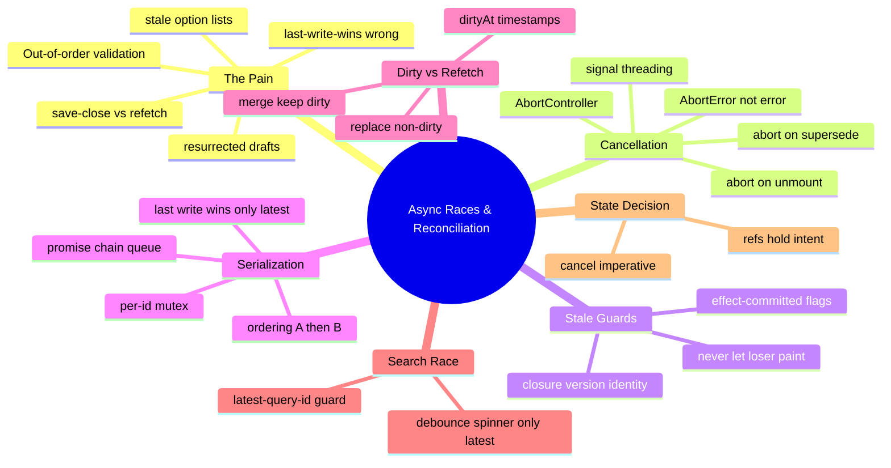

# Module 17: Async Races & Reconciliation

Est. study time: 1.7h
Language: en
Description: The network is unordered; the UI must impose a winner. Cancel the old, guard the stale, serialize the conflicting, and reconcile dirty drafts against server truth.

## Knowledge Map



---

## Learning Objectives (maps to course CILOs)
- Cancel superseded and unmounted work with AbortController signal threading, treating AbortError as a carrier, not a failure — serves CILO 7
- Guard resolution with closure-time identity so a stale response can never claim state it didn't win — serves CILO 7
- Serialize conflicting mutating requests (per-id queues) and keep last-write-wins honest — serves CILO 7
- Reconcile dirty local edits against a background refetch so server truth never resurrects a deleted draft or clobbers keystrokes — serves CILO 1

---

## Real-World Example

Friday, production, real latency. An admissions officer edits *Application 4021*'s cohort while a background refetch (m12 stale-while-revalidate) is in flight for the whole batch:

- The officer changes 4021's cohort to *Spring*, then hits **Save**. The refetch — that started *before* their change — resolves *after* the save and repaints 4021 with the **old** cohort. The save actually landed... and the screen shows it didn't.
- The officer deletes a draft, the refetch resurrects it from pre-delete cache. They delete again. It comes back. Now they're deleting in a loop while support emails pile up "your system won't let me delete".
- Validation for a keystroke on program resolves after a newer keystroke on cohort — the wrong field's error now sits on the wrong value.
- Two quick saves (A then B) on the same field land **B then A** on the server — a promise interleave, because nobody serialized writes.

Nothing crashed. No error message. Every row is just *wrong*, silently.

> **Think**: Why does this class of bug survive QA and even your dev server?
>
> *Answer: Locally, latency ≈ 0, so responses arrive in request order and the race never fires. Production latency reorders the wires. The failure mode is invisible where you develop and catastrophic where you ship — which is why it needs explicit tooling, not hope.*

---

## Core Content

### Section 1: Cancellation — AbortController and the Signal Thread

First tool: *cancel the old.* `AbortController` (m13 introduced the versioned option load; now thread it everywhere).

```tsx
function useAbortable<T>(fetcher: (signal: AbortSignal) => Promise<T>) {
  const main = useRef<AbortController | null>(null);
  const lastId = useRef(0);

  const run = useCallback(async () => {
    lastId.current += 1;
    const my = lastId.current;
    main.current?.abort();                  // supersede: cancel any in-flight run
    const ctl = new AbortController();
    main.current = ctl;
    try {
      const data = await fetcher(ctl.signal);
      if (my !== lastId.current) return;    // stale guard even if abort was too slow
      return data;
    } catch (err) {
      if (err instanceof DOMException && err.name === 'AbortError') return; // ignore carrier
      throw err;                             // real failures propagate
    }
  }, [fetcher]);

  // abort on unmount — no setState after death
  useEffect(() => () => main.current?.abort(), []);

  return run;
}
```

Contract of usage:

- **Abort on unmount** (effect cleanup above) and **abort on superseding request** (`main.current?.abort()` before the next). Unmount-abort is what keeps a component that navigated away from writing state into a dead tree.
- **AbortError ≠ UI error.** An aborted request is not a network failure; *it was deliberately replaced.* Throw no toasts, show no error states. The `catch` above and `ignoreAbort` from m13 are the two spellings of the same rule.

> **Cloze**: "`AbortController` cancels the old work — on `{unmount}` and on a `{superseding}` request — and `AbortError` is a {carrier}, not an error: it means the request was {replaced}, so no toast, no error state."
>
> *Answer: unmount, superseding, carrier, replaced*

> **Predict**: The server response was already on the wire when `abort()` fired. The request "succeeded" from the browser's view and the `then` runs. What stops it from painting stale data?
>
> *Answer: Nothing — abort is best-effort. The closure-time `my !== lastId` guard (next section) is the actual contract; the abort is optimization plus memory recycle.*

### Section 2: Stale Guards — Closure-Time Identity

Second tool: *guard the stale.* The rule: **never let a response claim a state it didn't win.** The guard is a captured number compared at resolve time — not state, not effects:

```tsx
const queryVersion = useRef(0);

async function load(key: string) {
  queryVersion.current += 1;
  const my = queryVersion.current;              // this intent, captured when work starts
  const res = await api.list({ key }, signal);
  if (my !== queryVersion.current) return;      // a newer intent exists — drop this payload
  setRows(res);                                 // only the newest intent may paint
}
```

Two failure modes the guard foils:

1. **The overwhelming race.** Response A (older) resolves after B (newer) — `my(B) === current` while `my(A) !== current`. B paints; A is dropped. Search, option lists (m13), and validation all use this exact shape.
2. **The committed-flag illusion.** Beginners "fix" it with an effect-set boolean:

```tsx
// WRONG — the boolean reads stale in async closures
useEffect(() => { let cancelled = false; fetch(...).then(d => !cancelled && setRows(d)); return () => { cancelled = true; }; }, [key]);
```

That effect-committed flag works only for cleanup-triggered cancellation inside *one* effect instance. The moment a second request starts inside the same component — superseding without unmount — the flag is wrong. The version counter survives both. The counter is the durable `intent version`; the flag is a local guard that dies with its effect.

> **Think**: Why is the version a ref, not `useState`?
>
> *Answer: A version write must never trigger a render — render churn on every intent would restate the whole form. Refs hold sync, render-free state read by the guard at resolve time. React state is for what the UI must show; an intent version is not UI.*

### Section 3: Request Serialization — Per-ID Mutex for Writes

Third tool: *serialize the conflicting.* Updating operations must land in issue order — two saves A then B must land A,B on the server, never B,A.

```tsx
function useSerializedSave<T>(save: (payload: T) => Promise<void>) {
  const chain = useRef<Promise<unknown>>(Promise.resolve());

  const enqueue = useCallback(
    (payload: T) => {
      const run = chain.current.then(
        () => save(payload),          // waits for the previous save to fully settle
        () => save(payload),          // even if the prior one failed, don't block the next
      );
      // keep the chain tail alive regardless: failures belong to the caller, not the chain
      chain.current = run.catch(() => {});
      return run;
    },
    [save],
  );

  return { enqueue };
}
```

Rules of serialization:

- **Per-id, not global.** Application 4021 and 4099 are independent — one per-id mutex (`Map<appId, Promise>`), not one queue for the whole portal. Serializing unrelated rows adds latency for nothing.
- **Last-write-wins is only legal when the writer is the latest intent.** A save queue that fired both A and B endpoints in order still leaves B overwriting A *as data* — that's correct because B was the newest user intent. The crime is ordering the *calls* B,A (interleaved promises) or letting a background response paint as if it were the latest intent (Section 2 guard).
- Serialize *on the client* because the server cannot see call order across two HTTP requests — an LMS backend is not a queue.

> **Predict**: Save A fails (cohort full). Save B — to a valid cohort — is queued behind it. What does the chain above do, and why is that right?
>
> *Answer: The `() => save(payload)` error-resuming branch runs B despite A's rejection — a failed save must not stall the whole queue forever. A's rejection is surfaced to A's caller (its own promise) while the chain tail stays resolved. The user fixes A and retries; B was never blocked.*

### Section 4: Dirty-vs-Refetch Reconciliation

The merge problem. A background refetch (m12) returns server truth that *predates* the user's unsaved keystrokes. Blindly replacing would clobber what they just typed; ignoring the refetch freezes server updates for the whole screen. Correct: **merge per field.**

```tsx
interface RowDirty { dirtyAt: number; field: string; … }

function reconcile(row: Row, dirty: RowDirty | undefined, server: Row) {
  if (!dirty) return server;                       // untouched — server truth wins
  if (dirty.dirtyAt > server.ts) return row;       // newer local intent wins — keep dirty field
  return server;                                   // server won the timestamp race
  // final touch: the dirty field itself is kept if dirtyAt > server.ts, others replaced
}
```

Reading the refetch through the cache seam (m12) with a reconciling validator:

```tsx
function mergeRows(server: Row[], dirtyMap: Map<string, DirtyRow>) {
  return server.map((srow) => {
    const d = dirtyMap.get(srow.id);
    if (!d) return srow;                            // not dirty: adopt server truth
    return {
      ...srow,                                      // replace non-dirty fields
      ...Object.fromEntries(
        Object.entries(d.fields).filter(([, v]) => v.dirtyAt > srow.ts),   // keep newer local
      ),
    };
  });
}
```

The timestamp comparison is the whole trick: **`dirtyAt > server.ts` → local wins; else server wins.** Dirty markers live in the form/draft store (m14) — client-authored truth — while the refetch lives in the cache seam (m12); the merge is the seam's read-time validator. This also kills the resurrected-deletion bug: a delete is the ultimate dirty — *deleted* is an intent newer than any refetch, so the refetch must not rematerialize the row.

> **Cloze**: "A background refetch is reconciled per {field}: local `dirtyAt` newer than the server row's timestamp keeps the local value, otherwise {server} truth replaces it — never let a stale refetch {clobber} unsaved keystrokes or resurrect a {deleted} draft."
>
> *Answer: field, server, clobber, deleted*

> **Think**: You use "edited at" from the *whole row* instead of per-field dirtyAt. A student edits field X, then a server push (m12 SSE) updates field Y on the same row. What breaks?
>
> *Answer: Row-level timestamps are all-or-nothing — the X edit re-marks Y stale and the Y push re-drops X. Per-field dirtyAt lets both coexist: Y pulls from server, X keeps local. Coarse timestamps force choosing one winner for the wrong reason.*

### Section 5: The Search Race — Latest-Query-Wins

The canonical read race, worn every day. Debounced search (m10/m13 filters) fires query `q1`, user types more, `q2` fires; `q1` resolves after `q2`. Naive `await fetch; setRows` paints the *older* term's results over the *newer* term. Fixed with the Section 2 guard, plus spinner discipline:

```tsx
const [query, setQuery] = useState('');
const latestQuery = useRef('');

async function search(q: string) {
  const my = q;
  latestQuery.current = q;
  setLoading(true);
  const res = await api.search(q);
  if (my !== latestQuery.current) return;     // a newer query owns the screen now
  setLoading(false);
  setResults(res);
  commitSearchHeading(q);                     // heading must match painted rows
}
```

Rules: the debounce coalesces typing; the guard drops stale resolves; the spinner turns off **only** for the latest query — `useDeferredValue` (m13) keeps the input responsive while aging the filter. Never set a separate "searching" flag per resolve; the latest-query identity *is* the loading state.

> **Think**: The results commit only when `my === latestQuery`. If the newest query errors, should the spinner still clear and show the older results?
>
> *Answer: The rejected query owns the screen — clear the spinner, show the error, keep the last committed results. Reverting to older-then-stale results would repaint rows that no longer match what's in the input. Error UX for search is m18's topic; the guard here still decides who may paint.*

### Section 5.5: [State Decision] — Race Tooling Lives Outside React State

| Concern | Where | Why |
|---|---|---|
| aborts, intent versions, latest-query id | refs + local vars | imperative, sync, must never re-render |
| per-id save queues | `useRef(Map<id, Promise>)` | a promise chain is not UI — it has no pixels |
| dirty markers, dirtyAt | form/draft store (m14) | durable client-authored truth, cross-screen |
| reconciliation meta (server ts, merge policy) | cache seam (m12) read-time validator | belongs where server truth is read |
| live region announcement of stale-drop | transient announcer (m16) | "showing results for 'cs'" — SR needs the verdict |

The one-line model: **races are imperative, not reactive.** React state is resolution; race tooling is arbitration. Arbitration happens in refs and plain functions; only the *winner's output* becomes state. Routing intent versions through zustand would turn every abort into a store write → re-render storm, and would make the arbitration itself a render dependency.

---

### Why This Matters

Every request in an enterprise portal is a bet against the wire. Real latency, mobile networks, server restarts, SSE pushes, and fast typists guarantee out-of-order traffic; the *only* question is whether your UI has a rule for who wins. The tools compose: cancel old work (Abort), drop stale resolves (guards), land mutating calls in order (queues), merge refetches against dirty state (reconciliation), and keep search honest (latest-query). Teams that skip this ship data-corruption bugs for years — the "deleted app came back" issue filed every release — while teams with the toolkit ship quiet, correct screens. This is the difference between a demo and a system people trust with their applications.

---

## Key Takeaways
- The network is unordered; the UI must impose a winner — three tools: cancel the old, guard the stale, serialize the conflicting
- AbortController means unmount-abort + supersede-abort; AbortError is a carrier (replaced), not a failure
- Closure-time version guards, not effect-committed flags, are the durable stale-response contract
- Mutating ops serialize per-id (promise chain); last-write-wins only when the writer is the latest intent
- Refetches merge per field by `dirtyAt > server.ts`; deletes are the ultimate dirty and must never be resurrected
- Races live in refs and plain functions — only the winner's output becomes React state

---

## Common Misconception

*"Promises resolve in call order, and await means order."* Two `await`s in one function are ordered; two independent requests are not — first request and first await are unrelated. `Promise.resolve()` once per intent is fine; "I awaited it so it's sequential" is false the second a second request exists. Order is *imposed* by queues and version guards; await only orders *within* one async flow.

---

## Spot the Mistake

```tsx
async function saveAll(apps) {
  await Promise.all(apps.map(saveRow));        // parallel writes, "it's faster"
}
```

What's wrong?

*Answer: Unordered writes across rows race *within* the batch, and a retry of one row interleaves with another's in-flight write. If rows are independent, use a per-id chain so each row's calls serialize (Section 3). If a row's save touches shared state (a batch counter, a shared cohort slot — m14), they must share one queue. Parallel promise fireworks look fast until two writes to the same cohort land out of order and the server keeps a phantom.*

---

## Feynman Explain

(You're a radio DJ. Callers phone in song requests. Everyone's calls travel through different towers and arrive any order. You can't stop a call once it's half-arrived, but you can *ignore* an old request if a newer one already took the slot — a number on each request says when it was made. If someone can request two things, you make them wait in line so the earlier one finishes first. And when the station prints its playlist from the server, you never overwrite a song a caller just asked for. Same three moves: cancel-or-ignore the old, ticket the newest, line up the rest.)

---

## Reframe

(Judge: how much of this belongs client-side vs server-side? Abort and guards are inherently client. But serialization could move to the server (`If-Match`/etag versioning, m12 SSE ts) — the upgrade path for a backend that can return a 409 instead of accepting disorder. Queues hide out-of-order landings; server versioning *rejects* them. Which does your backend implement, and what breaks first when it doesn't?)

---

## Drill
Take the quiz. Questions stress match the real latency traps — ordering, timestamps, abort carriers, and who is allowed to paint.

Run: `learn.sh quiz enterprise-react-ui-patterns 17-async-races-reconciliation`