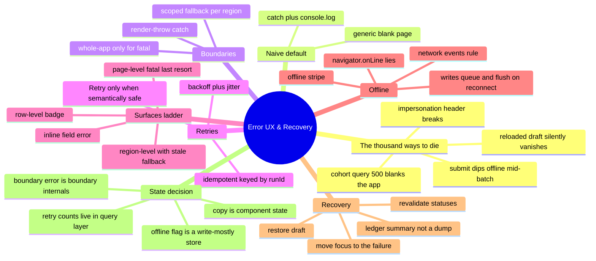
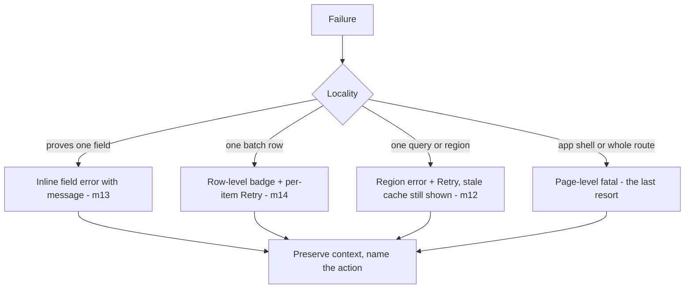
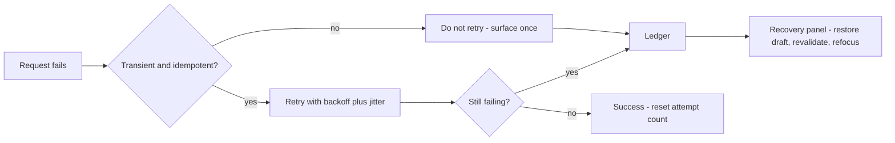

# Module 18: Error UX & Recovery

Est. study time: 1.6h
Language: en
Description: The portal dies in a thousand ways. Design failure as a system — scoped boundaries, idempotent retries, a ladder of surfaces, honest offline messaging, and recovery that restores what the user was trying to do.

## Knowledge Map



---

## Learning Objectives (maps to course CILOs)
- Scope render exceptions into error boundaries so a leaf failure degrades a region, never the whole portal — serves CILO 9
- Retry transient failures with exponential backoff plus jitter, gated on semantic safety and idempotency keys — serves CILO 9
- Design a failure-surface ladder and offline messaging that always preserves context and names the next action — serves CILO 9
- Recover intent after failure by restoring drafts, revalidating statuses, refocusing the failure point, and summarizing the ledger — serves CILO 1

---

## Real-World Example

Production Tuesday. The admissions portal dies in four different ways before lunch:

1. **Cohort query 500s — the app blanks.** One bad server response for the cohort list throws in a pure render function. The nearest `catch` is nowhere, so React unmounts the whole tree and shows a white screen. With it goes the application the student already half-filled.
2. **Submit dips offline mid-batch.** The student clicks "Submit all 6 applications". Application 3 of 6 never reaches the server. The button just... stops. No stripe, no queue, no list of what landed. They retry, and 1, 2, 4, 5, 6 double-submit.
3. **Impersonation response breaks the header.** The session endpoint (m6) returns a malformed impersonation object; a helper in the header does `session.impersonatedUser.name` and the whole shell — including the working form below — unmounts.
4. **A reviewer reloads and the draft vanishes.** The reviewer fixed 40 rows of grades, clicked something that 500'd, refreshed, and the draft was never persisted. All 40 rows gone.

The naive default response to all four is one line:

```ts
try { … } catch (e) { console.log(e) }
```

and one screen:

```tsx
<>Something went wrong.</>
```

Same output for *every* failure, no matter how small or how recoverable. A typo in your cohort fetch and a real server outage look identical to the person holding the mouse.

> **Think**: Why does one generic blank page make all four of those failures worse than the failure itself?
>
> *Answer: A blank page destroys the one asset a failure leaves behind — context. The 40-row draft, the partial batch, the names of what failed: all gone. The user now has nothing to fix and no way to trust the retry. An error surface that keeps context lets the user repair the situation; a blank surface starts them from zero.*

---

## Core Content

### Section 1: Boundaries — Catch Render Exceptions, Scoped

React error boundaries catch **render-phase exceptions** in the tree below them — the thrown thing from a bad fetch applied to state, a null `.name`, a `map` on an undefined array. They cannot catch event-handler errors, async rejects that you never `await`, or errors in themselves (m3 calls the render seam; the boundary sits exactly there).

A boundary is a class component with `getDerivedStateFromError` — function components cannot implement it yet:

```tsx
import { Component, type ReactNode } from 'react';

interface BoundaryProps {
  fallback: (reset: () => void) => ReactNode;
  resetKeys?: unknown[];          // 'retry after state changed' hint
  children: ReactNode;
}

class ErrorBoundary extends Component<BoundaryProps, { error: Error | null }> {
  state = { error: null as Error | null };

  static getDerivedStateFromError(error: Error) {
    return { error };                      // render the fallback, keep children mounted
  }

  componentDidUpdate(prev: BoundaryProps) {
    // if a resetKey (e.g. cohort id, applicant id) changes, we can safely re-render children
    if (this.state.error && prev.resetKeys !== this.props.resetKeys) {
      this.setState({ error: null });
    }
  }

  reset = () => this.setState({ error: null });

  render() {
    if (this.state.error) return this.props.fallback(this.reset);
    return this.props.children;
  }
}
```

The discipline is **where you put them**. Scope to the region that can fail:

```tsx
<PortalShell>
  <ErrorBoundary                                   // one region — the cohort panel
    resetKeys={[applicantId]}
    fallback={(reset) => (
      <RegionError
        title="Couldn't load cohorts"
        action={<button onClick={() => { refetchCohorts(); reset(); }}>Retry</button>}
      />
    )}
  >
    <CohortOptions applicantId={applicantId} />    {/* render throw isolated here */}
  </ErrorBoundary>
  <ApplicationForm />                               {/* survives the throw above */}
</PortalShell>
```

Rules that keep boundaries honest:

- **Never wrap the whole app in one boundary.** A blanket boundary turns every render bug into the same tragic "Something went wrong" page the naive version produced — the buggy leaf hides behind the smoke. Boundaries are for *regions*; the app shell only gets one when a failure is genuinely app-fatal (the session itself is corrupt — m6).
- **The boundary owns its own fallback state.** The error text lives inside the boundary component; sibling containers and the store never learn "CohortPanel is broken". Rendering state is not business state.
- **`resetKeys` is the retry story.** When the keyed data changes (new applicant), `componentDidUpdate` clears the error so children re-render. The fallback's Retry button also calls `reset` — but only after the *fetch* succeeds (m12 refetch policy), otherwise you re-render the same throw.

> **Cloze**: "React error {boundaries} catch render-phase exceptions in the tree below them; they must be {scoped} per region so a leaf failure degrades a panel, never the whole portal — a blanket boundary that hides the {leaf} bug is the old blank-page anti-pattern."
>
> *Answer: boundaries, scoped, leaf*

> **Predict**: The cohort fetch rejects inside `useEffect`, not during render. You wrap it in the boundary above. What happens?
>
> *Answer: Nothing catches it — boundaries only see render throws (and lifecycle `componentDidCatch`). The reject must be handled where the effect runs: caught, turned into `error` state the region shows, and rethrown *into render* only if you want the boundary to own it. The boundary is the display layer for render bugs; async failures need the ladder in Section 3.*

### Section 2: Retries — Backoff, Jitter, and the Idempotency Gate

Retry is only *responsible* when two conditions hold: the failure is **transient** (429, 5xx, network reset — retry can plausibly turn it green) and the operation, repeated, cannot corrupt (there is an idempotency key). Everything else: stop and ask.

```tsx
const MAX_RETRIES = 4;
const BASE_MS = 500;

function backoffWithJitter(attempt: number) {
  const exp = BASE_MS * 2 ** attempt;            // 500, 1000, 2000, 4000...
  return exp / 2 + Math.random() * (exp / 2);    // full jitter — breaks thundering herds
}

function isTransient(err: unknown) {
  if (err instanceof TypeError) return true;                      // network reset (CORS/offline)
  const status = (err as { status?: number }).status;
  return status === 429 || (status !== undefined && status >= 500);
}

function useRetry(fn: () => Promise<void>, retryKey: string) {
  const [attempt, setAttempt] = useState(0);
  const [error, setError] = useState<Error | null>(null);

  const run = useCallback(async () => {
    try {
      await fn();
      setAttempt(0); setError(null);              // recovered — reset the ladder
    } catch (err) {
      setError(err);
      if (!isTransient(err) || attempt >= MAX_RETRIES) return;   // permanent or exhausted
      const wait = backoffWithJitter(attempt);
      setAttempt(a => a + 1);
      setTimeout(() => run(), wait);              // next leg, jittered
    }
  }, [fn, attempt]);

  return { run, retrying: attempt > 0, error };
}
```

The discipline rules:

- **Never retry a non-idempotent mutation blindly.** A `POST /batch` that may have landed (m14 partial failure) is NOT retryable without proof. Retry it only when you have an idempotency key the server dedupes on — the m14 `runId:itemId` pair, which makes "retry" mean "re-send the same intent", not "send twice". A GET that failed is almost always safe to retry.
- **Show a Retry button only when the retry is semantically safe.** The rule of thumb: GET / pure refetch → show Retry. Mutation with an idempotency key → show Retry, keyed to the same `runId`. Mutation whose landing state is unknown → do NOT show Retry; show "Check the ledger and resubmit the failed items" (m14 per-item). This is the difference between a recovery button and a double-submit accelerator.
- **Retry counts live in the query layer (m12), not in zustand.** Attempts are per-request bookkeeping, trivially derivable and nothing any screen must subscribe to. The query layer (m12 status machine) already carries `fetching/error/stale` — put `retryCount` and the last attempt time beside it.
- **Backoff + jitter, never a fixed delay.** All retrying clients hitting the same dying endpoint at the same wall-clock instant create a thundering herd on every jitter-less retry — the retry *keeps* the outage alive. Full jitter spreads reconnects across the window.

> **Cloze**: "Retry is only responsible when the failure is {transient} and the operation carries an {idempotency} key; {backoff} with full {jitter} spreads reconnects so your retries don't re-break your own backend."
>
> *Answer: transient, idempotency, backoff, jitter*

> **Predict**: A batched submit rejects with a network reset after the server accepted application 4 of 6. You used useRetry around the whole `submitAll`. What is your risk, concrete?
>
> *Answer: The retry reposts all 6; application 4 and any others the server actually wrote now have two submissions (m14 partial failure states existed but were invisible). Correct: catch once, read the m14 ledger, retry only the failed itemIds under the same runId key — one write per intent, ever, thanks to m17 idempotency.*

### Section 3: The Failure-Surface Ladder

Consistency demands that *where* an error appears tells the user *how bad it is* and *what to do*. That is the ladder — match the surface to the scope of the failure:



Behaviors at each rung:

1. **Inline field error (m13).** A validation failure for one field stays on that field. Never promote it to a banner — the banner is the loudest instrument you have and it must be saved for things the whole form needs to hear.
2. **Row-level badge (m14).** One item of the batch failed while siblings succeeded: "Application 4021 — cohort full — Retry". The row owns its own state; the rest of the grid is untouched.
3. **Region-level.** "Couldn't load cohorts" for the whole panel. The rung's superpower: **serve stale cache while failing** (m12). If a previous good cohort list exists in the cache seam, render it with a "showing saved version" note and a small Retry — the user keeps working during an outage instead of staring at a skeleton. Region errors show something; only the next rung shows a wall.
4. **Page-level fatal.** Only when the app shell is genuinely unrecoverable (session corrupt, route itself broke). This runs the *single* whole-shell boundary from Section 1, and even it renders a "Reload" action, not a bare message.

Two invariants run through every surface: **name the action** (Retry / Resubmit / Reload — never "OK"), and **preserve context** (the draft, the stale rows, the fields the user typed). Read the ladder top-down: the moment a failure *can't* be localized, it climbs one rung — never lower.

> **Spot the Mistake**: "The batch submit failed on 3 of 40 rows. I toast 'Submission failed — try again' and disable the whole submit button."
>
> What's wrong?
>
> *Answer: The toast is rung-4 language for a rung-2 problem and the disabled button inherits the error. 37 rows saved; re-submitting everything risks double-submitting (non-idempotent, no key check), and hiding which rows failed forces guesswork. The ladder demands: badge the 3 failed rows with per-item retry under the m14 runId key, leave the 37 successes untouched, and move focus to the first failed badge (m16).*

### Section 4: Offline Is a State, Not a Message

`navigator.onLine` lies: it reports "online" whenever any network interface exists — a laptop with a dead VPN can be `online: true` and unable to reach your API. The honest signal is the **network event pair** (`online`/`offline`) from the browser's connectivity engine, plus, for real coverage, a failed request as the tiebreaker.

Offline handling is a state, so it lives in one tiny **write-mostly store** that every shell component can subscript to:

```tsx
type NetState = { online: boolean };
export const useNetworkStore = create<NetState>(() => ({ online: navigator.onLine }));

if (typeof window !== 'undefined') {
  window.addEventListener('online', () => useNetworkStore.setState({ online: true }));
  window.addEventListener('offline', () => useNetworkStore.setState({ online: false }));
}

function OfflineStripe() {
  const online = useNetworkStore(s => s.online);
  if (online) return null;
  return (
    <aside role="status" aria-live="polite" className="offline-stripe">
      You're offline. Submissions are queued and will send when you reconnect.
    </aside>
  );
}
```

The stripe is a `role="status"` live region (m16) so screen readers announce the transition; it says precisely what is deferred and when it will happen. Writes that arrive while offline **don't fail** — they enqueue to the m19 offline queue with their idempotency keys and a "Queued, sends when back online" note. On the `online` event, the queue flushes (Section: Verify shows this as a test). What the user never sees: a fake "saved" while offline, or a silent drop.

> **Cloze**: "`navigator.onLine` {lies} — it reports any network interface, not connectivity to your API. The honest signal is the browser's `online`/`{offline}` event pair, and the offline flag is a tiny {write-mostly} store every shell component subscribes to."
>
> *Answer: lies, offline, write-mostly*

> **Predict**: A student submits while offline. The write is queued with its runId key. They close the tab before the connection returns. On reopening, what should the app show, and why isn't the queue a lie?
>
> *Answer: The m19 queue is persisted (zustand + localStorage, m2/m5 draft restore), so the reopen shows "1 queued submission — resend on reconnect" and flushes. The m17 idempotency key makes that flush a re-send of the same intent, not a duplicate. The queue survives the tab because the queue was designed as storage, not as panel state.*

### Section 5: Recovery Preserves Intent

The final move: after failure, rebuild what the user was *trying to do*. Four ordered recovery steps:

1. **Restore the draft.** Cache the in-progress draft (m5 session/`localStorage` + the m14 draft store) so a failed submit or reload never starts from a blank page.
2. **Revalidate statuses.** After reconnect or retry, re-run statuses against the server (m12 refetch policy): "Application 4021: draft → submitted", so stale failure flags don't linger.
3. **Move focus to the failure point** (m16): focus the first failed row or field, so the user starts repairing, not searching.
4. **Summarize the ledger, don't dump it.** The m14 batch ledger already holds per-item verdicts. Render a summary, then an actionable list:

```tsx
function RecoveryPanel({ run }: { run: BatchRun }) {          // m14 ledger
  const failed = [...run.perItem.values()].filter(i => i.state === 'failed');
  if (failed.length === 0) return null;

  return (
    <section aria-labelledby="recovery-heading" className="recovery-panel">
      <h3 id="recovery-heading">
        Partial submission — {run.succeeded.length} of {run.perItem.size} saved
      </h3>
      <ul>
        {failed.map(item => (
          <li key={item.itemId}>
            <span>{item.itemId} — {item.reason}</span>
            <ResubmitButton
              item={item}
              runId={run.id}                       // idempotent retry, m14 + m17
            />
          </li>
        ))}
      </ul>
    </section>
  );
}
```

"37 saved, 3 blocked on a full cohort" beats "Submission failed". The panel is the recovery UX that the ladder's rung 2 (row badge) and rung 4 (fatal) both funnel into.

> **Cloze**: "Recovery preserves {intent}: restore the {draft}, revalidate {statuses}, move {focus} to the failure point, and summarize the m14 {ledger} instead of dumping raw errors."
>
> *Answer: intent, draft, statuses, focus, ledger*

### Section 5.5: [State Decision] — Where Failure State Lives

| Concern | Where | Why |
|---|---|---|
| error copy, per-field messages, inline errors | component/field state | owned by the region showing them — no cross-screen consumer (m2 owns-state rules) |
| boundary fallback + reset | boundary internals | rendering state; siblings and stores must never learn "CohortPanel broke" |
| retry counts, last-attempt time | query layer (m12) beside the status machine | per-request bookkeeping; nothing renders subscribes to attempt numbers |
| offline flag | tiny shared write-mostly store | many shell widgets subscribe (stripe, submit button, queue button) but nothing mutates it but the network listener |
| queued writes | zustand + persistence (m19) | must survive tab close — this is storage, not UI state |
| batch failure verdicts | m14 ledger (already there) | recovery reads it; it is the source of truth for what actually landed |

One-line model: **an error is a state, not an exit.** Every error is a noun with three adjectives the UI must answer — **scope** (what broke), **retry** (is it idempotent and transient?), **recovery** (what survives). Ask the three questions before you render a single pixel of failure:



---

## Verify — Testing the Error System

Tests prove the five contracts: boundaries scope, retries back off, offline queues and flushes, failures revert to actionable items, and the shell survives a leaf throw.

```tsx
test('scoped boundary catches the cohort throw; the shell survives', async () => {
  vi.spyOn(console, 'error').mockImplementation(() => {});
  render(<PortalShell />);                                    // shell + CohortRegion
  server.use(http.get('/api/cohorts', () => HttpError(500))); // MSW fixture (m3)
  await user.click(screen.getByRole('button', { name: 'Load' }));
  expect(screen.getByRole('heading', { name: "Couldn't load cohorts" })).toBeInTheDocument();
  expect(screen.getByRole('region', { name: 'App shell' })).toBeInTheDocument();  // alive
  // the ApplicationForm below still renders — blanket-boundary would have nuked it
});

test('retry backs off then succeeds — fake timers + MSW flips 500 to 200', async () => {
  vi.useFakeTimers();
  vi.spyOn(globalThis, 'setTimeout');                          // observe the jitter window
  server.use(http.get('/api/cohorts', () => HttpError(500)));
  const { result } = renderHook(() => useRetry(load, 'cohorts'));
  await act(() => result.current.run());
  server.use(http.get('/api/cohorts', () => HttpResponse.json(cohortsFixture))); // healed
  await act(async () => { await vi.advanceTimersByTimeAsync(500); });             // backoff leg
  expect(result.current.error).toBeNull();
  expect(screen.getByText('Spring 2026')).toBeInTheDocument();
  vi.useRealTimers();
});

test('offline stripe shows, writes queue, queue flushes on reconnect', async () => {
  window.dispatchEvent(new Event('offline'));
  expect(screen.getByRole('status')).toHaveTextContent(/queued/i);
  window.dispatchEvent(new Event('online'));
  await waitFor(() => expect(usedNetworkStore.getState().online).toBe(true));
  await waitFor(() => expect(api.batchSubmit).toHaveBeenCalledTimes(1));  // flush fired once
});

test('failed batch item shows an actionable retry and resubmits under the same runId', async () => {
  server.use(http.post('/api/batch', () => HttpResponse.json(partialFailFixture))); // m3
  await user.click(screen.getByRole('button', { name: /submit all/i }));
  expect(screen.getByRole('button', { name: /retry application 4021/i })).toBeInTheDocument();
  server.use(http.post('/api/batch', () => HttpResponse.json(fullSuccessFixture)));
  await user.click(screen.getByRole('button', { name: /retry application 4021/i }));
  const writes = api.batchCalls.map(c => c.body.runId);
  expect(writes[1]).toBe(writes[0]);   // same idempotency key — m14 + m17, not a duplicate
});
```

Constants: MSW fixtures serve the 500 cohort, the partial-fail batch, and the healed endpoints (m3); the resubmit assertion is the m14 `runId` key contract cited not re-written; focus movement after failure is the m16 pattern. **Playwright journey** (`context.setOffline(true)`): load → go offline → type into a draft → see the stripe → re-parent focus to the failure badge → go online → queued write flushes → rerun statuses → recovery panel reads "1 of 2 saved".

**Variant — breadcrumbs are user intent, not stack traces.** In production observability (cross-ref `advanced-react-testing`), the failure telemetry that pays for itself is *intent breadcrumbs*: "user selected program CS → changed cohort to Spring → clicked Submit Batch with 6 items". A stack tells you which line threw; breadcrumbs tell you what the user meant, which is what the recovery panel needed. Sentry's breadcrumb API at each intent boundary costs one line and converts "it 500'd" into "submit failed on 3 of 40 — resubmit the 3".

---

### Why This Matters

Every enterprise portal fails on a schedule; the difference between an outage and a catastrophe is whether failure *shrinks* or *explodes* the user's context. A cohort 500 that blanks the app loses a half-filled application; the same 500 on a region with a stale-cache fallback costs the user nothing. A batch that partially fails with a "retry everything" button double-submits; the same batch with a per-row ledger and idempotency keys heals in one click. Teams that skip this module ship the fourth scenario twice a year — "my draft vanished" is a support-ticket legend. Errors designed as a system — scoped, retryable where legit, surface-matched, offline-honest, recovery-first — are the last thing a user notices and the first thing they stop filing tickets about.

---

## Key Takeaways
- Error boundaries catch *render* throws; wrap regions, never the app — a blanket boundary is the old blank page
- Retry only transient failures that carry an idempotency key; a submit whose landing state is unknown gets a ledger, not a Retry
- The surface ladder maps error scope to UI: field → row badge → region with stale fallback → fatal last resort
- `navigator.onLine` lies — use network events, an offline stripe, and a persisted queue that flushes on reconnect
- Recovery preserves intent: restore the draft, revalidate, refocus the failure, summarize the ledger
- An error is a state, not an exit — answer scope, retry, and recovery before rendering one failure pixel

---

## Common Misconception

*"A catch block + a toast is enough error handling."* The catch is where the work *starts*: it must classify (transient vs permanent), scope (which rung of the ladder), gate the retry (idempotent or not), and hand off to recovery (draft, ledger, focus). A generic toast is the blank-page anti-pattern in a smaller font — same context loss, less severe. The error system is not "show something when it breaks"; it is *deciding what the user can still do*, before the error ever happens.

---

## Spot the Mistake

```tsx
function SubmitBatch() {
  const [error, setError] = useState<string | null>(null);
  useEffect(() => { window.addEventListener('offline', () => setError('You are offline')); }, []);
  return error ? <div className="fatal">{error}</div> : <Form />;
}
```

What's wrong?

*Answer: Three failures of the ladder in one snippet. The `offline` listener lives in one component's effect — navigate away and the stripe vanishes while the portal is still offline (the flag belongs in the shared write-mostly store). Offline is not a fatal; it's a deferral — "will send when back online" — not a "fatal" wall, and the form must stay usable. And SetState-on-listener without cleanup double-registers the handler under StrictMode. Offline state belongs in the network store; the stripe renders as a live region above a still-working form.*

---

## Feynman Explain

(A tent in a storm. The rain finds a tear in one corner: you patch that corner with its own little roof — you do not take down the whole tent. For each tear you decide: is it small (patch one spot), medium (patch one wall and keep using the tent), or is the whole tent collapsing (only then do you pack up)? Sometimes the ground shakes and you wait a bit, then shake again, trying a little later each time instead of all at once — because if everyone shakes back at the same second, the hill splits further. And before you flee, you grab your backpack. The backpack is the draft: if you must run, you run *with the map*, so you can keep going where you were headed.)

---

## Reframe

(Judge: the ladder assumes the client decides error scope — but the *server* knows whether a submit landed, and a server with idempotency support (m17) is a far more authoritative "safe to retry" tell than a client heuristic. Counterargument holds for the batch: the ledger is only as honest as the backend's commit semantics. The honest split: client owns *surface* (scope display, focus, live regions) and *deferral* (queue, stripe); server owns *landing* (commit + idempotency). When the backend can return `202` + a run ticket instead of `500`, the recovery panel becomes "resubmit ticket X" — the module's shapes are unchanged one abstraction up.)

---

## Drill
Take the quiz. Questions test boundary scope, retry gating, ladder placement, offline honesty, and recovery ordering.

Run: `learn.sh quiz enterprise-react-ui-patterns 18-error-ux-recovery`