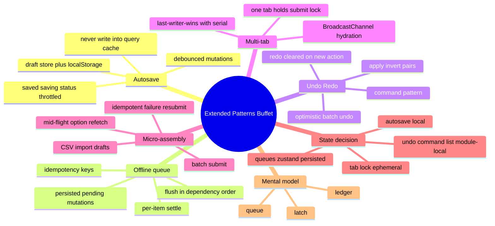
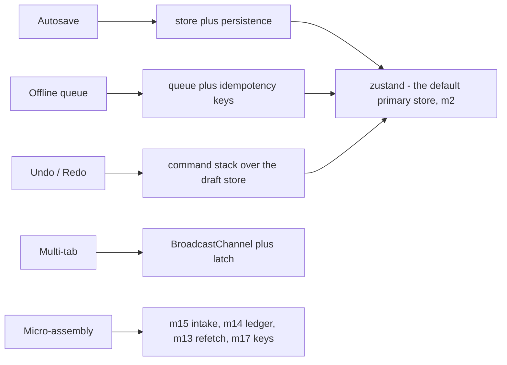

# Module 19: Extended Patterns Buffet

Est. study time: 1.8h
Language: en
Description: Final module. Four working mini-patterns — autosave, offline queue, undo/redo, multi-tab consistency — plus a scored micro-assembly that stitches m13/m14/m15/m17 into one running loop. Every pattern is a queue, a ledger, or a latch under a familiar name.

## Knowledge Map



---

## Learning Objectives (maps to course CILOs)
- Build a debounced autosave that persists drafts without ever leaking into the query cache — serves CILO 10
- Persist an offline mutation queue that flushes in dependency order with per-item settle and idempotency keys — serves CILO 10
- Implement undo/redo as a module-local command stack and multi-tab consistency over BroadcastChannel with a submit latch — serves CILO 10
- Stitch m13/m14/m15/m17 into one micro-assembled loop: import → staged drafts → batch submit → mid-flight option refetch → idempotent resubmit — serves CILO 10

---

## Real-World Example

It is the last working day before the admissions deadline. The portal is behaving *fine* for once — no 500s, no blank pages — but the human problems start showing up:

- The reviewer edits a personal statement, answer 3 of 4, then **closes the tab on an autosave the product manager swears exists**. Where is the draft? Nobody can say, because autosave was "nice to have" and nobody tested the close-the-tab path.
- The registrar works from a train. They batch-submit 6 applications; the connection dips for 90 seconds. A spinner sits there, then a generic timeout. Nothing saved, nothing queued — the train just ate their afternoon.
- A student types a whole paragraph of statement, hits undo expecting one character's worth of rollback — and gets the entire draft back to breakfast time. The undo "history" was actually the whole form snapshot, once.
- Two staff tabs are open on the same applicant. Tab A changes the cohort; tab B is still looking at the old one and hits save. Nobody knows which value the server holds, and the "which browser won" game starts.

Four small-feeling problems, four shapes. This module names the shapes: **autosave is a debounced store write**, **offline is a persisted queue**, **undo is a command stack**, **tabs are a broadcast channel plus a latch**. Once you can name the shape, the code is a copy-paste away from the primitives you already built.

> **Think**: All four problems look like different bugs. What one idea connects them?
>
> *Answer: They are all state that outlives one prompt, one screen, or one tab. The primitive behind each is one you already own — a store (m2), a queue/ledger (m14), or a latch/version (m17). The buffet is pairing the pain to the right primitive.*

---

## Core Content

### Section 1: Autosave Drafts — Debounced Store Write

Autosave is not "save every keystroke". The shape: **debounced mutation → draft store + persistence (m5) → throttled status.**

```tsx
function useAutosave(version: Draft) {
  const save = useDraftStore(s => s.saveDraft);
  const [status, setStatus] = useState<'saved' | 'saving'>('saved');

  useEffect(() => {
    const t = setTimeout(() => {
      setStatus('saving');
      save(version);                       // draft store patched, persisted (m5 localStorage)
      setStatus('saved');
    }, 800);
    return () => clearTimeout(t);          // only the latest version ever fires
  }, [version, save]);

  return status;
}
```

Contract:

- **Debounce is the throttle on the wire.** Keystrokes coalesce; only the settled value of 800ms of pause hits the store. Debounce *then* save, never the reverse (save-per-keystroke defeats the whole point).
- **The status shows `saving` → `saved`, with a floor.** Throttle status updates so "Saved" does not flicker on and off per call — a live region (m16) that says "saving…" for 300ms then "Saved" reads as one calm fact, not a light show.
- **Never autosave into the query cache (m12).** Drafts are client-authored truth (m15/m18 discipline); the cache holds server truth. An autosaved draft in the cache would be served as-if-committed — a lie. Drafts go to the draft store and get persisted to localStorage (m5 restore) so the close-the-tab path holds.
- **Idempotency by draft id (m17).** Each save carries its draft id; saves that get superseded are dropped by the version guard, and a repeated save is a no-op for the same version.

> **Cloze**: "Autosave is a {debounced} store write: keystrokes coalesce into one settled value, the draft lands in the {draft} store plus {localStorage} persistence, and status flips to saving then saved — never into the query {cache}."
>
> *Answer: debounced, draft, localStorage, cache*

> **Predict**: The user types, then within 200ms clicks "Save now" (an explicit submit). What happens to the pending debounce?
>
> *Answer: The explicit submit wins and the debounced timer must be cancelled (the effect cleanup clears it) — otherwise a stale autosave fires after the explicit save and asserts a version the server has already moved past. The version guard (m17) drops it, but cancelling on submit is the cleaner rule: explicit intent supersedes the debounce.*

### Section 2: Offline Queue — Persisted Queue With Dependency Order

The offline story from m18 needs a real queue behind it. Shape: **pending mutations in a persisted zustand store; flush in dependency order; each item settles per-item; keys prevent replays.**

```tsx
interface Pending {
  runId: string; itemId: string;
  op: 'createApplication' | 'createCohortChoice';
  payload: object;                        // references parent ids for dependent rows
}

export const useQueueStore = create<{ pending: Pending[] }>()(
  persist(() => ({ pending: [] }), { name: 'admissions-offline-queue' }),  // m2 + m5
);

export function enqueue(p: Pending) {
  useQueueStore.setState(s => ({ pending: [...s.pending, p] }));           // push in user order
}

export function flushQueue() {
  const ordered = dependencySort(useQueueStore.getState().pending);        // parents before children
  for (const item of ordered) {
    api.write(item.payload, { idempotencyKey: `${item.runId}:${item.itemId}` })  // m17 key
      .then(()  => dequeue(item.itemId))
      .catch(e  => e.isOffline ? keep() : markFailed(item));               // per-item, m14 ledger
  }
}

window.addEventListener('online', flushQueue);                             // m18 hook
```

Rules:

- **Dependency order, not arrival order.** A create of the parent application must land before the cohort choice that references its id (m13). `dependencySort` is a topological sort over the payload references — the "create parent, then children" rule from m13 made mechanical.
- **Per-item settle, never whole-queue all-or-nothing.** One failing item marks itself `failed` in the m14 ledger lane while siblings continue; the stripe (m18) keeps counting.
- **The idempotency key is the queue's memory.** `runId:itemId` replays are deduped server-side (m17), so a duplicate flush after a tab crash cannot double-enroll anyone. Persisted queue + keyed replay = an offline write that is *eventually exactly once*.

> **Cloze**: "The offline queue persists pending {mutations} in a zustand store, {flushes} on the online event in dependency order, settles each item in the m14 {ledger}, and replays under an {idempotency} key so a crashing tab cannot double-enroll."
>
> *Answer: mutations, flushes, ledger, idempotency*

> **Predict**: Two tabs both flush the queue after reconnect. Both send the same runId keyed write. What happens server-side, and what does that rely on?
>
> *Answer: One lands; the second is a no-op because the server dedupes on the idempotency key (m17). This works only if the backend actually implements keyed dedupe — the client queue composes the intent, the server is the final authority on not sending twice.*

### Section 3: Undo/Redo — The Command Stack

Undo over a form is a **command pattern over the draft store**, not one giant snapshot. Shape: **apply/invert command pairs in a module-local stack scoped to the current draft; redo cleared on new action; optimistic batch undo.**

```tsx
interface Command {
  apply:    (d: Draft) => Draft;
  invert:   (d: Draft) => Draft;     // undo("x") === applying invert(x)
}

function useUndoRedo() {
  const [past, setPast] = useState<Command[]>([]);
  const [future, setFuture] = useState<Command[]>([]);

  const run = (cmd: Command) => {
    const next = cmd.apply(useDraftStore.getState().draft);
    useDraftStore.getState().patch(next);
    setPast(p => [...p, cmd]);
    setFuture([]);                          // redo is cleared on any new action
  };

  const undo = () => {
    const cmd = past[past.length - 1];
    if (!cmd) return;
    const next = cmd.invert(useDraftStore.getState().draft);
    useDraftStore.getState().patch(next);
    setPast(p => p.slice(0, -1));
    setFuture(f => [...f, cmd]);            // the undone command goes to the redo stack
  };

  return { run, undo, canUndo: past.length > 0, canRedo: future.length > 0 };
}
```

Each mutation becomes a command: `{ apply: setCohort('Spring'), invert: setCohort(prevCohort) }`. The **invert closes over the pre-action value** — the command object is created *at action time*, which is why fine-grained undo beats a one-shot full snapshot. A whole-form snapshot can only roll back to one past instant; a command stack rolls back exactly the last *action*, character by character.

Who actually translates? The m14 draft store stays the single source of truth — the command reads it, the command's output patches it. The **undo stack itself is module-local state, not zustand**: it is scoped to one open draft, infrequently read, and must never survive navigation. (Compare m18's state decision: offline flag is shared/write-mostly; undo history is private/frequent.)

**Optimistic batch undo (m14):** a batch action is a command whose `invert` re-issues the pre-batch draft. The batch runs optimistically (m14 partial-failure machinery); a user-caneling batch applies its invert to the draft store and re-submits the *removed* items' ledger lane. The ledger stays honest because revert is itself a versioned write with an idempotency key (m17) — undo of a commit is a new commit, not a rollback of time.

> **Cloze**: "Undo is a {command} pattern: each action is an apply/invert {pair} in a module-local stack scoped to the current {draft}, the invert closes over the pre-action {value}, and any new action clears the redo stack."
>
> *Answer: command, pair, draft, value*

> **Predict**: The user types paragraph A, then paragraph B, then hits undo. What does the command stack roll back, versus a full-snapshot system?
>
> *Answer: Command stack rolls back exactly B (the single invert); the snapshot system rolls back to the moment after typing A, because its only memory is a past render. Snapshot undo is the "entire draft back to breakfast time" bug from the intro — the command stack exists to be that precise.*

### Section 4: Multi-Tab Consistency — BroadcastChannel and the Submit Latch

Two tabs editing the same applicant is a two-writer database with one human. Shape: **BroadcastChannel hydration, last-writer-wins with a per-tab serial (m17), and one submit latch.**

```tsx
const tabId = crypto.randomUUID();                 // per-tab identity
const channel = new BroadcastChannel('admissions-draft-sync');
let ourSerial = 0;                                 // m17-style version, per tab

function publishDraft(draft: Draft) {
  ourSerial += 1;                                  // every local change bumps the serial
  channel.postMessage({ type: 'draft', tabId, serial: ourSerial, draft });
}

channel.onmessage = ({ data }) => {
  if (data.tabId === tabId) return;                // ignore self
  if (data.serial > ourSerial) hydrate(data.draft, data.tabId);  // newer writer wins (m17 last-writer-wins)
};

// submit latch — only ONE tab holds the submit ticket at a time
const submitLock = new BroadcastChannel('admissions-submit-lock');
async function acquireSubmitLock(): Promise<string | null> {
  const ticket = crypto.randomUUID();
  submitLock.postMessage({ type: 'request', tabId, ticket });   // race resolved by ack protocol
  return await waitForAck(ticket, first);
}
```

Rules:

- **Hydrate on change, last-writer-wins by serial.** Each tab keeps a monotonic per-tab serial; a message with a higher serial wins. Two humans racing the same field lands one deterministic winner — the same version arithmetic as m17, applied to tabs instead of calls. `localStorage`-scoped storage events (m5) are the fallback when BroadcastChannel is unavailable.
- **Only one tab submits.** Without the latch, a double-click in two tabs double-submits the same run. The latch is ephemeral: a `BroadcastChannel` ticket that lives for the submit's duration, then releases. Ephemeral is the point — a persisted lock would survive stale tabs and deadlock the workflow (unlike the offline queue, which is storage and *must* persist).
- **Each tab is honest about the "last-known" stamp.** Show "edited in another tab" on hydrate, and never clobber a local draft the user has unsaved changes on — that is m17 dirty-vs-refetch reconciliation wearing a different hat.

> **Cloze**: "Tabs sync via a {BroadcastChannel} with last-writer-wins ranked by a per-tab {serial}, and a single {latch} ticket ensures only one tab may submit — the latch is {ephemeral} while the offline queue must persist."
>
> *Answer: BroadcastChannel, serial, latch, ephemeral*

> **Predict**: Tab A holds the submit latch and the user navigates away (tab never released). What design rule keeps deadlocks out?
>
> *Answer: The latch must be a lease with a timeout (and be released on unload), not an indefinite ticket. A persisted lock from a dead tab would block every future submit; an ephemeral lease expires and the next acquirer wins — same reasoning that keeps m14's run locks re-acquirable.*

### Section 4.5: [State Decision] — What Lives Where

| Concern | Where | Why |
|---|---|---|
| autosave status (`saving`/`saved`) | module-local component state | throttled UI fact, no cross-screen consumer |
| offline pending queue | zustand + persistence (m2, m5) | must survive tab close — this is storage, not UI |
| undo/redo stack | module-local command list | scoped to current draft, high-frequency, must not survive navigation |
| tab lock | BroadcastChannel ephemeral lease | dies with the tab; persistence would deadlock |
| per-tab serial / last-writer-wins | BroadcastChannel payloads | m17 version arithmetic, applied tab-to-tab |

The one-line model: **every extended pattern is a queue, a ledger, or a latch under a familiar name — zustand stores, m14 ledgers, and m17 versioning are the primitives.** Persistence decides whether the shape becomes storage (queue) or ephemera (latch).



---

### Section 4.6: MICRO-ASSEMBLY — The Course Stitched Into One Loop

The last lesson ends where the real portal starts: one reviewer, one file, one flaky afternoon. Assemble the seams from four modules into a running loop:

```ts
// REVIEWER IMPORT LOOP — m13/m14/m15/m17, one seated run
const drafts  = stage(await importCsv(file));                    // m15: parse + validate + stage
const run     = batchStore.begin(drafts);                        // m14: runId minted here
const options = fetchOptions(drafts[0].programKey, requestId(run));    // m13: dependent option list
options.abortOn(() => userReassignsProgram(drafts[0], run));     // m17: request-id guard on change
await batchStore.submit(run, { idempotencyKey: run.key });       // m14: per-item ledger owns outcome
const failed  = run.perItem.filter(i => i.state === 'failed');   // m14: who did not land
for (const it of failed) await batchStore.resubmit(it, run.key); // m17: same key, replay dedupes
```

Ten lines. Every line is a seam already built in a prior module: m15 turns hostile CSV rows into validated typed drafts; m14 mints the run key and owns per-item truth; m13 keeps the option list live while a submit is in flight; m17 makes the whole loop safe to re-run exactly once. The micro-assembly test below proves it end to end — which is why the course composes here: **no module re-implements another; each hands its result to the next through the seams they agree on.**

> **Think**: Why does the micro-assembly work without a single new abstraction beyond the imported seams?
>
> *Answer: Because each module designed its exit as the next module's entrance — CSV (m15) emits typed drafts, the engine (m14) accepts any draft list and emits a ledger, the option refetch (m13) and request-id (m17) make mid-flight changes safe, and resubmit reuses the same key. Composition is the payoff of naming seams from the start.*

---

## Verify — Testing the Buffet

Tests prove four contracts plus the assembly: debounced autosave, ordered queue flush, invertible undo, cross-tab sync, and the loop that ends correct.

```tsx
test('autosave debounces 800ms and never touches the query cache', () => {
  vi.useFakeTimers();
  render(<AutosaveDraftEditor />);
  fireEvent.change(screen.getByLabelText('Personal statement'), { target: { value: 'para' } });
  act(() => vi.advanceTimersByTime(799));
  expect(api.saveDraft).not.toHaveBeenCalled();                  // still inside the window
  act(() => vi.advanceTimersByTime(1));
  expect(api.saveDraft).toHaveBeenCalledTimes(1);
  expect(queryCache.mutations).toHaveLength(0);                  // m12/m15: cache stays server truth
  vi.useRealTimers();
});

test('offline queue flushes in dependency order on reconnect', async () => {
  const order: string[] = [];
  api.write = jest.fn(async (p) => { order.push(p.itemId); });
  window.dispatchEvent(new Event('offline'));                     // m18 fixture
  enqueue(createApplication('APP-1'));                            // parent first
  enqueue(createCohortChoice('CH-1', 'APP-1'));                   // child references the id
  window.dispatchEvent(new Event('online'));
  await waitFor(() => expect(order).toEqual(['APP-1', 'CH-1']));  // topo order, m13
});

test('undo inverts the last command; a new action clears redo', () => {
  const { result } = renderHook(() => useUndoRedo());
  act(() => result.current.run(setCohortSpring));                 // apply/invert pair
  act(() => result.current.run(setProgramCS));
  act(() => result.current.undo());
  expect(getDraft().program).toBe('MATH');                        // invert applied
  act(() => result.current.run(setProgramLS));                    // new action
  expect(result.current.canRedo).toBe(false);                     // redo stack cleared
});

test('BroadcastChannel syncs two stores; the higher serial wins', () => {
  const other = { tabId: 'tab-B', serial: 5, draft: springDraft };
  window.dispatchEvent(new MessageEvent('message', { data: other }));
  expect(getDraft().cohort).toBe('Spring');                       // newer writer claimed
  const stale = { tabId: 'tab-B', serial: 2, draft: oldDraft };   // lower serial
  window.dispatchEvent(new MessageEvent('message', { data: stale }));
  expect(getDraft().cohort).toBe('Spring');                       // stale hydrate rejected, m17
});

test('micro-assembly: import → batch with mid-flight option refresh ends correct', async () => {
  // MSW (m3): file parses to 2 drafts; batch partial-fails 1; option refetch demands requestId
  const { run } = await importAndSubmit(fileFixture);
  expect(run.perItem.size).toBe(2);
  expect([...run.perItem.values()].filter(i => i.state === 'failed')).toHaveLength(1);
  userReassignsProgram(run);                                      // triggers guard + refetch
  await resubmitFailed(run);                                      // same run.key
  expect(run.perItem.every(i => i.state === 'succeeded')).toBe(true);
  expect(api.batchCalls.map(c => c.body.idempotencyKey).at(-1))
    .toBe(api.batchCalls.map(c => c.body.idempotencyKey).at(-2)); // key never changed
});
```

Constants: MSW fixtures serve parse → validate → batch-partial → healed endpoints (m3); the order assertion is the m13 parent/child dependency; the key stability assertion is the m17 idempotency contract. **Playwright multi-tab smoke:** two pages on the same applicant → edit in A → B shows the hydrated value → B's serial loses to a newer A edit → B submits → A's submit button is disabled by the latch → after submit, the dust settles on one truth.

**Variant — beyond the buffet.** Three upgrades keep the shapes on rails as the app grows: **state machines** (m8's patterns) for the submit latch's transitions — `idle → requesting → latched → done` — instead of hand-rolled acks; **feature flags** so the offline queue can be switched per cohort without a re-deploy; and **telemetry** (m18 Sentry breadcrumbs) on queue flushes and latch acquisitions because those are the moments support tickets are born from.

---

### Why This Matters

The last modules gave you single-screen excellence. The buffet is what a *platform* feels like across a day of real human use — typists closing tabs, registrars on trains, two staff staring at one applicant. Each pattern is cheap alone and devastating when skipped: an unpersisted autosave loses a paragraph a week per user; a non-ordered queue corrupts a parent/child linkage (m13) exactly on deadline day; a snapshot undo erases an hour; a missed latch double-enrolls a student. And the assembly is the real point of the course: after nineteen modules, the micro-loop shows that a production click-path is never one pattern — it is seams, handing typed results to the next module in the chain. Teams that can name a queue, a ledger, and a latch when they see them can build features like this in an afternoon.

---

## Key Takeaways
- Autosave = debounced write into the draft store + persistence, with a throttled saving→saved status — never the query cache
- Offline = persisted mutation queue, flushed in dependency order, per-item settle, replayed under idempotency keys
- Undo/redo = apply/invert command pairs in a module-local stack; redo clears on any new action; snapshot undo is a lie
- Multi-tab = BroadcastChannel hydration with last-writer-wins serials and an ephemeral submit latch
- Every extended pattern is a queue, a ledger, or a latch over zustand/query/race primitives — persistence decides storage vs ephemera
- The micro-assembly works because every module hands its result to the next through agreed seams — that is what composition means

---

## Common Misconception

*"Undo means saving a snapshot of the whole form."* A snapshot can only roll back to one past instant — it is the bug that erases an hour. Real undo needs *actions*: each command stores its invert (the value it replaced) so the stack rolls back exactly the last action. The mental model is `stack of deltas`, not `stack of photos`. Same false economy appears in autosave-as-full-form-dump: dump every keystroke and the wire and the query cache both rot. Precision (a command, a debounced value, a keyed write) is the whole craft.

---

## Spot the Mistake

```tsx
const saved = useRef(false);
function autosave(v: Draft) {
  if (saved.current) return;                 // "only save once"
  saved.current = true;
  api.saveDraft(v);                         // no debounce, no store, no idempotency
}
```

What's wrong?

*Answer: `saved.current` is a once-flag that saves the first version and then guards everything else out — the autosave fires exactly once and the draft is frozen forever. There is no debounce (every caller hits the API as-is), no draft-store/lastWriter isolation (a stale version can overwrite a newer one), and no idempotency key (m17), so a replay double-writes. The guard is the wrong primitive for the wrong job; the shape is a debounced store write, not a boolean latch.*

---

## Feynman Explain

(Your sketchbook writes itself. You draw, it writes your drawing into the notebook after you pause half a moment, and it stamps "saved" — but only after the drawing has settled; it does not write every scratch of the pencil. When the power goes out, your half-drawn picture queues at the door with a ticket number and leaves the moment the door opens, tickets in order — a big house needs its walls before its windows, so tickets that need a bigger ticket go after it. If you draw a bad line, you keep a list of the exact last lines to cross out, in order, so one cross-out fixes one line, not the whole morning. And if two students have the same notebook page open, the latest pencil stroke wins, and only one of them holds the pencil at submit time so the page does not tear from two hands. Notebook, tickets, list, one pencil: four small tools, and they run every nice app you love.)

---

## Reframe

(Judge: the habits say "queue, ledger, latch" as if the primitives hash out *everywhere*. Push back: per-tab serials and last-writer-wins hide a fighting split-brain — two humans editing the same applicant is, still, a merge that neither tab perceives. BroadcastChannel + supported serials is table stakes for a *client-only* portal, but the honest endgame is server-versioned writes (m17's `If-Match` upgrade path): the server accepts only the version it last returned, so "which tab won" stops being a client guess. The queues/latches remain, but they govern intent, not truth. When does this break? Exactly when the human cares which of two conflicting edits survives — that moment the receipt belongs to the server, not the channel.)

---

## Drill
Take the quiz. Questions stress debounce boundaries, queue ordering, command invert semantics, serial arbitration, and the micro-assembly seams.

Run: `learn.sh quiz enterprise-react-ui-patterns 19-extended-patterns-buffet`