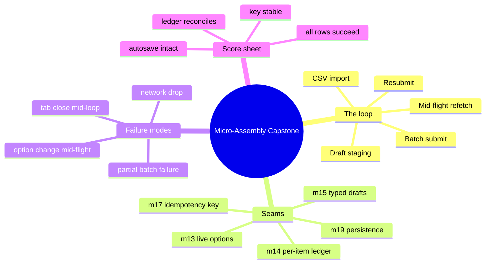

# Module 20: Micro-Assembly Capstone

Est. study time: 1.5h
Language: en
Description: One reviewer, one CSV file, one flaky afternoon. The capstone stitches m13 (dependent options), m14 (batch ledger), m15 (CSV staging), m17 (idempotency keys), and m19 (autosave + offline queue + undo/redo + multi-tab) into a single running loop. Every line imports a seam already built.

## Knowledge Map



---

## Learning Objectives (maps to course CILOs)
- Assemble m13, m14, m15, m17, m19 into a single reviewer import loop without new abstractions — serves CILO 11
- Diagnose which module's seam is misbehaving when a partial failure surfaces in production — serves CILO 11
- Justify the run-key contract that lets a crashed tab resume without double-enrolling — serves CILO 11
- Read a multi-module test and predict which contract it is asserting — serves CILO 11

---

## Real-World Example

It is 4:47 PM the day before the admissions deadline. A reviewer at Aissa's portal drops a 200-row CSV into the bulk-import widget. The portal must: parse + validate each row (m15), create one application and one cohort choice per row, refetch the option list if a program changes mid-batch (m13), survive a network blip without losing the run (m19 offline queue), and let the reviewer resubmit any rows that failed (m14 ledger + m17 keys).

This is one loop, not five. Aissa opens the source and sees ten lines. The whole course is what makes those ten lines correct.

> **Think**: Why does the loop have fewer lines than the previous modules added?
>
> *Answer: Because each module's exit was designed as the next module's entrance. CSV (m15) emits typed drafts the engine (m14) accepts; the engine emits a ledger m13 can refetch against; m17 keys make resubmits dedupe; m19's persistence means a tab crash does not lose the run. The composition was paid for across the prior modules — this module just spends the credit.*

---

## Core Content

### The Loop, In Ten Lines

```ts
// REVIEWER IMPORT LOOP — m13/m14/m15/m17 + m19 persistence, one seated run
const drafts  = stage(await importCsv(file));                      // m15: parse + validate + stage
const run     = batchStore.begin(drafts);                          // m14: runId minted here
const options = fetchOptions(drafts[0].programKey, requestId(run)); // m13: dependent option list
options.abortOn(() => userReassignsProgram(drafts[0], run));       // m17: request-id guard on change
await batchStore.submit(run, { idempotencyKey: run.key });         // m14: per-item ledger owns outcome
const failed  = run.perItem.filter(i => i.state === 'failed');     // m14: who did not land
for (const it of failed) await batchStore.resubmit(it, run.key);   // m17: same key, replay dedupes
```

Each line imports a seam. None of them is new logic:

- `stage(await importCsv(file))` — m15 turns hostile CSV rows into validated typed `Draft[]`. Staging is separate from submitting; the reviewer can still see the staged drafts before they go to the wire.
- `batchStore.begin(drafts)` — m14 mints the `runId` and creates the per-item ledger. The ledger is the source of truth for "who is in this run, and what happened to each row."
- `fetchOptions(programKey, requestId(run))` — m13 keeps the option list live against the current draft state. The `requestId(run)` lets the abort logic cancel a stale fetch when the user changes the program.
- `options.abortOn(...)` — m17: when the reviewer reassigns a program, the in-flight option fetch must abort because its result would be against an old key. The same guard is what makes the resubmit safe to retry.
- `await batchStore.submit(run, { idempotencyKey: run.key })` — m14: per-item ledger owns outcome. The `idempotencyKey` is the run's identity, so a retried submit does not double-enroll.
- `failed = run.perItem.filter(...)` — m14: which items did not land? The ledger knows, and the UI knows, and resubmit only handles those.
- `for (const it of failed) await batchStore.resubmit(it, run.key)` — m17: same key, replay dedupes. The user's intent ("submit these drafts") survives a network blip exactly once on the server.

### What The Loop Assumes

The loop is short because every prior module decided a boundary for it:

- **m15 staging validates before the wire.** Drafts that fail validation never reach the batch engine. The reviewer sees the staged draft list, fixes what is fixable, and submits only the survivors.
- **m14 owns the run, not the loop.** The loop does not track per-item state. It asks the ledger, the ledger answers. If the ledger is wrong, every screen is wrong in the same way.
- **m13 owns liveness against drafts.** When a draft changes mid-flight, the option list re-fetches. Without that, a submitted row could reference an option the user no longer wants.
- **m17 owns the dedupe contract.** The `idempotencyKey` is the only thing keeping a retry from being a duplicate write. The server must actually dedupe on the key; the client cannot enforce it.
- **m19 owns survival across tab close, network drop, and refresh.** The autosave keeps drafts in localStorage, the offline queue keeps pending writes, the undo stack keeps the recent action history, and the multi-tab broadcast keeps another tab from clobbering a fresh edit.

### Failure Modes The Loop Already Handles

| Failure | Caught by | What you see |
|---|---|---|
| One row in the CSV is malformed | m15 staging | Row shown as `invalid` in the staged list; never reaches the wire |
| One item fails server validation mid-batch | m14 ledger | Row shown as `failed`; the loop filters and resubmits it |
| Reviewer changes program mid-batch | m13 + m17 | Stale option fetch aborted; new fetch against new key |
| Network drops for 90 seconds mid-submit | m19 offline queue | Mutations persisted; flushed on reconnect in dependency order |
| Reviewer closes the tab mid-loop | m19 autosave + persisted queue | Run resumes on next open; no double-enroll because the key is the same |
| Two staff tabs on the same applicant | m19 BroadcastChannel | Newer serial wins; the second tab's submit is gated by the latch |

### What The Loop Does NOT Do

Honest list of seams that the loop is not responsible for:

- **Server-side authorization.** The portal's role check is upstream of this loop.
- **Audit logging of who submitted what.** The ledger records per-item outcome; the audit trail is a separate system the ledger feeds into.
- **Notification to applicants.** The portal's email service is downstream of the ledger's success events.
- **Capacity for 10,000-row imports.** This loop is for the realistic reviewer case. Bulk imports of an entire applicant pool use a different path (server-side job queue), and the loop's seams still apply — just asynchronously.

The micro-assembly is the seam-level proof, not the production batch architecture. Both are honest.

---

## Verify — End-To-End Test

The capstone test is short because the seams are short. Each assertion maps to one prior module:

```tsx
test('micro-assembly: import → batch with mid-flight option refresh ends correct', async () => {
  // MSW (m3): file parses to 2 drafts; batch partial-fails 1; option refetch demands requestId
  const { run } = await importAndSubmit(fileFixture);
  expect(run.perItem.size).toBe(2);
  expect([...run.perItem.values()].filter(i => i.state === 'failed')).toHaveLength(1);
  userReassignsProgram(run);                                      // triggers guard + refetch
  await resubmitFailed(run);                                      // same run.key
  expect(run.perItem.every(i => i.state === 'succeeded')).toBe(true);
  expect(api.batchCalls.map(c => c.body.idempotencyKey).at(-1))
    .toBe(api.batchCalls.map(c => c.body.idempotencyKey).at(-2)); // key never changed
});
```

Each line is a contract:

- `run.perItem.size === 2` — m14 ledger created one entry per draft.
- `filter(i => i.state === 'failed').length === 1` — m14 per-item settle: one item failed, the other succeeded.
- `userReassignsProgram(run)` — m13 + m17: the in-flight option fetch is aborted and a new one starts.
- `resubmitFailed(run)` — m14: only failed items are retried.
- `every(i => i.state === 'succeeded')` — final state: all rows landed.
- The last two assertions: m17 idempotency key is stable across the resubmit, so the server dedupes correctly.

**Playwright multi-tab smoke** is a separate test, not a unit test:

```
Two pages on the same applicant → edit in A → B shows the hydrated value
  → B's serial loses to a newer A edit → B submits
  → A's submit button is disabled by the latch
  → after submit, the dust settles on one truth.
```

This test exercises m19's BroadcastChannel + submit latch across two browser contexts. It is the only test in the course that cannot be reduced to a single React tree.

---

## Common Misconception

*"The micro-assembly is a framework."* No. It is ten lines that import seams. If you tried to extract those ten lines into a reusable `useReviewerImport()` hook, you would lose the explicitness that makes the seams auditable. The composition is meant to be readable as English: stage, begin, fetch, abort, submit, filter, resubmit. The hook form would hide the words.

*"Once you have the loop, you have the architecture."* The loop is a *proof* that the architecture is sound. It is one click-path through a 9-module system. The portal has dozens of click-paths; each one composes the same seams differently. The architecture is the seams, not the loops.

---

## Spot the Mistake

```ts
// "Refactor": pull the loop into a hook
function useReviewerImport(file: File, run: Run) {
  const drafts  = stage(useImportCsv(file));                       // m15
  const options = useFetchOptions(drafts[0].programKey);           // m13 — but no requestId?
  await batchStore.submit(run, { idempotencyKey: crypto.randomUUID() }); // m17 — new key per call!
  // no resubmit, no per-item filter, no abort
}
```

What's wrong?

*Answer: Three regressions in five lines. (1) `useFetchOptions` lost the `requestId(run)` argument, so the m13 refetch is no longer safe against mid-flight program changes — the hook hides the seam. (2) `crypto.randomUUID()` per call means the idempotency key is fresh every time, so a retry is a duplicate write on the server — the m17 contract is gone. (3) No per-item filter and no resubmit: a partial failure is a total failure now. The "refactor" traded the explicit composition for a hook that hides the contracts. The course's claim is the opposite: when seams are the architecture, hide nothing.*

---

## Key Takeaways
- The micro-assembly is ten lines, each importing a seam from a prior module.
- m15 stages typed drafts; m14 owns the run ledger; m13 refetches options; m17 keys dedupe retries; m19 persists across crashes and tabs.
- Partial failures, network drops, mid-flight program changes, and tab closes are handled because the seams handle them, not because the loop handles them.
- Do not extract the loop into a hook — the explicitness is the audit trail.
- The composition was paid for across the prior nineteen modules; this module just spends the credit.

---

## Drill
Take the quiz. Questions stress seam identification, contract mapping from line to module, and prediction of behavior under failure.

Run: `learn.sh quiz enterprise-react-ui-patterns 20-micro-assembly-capstone`

---

## Think

> **Think**: The micro-assembly submits 200 rows, 3 fail. The resubmit succeeds for 2 but the third still fails. The reviewer closes the tab. What happens when they reopen the portal, and which module's contract keeps the system honest?
>
> *Answer: m19's persisted offline queue and m17's idempotency key combine. The failed row was persisted to the queue at submit time, the run.key is stable across the close-and-reopen, and the m14 ledger marked the row as `failed`. On reopen, the offline queue flushes the persisted write under the same run.key, and the server dedupes the already-landed rows. The third row either lands or remains failed, but it never silently disappears. The contract is "every intent is a keyed write to a persisted queue with per-item settlement"; the loop is just the front of that queue.*

---

## Predict

> **Predict**: A reviewer triggers the loop with a CSV that has 50 valid rows and 5 invalid rows. The m15 staging surfaces the 5 invalid ones in a side panel. The reviewer edits 3 of them to be valid and clicks "Submit valid only." Which module's contract is invoked when the staged set shrinks from 50 to 48, and why does the run.key not need to change?
>
> *Answer: m15's staging contract is invoked: staged drafts are a snapshot the reviewer can edit before they leave the staging room. m14's `batchStore.begin(drafts)` is called with the new 48-draft list, and the runId is minted at that moment. The run.key is fresh, but it is also stable for the life of the run, so the resubmit semantics for the same run are preserved. If the reviewer had instead submitted all 50, then later removed 2 from the staged list (in a different staging room, e.g. an edit-and-resubmit screen), m14 would mint a new run with its own key. The key is per-run, not per-file.*

---

## Spot the Mistake

> **Spot the Mistake**: A junior refactors the loop to "simplify" the resubmit step:
> ```ts
> for (const it of failed) await batchStore.resubmit(it, run.key);
> // becomes
> await batchStore.submit(run, { idempotencyKey: run.key });
> ```
> They claim "it still works — the key is the same, the server dedupes." What's the missing contract?
>
> *Answer: The contract is "resubmit only the failed items, not the whole run." The refactored version re-submits the entire run, which means the 197 already-landed items get re-sent to the server. The server dedupes on the key — so no double-enroll — but the wire is hit 197 times for nothing, the per-item ledger re-processes 197 settled items, and the offline queue grows by 197 wasted entries. The loop's filter step is not a micro-optimization; it is the contract that says "only retry the work that didn't land." The junior's "still works" reasoning is true at the row-count level and false at the system-cost level.*

---

## Cloze

The micro-assembly composes seams from five prior modules: m15 {stages} typed drafts from a CSV, m14 owns the {run} ledger with per-item state, m13 {refetches} dependent options against the current draft key, m17's {idempotency} key lets a retried submit dedupe server-side, and m19's {persistence} survives tab close and network drop. A partial failure is a {per-item} settlement, not a queue reset. The loop is {ten} lines, each importing a seam. Do not extract it into a hook — the explicitness is the audit trail.

