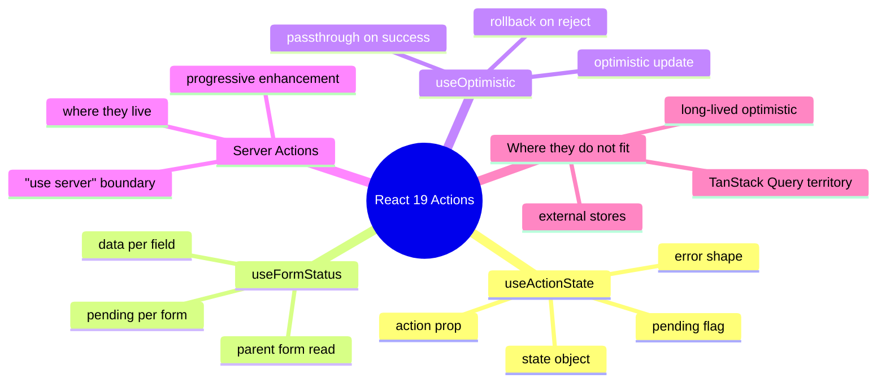

# Module 21: React 19 Actions in Enterprise UI

Est. study time: 1.5h
Language: en
Description: useActionState, useFormStatus, useOptimistic, and Server Actions in the context of a client-only enterprise portal. Where they fit next to TanStack Query, where they do not, and why Aissa's portal keeps both.

## Knowledge Map



---

## Learning Objectives (maps to course CILOs)
- Decide when useActionState + Server Actions beat a TanStack Query mutation for an enterprise form — serves CILO 12
- Wire useOptimistic safely with a rollback path keyed to a stable id — serves CILO 12
- Read useFormStatus from a child component of the form without prop drilling — serves CILO 12
- Recognize the limits of React 19 Actions in a client-only portal with mocked APIs — serves CILO 12

---

## Real-World Example

Aissa's team ships a "request more info" form on the applicant detail page. The form has three fields, a submit button, and a success state that hides the form and shows a confirmation. Two engineers propose two designs.

Engineer 1 reaches for `useActionState` + a Server Action. The form works without JavaScript (progressive enhancement), pending state is automatic, and the error path is built in.

Engineer 2 reaches for `useMutation` from TanStack Query. The mutation is tied to the same query cache the rest of the app reads from, so a successful submit invalidates the applicant list and refetches.

Both work. Which is right depends on whether the form is part of an integrated client experience (TanStack Query, M12) or a self-contained transaction that benefits from progressive enhancement (React 19 Actions). The portal is client-only with a mock server, so the "no JS" path is academic — but the integration question is real.

> **Think**: When would you choose TanStack Query over useActionState even though both can handle a form submission?
>
> *Answer: When the mutation must coordinate with other cached data — invalidating lists, updating related queries, integrating with a websocket refresh. useActionState is local to the form's lifecycle; TanStack Query mutations are global to the cache. Pick the one whose scope matches the coordination you need.*

---

## Core Content

### Section 1: useActionState — Form State Without useState

`useActionState` collapses three things a hand-rolled form manages separately: the form state, the pending flag, and the error envelope. The shape is a reducer with a known transition.

```tsx
'use client';
import { useActionState } from 'react';

async function requestInfo(prev: State, formData: FormData): Promise<State> {
  const res = await api.requestInfo(formData);
  if (!res.ok) return { ok: false, error: res.error };
  return { ok: true, ticketId: res.ticketId };
}

export function RequestInfoForm() {
  const [state, action, pending] = useActionState(requestInfo, { ok: null });
  return (
    <form action={action}>
      <input name="email" required />
      <button disabled={pending}>{pending ? 'Sending…' : 'Request info'}</button>
      {state.ok === false && <p role="alert">{state.error}</p>}
      {state.ok && <p>Ticket #{state.ticketId} created.</p>}
    </form>
  );
}
```

The contract:

- `state` is whatever the action returns. It is the reducer's accumulator. Reading `state.ok` is the canonical way to branch on the last result.
- `action` is the function passed to `<form action={...}>`. It is what React calls on submit, with the previous state and the FormData. The previous state is the key reason this is a `useActionState` and not a plain action — a plain action has no memory of what came before.
- `pending` is `true` while the action is in flight. The button is disabled, the form fields are typically read-only, and the UI shows a spinner.
- The action runs in a transition by default. Lower-priority updates elsewhere do not block on it.

The pattern fits **simple, self-contained forms** where the success state is a different render and the form is not part of a larger coordinated workflow. The "request more info" example is exactly that. A multi-step wizard with cross-step validation is not.

### Section 2: useFormStatus — Parent Form Read From a Child

`useFormStatus` lets a deep child of a form read the form's pending state without prop drilling. The child must be a descendant of a `<form>` whose `action` is an action function.

```tsx
'use client';
import { useFormStatus } from 'react-dom';

function SubmitButton() {
  const { pending, data } = useFormStatus();
  return (
    <button disabled={pending} aria-busy={pending}>
      {pending ? `Sending ${data?.get('email')}…` : 'Request info'}
    </button>
  );
}
```

The contract:

- The hook only works inside a form's action. It reads the parent form's transition state.
- `pending` is the form's pending flag. A submit button deep in the form can disable itself without the parent passing props.
- `data` is the FormData the form was submitted with. Useful for showing "Sending to [email]" or similar context-dependent labels.

The pattern fits **design system components**: a `SubmitButton` lives in the design system, takes no props for pending, and just works. It does not fit forms that have multiple submit targets or that are not actually a `<form>` (e.g. a div with onClick).

### Section 3: useOptimistic — Show The Result Before The Server Confirms

`useOptimistic` lets a component show a value that is not yet the source of truth, and lets the React state catch up when the real value arrives. The classic case is a like button that fills in immediately and rolls back if the API rejects.

```tsx
'use client';
import { useOptimistic, useState } from 'react';

export function LikeButton({ initial, applicantId }: Props) {
  const [saved, setSaved] = useState(initial);
  const [optimistic, setOptimistic] = useOptimistic(saved);

  async function like() {
    setOptimistic({ ...optimistic, liked: true });
    const next = await api.like(applicantId);
    setSaved(next);
  }

  return <button onClick={like}>{optimistic.liked ? 'Liked' : 'Like'}</button>;
}
```

The contract:

- `useOptimistic(state)` returns `[optimisticState, setter]`. While the action is in flight, reads see the optimistic value. When the action resolves and the real state updates, reads see the real value.
- The setter must be called inside a transition. If the action throws or rejects, React does NOT automatically roll back. The rollback is the caller's job — typically, on error, the real state is unchanged, so the optimistic value evaporates on the next render.
- The pattern requires a **stable key** in the optimistic value. If the user clicks the button twice in 50ms, two optimistic updates land; the second one must compose with the first or both reads will see a stale value. The `applicantId` is the key — the optimistic value lives inside a row identified by that id.

The pattern fits **fast feedback for fast user actions** (like, follow, mark-as-read). It does not fit long-running workflows where the optimistic state is itself a complex object that needs cancellation. For those, M14's batch engine and the per-item ledger are the right tool.

### Section 4: Server Actions — Where They Live

A Server Action is a function with the `'use server'` directive, intended to run on a server. In a Next.js app, the function lives in a server component or a `'use server'` module, and the client passes a reference to it as a form's `action` prop.

```tsx
// app/actions.ts
'use server';
export async function requestInfo(prev: State, formData: FormData) {
  // runs on the server, has access to the database
  await db.insertTicket(formData);
  return { ok: true, ticketId: 'T-123' };
}
```

The contract:

- The action runs on the server. It can access databases, secrets, and other server-only resources.
- The client imports a reference to the action, not its body. The bundler wires the reference through a special endpoint.
- The action is part of the framework's RPC mechanism. It is not a general-purpose API; the form-action and `useActionState` integration is the supported usage.
- Aissa's portal does not use Server Actions. The portal is a client-only React app with a mock server. Server Actions are a fit for apps built on a framework that supports them, not for apps built on a separate API.

> **Cloze**: "A {Server Action} is a function marked 'use server' that runs on the {server}; the client imports a {reference} to it, not its body. The portal is client-only, so Server Actions are not the fit — the form uses a TanStack Query {mutation} against the mock API."

### Section 5: Where React 19 Actions Do Not Fit

Honest list of seams the actions are NOT responsible for:

- **Coordinating with the query cache.** useActionState has no concept of "invalidate this query." A successful form submit that should refresh a list needs TanStack Query's `invalidateQueries`.
- **Long-lived optimistic state.** useOptimistic is a fast-feedback primitive. A multi-step batch that takes 30 seconds to commit needs M14's batch engine and the per-item ledger.
- **External store integration.** useSyncExternalStore is still the right tool for bridging zustand or a websocket into a render. Actions do not replace it.
- **Tabs, network drops, partial failure.** Those are M19's domain. Actions do not persist across tab close, do not queue, and do not have a per-item settle contract.

The actions are a good fit for **simple forms with one submission, one server call, one success or one error**. Beyond that, the seams built earlier in the course are the right tools.

---

## Verify — Tests For The Patterns

```tsx
test('useActionState exposes pending and state', async () => {
  render(<RequestInfoForm />);
  fireEvent.click(screen.getByText('Request info'));
  expect(screen.getByRole('button')).toBeDisabled();
  await waitFor(() => expect(screen.getByText(/Ticket #/)).toBeInTheDocument());
});

test('useFormStatus reads parent form pending from a child', () => {
  render(<RequestInfoForm />);
  expect(screen.getByRole('button')).not.toBeDisabled();
  fireEvent.click(screen.getByText('Request info'));
  expect(screen.getByRole('button')).toBeDisabled();
});

test('useOptimistic rolls back when the action rejects', async () => {
  api.like = jest.fn().mockRejectedValue(new Error('rate limited'));
  render(<LikeButton initial={{ liked: false }} applicantId="A-1" />);
  fireEvent.click(screen.getByText('Like'));
  expect(screen.getByText('Liked')).toBeInTheDocument();     // optimistic
  await waitFor(() => expect(screen.getByText('Like')).toBeInTheDocument()); // rolled back
});
```

---

## Common Misconception

*"React 19 Actions replace TanStack Query."* No. Actions handle form-submission-shaped interactions; TanStack Query handles cached-server-data-shaped interactions. The portal needs both: useActionState for the request-info form, useQuery for the applicant list, and they never replace each other.

*"useOptimistic auto-rolls-back on error."* No. The optimistic value evaporates only if the real state did not change. If the action partially succeeded and updated a server-side field, the next refetch is the only thing that re-syncs the view.

*"Server Actions are the new way to build forms."* In a framework that supports them (Next.js App Router, Remix, etc.), yes. In a client-only app like Aissa's portal with a separate API, they are not the right tool. The course stays framework-neutral on this point.

---

## Spot the Mistake

```tsx
function LikeButton({ initial, applicantId }: Props) {
  const [saved, setSaved] = useState(initial);
  const [optimistic, setOptimistic] = useOptimistic(saved);

  async function like() {
    const next = { ...saved, liked: true };
    setOptimistic(next);                                  // bug 1: based on saved, not optimistic
    try {
      const result = await api.like(applicantId);
      setSaved(result);                                   // bug 2: setSaved not in a transition
    } catch (e) {
      // no rollback
    }
  }

  return <button onClick={like}>{optimistic.liked ? 'Liked' : 'Like'}</button>;
}
```

What's wrong?

*Answer: Three problems. (1) `setOptimistic(next)` reads `saved`, the source-of-truth, instead of the current `optimistic` value. Two rapid clicks see the same `saved` and produce identical optimistic updates, so the second click does not compose. The fix: read `optimistic` in the closure, not `saved`. (2) `setSaved(result)` outside a transition can race with the pending action; the state update can land before the action's transition completes. Wrap in `startTransition`. (3) No rollback on error. The catch block should either set a previous-state marker or rely on the fact that `saved` was not updated, which only works if the optimistic value's setter was called with the latest `optimistic` — which bug (1) prevents. The pattern is fragile without the key and the transition.*

---

## Key Takeaways
- useActionState collapses form state, pending flag, and error envelope into one hook
- useFormStatus lets a deep child of a form read the form's pending state without prop drilling
- useOptimistic shows a value before the server confirms; the rollback is the caller's job
- Server Actions are a fit for framework-backed apps, not for client-only portals with separate APIs
- Actions do not replace TanStack Query, batch engines, or persistence — they handle form-submission-shaped interactions

---

## Drill
Take the quiz. Questions stress the fit/misfit boundary between React 19 Actions and the rest of the course's seams.

Run: `learn.sh quiz enterprise-react-ui-patterns 21-react-19-actions`

---

## Think

> **Think**: A team replaces a TanStack Query mutation with useActionState because "it's simpler." The mutation was previously invalidating the applicant list on success. After the switch, the list is stale. What went wrong architecturally, and what is the minimum change to recover the invalidation?
>
> *Answer: useActionState has no concept of query invalidation. The original design assumed the action lived in a TanStack Query mutation's onSuccess, which had access to the query client. The fix is to keep the action in a TanStack Query mutation, or to call `queryClient.invalidateQueries(...)` from inside the useActionState action after a successful result. The "simpler" replacement is simpler only for the form's UI; the coordination with cached data is the seam that the original architecture owned. Actions do not own that seam.*

---

## Predict

> **Predict**: A user clicks "Like" on an applicant in Aissa's portal. The optimistic state shows "Liked" immediately. The API call takes 1.2 seconds and succeeds. What does the user see at t=0, t=0.6s, t=1.2s, and t=1.21s? What if the API rejects at t=1.2s?
>
> *Answer: t=0 — "Liked" (optimistic applied). t=0.6s — still "Liked" (in-flight, optimistic persists). t=1.2s on success — "Liked" (real value matches). t=1.21s — "Liked" (no visual change because real matches optimistic). On rejection at t=1.2s: the real state was never updated, so on the next render the optimistic value evaporates and the user sees "Like" again. The rollback is automatic only if the real state did not change AND the optimistic was based on the current optimistic value (not the saved one — see the Spot the Mistake).*

---

## Spot the Mistake

> **Spot the Mistake**: A junior uses useActionState for the applicant detail page's "Edit" form, which has 30 fields. They complain "the form is sluggish — every keystroke re-renders the entire page."
>
> What's the architectural issue, and what is the right primitive?
>
> *Answer: useActionState is a reducer — every action invocation produces a new state object, and React re-renders the form's component tree. For a 30-field form, that means every keystroke goes through the action's pending cycle, even though only one field changed. The right primitive is a hand-rolled form with local useState per field, plus a submit handler that calls useActionState once on submit. The fields own their state; the action owns only the submit lifecycle. useActionState is for the action, not for the field state. Conflating the two is the same shape as the "managed component" anti-pattern from pre-hooks React.*

---

## Cloze

{useActionState} collapses form state, pending flag, and error envelope into one hook bound to a {reducer} shape. {useFormStatus} lets a deep {child} of a form read the form's pending state without prop drilling — useful for design-system SubmitButton components. {useOptimistic} shows a value before the server confirms; the rollback is the {caller's} job, not React's. {Server Actions} are framework-backed RPC functions, not the right fit for Aissa's client-only portal. Actions are not a {replacement} for TanStack Query, batch engines, or persistence — they handle form-submission-shaped interactions.

