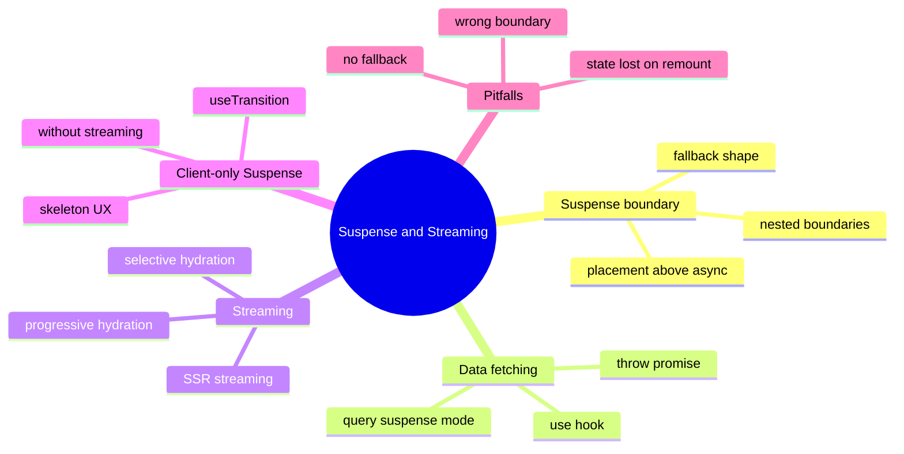

# Module 22: Suspense & Streaming Patterns

Est. study time: 1.5h
Language: en
Description: Suspense, Suspense boundaries, streaming SSR, and the data-fetching patterns that work with them. How to wrap TanStack Query reads, when to add a fallback, and why Aissa's client-only portal still benefits from a Suspense-shaped component tree.

## Knowledge Map



---

## Learning Objectives (maps to course CILOs)
- Place a Suspense boundary above an async data source so the fallback shows while data resolves — serves CILO 13
- Decide when a client-only portal benefits from Suspense-shaped trees without actual streaming — serves CILO 13
- Use `use()` to read a Promise in render and let Suspense catch the throw — serves CILO 13
- Avoid the common pitfalls: wrong boundary placement, no fallback, lost state on remount — serves CILO 13

---

## Real-World Example

Aissa's applicant detail page has three sections: profile (from `useQuery`), recent activity (from `useQuery`), and a related-applicants carousel (from `useQuery`). Without Suspense, each section renders a spinner independently, and the page feels busy. With Suspense, the whole page can render a single skeleton until the slowest query resolves — but only if the boundaries are placed correctly.

A junior wraps each section in its own `<Suspense>` boundary. The result: three spinners again. The fix: wrap the whole page in one boundary so the page-level skeleton shows until everything resolves. The trade-off: any one slow query delays the whole page. The right answer depends on whether the sections are independent (own boundary each) or coordinated (one boundary).

> **Think**: When is a single page-level Suspense boundary better than per-section boundaries?
>
> *Answer: When the sections are coordinated — a slow section means the page is not useful. When sections are independent — the user can read one while another loads — per-section boundaries are better. A detail page with one primary section is coordinated; a dashboard with many independent widgets is independent.*

---

## Core Content

### Section 1: What Suspense Actually Does

Suspense is a render-phase mechanism. A child component "suspends" by throwing a Promise during render. The nearest ancestor `<Suspense>` boundary catches the throw, renders its `fallback`, and schedules a re-render when the Promise resolves. The boundary then commits the resolved children.

The pattern requires a data source that knows how to throw a Promise. Three common sources:

- **React.lazy**: dynamic import of a component. The import returns a Promise; React throws it during render.
- **Server Components with `cache()`**: framework integration, throws a Promise that the streaming runtime resolves.
- **`use()` with a Promise**: any Promise can be read in render via `use()`, which throws the Promise if it is not yet resolved.

For client-only data fetching (the portal's case), `use()` is the explicit primitive. A TanStack Query read can be wrapped: a `SuspenseQuery` hook that throws the Promise until the query resolves. TanStack Query ships a `suspense: true` option that turns the hook into a thrower.

### Section 2: Where to Place the Boundary

The boundary placement question is the only one that matters. The rule: **place the boundary above every async source that can suspend**.

```tsx
function ApplicantPage({ id }: { id: string }) {
  return (
    <Suspense fallback={<ApplicantSkeleton />}>
      <Profile id={id} />              // uses useSuspenseQuery
      <RecentActivity id={id} />       // uses useSuspenseQuery
      <RelatedCarousel id={id} />      // uses useSuspenseQuery
    </Suspense>
  );
}
```

The contract:

- The fallback shows until ALL children have resolved. If one is slow, all wait.
- If you want the page to render as sections resolve, add nested boundaries:

```tsx
function ApplicantPage({ id }: Props) {
  return (
    <div>
      <Suspense fallback={<ProfileSkeleton />}>
        <Profile id={id} />
      </Suspense>
      <Suspense fallback={<ActivitySkeleton />}>
        <RecentActivity id={id} />
      </Suspense>
    </div>
  );
}
```

The trade-off is between coordinated UX (one boundary, all-or-nothing) and progressive UX (multiple boundaries, sections stream in). The right answer is "the boundaries match the user's mental model of independence."

### Section 3: The `use()` Hook

`use(promise)` reads a Promise in render. If the Promise is unresolved, `use` throws it, and the nearest Suspense boundary catches. If the Promise rejects, the nearest error boundary catches.

```tsx
import { use, Suspense } from 'react';

function Profile({ dataPromise }: { dataPromise: Promise<Profile> }) {
  const profile = use(dataPromise);
  return <h1>{profile.name}</h1>;
}

function Page({ id }: Props) {
  const dataPromise = fetchProfile(id);   // start the fetch in render
  return (
    <Suspense fallback={<Skeleton />}>
      <Profile dataPromise={dataPromise} />
    </Suspense>
  );
}
```

The contract:

- The fetch starts in render. This is fine because the same render is what throws the Promise, and React will retry when it resolves.
- `use` is the only way to read a Promise in render. Other approaches (await, .then) do not throw to Suspense.
- Aissa's portal can use `use` directly, without a framework, by combining it with a small cache so the same Promise is returned for the same id.

### Section 4: Streaming SSR

Streaming SSR is a framework capability, not a React capability alone. The server sends the initial HTML, then streams additional chunks as data resolves. The client's HTML parser sees the chunks as they arrive. Suspense boundaries are how the server knows which chunks can be sent independently.

For a client-only portal like Aissa's, streaming SSR is not the concern. The portal is shipped as a static bundle; data fetching happens in the browser. But the Suspense-shaped component tree is the same, and it makes the client code ready for SSR if/when the portal moves to Next.js or Remix.

> **Cloze**: "Streaming SSR streams additional HTML chunks as data resolves; {Suspense} boundaries tell the server which chunks are independent. A client-only portal does not need streaming but benefits from a Suspense-shaped tree that is ready for the move to SSR."

### Section 5: Pitfalls

Three pitfalls show up in every Suspense codebase:

- **No fallback.** A `<Suspense>` without a `fallback` prop renders nothing while children suspend. Always provide a fallback that matches the children's final shape (avoid layout shift).
- **Wrong boundary placement.** A boundary below the async source is useless — the throw bubbles to the parent's boundary. A boundary above the wrong subtree groups things that should be independent. Trace from each async source to the boundary you want to catch it.
- **State lost on remount.** When a Suspense boundary remounts its children (because the key changed, or because of a navigation), the children's local state is lost. A common bug: a `<form>` inside a Suspense boundary loses its draft on revalidation. The fix is to keep the form outside the boundary or to lift the draft to a stable parent.

### Section 6: Client-Only Suspense Without Streaming

For a client-only portal, the "streaming" benefit does not apply. But Suspense is still useful:

- The boundary gives a single skeleton for the whole page instead of N spinners.
- The combination of `use()` + a fetch cache gives a render-time read with built-in dedupe.
- The shape is portable to SSR when the portal moves to a framework.

The trade-off: every `useSuspenseQuery` must be wrapped in a boundary, or the page throws past the boundary to a parent or errors out. TanStack Query's `suspense: true` requires you to commit to the shape.

---

## Verify — Tests For The Patterns

```tsx
test('Suspense shows fallback while query is pending', () => {
  render(
    <Suspense fallback={<Skeleton />}>
      <Profile id="A-1" />
    </Suspense>,
    { wrapper: createTestQueryClient() }
  );
  expect(screen.getByTestId('skeleton')).toBeInTheDocument();
  await waitFor(() => expect(screen.getByText(/Aissa/)).toBeInTheDocument());
});

test('use() throws the promise to the boundary', async () => {
  const promise = Promise.resolve({ name: 'Aissa' });
  render(
    <Suspense fallback="loading">
      <Profile dataPromise={promise} />
    </Suspense>
  );
  expect(screen.getByText('loading')).toBeInTheDocument();
  await waitFor(() => expect(screen.getByText('Aissa')).toBeInTheDocument());
});

test('nested boundaries suspend independently', async () => {
  render(<ApplicantPage id="A-1" />, { wrapper });
  expect(screen.getByTestId('profile-skeleton')).toBeInTheDocument();
  await waitFor(() => expect(screen.getByTestId('profile')).toBeInTheDocument());
  expect(screen.queryByTestId('activity-skeleton')).toBeInTheDocument();
});
```

---

## Common Misconception

*"Suspense means streaming."* No. Suspense is a render-phase mechanism for showing fallbacks while data resolves. Streaming is a server capability that uses Suspense boundaries to know which chunks to send independently. A client-only app uses Suspense without streaming; a server framework uses both.

*"useSuspenseQuery replaces useQuery."* No. The suspense variant throws instead of returning `{ isLoading: true }`. The two are different shapes. Switching to suspense requires every consumer to be inside a boundary, which is a non-trivial refactor for an app built around useQuery.

*"Suspense always improves perceived performance."* No. A single page-level boundary can make the page feel slower because the whole page waits for the slowest section. The right granularity matches the user's mental model of independence.

---

## Spot the Mistake

```tsx
function ApplicantPage({ id }: Props) {
  return (
    <div>
      <Profile id={id} />              {/* uses useSuspenseQuery, but no Suspense above it */}
      <RecentActivity id={id} />
    </div>
  );
}
```

What's wrong?

*Answer: `Profile` suspends (throws a Promise) and there is no `<Suspense>` boundary above it. The throw bubbles to the nearest Suspense in the route tree, which is probably the router's loading state — and the page's recent-activity section is hidden behind the same boundary, defeating the point of independent rendering. The fix: wrap the page (or the profile) in a `<Suspense>` boundary above the suspending component. The boundary must be above the thrower, not below.*

---

## Key Takeaways
- Suspense is a render-phase mechanism: a child throws a Promise, the nearest boundary catches and shows fallback
- Boundary placement is the only design question that matters; match it to the user's mental model of independence
- `use(promise)` is the only way to read a Promise in render
- Streaming SSR is a framework capability built on Suspense; client-only apps use Suspense without streaming
- Always provide a fallback; trace throws to boundaries; protect stateful children from remount

---

## Drill
Take the quiz.

Run: `learn.sh quiz enterprise-react-ui-patterns 22-suspense-and-streaming`

---

## Think

> **Think**: A page has three sections. Section A is the user's primary task and must render first. Section B is contextual and can wait. Section C is a footer-like widget. Where do you place Suspense boundaries?
>
> *Answer: One boundary around Section A so it renders alone as soon as its data resolves. One boundary around B and C together so they render when their data resolves. The key insight: the user's mental model of independence is the rule. Section A is independent; B and C are not separately valuable, so grouping them is fine. The boundary placement is the design — and the design is the user's flow, not the data's fetch order.*

---

## Predict

> **Predict**: A team refactors from `useQuery` to `useSuspenseQuery` in a portal. The app suddenly shows a blank page for 800ms on first load, where before it showed the layout with skeleton spinners. Why?
>
> *Answer: The refactor added a single page-level Suspense boundary that wraps the whole route. While the slowest query is in flight, the entire route shows the fallback. The original useQuery pattern let each section render its own spinner independently. The fix is either: (a) add per-section boundaries so the layout renders with the slowest section as fallback, or (b) accept the new shape if the layout would be useless without all data anyway. The trade-off is the same as the always-suspends-everything vs progressive-streaming decision — but the user sees it as 800ms of blank instead of a busy, populated loading state.*

---

## Spot the Mistake

> **Spot the Mistake**: A junior writes a Suspense boundary with no fallback:
> ```tsx
> <Suspense>
>   <Profile id={id} />
> </Suspense>
> ```
> They say "React will figure it out." What's wrong?
>
> *Answer: A `<Suspense>` without a `fallback` prop renders nothing while children suspend. The user sees a blank section for 800ms instead of a skeleton. The fix is always to provide a fallback that matches the final shape — same height, same layout, same column count — so the transition to real content is not a layout shift. Skeletons are a UX contract, not optional.*

---

## Cloze

{Suspense} is a render-phase mechanism: a child throws a {Promise} during render, the nearest {boundary} catches the throw and shows its fallback. Boundary placement is the only design question — match it to the user's mental model of {independence}. The {use} hook is the only way to read a Promise in render. Streaming {SSR} is a framework capability built on Suspense; a client-only portal uses Suspense without streaming. Always provide a {fallback} that matches the final shape to avoid layout shift, and protect stateful children from {remount} by lifting state above the boundary.

