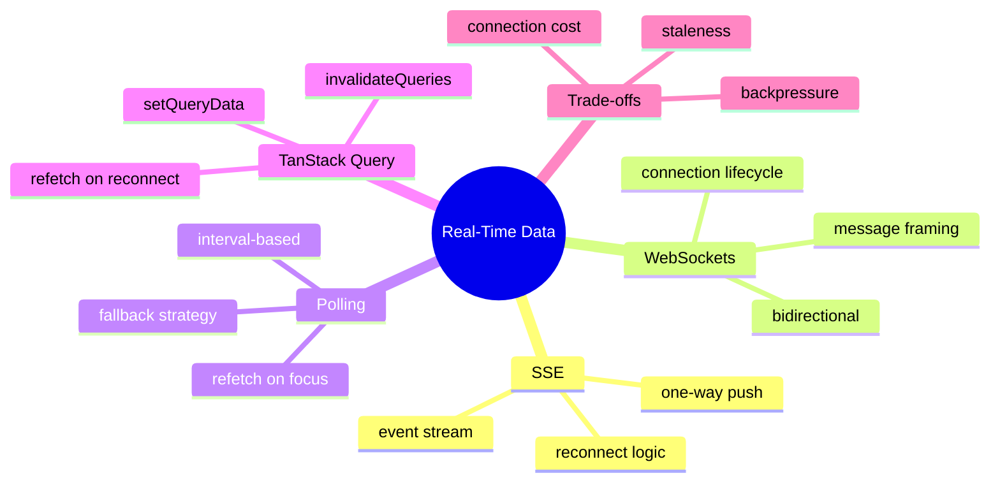

# Module 23: Real-Time Data Patterns

Est. study time: 1.5h
Language: en
Description: Server-Sent Events, WebSockets, polling, and TanStack Query integrations. How a client-only enterprise portal handles real-time updates without giving up the cache, and what a closed browser tab costs.

## Knowledge Map



---

## Learning Objectives (maps to course CILOs)
- Choose SSE vs WebSocket vs polling for an enterprise use case from measurable conditions — serves CILO 14
- Wire a real-time stream into TanStack Query so the cache updates without breaking other consumers — serves CILO 14
- Handle reconnect, backoff, and missed messages without flooding the server — serves CILO 14
- Recognize when real-time is the wrong answer and a manual refresh is enough — serves CILO 14

---

## Real-World Example

Aissa's portal needs the applicant list to update when a colleague creates or edits an applicant in another tab. Three approaches:

1. **Polling every 30 seconds.** Simple, robust, easy to reason about. Costs one request per tab per 30s. Stale by up to 30s.
2. **Server-Sent Events.** Server pushes when something changes. One-way, low overhead, auto-reconnect. Costs one persistent connection per tab.
3. **WebSockets.** Bidirectional, lower latency, more complex. Costs one persistent connection per tab and more server complexity.

For the applicant list, polling is honestly fine — 30s staleness is not a problem for an internal tool. For a chat panel or a live trading dashboard, SSE or WebSockets are necessary. The right tool depends on the staleness budget and the connection cost.

> **Think**: When is polling honestly the right answer for an enterprise app?
>
> *Answer: When the staleness budget is large (tens of seconds), the connection cost is real (mobile users on metered connections, server capacity for thousands of idle connections), and the user is not actively watching the screen. Internal tools, admin panels, and low-frequency data are polling's natural fit. Real-time is for high-frequency, user-watching, latency-sensitive surfaces.*

---

## Core Content

### Section 1: Polling With TanStack Query

TanStack Query ships polling as a first-class feature. The hook accepts a `refetchInterval` and refetches at that cadence.

```tsx
const { data } = useQuery({
  queryKey: ['applicants'],
  queryFn: fetchApplicants,
  refetchInterval: 30_000,
  refetchIntervalInBackground: false,
});
```

The contract:

- `refetchInterval` is the cadence in milliseconds. The query refetches on a timer.
- `refetchIntervalInBackground` is whether the refetch continues when the tab is hidden. Default is `false` (which is what you want — don't hammer the server from idle tabs).
- The refetch is a normal TanStack Query refetch. It uses the same cache, the same stale-time logic, the same error handling. The polling is just "trigger refetches on a timer instead of only on user action."

Polling is the right answer when the staleness budget is large. The implementation is two config flags; the cost is one request per interval per active tab. For an internal admin tool, this is the cheapest correct answer.

### Section 2: Server-Sent Events (SSE)

SSE is a one-way stream from server to client over HTTP. The client opens an `EventSource` and receives events as the server emits them.

```tsx
function useApplicantsStream() {
  const queryClient = useQueryClient();

  useEffect(() => {
    const es = new EventSource('/api/applicants/stream');
    es.addEventListener('applicant-changed', (e) => {
      const updated = JSON.parse(e.data);
      queryClient.setQueryData(['applicants'], (prev) => updateList(prev, updated));
    });
    return () => es.close();
  }, [queryClient]);

  return useQuery({ queryKey: ['applicants'], queryFn: fetchApplicants });
}
```

The contract:

- `EventSource` is a browser API. It handles reconnect automatically with exponential backoff.
- Events are typed by name. The server sends `event: applicant-changed\ndata: {...}\n\n`; the client listens on that event name.
- The stream is one-way. The client cannot send events back over the same connection. For a chat panel where the user sends messages, the client uses a regular POST and the server pushes the received message back over the SSE.
- The cache integration is `setQueryData` for partial updates (one applicant changed) or `invalidateQueries` for full refetch (when the server's logic is complex and the client should re-pull).
- The portal's mock server (M3 MSW) does not natively support SSE. For local dev, the team uses a polling fallback. In production against a real backend, the SSE path is the preferred integration.

### Section 3: WebSockets

WebSockets are bidirectional and lower-latency than SSE. The connection upgrade is a one-time HTTP request; thereafter, both sides send framed messages.

```tsx
function useApplicantsWS() {
  const queryClient = useQueryClient();

  useEffect(() => {
    const ws = new WebSocket('wss://api.example.com/applicants');
    ws.addEventListener('message', (e) => {
      const msg = JSON.parse(e.data);
      if (msg.type === 'applicant-changed') {
        queryClient.setQueryData(['applicants'], (prev) => updateList(prev, msg.payload));
      }
    });
    ws.addEventListener('close', () => {
      // schedule reconnect with backoff
    });
    return () => ws.close();
  }, [queryClient]);
}
```

The contract:

- `WebSocket` is a browser API. Reconnect is the application's job — there is no built-in backoff.
- Messages are framed; the protocol is up to the application. JSON is common; protobuf or msgpack for compact binary.
- Bidirectional means the client can push events back over the same connection, useful for presence, typing indicators, or collaborative editing.
- The cost is server-side: every connected client holds a TCP connection. Scaling to thousands of connections is non-trivial; SSE has the same constraint.
- For Aissa's portal, WebSockets are overkill for the applicant list. They become necessary if the team adds live collaborative editing on a draft (multiple users typing in the same form).

### Section 4: Reconnect And Backoff

Every streaming integration must handle reconnect. The pattern is the same for SSE and WebSockets: a backoff that doubles on failure, capped at a maximum interval, with jitter to avoid thundering herd.

```tsx
function useReconnectingStream(url: string, onMessage: (data: unknown) => void) {
  useEffect(() => {
    let es: EventSource | null = null;
    let attempts = 0;
    let cancelled = false;

    function connect() {
      es = new EventSource(url);
      es.onopen = () => { attempts = 0; };
      es.onmessage = (e) => onMessage(JSON.parse(e.data));
      es.onerror = () => {
        if (cancelled) return;
        es?.close();
        const delay = Math.min(30_000, 1000 * 2 ** attempts) + Math.random() * 1000;
        attempts++;
        setTimeout(connect, delay);
      };
    }
    connect();

    return () => { cancelled = true; es?.close(); };
  }, [url, onMessage]);
}
```

The contract:

- Doubling backoff with jitter is the standard. 1s, 2s, 4s, 8s, ..., capped at 30s.
- Reset `attempts` to 0 on a successful `onopen`. A single success resets the backoff.
- Cap the maximum delay. Without a cap, a long-lived tab could end up waiting hours between attempts.
- Cleanup on unmount: `cancelled = true` and `es.close()`. Without this, a closed component can leave a stream alive, hammering the server.

### Section 5: When Real-Time Is The Wrong Answer

Real-time is expensive. The cost stack:

- A persistent connection per tab. At 10,000 active users, that's 10,000 connections the server must hold.
- Reconnect logic, backoff, jitter. Reconnect storms during a backend deploy can flood the server.
- Stale-while-revalidate semantics get harder. A message arrives that says "applicant X is now Spring cohort," but the user's tab is showing a value the server already moved past. Last-writer-wins or a version number is required.
- A closed tab misses messages. Real-time does not solve "I want to see what happened while I was away." Polling, on focus, or a notification badge is the right tool for that.

The honest recommendation: **polling + refetch-on-focus** covers 80% of enterprise use cases. SSE covers another 15%. WebSockets cover the last 5%, where sub-second latency is the actual requirement.

---

## Verify — Tests For The Patterns

```tsx
test('polling refetches on interval', async () => {
  vi.useFakeTimers();
  renderHook(() => useQuery({ queryKey: ['x'], queryFn, refetchInterval: 1000 }));
  expect(queryFn).toHaveBeenCalledTimes(1);
  act(() => vi.advanceTimersByTime(3000));
  expect(queryFn).toHaveBeenCalledTimes(4);
});

test('SSE updates the cache on applicant-changed', async () => {
  const setQueryData = jest.fn();
  renderHook(() => useApplicantsStream());
  // simulate the SSE event
  act(() => {
    global.EventSource.instance?.emit('applicant-changed', { id: 'A-1' });
  });
  expect(setQueryData).toHaveBeenCalled();
});

test('reconnect uses exponential backoff with jitter', () => {
  vi.useFakeTimers();
  // assert connect is called at 1s, ~2s, ~4s after a failure
});
```

---

## Common Misconception

*"SSE is the modern answer to polling."* No. SSE saves requests and gives lower latency, but it costs a persistent connection. For internal tools with a 30s staleness budget, polling is cheaper.

*"WebSockets are always better than SSE."* No. WebSockets are bidirectional and lower latency, but the cost is application-level reconnect and message framing. SSE handles reconnect for you and uses a simpler server-side protocol. For one-way server-to-client push, SSE is the simpler choice.

*"Real-time means no staleness."* No. A closed tab misses messages. The user's view of the data is only as fresh as the last event they received. Polling on focus, or a "X changes while you were away" notification, handles the closed-tab case.

---

## Spot the Mistake

```tsx
function useApplicantsStream() {
  const queryClient = useQueryClient();

  useEffect(() => {
    const es = new EventSource('/api/applicants/stream');
    es.addEventListener('applicant-changed', (e) => {
      const updated = JSON.parse(e.data);
      queryClient.invalidateQueries({ queryKey: ['applicants'] });
    });
    return () => es.close();
  }, []);

  return useQuery({ queryKey: ['applicants'], queryFn: fetchApplicants });
}
```

What's wrong?

*Answer: Two issues. (1) The handler does a full `invalidateQueries` for every single applicant change. If 50 applicants change in a burst, the cache invalidates 50 times and the wire sees 50 refetches. The right pattern is to `setQueryData` with a partial update (the one changed applicant) and only `invalidateQueries` when the change cannot be safely applied client-side. (2) The `useEffect` has no `queryClient` in the dependency array. While `queryClient` is stable in practice, lint rules will flag this; include it for correctness. (3) There is no reconnect logic on error — the mock dev server does not trigger it, but production SSE may close on transient network issues. The pattern needs `onerror` handling.*

---

## Key Takeaways
- Polling + refetch-on-focus covers 80% of enterprise real-time needs
- SSE is a one-way server-push with built-in reconnect; WebSockets are bidirectional and need application-level reconnect
- The cache integration is setQueryData (partial) or invalidateQueries (full); choose by safety
- Exponential backoff with jitter and a cap is the reconnect pattern
- Real-time does not solve "I was away" — polling on focus or a notification handles the closed-tab case

---

## Drill
Take the quiz.

Run: `learn.sh quiz enterprise-react-ui-patterns 23-real-time-data`

---

## Think

> **Think**: A dashboard shows the live count of unprocessed applications. The count is updated by a background job. The team has three options: poll every 5 seconds, SSE on a count-changed event, or WebSocket with a bidirectional protocol. Which is right, and what is the staleness budget?
>
> *Answer: SSE is the right answer. The count changes are server-driven and unidirectional. WebSockets are overkill (the client never sends back). Polling every 5s is fine but wastes requests. SSE pushes only on change, and the staleness budget is "until the next change" — usually seconds. The cost is one persistent connection per active user; for an internal admin dashboard, that's tractable. For a public-facing page with 100K concurrent users, polling or a server-pushed cache (CDN) is cheaper.*

---

## Predict

> **Predict**: An SSE stream sends "applicant-changed" events for 50 applicants in 100ms. The handler calls `invalidateQueries` for each event. What happens to the network and the cache?
>
> *Answer: 50 cache invalidations and 50 refetches in 100ms — the wire sees 50 GET requests for the full applicant list, the cache churns, and the UI flickers as 50 sets of data arrive out of order. The fix: debounce the invalidation (coalesce events within a 200ms window) OR use `setQueryData` for partial updates (merge each event into the existing list). The right pattern depends on whether the client can correctly apply each partial update; for a list where one row changes, partial updates are correct and cheap. For a list with computed aggregates, full invalidation is safer.*

---

## Spot the Mistake

> **Spot the Mistake**: A junior wires a WebSocket for an admin notification panel and adds no reconnect logic:
> ```tsx
> const ws = new WebSocket(url);
> ws.addEventListener('message', handle);
> ```
> The backend deploys cause 30 seconds of disconnections. What happens?
>
> *Answer: The `WebSocket` object enters the CLOSED state and stays there. The browser does not auto-reconnect like `EventSource` does. The admin panel shows no further notifications until the page is refreshed. The fix: implement reconnect with exponential backoff in `onclose`, reset attempts on `onopen`, and clean up on component unmount. For a notification panel, a 30s blackout during every deploy is a usability bug.*

---

## Cloze

{Polling} + refetch-on-focus covers 80% of enterprise real-time needs at the lowest cost. {SSE} is a one-way server-push with built-in reconnect; {WebSockets} are bidirectional and need application-level reconnect. The cache integration is {setQueryData} for partial updates or {invalidateQueries} for full refetch. Reconnect uses {exponential backoff} with jitter and a cap. Real-time does not solve "I was {away}" — polling on focus or a notification handles the closed-tab case.

