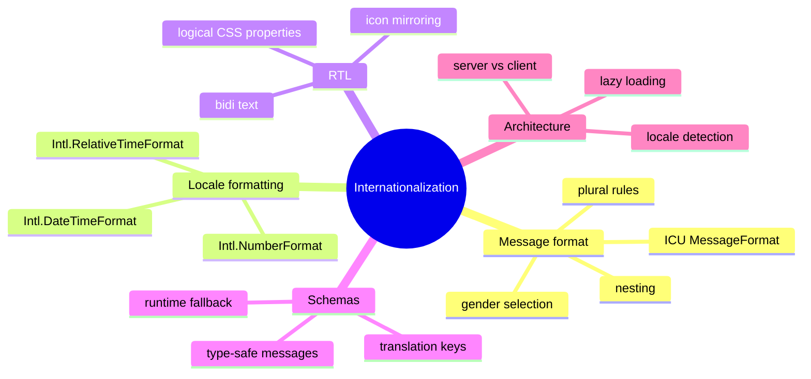

# Module 24: Internationalization

Est. study time: 1.5h
Language: en
Description: i18n in a client-only React app: ICU MessageFormat, locale-aware formatting (numbers, dates, currencies), RTL layout, and the schemas/translation contract that makes the engineering tractable. Aissa's portal supports English, Spanish, and Mandarin for an international applicant pool.

## Knowledge Map



---

## Learning Objectives (maps to course CILOs)
- Format numbers, dates, and currencies using Intl APIs with explicit locale — serves CILO 15
- Use ICU MessageFormat for plurals, gender, and nested substitutions — serves CILO 15
- Build a translation contract that is type-safe across language files — serves CILO 15
- Handle RTL layout with logical CSS properties and bidi text — serves CILO 15

---

## Real-World Example

Aissa's portal is used by applicants in 12 countries. The English version is the source of truth; the team ships Spanish, French, and Mandarin. Three things broke the first time they shipped localized content:

- "1 application" was hard-coded everywhere. In Spanish, the singular form is "1 solicitud" but the plural is "n solicitudes" — and the count of "1" still triggers the plural form in some languages (Russian has three forms). Hard-coded singular/plural strings were wrong on day one.
- Dates were formatted as `MM/DD/YYYY` in the US and `DD/MM/YYYY` in the UK. The portal showed the wrong date in every non-US locale until the team switched to `Intl.DateTimeFormat`.
- The Spanish version had translation gaps. Some keys were missing; the app showed the English key (`applicants.count`) instead of a translated string. The team added a runtime fallback and a build-time check that fails CI when keys are missing.

The right toolchain is `Intl` for formatting, ICU MessageFormat for plural/gender/nesting, and a translation contract that type-checks across language files.

> **Think**: Why is hard-coded "1 application" wrong in Spanish and Russian?
>
> *Answer: Spanish has two plural forms (singular vs plural). Russian has three (one, few, many). The English "1 application" is a count-1 form, but the English "0 applications" is a plural form, and the Spanish "0 solicitudes" is also plural. The rule is not "1 → singular, else plural"; it is locale-specific plural categories. ICU MessageFormat encodes these rules per locale.*

---

## Core Content

### Section 1: Intl APIs For Formatting

The browser ships `Intl.NumberFormat`, `Intl.DateTimeFormat`, `Intl.RelativeTimeFormat`, `Intl.ListFormat`, and `Intl.Collator`. They take a locale and format values according to that locale's rules.

```tsx
const nf = new Intl.NumberFormat(locale, { style: 'currency', currency: 'USD' });
nf.format(1234.5);          // "$1,234.50" in en-US, "1.234,50 US$" in de-DE

const dtf = new Intl.DateTimeFormat(locale, { dateStyle: 'medium' });
dtf.format(new Date());     // "Jan 15, 2026" in en-US, "15 ene 2026" in es-ES

const rtf = new Intl.RelativeTimeFormat(locale, { numeric: 'auto' });
rtf.format(-1, 'day');      // "yesterday" in en, "ayer" in es
```

The contract:

- Pass the locale explicitly. Do not rely on the user's browser locale (`navigator.language`) for the application's primary locale — the user can set their browser to anything. The portal's locale is set by the user's profile or URL.
- Cache the formatter. `new Intl.NumberFormat(...)` is not free; build it once per locale and reuse.
- Use `formatToParts` for cases where you need to wrap a part of the formatted output (e.g. styled digits). The default `format` returns a single string.

### Section 2: ICU MessageFormat

`Intl` does not handle plurals, gender, or nested substitutions. ICU MessageFormat does. The pattern is `{var, plural, ...}` for plurals, `{var, select, ...}` for gender/category, and `{var}` for simple substitution.

```ts
const messages = {
  en: {
    'applicants.count': '{count, plural, =0 {No applicants} =1 {1 applicant} other {# applicants}}',
    'applicants.welcome': '{gender, select, male {Welcome, Mr. {name}} female {Welcome, Ms. {name}} other {Welcome, {name}}}',
  },
  es: {
    'applicants.count': '{count, plural, =0 {Sin solicitudes} =1 {1 solicitud} other {# solicitudes}}',
  },
  ru: {
    'applicants.count': '{count, plural, one {# заявка} few {# заявки} many {# заявок} other {# заявки}}',
  },
};
```

The contract:

- Each language file is keyed the same way. The translation contract is the keys, and the values are ICU strings.
- The `other` clause is required. Without it, an unmatched category throws.
- The `#` symbol is replaced with the number itself. Useful when the count drives the word form (Russian) but the literal number is also displayed.
- A library like `intl-messageformat` or `react-intl` does the runtime parsing. The portal uses `react-intl` for the React integration.

### Section 3: Type-Safe Translations

The translation contract is a TypeScript type. Each language file is checked against the same key set.

```ts
type Messages = Record<string, string>;

const en: Messages = { ... };
const es: Messages = { ... };

// build-time check
function checkCoverage(base: Messages, target: Messages, lang: string) {
  for (const key of Object.keys(base)) {
    if (!(key in target)) {
      throw new Error(`[i18n] missing key ${key} in ${lang}`);
    }
  }
}
```

The contract:

- Run the check at build time. CI fails when a language is missing keys. A runtime fallback (English) handles the case where a translation has not landed yet.
- Keep the keys flat or shallow. Deep nesting (`applicants.detail.fields.name.label`) is tempting for organization but adds friction when translators need to find keys.
- A linter that flags hard-coded user-facing strings catches the most common i18n bug. The team's ESLint rule rejects `'>'` patterns in JSX unless wrapped in a translation function.

### Section 4: RTL Layout

Some languages (Arabic, Hebrew, Persian, Urdu) are read right-to-left. The layout must mirror: navigation on the right, text aligned right, icons flipped. The modern approach is **logical CSS properties**:

```css
.card {
  margin-inline-start: 1rem;   /* left in LTR, right in RTL */
  padding-inline-end: 1rem;    /* right in LTR, left in RTL */
  border-start-end-radius: 0.5rem;
}
```

The contract:

- Logical properties (`margin-inline-start`, `padding-block`, `border-start-end-radius`) automatically flip in RTL. The CSS writes once and the browser handles the direction.
- For icons that have a direction (an arrow, a chevron), use the `dir` attribute and CSS attribute selectors, or a runtime check that flips the icon.
- For mixed text (English term inside an Arabic sentence), wrap the English term in `<bdi>` or apply `unicode-bidi: isolate` so the bidi algorithm does not garble the surrounding text.
- Test the layout in RTL from day one. Adding RTL support at the end is a multi-week refactor; adding it incrementally with logical properties is a 2-day task.

### Section 5: Lazy Loading Translations

For 12 locales, shipping all 12 in the initial bundle is wasteful. Lazy-load the locale on demand:

```ts
const messages = await import(`./locales/${locale}.json`);
```

The contract:

- The initial bundle ships the user's primary locale (English in the portal's case) plus a tiny `Intl` runtime.
- Other locales load on first navigation. The first render in the new locale shows the English strings for a few hundred milliseconds while the chunk loads.
- For server-side rendering, the locale is determined from the request and the bundle is loaded before render. A client-only portal does the client-side fetch.

---

## Verify — Tests For The Patterns

```ts
test('Intl.NumberFormat formats USD per locale', () => {
  expect(new Intl.NumberFormat('en-US', { style: 'currency', currency: 'USD' }).format(1234.5))
    .toBe('$1,234.50');
  expect(new Intl.NumberFormat('de-DE', { style: 'currency', currency: 'USD' }).format(1234.5))
    .toBe('1.234,50 $');
});

test('ICU plural in Spanish', () => {
  const mf = new MessageFormat(es['applicants.count'], 'es');
  expect(mf.format({ count: 0 })).toBe('Sin solicitudes');
  expect(mf.format({ count: 1 })).toBe('1 solicitud');
  expect(mf.format({ count: 5 })).toBe('5 solicitudes');
});

test('build-time key coverage check fails on missing key', () => {
  expect(() => checkCoverage(en, {}, 'es')).toThrow(/missing key/);
});
```

---

## Common Misconception

*"We can ship i18n later."* You can ship the mechanism later; you cannot retrofit the strings. Every hard-coded user-facing string is a future translation debt. The fix is to wrap every string in a translation function from day one, even if only one locale is supported. The cost is minimal; the future savings are large.

*"Hard-coded plurals are fine for English-only apps."* They are fine until you ship Spanish. The moment you do, every `count === 1 ? 'applicant' : 'applicants'` is a bug in some locale. ICU MessageFormat is the right shape from day one; the English plural rule is just one of many.

*"RTL is just CSS direction."* It is layout, icons, bidi text, and platform conventions. A chevron pointing right in LTR should point left in RTL; an English term inside an Arabic sentence must be isolated; navigation flows from the other side. A 2-day fix with logical properties if you start now, a 2-month refactor if you add it later.

---

## Spot the Mistake

```tsx
function ApplicantsCount({ count, locale }: Props) {
  const word = count === 1 ? 'applicant' : 'applicants';
  return <p>{count} {word}</p>;
}
```

What's wrong?

*Answer: The hard-coded singular/plural is wrong for Spanish (which has its own plural rules), wrong for Russian (which has three plural forms), and wrong for the count-0 case in any plural-required language. The fix: use ICU MessageFormat via `intl-messageformat` or `react-intl`'s `FormattedMessage`. The English string becomes `{count, plural, =0 {No applicants} =1 {1 applicant} other {# applicants}}`, and the Spanish and Russian versions have their own plural categories. The English rule is one of many; the hard-coded version bakes in the English rule and breaks the moment a second language ships.*

---

## Key Takeaways
- `Intl` APIs format numbers, dates, and currencies per locale; pass the locale explicitly and cache formatters
- ICU MessageFormat handles plurals, gender, and nesting; every language has its own plural categories
- A type-safe translation contract with build-time key coverage checks prevents translation gaps
- RTL layout uses logical CSS properties; test RTL from day one to avoid a multi-week refactor later
- Lazy-load locales to keep the initial bundle small

---

## Drill
Take the quiz.

Run: `learn.sh quiz enterprise-react-ui-patterns 24-internationalization`

---

## Think

> **Think**: The team ships Spanish localization. A page shows "0 aplicants" — a typo where "applicants" was not translated, just appended to "0". What went wrong in the engineering, and what is the fix?
>
> *Answer: The string was concatenated as `{count} {word}` instead of being a single ICU MessageFormat string with the count inside the translation. The English word "applicants" leaked into the Spanish string. The fix is one ICU string per language that owns the entire phrase, with the count as a substitution: `{count, plural, =0 {Sin solicitudes} =1 {1 solicitud} other {# solicitudes}}`. The translator sees the whole phrase, the count is interpolated, and a missing translation would be a missing key, not a leaked English word.*

---

## Predict

> **Predict**: A team adds Arabic support. The navigation now appears on the right side as expected, but the "next page" chevron still points right. What is the cleanest fix?
>
> *Answer: Use logical CSS properties plus an icon component that respects `dir`. The chevron is a directional icon; in RTL it should point left. Two options: (1) flip the icon's CSS using `[dir="rtl"] .chevron { transform: scaleX(-1); }`; (2) use an icon set that ships RTL variants (e.g. Material Icons has `arrow_back_ios_new` for both directions). The cleanest fix is the CSS attribute selector because it works for any directional icon without code changes. Test the navigation in RTL before shipping — directional icons are the most common RTL bug.*

---

## Spot the Mistake

> **Spot the Mistake**: A junior uses `navigator.language` to set the app's locale:
> ```tsx
> const locale = navigator.language;
> ```
> What is wrong with this assumption?
>
> *Answer: `navigator.language` is the user's browser locale, not the application's locale. A user can set their browser to anything, including languages the application does not support. The application's locale should be set by the user's profile (server-side, persisted) or by an explicit URL parameter. The browser locale is a hint, not a source of truth. The fix: use a server-derived locale, fall back to the URL locale, and only consult `navigator.language` as a last-resort default for the very first visit.*

---

## Cloze

`{Intl}` APIs format numbers, dates, and currencies per locale; pass the locale explicitly and cache formatters. {ICU MessageFormat} handles plurals, gender, and nesting; every language has its own plural categories. A type-safe {translation} contract with build-time key coverage checks prevents translation gaps. {RTL} layout uses logical CSS properties; test RTL from day one. Lazy-load {locales} to keep the initial bundle small. The application's locale is set by the {profile} or URL, not by the browser's `navigator.language`.

