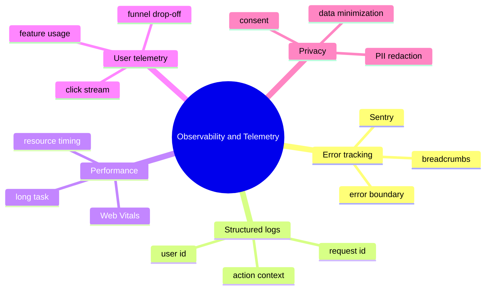

# Module 25: Observability & Telemetry

Est. study time: 1.5h
Language: en
Description: Frontend observability beyond console.log — error tracking, structured logging, performance metrics, user-action telemetry, and the seams where each belongs. Aissa's portal runs Sentry for errors, custom analytics for product metrics, and Web Vitals for performance.

## Knowledge Map



---

## Learning Objectives (maps to course CILOs)
- Wire an error boundary to an error tracker so render-phase exceptions land in the dashboard — serves CILO 16
- Add breadcrumbs to user actions so an error report has the path that led to the crash — serves CILO 16
- Capture Web Vitals (LCP, FID, CLS) and surface regressions in the dashboard — serves CILO 16
- Redact PII before sending telemetry and respect user consent — serves CILO 16

---

## Real-World Example

Aissa's portal had a render-phase exception that only happened in production. The error boundary caught it; the user saw the fallback; the support ticket said "the page broke." Aissa had no idea why, when, or for which users.

After wiring Sentry (or any error tracker) into the error boundary, the same exception now reports: the user id, the route, the action they took 30 seconds before the crash, the network calls in the last 10 seconds, and the React component stack. The fix is a 5-line change; the visibility is night and day.

> **Think**: Why is a render-phase error tracker not a substitute for a runtime try/catch?
>
> *Answer: A render-phase error tracker catches what the error boundary catches — exceptions thrown during render. It does not catch exceptions in event handlers (those are async and need a try/catch), in async work the component never awaits, or in third-party code that swallows its own errors. The two patterns are complementary: error boundaries + tracker for render; try/catch + log for handlers. Together they cover most surfaces.*

---

## Core Content

### Section 1: Error Tracking With An Error Boundary

The error boundary catches render-phase exceptions. The tracker integration is one callback in the boundary's `componentDidCatch` (or its functional wrapper):

```tsx
import { ErrorBoundary } from 'react-error-boundary';
import * as Sentry from '@sentry/react';

function ErrorFallback({ error, resetErrorBoundary }: FallbackProps) {
  React.useEffect(() => {
    Sentry.captureException(error);
  }, [error]);
  return <ErrorPanel onRetry={resetErrorBoundary} />;
}

export function App() {
  return (
    <ErrorBoundary FallbackComponent={ErrorFallback}>
      <Routes />
    </ErrorBoundary>
  );
}
```

The contract:

- The boundary catches render-phase exceptions in the tree below. The fallback renders.
- The fallback component's effect calls `captureException`. The error report includes the React component stack, the user's session, the URL, the user agent, and any breadcrumbs the tracker has accumulated.
- The boundary's `resetErrorBoundary` re-renders the children. For a transient error, the retry may succeed; for a permanent one, the user is stuck — the fallback should make that visible.

### Section 2: Breadcrumbs

Breadcrumbs are the trail of events that led up to the error. They turn a single "the page broke" report into "the user clicked X, then Y, then the API returned Z, then the page broke."

```tsx
function trackClick(action: string, context: object) {
  Sentry.addBreadcrumb({
    category: 'user',
    message: action,
    data: context,
    level: 'info',
  });
}

function ApplicantCard({ applicant }: Props) {
  return (
    <button onClick={() => {
      trackClick('applicant-card-clicked', { id: applicant.id, cohort: applicant.cohort });
      navigate(`/applicants/${applicant.id}`);
    }}>
      {applicant.name}
    </button>
  );
}
```

The contract:

- Breadcrumbs accumulate in a ring buffer. The tracker typically keeps the last 50-100 events.
- Categories: `user` for clicks, `navigation` for route changes, `http` for network calls, `state` for state transitions. Categories help filter when reading reports.
- Do not log sensitive data. The breadcrumb should be useful but redactable. The redaction step happens at the tracker's transport layer (Section 5).

### Section 3: Web Vitals

Web Vitals are the user-experience metrics Google defines as the floor for a good page: LCP (largest contentful paint), INP (interaction to next paint, formerly FID), and CLS (cumulative layout shift). The `web-vitals` library captures them.

```ts
import { onLCP, onINP, onCLS } from 'web-vitals';

onLCP((metric) => Sentry.captureMessage(`LCP: ${metric.value}`, 'info'));
onINP((metric) => Sentry.captureMessage(`INP: ${metric.value}`, 'info'));
onCLS((metric) => Sentry.captureMessage(`CLS: ${metric.value}`, 'info'));
```

The contract:

- The metric is captured once per page load. Send it as a message (not an exception) — it is a measurement, not an error.
- Threshold: LCP < 2.5s is "good," 2.5-4s is "needs improvement," > 4s is "poor." INP < 200ms is good; CLS < 0.1 is good.
- Send a labeled event (the metric name) so the dashboard can aggregate by metric. A P95 dashboard is the standard.
- For SPA navigation, re-capture on every route change. The metric is per-page, not per-session.

### Section 4: User Telemetry

Product metrics (which feature is used, where users drop off in a funnel) are separate from error tracking. Aissa's team uses a dedicated analytics tool (Plausible, PostHog, or a homegrown service).

```tsx
function trackEvent(name: string, properties?: Record<string, unknown>) {
  if (!hasConsent()) return;             // respect consent
  analytics.track(name, redact(properties));
}
```

The contract:

- Track at meaningful events, not at every render. A "save draft" event is meaningful; a "user opened the modal" is not unless you are studying modal usage.
- Include context: user id (pseudonymous), route, current state, the value being saved. The richer the context, the better the funnel analysis.
- Aggregate at the dashboard, not the client. The client tracks events; the dashboard answers questions. A typical funnel needs hundreds of events per user per session.

### Section 5: Privacy And PII

Telemetry is a privacy contract. The team redacts PII before sending, and respects user consent.

```ts
const PII_KEYS = ['email', 'phone', 'ssn', 'address', 'name'];

function redact<T extends Record<string, unknown>>(obj: T): T {
  const out = { ...obj };
  for (const key of Object.keys(out)) {
    if (PII_KEYS.includes(key.toLowerCase())) {
      out[key] = '[redacted]';
    }
  }
  return out;
}
```

The contract:

- Maintain a PII key list. Update it when the schema adds new fields that could contain PII.
- Hash user ids on the client before sending. The server joins the hash back to the real id only when needed for support. This protects the user from a tracker-side data breach.
- Respect consent. The EU/EEA/UK require explicit consent for non-essential cookies and trackers. The portal shows a consent banner on first visit; the analytics call is gated on `hasConsent()`.
- Data minimization: send only what you need. A click event does not need the entire applicant object; it needs the applicant id and the action.

### Section 6: When Telemetry Is The Wrong Answer

Telemetry is not free. The cost stack:

- Every event is a network call. At 10,000 active users, naive telemetry is 10,000 requests per second.
- Storage and retention cost money. A 30-day retention at 100 events per user per day is 30M events.
- PII leaks are a liability. A redaction bug that sends an email address to the tracker is a GDPR violation.

The honest recommendation: **error tracking on every app, performance metrics on user-facing apps, product telemetry on apps that need product decisions.** A portal's product team may not need a 100-event-per-session analytics tool if 10 well-chosen events answer the same questions.

---

## Verify — Tests For The Patterns

```ts
test('error boundary captures exception to Sentry', () => {
  const captureException = jest.spyOn(Sentry, 'captureException');
  render(<Bomb />, { wrapper: AppWrapper });
  fireEvent.click(screen.getByText('detonate'));
  expect(captureException).toHaveBeenCalled();
});

test('breadcrumb is added on click', () => {
  const addBreadcrumb = jest.spyOn(Sentry, 'addBreadcrumb');
  render(<ApplicantCard applicant={applicantFixture} />, { wrapper });
  fireEvent.click(screen.getByText(applicantFixture.name));
  expect(addBreadcrumb).toHaveBeenCalledWith(expect.objectContaining({
    category: 'user',
    message: 'applicant-card-clicked',
  }));
});

test('redact strips PII keys', () => {
  const out = redact({ email: 'a@b.com', id: 'A-1', name: 'Aissa' });
  expect(out.email).toBe('[redacted]');
  expect(out.name).toBe('[redacted]');
  expect(out.id).toBe('A-1');
});
```

---

## Common Misconception

*"Sentry is enough telemetry."* No. Sentry handles errors and (via custom messages) metrics, but product analytics — which features are used, where users drop off, what they tried before succeeding — need a dedicated tool. The two have different aggregation patterns, different retention policies, and different access controls.

*"Breadcrumbs are a security risk."* Breadcrumbs can leak PII if the redaction is incomplete. The fix is redaction at the transport layer, not at the call site. Every breadcrumb goes through `redact()` before it leaves the client.

*"Web Vitals is a one-time check."* No. The metric is per-page-load. An SPA's route changes do not reset the metric. The team re-captures on every route change so the dashboard reflects the current page's performance.

---

## Spot the Mistake

```tsx
function ApplicantForm() {
  return (
    <form onSubmit={async (e) => {
      e.preventDefault();
      try {
        await api.save(formData);  // no telemetry on success
      } catch (err) {
        Sentry.captureException(err);  // only on error
      }
    }}>
      ...
    </form>
  );
}
```

What's wrong?

*Answer: Three problems. (1) No breadcrumb for the submit attempt. When the user later hits an error elsewhere, the tracker has no record of "user tried to save" in the trail. The fix: add a breadcrumb before the await: `Sentry.addBreadcrumb({ category: 'user', message: 'applicant-form-submit', data: { id: formData.id } })`. (2) The error capture has no context. The same `err` could come from any of 50 endpoints; without a tag, the dashboard shows "TypeError: ..." with no idea which form. The fix: `Sentry.captureException(err, { tags: { form: 'applicant-form' } })`. (3) No success path. If the form succeeds 95% of the time and fails 5%, the team needs to know the success rate to spot a slow degradation. The fix: emit a `form-save-success` event with the duration, gated on consent.*

---

## Key Takeaways
- An error boundary + tracker catches render-phase exceptions and gives the dashboard a component stack
- Breadcrumbs turn a single error into the trail that led to it
- Web Vitals (LCP, INP, CLS) are the user-experience floor; capture per page-load and per SPA route change
- Product telemetry is a separate tool from error tracking; the two have different aggregation patterns
- Redact PII at the transport layer; respect consent; minimize what you send

---

## Drill
Take the quiz.

Run: `learn.sh quiz enterprise-react-ui-patterns 25-observability-and-telemetry`

---

## Think

> **Think**: A render-phase exception fires in production. Sentry captures it. The team investigates: the component stack is shown, the user id is shown, but the breadcrumb trail is empty. Why, and what is missing?
>
> *Answer: Breadcrumbs are not captured automatically; the team has not added them at the action sites. Sentry shows the moment of the error but not the path that led to it. The fix: add `Sentry.addBreadcrumb` to user actions (clicks, form submits, navigation), to network calls (an HTTP client integration can do this automatically), and to state transitions. The trail is the value-add of the error report; without it, every report is a single frame instead of a movie.*

---

## Predict

> **Predict**: The portal's CLS spikes from 0.05 to 0.3 after a feature ships. What is the most likely cause, and what is the fix?
>
> *Answer: A component renders asynchronously (fetches data, then sets state, then renders content) where it used to render synchronously. The page paints without the component, then paints again with it — that's a layout shift. The fix: reserve space for the component with a skeleton of the same height (a `min-height` on the container) so the page does not shift when the content arrives. CLS measures layout instability; the cure is either synchronous rendering or reserved space.*

---

## Spot the Mistake

> **Spot the Mistake**: A team sends every click to the analytics tool with the full form state:
> ```tsx
> onClick={() => trackEvent('form-input', { ...formState })}
> ```
> The dashboard is slow and a PII audit flags the form state. What's wrong?
>
> *Answer: Two problems. (1) The full form state contains PII — names, emails, addresses — that should never leave the client. The fix: redact at the transport layer (PII keys to `[redacted]`) before sending, OR send only the field id and a hash of the value. (2) Every keystroke in the form fires a click event with the full state, which is hundreds of events per form fill. The fix: track at meaningful events (form-open, form-submit, field-blur for sensitive fields), not at every interaction. Less data, better signal, faster dashboard.*

---

## Cloze

An {error boundary} + tracker catches render-phase exceptions and gives the dashboard a component stack. {Breadcrumbs} turn a single error into the trail that led to it. Web {Vitals} (LCP, INP, CLS) are the user-experience floor; capture per page-load and per SPA {route} change. Product {telemetry} is a separate tool from error tracking; the two have different aggregation patterns. {Redact} PII at the transport layer; respect {consent}; minimize what you send.

