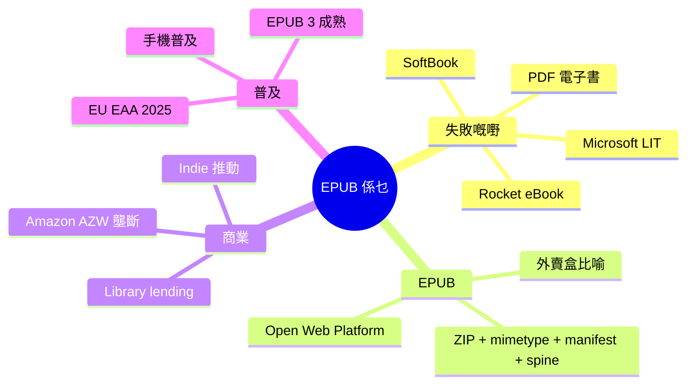

# Module 01: EPUB 係乜 — 由失敗講到普及

> **Part I: EPUB 點解** · 估計閱讀 45 分鐘 · 廣東話 casual



## 學習目標

學完呢個單元，你會知：
- 點解要有 EPUB（紙本書解決唔到嘅問題）
- 電子書早期失敗嘅嘢同原因
- EPUB 係乜、入面有乜、大約點裝
- Amazon 點解壟斷電子書市場
- 點解 2020 年代 EPUB 先真正普及

---

## 2007

2007 年，一個工程師新買咗部 iPhone（3.5 吋屏幕）。佢想將一本 1000 頁嘅工具書放入去，搭車時睇。

佢有四個選擇：

**第一，掃描做 PDF。** 1000 頁掃描成 PDF，檔案 50MB。文字可以 OCR 複製，但排版同紙本書一模一樣，唔識 reflow。喺 iPhone 細屏幕睇，要不停放大縮小，睇两行就要移一次。**結果：放棄。**

**第二，寫一個 iPhone App。** 整一個 app 嚟顯示內容。問題：Apple 收 30% 分成、iOS-only、Android / Windows 用唔到。冇人會為咗一本書裝一個 app。**結果：放棄。**

**第三，用 HTML 砌網站。** 2007 年 HTML 4.01 同 CSS 2.1 已經成熟。但一定要上網先睇到 — 地鐵冇信號就睇唔到。冇 DRM、冇頁面概念、冇閱讀器功能（字體大小、書籤、高亮）。**結果：放棄。**

**第四，整一個新格式。** 將 HTML 打包，加 manifest + spine，變成可以被閱讀器打開嘅檔案。問題：邊個支持？**結果：放棄。** 但呢個方向最接近理想答案 — 要等 IDPF 推出 EPUB 2.0（2007 年 10 月），呢個問題先解決。

> **Think**：點睇四個選擇入面，邊個最接近 EPUB 嘅答案？
>
> 第四個 — 2007 年 10 月 IDPF 推出 EPUB 2.0，將 HTML 打包成 ZIP，加 manifest + spine，閱讀器識得開、識得排。EPUB 嘅革命性唔係內容格式（HTML 已經成熟），係包裝。

---

## 早期失敗嘅嘢

EPUB 之前，已經有一堆電子書格式試過征服世界。全部死晒。

### Rocket eBook（1998-2003）

NuvoMedia 1998 年推出 Rocket eBook — 一個 6 吋屏幕嘅專用硬件，售價 $499。入面有 100MB 儲存空間，可以放約 100 本書。

**點解死**：冇生態圈。冇書店、冇出版商合作、冇開發者。你買咗部機，要去 NuvoMedia 嘅網站買書 — 得幾百本。而且部機唔兼容其他格式。2003 年 NuvoMedia 結業。連帶佢嘅競爭對手 Gemstar（買咗另一間電子書公司）都一齊死。

Rocket eBook 嘅教訓：**硬件唔夠，要有內容生態圈。**

### SoftBook（1998-2003）

SoftBook Press 1998 年推出 SoftBook Reader — 8 吋彩色屏幕，售價 $599。唔同 Rocket，佢有內置數據機，可以直接連電話線買書。聽落幾先進。

**點解死**：同 Rocket 一樣 — 冇內容。SoftBook 話有「100,000 本書」，但實際得幾千本，而且大部分係公版書（已過版權期嘅舊書）。2003 年 SoftBook Press 結業。

### Microsoft LIT（2000-2012）

Microsoft 2000 年推出 Microsoft Reader — 用自家嘅 `.lit` 格式。特色係 ClearType 字型技術（喺 LCD 屏幕度令文字更清晰）。

**點解死**：三個原因。第一，廠商鎖定 — `.lit` 格式由 Microsoft 完全控制，其他公司做唔到支援。讀者要睇書一定要裝 Microsoft Reader，鎖住晒喺 Microsoft 生態圈。第二，冇硬件配合 — 2007 年 Amazon 出 Kindle、Sony 出 Reader，Microsoft 冇出自家電子書閱讀器，淨靠 PC 軟件。第三，唔兼容 EPUB — 2007 年 EPUB 普及，出版社轉用 EPUB，`.lit` 書愈來愈少，變成孤島。2012 年 Microsoft 停止支持 `.lit` 格式。

### Adobe PDF 電子書（1993-今）

Adobe PDF 1993 年推出，2007 年前後有人用嚟做電子書。PDF 嘅問題係 — 固定版面、唔識 reflow、唔適應屏幕。但 PDF 嘅真正問題係**思維模式**：Adobe 一開始嘅使用場景係「打印機嘅最終輸出」，唔係「喺屏幕度閱讀嘅書」。呢個思維模式導致 PDF 嘅設計原則係「頁印出嚟係咁」，唔係「文字隨屏幕自動排」。

> **Spot the Mistake**：有個人話「PDF 係 EPUB 之前最成功嘅電子書格式」。呢句說話問題喺邊？
>
> PDF 唔係為電子書設計嘅。PDF 嘅成功喺「文件交換」（例如合約、論文、報告），唔係喺「閱讀」。PDF 用嚟做電子書係「將錯就錯」— 因為冇更好的選擇，所以大家都用。EPUB 出現之後，電子書先有咗真正嘅專用格式。

---

## EPUB 係乜

### 外賣盒比喻

想像你去買外賣。個外賣盒有固定嘅形狀 — 長方形、有蓋、有嘢飲位。唔同餐廳都用類似嘅盒，你唔使拆開睇都知入面大約有乜。

EPUB 就似一個電子版外賣盒：

| 外賣盒 | EPUB |
|--------|------|
| 盒本身 | ZIP container（一個 .epub 檔案） |
| 盒入面嘅飯、餸、湯 | HTML、CSS、圖片、字型 |
| 張單（寫住有乜嘢） | manifest（列出所有檔案） |
| 食嘅順序（先飲湯再食飯） | spine（規定閱讀順序） |
| 盒上面嘅餐廳名、電話 | metadata（書名、作者、語言） |

重點：唔同餐廳（出版商）都用同款盒格式。你換間餐廳，個盒都係咁開。EPUB 做到同樣嘅嘢 — Apple Books、Kobo、Kindle 全部識開同一種格式。

> **Think**：點解唔用 PDF 做外賣盒？
>
> 因為 PDF 個盒係硬嘅 — A4 就 A4，唔會因應個碟（屏幕）大細而變。EPUB 個盒係軟嘅，自動適應。

### 正式定義

而家你有咗外賣盒嘅概念。正式講：**EPUB = 一班 HTML 頁面 + CSS 樣式 + 圖片，包喺一個 ZIP 入面，加埋一張「清單」同「閱讀順序」。**

用技術啲講：EPUB 基於 Open Web Platform（HTML + CSS + SVG + MathML），包喺一個符合 OCF（Open Container Format）規範嘅 ZIP 入面。閱讀器跟 W3C EPUB 3 規格去開呢個 ZIP，攞到入面嘅內容，再渲染畀你睇。

你唔使記住晒。記住：**EPUB 就係將網頁打包成一本書。**

### 點裝

EPUB 嘅 ZIP 入面有固定嘅結構。解壓一個 EPUB，你會見到：

```
my-book.epub
├── mimetype               ← 8 個 byte，寫住 application/epub+zip
├── META-INF/
│   └── container.xml      ← 指向「主菜喺邊」
└── OEBPS/
    ├── content.opf         ← manifest + spine + metadata
    ├── nav.xhtml           ← 目錄
    ├── chapter1.xhtml      ← 內容頁
    ├── chapter2.xhtml
    ├── images/
    │   ├── cover.jpg
    │   └── diagram.png
    └── styles/
        └── main.css
```

**四個關鍵檔案：**

**1. mimetype** — 第一個檔案，8 個 byte，寫住 `application/epub+zip`。EPUB 嘅身份證 — 閱讀器未開 ZIP 之前就要 byte-sniff 認到佢。必須喺 ZIP 入面第一個、唔壓縮（STORED 而唔係 DEFLATE）。

**2. META-INF/container.xml** — XML 檔案，話畀閱讀器知：「本書嘅主菜（package document）喺邊度」。通常指向 `OEBPS/content.opf`。

**3. content.opf（package document）** — EPUB 嘅心臟。入面有三樣嘢：metadata（書名、作者、語言、ISBN）、manifest（列出所有檔案）、spine（規定閱讀順序）。

**4. nav.xhtml** — 目錄頁。閱讀器用呢個檔案嚟顯示章節列表，等你可以跳去特定章節。

> **Think**：點解 mimetype 唔可以 compressed？
>
> 因為閱讀器要喺未 unzip 之前就知道呢個係 EPUB。壓縮咗就 byte-sniff 唔到 — 你唔可以喺一堆 compressed binary 入面搵到一個 ASCII string。

### 動手試

揾一個 .epub 檔案（或者 download 一個免費嘅），跟住做：

1. **改名**：將 `xxx.epub` 改做 `xxx.zip`
2. **解壓**：撳兩下或者用 `unzip xxx.zip`
3. **睇結構**：
   - 有冇 `mimetype` 檔案？入面寫乜？
   - 有冇 `META-INF/container.xml`？開嚟睇下佢指去邊
   - 有冇 `.opf` 檔案？搵下 `<manifest>` 同 `<spine>`
   - 入面有幾多個 XHTML 檔案？
4. **試改**：用文字編輯器開一個 XHTML 檔案，改少少嘢，存檔，再用閱讀器開嚟睇

做完你會發現：EPUB 真係好簡單，就係 ZIP + XML + HTML。

> **Spot the Mistake**：有個人話「EPUB 就係一班 HTML 頁面壓縮埋一齊」。呢句說話有兩個問題。第一，EPUB 唔係淨係 HTML — 仲有 CSS、圖片、字型、metadata。第二，唔係「壓縮埋」咁簡單 — mimetype 要 STORED（唔壓縮），而且有特定嘅目錄結構（META-INF、OEBPS）同清單檔案（manifest/spine）。ZIP 只係包裝，EPUB 係一套完整嘅結構約定。

### EPUB 3.0 嘅革命

EPUB 2.0（2007）用 XHTML 1.1 + 限制 CSS。2011 年 EPUB 3.0 直接用 HTML5 + CSS3 + JavaScript — 呢個改動有兩個深遠影響：

**第一，網頁開發者識嘅嘢直接用到。** Flexbox、Grid、Video、Font、Animation — 全部 HTML5 標準，唔係 EPUB 自創。之前要重新學，而家唔使。

**第二，fixed layout 變可能。** CSS `@page` 同 `@viewport` 標準化之後，一個 HTML 檔案對應一頁嘅概念出現。之後 Apple 2013 年 iBooks Author 推漫畫 fixed layout。

EPUB 3.0 仲加咗 media overlays（音頻同步）、SVG 內嵌、多語言 ruby annotation。全部都係 web 標準。

> **Predict**：點睇 EPUB 用 HTML5 之後，邊個群體最開心？
>
> 網頁開發者。佢哋唔使再學一個新格式，直接用自己識嘅 HTML + CSS 就可以出電子書。

---

## Amazon 嘅壟斷

EPUB 概念 1999 年已經有。但到 2026 年先普及。唔係技術問題 — 係商業問題。

### Kindle 2007

2007 年 Amazon 推出 Kindle，用自家嘅 AZW 格式（源自 Mobipocket 嘅 MOBI）。Amazon 從來唔加入 IDPF（EPUB 嘅標準組織）。

**點解 Amazon 唔用 EPUB？** 因為賣電子書唔係賣規格，係賣商店 + 裝置 + 鎖定閱讀器。AZW 格式令 Kindle 用戶鎖喺 Amazon 嘅生態圈 — 你喺 Amazon 買嘅書，只可以用 Kindle 睇。呢個叫廠商鎖定。

Amazon 嘅策略：
- **硬件補貼**：Kindle 售價低過成本，靠賣書賺返
- **格式壟斷**：AZW / KFX 唔兼容 EPUB
- **價格控制**：同出版商協議「most-favored-nation」條款 — 出版商唔可以喺其他平台賣平過 Amazon

### 但 EPUB 冇死

Amazon 壟斷咗電子書市場嘅大份，但 EPUB 冇死。原因：

**Indie 推動。** Smashwords（2008）同 Draft2Digital（2012）用 EPUB 做主要格式。獨立作者出書唔使經 Amazon — 佢哋可以直接出 EPUB，放喺 Apple Books、Kobo、Google Play Books。Indie romance / sci-fi 圈帶咗 EPUB 普及。

**圖書館。** OverDrive / Libby（圖書館借書平台）100% 用 EPUB。呢個係 EPUB 嘅最大勝利 — 圖書館唔會用 Amazon 嘅 AZW，因為佢哋唔想被廠商鎖定。

**2023 轉折。** Amazon 終於喺 Kindle firmware 加入原生 EPUB 支持。原因：歐盟 DMA（Digital Markets Act）壓力、市場競爭（Kobo / Apple Books 嘅 EPUB 原生支持），同埋 indie 作者嘅要求。

> **Think**：Amazon 2023 年先支持 EPUB，遲咗16 年。點睇 Amazon 內部係點諗？
>
> Amazon 嘅商業模型係「靠硬件鎖用戶，靠內容賺錢」。EPUB 嘅開放性威脅呢個模型 — 如果用戶可以喺任何平台買書，Amazon 嘅壟斷就瓦解。但 2023 年嘅市場壓力太大，Amazon 被迫就範。

---

## 點解 2020 年代先普及

EPUB 概念 1999 年已經有。點解要等到 2020 年代先打入主流？因為六個因素喺同一個十年入面成熟：

| 因素 | 2007 | 2026 | 影響 |
|------|------|------|------|
| 智能手機普及率 | iPhone 剛起步，全球 5% | 全球 85%+ | 人人都有裝置睇書 |
| 圖書館借書平台 | 仲未有 | OverDrive / Libby 成熟 | 免費借書推動 EPUB adoption |
| 自出版平台 | 剛起步（Smashwords 2008） | KDP + Apple Books + Kobo + D2D | 作者可以直接出 EPUB |
| EPUB spec 成熟度 | 2.0 啱啱出，限制多 | 3.3（W3C 接手），完整 web 標準 | 穩定、兼容、功能完善 |
| Accessibility 法律 | 冇 | EU EAA 2025 強制 | 唔 compliant 嘅書唔可以賣 |
| 讀者期望 | 紙本書為主 | 一部電話隨時讀書 | 電子書變成預設 |

**關鍵洞察：** EPUB 普及唔係因為 spec 改進（2011 年 EPUB 3.0 已經夠好），係因為生態圈成熟。冇手機、冇平台、冇法律推動，再好嘅 spec 都係紙上談兵。

> **Predict**：點睇 EPUB 之後會點發展？
>
> EPUB 3.3（2026）係現時最新 spec，W3C 已經接手治理。下一步可能係 EPUB 4.0 — 但 W3C 治理比較慢，上一個大版本（3.0）到 3.3 用咗 15 年。預計 2030 年代先有 EPUB 4.0。

---

## EPUB 同其他格式比較

| 維度 | EPUB | PDF | 純 HTML 網頁 | App |
|------|------|-----|-------------|-----|
| 重新排版 | 自動 reflow | 固定版面 | 自動 reflow | 視乎設計 |
| 離線閱讀 | 得 | 得 | 唔得，要上網 | 視乎設計 |
| 閱讀器功能 | 改字型、高亮、書籤 | 有限 | 冇 | 視乎 App |
| 跨裝置同步 | 得（閱讀器內建） | 唔得 | 唔得 | 視乎 App |
| Accessibility | 好（結構化語義） | 差 | 好（HTML 天生） | 視乎設計 |
| 圖書館借書 | 得（加 DRM） | 唔得 | 唔得 | 唔得 |
| 檔案大小 | 細（壓縮 HTML） | 大（嵌入字型/圖） | — | 大 |
| 適合內容 | 小說、教科書、漫畫 | 雜誌、設計稿 | 新聞、部落格 | 遊戲、互動 |

重點：冇一個格式係萬能。EPUB 嘅強項係「結構化嘅文字內容」— 小說、教科書、工具書。PDF 嘅強項係「固定版面」— 需要精準排版嘅嘢。HTML 嘅強項係「互動」— 需要用戶參與嘅嘢。

---

## 唔同類型嘅 EPUB

EPUB 唔係只有一種。根據內容，大約分三類：

| 類型 | 入面有乜 | 例子 |
|------|----------|------|
| 純文字 | XHTML + CSS + 少量圖片 | 小說、散文、教科書 |
| 漫畫/圖書 | 大量圖片，有時每頁一張圖 | 日本漫畫、兒童繪本 |
| 有聲 | 加埋 audio 檔案 + media overlay | 有聲書、語言學習 |

三種都係同一個格式，只係入面裝嘅嘢唔同。

---

## 喺邊度睇 EPUB

**硬件閱讀器**
- Kobo — 原生支持 EPUB，有 Aura、Clara、Sage 等型號
- Amazon Kindle — 2023 年起原生支持 EPUB
- Apple iPad / iPhone — Apple Books App

**手機/平板 App**
- Apple Books（iOS）— 免費
- Kobo App（iOS/Android）— 免費
- Google Play Books（iOS/Android）— 免費
- Moon+ Reader（Android）— 免費

**電腦**
- Calibre — 開源電子書管理軟件，可以睇、轉格式、管理
- Apple Books（Mac）
- Adobe Digital Editions — 用嚟開有 DRM 嘅 EPUB

---

## 常見誤解

**誤解 1：EPUB 就係 PDF 嘅替代品**

唔完全係。PDF 需要固定版面（雜誌、設計稿），EPUB 做唔到。EPUB 做到嘅係 reflowable 嘅文字內容。

**誤解 2：EPUB 一定要有 DRM**

唔係。EPUB 本身係開放格式，冇 DRM。DRM 係選擇性嘅，出版商可以選擇加唔加。事實上好多獨立作者出 DRM-free 嘅 EPUB。

**誤解 3：EPUB 同 HTML 一樣**

唔係。HTML 係一個網頁技術，EPUB 係一個包裝格式。EPUB 入面用 HTML，但有兩大分別：第一，EPUB 有結構（manifest、spine、metadata）同規則（mimetype、container.xml）。第二，EPUB 入面嘅 XHTML 有 strict 嘅 well-formedness requirement — 不容許 HTML5 嘅容錯 parsing（例如唔可以漏咗結束標籤，唔可以有未閉合嘅元素）。

---

## 填一填

1. EPUB = 一班 HTML 頁面 + CSS 樣式 + 圖片，包喺一個 ZIP 入面。
2. mimetype 檔案嘅 content 必須係 application/epub+zip（8 個 byte），無 newline，無 BOM。
3. Amazon Kindle 2007 年推出，用自家嘅 AZW 格式（源自 MOBI），唔跟 EPUB。
4. EPUB 普及唔係因為 spec 改進，係因為生態圈成熟。
5. EPUB 入面嘅 XHTML 有 strict 嘅 well-formedness requirement，不容許 HTML5 嘅容錯 parsing。

---

## 點睇？

> **Q1**：2007 年一個工程師想將工具書放入 iPhone，佢有四個選擇。邊個最接近 EPUB 嘅答案？點解？
>
> **Q2**：Amazon 2007 年推出 Kindle，唔跟 EPUB 標準。16 年後（2023）終於支持 EPUB。點睇 Amazon 點解改變？
>
> **Q3**：EPUB 3.0 喺 2011 年已經用 HTML5 + CSS3。點解到 2020 年代先打入主流？列出至少三個因素。
>
> **Q1 觀點**：第四個最接近。第三個（HTML 網站）解決咗內容格式 — HTML 本身就係 EPUB 嘅核心。但冇離線、冇結構、冇閱讀器功能。第四個（新格式）解決咗包裝 — 將 HTML 打包成 ZIP，加 manifest + spine，閱讀器識得開。但冇人支持。EPUB = 第三個內容 + 第四個包裝。2007 年 10 月 IDPF 推出 EPUB 2.0，將兩樣嘢結合。革命性唔係新內容格式（HTML 已成熟），係新包裝標準。
>
> **Q2 觀點**：四個原因。第一，市場壓力 — Kobo、Apple Books 原生支持 EPUB，歐盟 DMA 逼互操作性，Amazon 被迫開放。第二，Indie 作者要求 — 獨立作者出 EPUB 唔出 AZW，Amazon 書店選擇變少。第三，圖書館市場 — OverDrive / Libby 100% 用 EPUB，Amazon 唔想放過。第四，格式壟斷已經唔重要 — Kindle 嘅競爭力靠生態圈（Prime、Audible、Kindle Unlimited），唔靠格式鎖定。
>
> **Q3 觀點**：六個因素。第一，智能手機普及 — 2007 年 iPhone 剛起步，2020 年代全球 85%+ 人有智能電話，冇裝置再好嘅格式都冇用。第二，自出版平台成熟 — KDP、Apple Books、Kobo、D2D 全部支持 EPUB，作者可以直接出 EPUB。第三，EU EAA 2025 — 歐盟法律強制 ebook accessibility，EPUB 天生結構化最容易達到標準。第四，圖書館借書平台成熟。第五，EPUB 3 十年累積穩定。第六，讀者期望轉變 — 由「紙本書為主」變成「一部電話隨時讀書」。關鍵洞察：spec 2011 年已經夠好，等嘅係生態圈。

---

## 下一步

下一個單元：解壓一個 EPUB，5 分鐘睇完每個檔案做乜。
